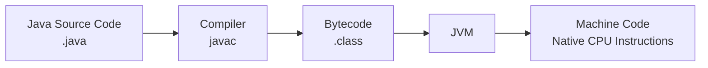
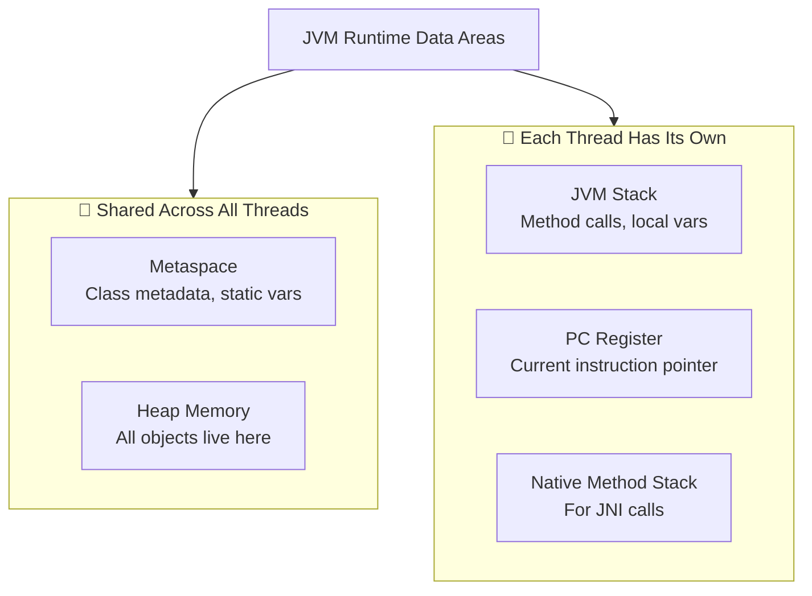
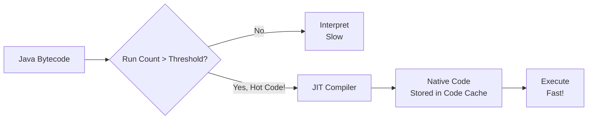

# JVM Internal Architecture & Memory Layout

:::info Interview Importance ⭐⭐⭐⭐⭐
This is the **#1 topic** asked in Java interviews. Understanding JVM memory is crucial for troubleshooting `OutOfMemoryError`, performance tuning, and explaining how Java applications work internally.
:::

## What is JVM?

**Simple Answer:** JVM (Java Virtual Machine) is like a "translator" that runs your Java code on any computer. When you write Java code, it gets compiled to **bytecode**, and JVM translates this bytecode into machine language that your computer understands.

**Interview Answer:** JVM is an abstract computing machine that enables a computer to run Java programs. It provides platform independence by acting as an intermediary between the compiled Java bytecode and the underlying hardware. JVM performs memory management, garbage collection, and security enforcement.



---

## 1. JVM Runtime Data Areas

When your Java application runs, JVM creates several memory areas. Think of them as different "rooms" in a building, each with a specific purpose.

### Quick Overview

| Memory Area | Shared? | Purpose | Example |
|------------|---------|---------|---------|
| **Heap** | ✅ All threads share | Object storage | `new User()`, `new ArrayList()` |
| **Stack** | ❌ Per thread | Method execution | Local variables, method calls |
| **Metaspace** | ✅ All threads share | Class metadata | Class definitions, static variables |
| **PC Register** | ❌ Per thread | Current instruction | Which line is executing now |
| **Native Stack** | ❌ Per thread | Native method calls | JNI calls to C/C++ |



---

## 2. Heap Memory - The Main Playground

:::tip Simple Explanation
Think of Heap as a **big parking lot** where all your objects (cars) park. When you create an object with `new`, it goes to the Heap.
:::

### What Goes in Heap?
- **All objects** created with `new` keyword
- **Arrays** (even arrays of primitives like `int[]`)
- **Instance variables** (non-static fields of objects)

### Heap Structure - Generational Memory

The Heap is divided into **generations** based on object age. Why? Because most objects die young!

```
┌─────────────────────────────────────────────────────────────────┐
│                         HEAP MEMORY                              │
├─────────────────────────────────┬───────────────────────────────┤
│        YOUNG GENERATION         │        OLD GENERATION         │
│           (New objects)         │       (Survived objects)      │
├──────────┬──────────┬───────────┤                               │
│   EDEN   │    S0    │    S1     │                               │
│  (Birth) │ Survivor │ Survivor  │       (Tenured/Old Gen)       │
│   ~80%   │   ~10%   │   ~10%    │           ~66%                │
└──────────┴──────────┴───────────┴───────────────────────────────┘
```

#### 2.1 Young Generation (Nursery)

**Eden Space - The Birth Place**
- 🍼 Where **99% of new objects are born**
- When you write `new User()`, the object lands here first
- It's the **largest** part of Young Gen (~80%)

```java
// This object is created in EDEN space
User user = new User("John");  // Goes to Eden!

// This array also goes to Eden
int[] scores = new int[100];   // Goes to Eden!
```

**Survivor Spaces (S0 and S1)**
- 🏃 Objects that **survive** a garbage collection move here
- There are always **two** Survivor spaces (S0 and S1)
- Only **one** is used at a time (the other is empty)

#### 2.2 Old Generation (Tenured)

- 👴 Long-lived objects that survived **multiple GCs**
- Objects are **promoted** here after surviving 15+ Minor GCs (configurable)
- Examples: Caches, Spring Beans, Connection Pools, Singletons

```java
// These typically end up in Old Gen
@Bean  // Spring Bean - lives forever
public DataSource dataSource() { ... }

// Singleton - lives for entire application life
private static final UserCache INSTANCE = new UserCache();
```

### Interview Question: Why Divide Heap into Generations?

**Answer:** Because of the **Generational Hypothesis**:
1. **Most objects die young** - Request objects, temporary calculations disappear quickly
2. **Few objects live long** - Caches, beans, singletons stay forever

By separating them:
- ✅ Minor GC (Young Gen) is **fast** - only checks small area
- ✅ Old Gen doesn't need frequent cleaning
- ✅ Overall application performance is better

---

## 3. JVM Stack - Method Execution Area

:::tip Simple Explanation
Think of Stack as a **stack of plates**. When you call a method, you put a plate on top. When the method returns, you remove that plate. **Last In, First Out (LIFO)**.
:::

### Key Points
- ❌ **NOT shared** - Each thread has its own Stack
- 📦 Stores method calls as **Frames**
- 🔢 Holds **local variables** and **partial results**
- 📞 Manages **method invocation and return**

### Stack Frame Structure

Every time you call a method, a new **Frame** is pushed onto the Stack:

```
┌─────────────────────────────────────────────┐
│              STACK FRAME                     │
├─────────────────────────────────────────────┤
│  1. LOCAL VARIABLES ARRAY                    │
│     └── Parameters, local variables          │
│     └── Primitive values stored directly     │
│     └── Object references (not objects!)     │
├─────────────────────────────────────────────┤
│  2. OPERAND STACK                            │
│     └── Workspace for calculations           │
│     └── Like a scratch pad for a + b         │
├─────────────────────────────────────────────┤
│  3. FRAME DATA                               │
│     └── Reference to Constant Pool           │
│     └── Return address                       │
│     └── Exception table                      │
└─────────────────────────────────────────────┘
```

### Example: How Stack Works

```java
public class StackExample {
    public static void main(String[] args) {
        int result = calculate(5, 3);  // Frame 2 pushed
        System.out.println(result);
    }  // Frame 1 popped
    
    public static int calculate(int a, int b) {
        int sum = a + b;   // Local variables: a=5, b=3, sum=8
        return sum;
    }  // Frame 2 popped, returns to Frame 1
}
```

**Stack visualization:**
```
TIME →
                    
Step 1:   [main]           ← main() called
Step 2:   [main][calculate] ← calculate() called  
Step 3:   [main]           ← calculate() returned
Step 4:   [ ]              ← main() finished
```

### StackOverflowError - When It Happens?

When the Stack becomes **too deep** (usually due to infinite recursion):

```java
// ❌ This will cause StackOverflowError!
public void infiniteRecursion() {
    infiniteRecursion();  // Keeps adding frames forever
}
```

**How to fix:**
1. Fix the infinite recursion bug
2. Increase stack size: `-Xss2M` (2 MB stack per thread)

:::warning Default Stack Size
- Linux/macOS: 512KB - 1MB
- Windows: 320KB - 1MB
- Each thread gets its own stack, so 1000 threads = 1000 × 1MB = 1GB just for stacks!
:::

---

## 4. Metaspace (Replaced PermGen in Java 8+)

:::tip Simple Explanation
Metaspace is like a **library catalog** - it stores information ABOUT your classes, not the actual objects. It stores class definitions, method signatures, and static variables.
:::

### What Goes in Metaspace?
- 📋 **Class metadata** (class names, methods, fields)
- 🔧 **Method bytecode** (the compiled method instructions)
- 📊 **Static variables** (class-level variables)
- 🏷️ **Constant pool** (literals, symbolic references)

### Key Differences from Old PermGen

| Feature | PermGen (Java 7 and before) | Metaspace (Java 8+) |
|---------|--------------------------|---------------------|
| Location | Inside Heap | Native Memory (OS) |
| Default Size | 64MB-85MB | Unlimited (grows dynamically) |
| OOM Error | `PermGen space` | `Metaspace` |
| GC | Part of Full GC | Separate handling |

### Metaspace Memory Leak Warning

:::danger Common Interview Question
**Q: When can Metaspace run out of memory?**

**A:** When you create too many classes dynamically:
- 📦 Too many JSP compilations
- 🔄 Dynamic proxy generation (cglib, ASM)
- 🔁 Repeated ClassLoader creation without cleanup
- 🧪 Too many mock objects in tests (Mockito)
:::

```java
// ❌ Bad: Creating infinite classes
while (true) {
    // Each iteration creates a new class!
    Object proxy = Enhancer.create(MyClass.class, new MyInterceptor());
}
// Eventually: OutOfMemoryError: Metaspace
```

### JVM Flag to Control Metaspace

```bash
# Limit Metaspace to prevent OS-level OOM
-XX:MaxMetaspaceSize=512M

# Set initial size (reduces resizing overhead)
-XX:MetaspaceSize=256M
```

---

## 5. The Code Cache

:::tip Simple Explanation
When JVM notices that a piece of code runs frequently (a "hot spot"), it compiles it to native machine code for faster execution. This compiled code is stored in the **Code Cache**.
:::

### How It Works



### Why Code Cache Matters

1. **Performance**: Compiled code runs 10x-100x faster than interpreted
2. **Memory**: If Code Cache fills up, JIT stops compiling
3. **Warning Signs**: Look for `CodeCache is full` warnings in logs

```bash
# Example: Increase Code Cache size
-XX:ReservedCodeCacheSize=512M
```

### Interview Question: What Happens When Code Cache is Full?

**Answer:** 
1. JIT compiler **stops compiling** new methods
2. Application falls back to **interpreted mode** (VERY SLOW)
3. You'll see `CodeCache is full. Compiler has been disabled` in logs
4. **Fix**: Increase `-XX:ReservedCodeCacheSize` or analyze why so much code is being compiled

---

## 6. PC Register (Program Counter)

### Simple Explanation
- 📍 Points to the **current instruction** being executed
- 🧵 Each thread has its own PC Register
- 🔢 Holds the address of the current bytecode instruction

```java
public void example() {
    int a = 5;      // PC points here → Line 1
    int b = 10;     // PC moves here → Line 2
    int c = a + b;  // PC moves here → Line 3
}
```

---

## 7. Native Method Stack

### What Is It?
- Used when Java code calls **native methods** (C/C++ code)
- Written using **JNI (Java Native Interface)**
- Each thread has its own Native Method Stack

```java
// Example of native method
public class NativeExample {
    // This method is implemented in C/C++
    public native void nativeMethod();
    
    static {
        System.loadLibrary("myNativeLib");
    }
}
```

### When Is It Used?
- File I/O operations (internally uses native code)
- Socket operations
- GUI applications (AWT/Swing use native calls)
- Performance-critical operations

---

## 8. Summary: Memory Areas at a Glance

```
┌───────────────────────────────────────────────────────────────────┐
│                        JVM MEMORY LAYOUT                           │
├───────────────────────────────────────────────────────────────────┤
│                                                                    │
│  ┌────────────────────────────────────────────────────────────┐   │
│  │                    HEAP (Shared)                            │   │
│  │  ┌─────────────────────┐  ┌─────────────────────────────┐  │   │
│  │  │    Young Gen        │  │        Old Gen               │  │   │
│  │  │  ┌─────┬────┬────┐  │  │                              │  │   │
│  │  │  │Eden │ S0 │ S1 │  │  │    Long-lived objects       │  │   │
│  │  │  └─────┴────┴────┘  │  │                              │  │   │
│  │  └─────────────────────┘  └─────────────────────────────────┘  │   │
│  └────────────────────────────────────────────────────────────┘   │
│                                                                    │
│  ┌─────────────────┐  ┌──────────────────────────────────────┐   │
│  │   Metaspace     │  │           Code Cache                  │   │
│  │  (Native Mem)   │  │     (JIT compiled code)               │   │
│  │  Class metadata │  │                                       │   │
│  └─────────────────┘  └──────────────────────────────────────┘   │
│                                                                    │
│  ┌────────────────────────────────────────────────────────────┐   │
│  │              PER-THREAD MEMORY                              │   │
│  │  ┌──────────┐  ┌──────────────┐  ┌───────────────────────┐ │   │
│  │  │  Stack   │  │  PC Register │  │  Native Method Stack  │ │   │
│  │  │ (LIFO)   │  │  (Pointer)   │  │  (For JNI calls)      │ │   │
│  │  └──────────┘  └──────────────┘  └───────────────────────┘ │   │
│  └────────────────────────────────────────────────────────────┘   │
│                                                                    │
└───────────────────────────────────────────────────────────────────┘
```

---

## 9. Common JVM Flags for Memory Tuning

```bash
# Heap Settings
-Xms4G          # Initial heap size (set equal to Xmx for production)
-Xmx4G          # Maximum heap size

# Young Generation
-Xmn1G          # Young generation size
-XX:NewRatio=2  # Old:Young ratio (2 means Old is 2x Young)

# Stack
-Xss512K        # Stack size per thread

# Metaspace
-XX:MetaspaceSize=256M
-XX:MaxMetaspaceSize=512M

# Code Cache
-XX:ReservedCodeCacheSize=512M
-XX:InitialCodeCacheSize=64M
```

---

## 10. Top Interview Questions

### Q1: What's the difference between Heap and Stack?

| Aspect | Heap | Stack |
|--------|------|-------|
| **Content** | Objects | Method frames, local variables |
| **Sharing** | Shared by all threads | Private to each thread |
| **Size** | Large (GBs) | Small (KB-MB per thread) |
| **Speed** | Slower allocation | Faster (LIFO) |
| **Cleanup** | Garbage Collector | Automatic (frame pop) |
| **Error** | `OutOfMemoryError: Java heap space` | `StackOverflowError` |

### Q2: Where are primitives stored - Heap or Stack?

**Answer:** It depends!
- **Local primitive variables** → **Stack** (in the method's frame)
- **Primitive instance variables** → **Heap** (inside the object)
- **Primitive static variables** → **Metaspace** (with class data)

```java
public class Example {
    private int instanceVar = 10;      // Heap (inside object)
    private static int staticVar = 20; // Metaspace
    
    public void method() {
        int localVar = 30;             // Stack (in frame)
    }
}
```

### Q3: What is the difference between -Xms and -Xmx?

- **`-Xms`**: Initial heap size when JVM starts
- **`-Xmx`**: Maximum heap size JVM can grow to

**Best Practice:** Set them **equal** in production to avoid resize overhead.

```bash
# ✅ Good: Equal sizes, predictable memory
-Xms4G -Xmx4G

# ❌ Bad: JVM keeps resizing, causing pauses
-Xms512M -Xmx4G
```

### Q4: Why was PermGen replaced with Metaspace?

1. **PermGen had fixed size** → Frequent `OutOfMemoryError: PermGen space`
2. **Metaspace auto-grows** using native memory
3. **Better GC** → Metaspace classes are collected more efficiently
4. **Simpler tuning** → Developers usually don't need to set max size

---

## 11. False Sharing - The Hidden Performance Killer

:::warning Advanced Topic
This is asked in **senior-level interviews** or when discussing high-performance/low-latency systems.
:::

### What is False Sharing?

When two threads modify **different** variables that happen to be on the **same CPU cache line** (usually 64 bytes), they cause each other's caches to invalidate, leading to severe performance degradation.

### The Problem Explained

```
CPU Cache Line (64 bytes)
┌────────────────────────────────────────────┐
│  counter1 (8 bytes)  │  counter2 (8 bytes) │  ... padding ...
└────────────────────────────────────────────┘
      ↑                        ↑
   Thread 1                 Thread 2
   modifies                 modifies
```

**What happens:**
1. Thread 1 updates `counter1`
2. CPU invalidates the **entire cache line** for Thread 2
3. Thread 2 updates `counter2`
4. CPU invalidates the **entire cache line** for Thread 1
5. This ping-pong continues, destroying performance!

### The Solution: Padding

**Pre-Java 8 (Manual Padding):**
```java
public class PaddedCounter {
    volatile long value = 0;
    // Padding to push to separate cache line
    long p1, p2, p3, p4, p5, p6, p7; // 7 * 8 = 56 bytes
}
```

**Java 8+ (@Contended Annotation):**
```java
import jdk.internal.vm.annotation.Contended;

public class HighPerformanceCounter {
    @Contended  // JVM automatically adds padding
    volatile long value = 0;
}
```

**Note:** Requires JVM flag: `-XX:-RestrictContended`

### When to Worry About False Sharing?
- High-frequency counters updated by multiple threads
- Low-latency trading systems
- High-throughput message processing
- Game servers with shared state

---

## Quick Reference Card

```
┌──────────────────────────────────────────────────────────────────┐
│                    JVM MEMORY CHEAT SHEET                        │
├──────────────────────────────────────────────────────────────────┤
│ new Object()        → Goes to HEAP (Eden space)                  │
│ Local int x = 5     → Goes to STACK                              │
│ static int x = 5    → Goes to METASPACE                          │
│ Class definition    → Goes to METASPACE                          │
│ JIT compiled code   → Goes to CODE CACHE                         │
│                                                                  │
│ OutOfMemoryError: Java heap space    → Increase -Xmx             │
│ OutOfMemoryError: Metaspace          → Increase MaxMetaspaceSize │
│ StackOverflowError                   → Fix recursion or -Xss     │
│ CodeCache is full                    → Increase CodeCacheSize    │
└──────────────────────────────────────────────────────────────────┘
```
