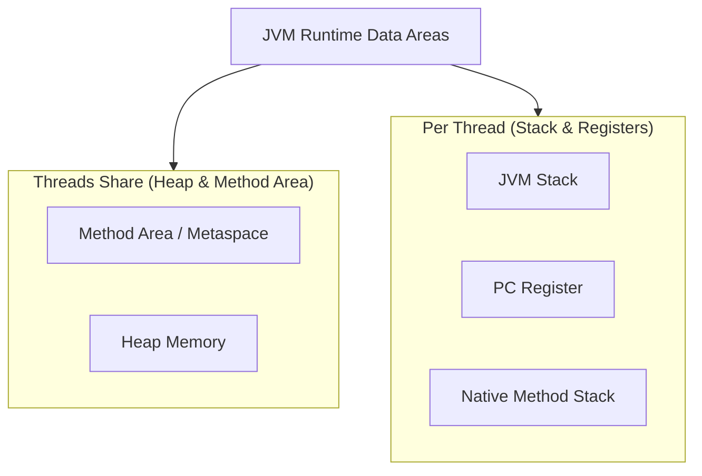

# JVM Internal Architecture & Memory Layout

:::info Production Tip
Understanding the JVM memory layout is the **#1 skill** required to troubleshoot `OutOfMemoryError` and tune applications for high throughput.
:::

## 1. The Runtime Data Areas

When a Java application runs, the JVM defines several memory areas. Some are created on JVM start-up (shared), while others are per-thread.



### 1.1 Heap Memory (The "Playground")
The Heap is where **all class instances and arrays** are allocated. It is the main area managed by the Garbage Collector (GC).

*   **Young Generation (Nursery):**
    *   **Eden Space:** Where 99% of new objects are born.
    *   **Survivor Spaces (S0, S1):** Objects that survived a Minor GC.
*   **Old Generation (Tenured):** Long-lived objects (caches, connection pools, singletons) that survived multiple GCs.

**Production Configuration:**
```bash
# Set initial and max heap size to the same value to avoid resizing overhead
-Xms4G -Xmx4G 
```

### 1.2 JVM Stack (Thread Private)
Each thread has its own stack. The stack holds **Frames**. A new frame is created every time a method is invoked.

*   **Frame Structure:**
    *   **Local Variables Array:** parameters, local variables (`int i`, `Object ref`).
    *   **Operand Stack:** Workspace for intermediate operations (e.g., `a + b`).
    *   **Frame Data:** Reference to Constant Pool, return address.

**StackOverflowError:** Occurs when recursion is too deep or stack size (`-Xss`) is too small.

### 1.3 Metaspace (Replaced PermGen)
Stores class metadata (Orbit), static variables, and method bytecode.
*   **Native Memory:** It sits **outside** the Heap (in native OS RAM).
*   **Leak Risk:** Dynamic class generation (cglib, JSP) can fill up Metaspace.

```bash
# Cap Metaspace to prevent OS OOM
-XX:MaxMetaspaceSize=512M
```

---

## 2. False Sharing (The Silent Killer)

False sharing occurs when multiple threads modify independent variables that happen to share the same **CPU Cache Line** (usually 64 bytes). This causes "cache trashing" and severe performance degradation.

### The Problem
Imagine two `volatile long` counters, `A` and `B`, sitting next to each other in memory.
*   Thread 1 updates `A`.
*   Thread 2 updates `B`.
*   Because they are in the same cache line, the CPU invalidates the **entire line** for both cores.

### The Solution: Padding
We can artificially add unused variables ("padding") to push the critical fields apart.

**Pre-Java 8 (Manual Padding):**
```java
public class PaddedCounter {
    volatile long value = 0;
    long p1, p2, p3, p4, p5, p6, p7; // 7 * 8 bytes = 56 bytes padding
}
```

**Java 8+ (The `@Contended` Annotation):**
```java
import jdk.internal.vm.annotation.Contended;

public class HighPerformanceCounter {
    @Contended
    volatile long value = 0;
}
```
*Note: Requires `-XX:-RestrictContended` flag.*

---

## 3. The Code Cache
The JIT (Just-In-Time) compiler stores **compiled native code** here.
*   If Code Cache fills up, the JIT stops compiling, and the app runs in **interpreted mode** (EXTREMELY SLOW).
*   **Monitoring:** Watch for `CodeCacheFull` warnings in logs.

**Tuning:**
```bash
-XX:ReservedCodeCacheSize=512M
```
