# Garbage Collection & Memory Management

:::info Interview Importance ⭐⭐⭐⭐⭐
GC is one of the **most asked topics** in Java interviews. Understanding how GC works helps you write memory-efficient code and troubleshoot production issues.
:::

## What is Garbage Collection?

**Simple Answer:** Garbage Collection is like a **cleaning service** that automatically removes objects from memory that your program no longer uses. You don't have to manually free memory like in C/C++.

**Interview Answer:** GC is an automatic memory management feature of the JVM that identifies and removes objects that are no longer reachable from any root reference, reclaiming heap memory for new object allocations.

---

## 1. How Does GC Know What to Collect?

### The Concept of "Reachability"

An object is **alive** (not garbage) if it can be reached through a chain of references starting from **GC Roots**.

### What are GC Roots?

GC Roots are the starting points for the reachability analysis:

| GC Root | Example |
|---------|---------|
| Local variables | Variables in currently executing methods |
| Static variables | `private static User currentUser;` |
| Active threads | Thread objects that are running |
| JNI references | Objects passed to native code |

```mermaid
graph TD
    subgraph GC_Roots["🌱 GC Roots"]
        A[Static Variable]
        B[Local Variable in main]
        C[Active Thread]
    end
    
    A --> D[Object A]
    B --> E[Object B]
    E --> F[Object C]
    F --> G[Object D]
    
    H[Object X - GARBAGE!]
    I[Object Y - GARBAGE!]
    H --> I
    
    style H fill:#ff6b6b
    style I fill:#ff6b6b
```



**In the diagram above:**
- Objects A, B, C, D are **reachable** → Will NOT be collected
- Objects X, Y are **unreachable** → Will be collected as garbage

### Interview Question: How to Make an Object Eligible for GC?

**Answer:** Remove all references to it!

```java
public void example() {
    User user = new User("John");  // Object created
    user = null;  // Reference removed - now eligible for GC!
    
    // OR
    user = new User("Jane");  // Old object becomes unreachable
}
```

---

## 2. Generational Garbage Collection

### The Generational Hypothesis

The JVM makes two observations from real-world applications:

1. 📈 **Most objects die young** (80-95%)
   - Request objects, temporary calculations, iterators
   - They're created, used once, and thrown away

2. 📊 **Few objects live long**
   - Caches, connection pools, Spring beans, singletons
   - Once they survive, they tend to stay forever

### Why Generational GC is Smart

Instead of scanning the entire heap every time:
- ✅ Young Gen is cleaned **frequently** (Minor GC) - it's small
- ✅ Old Gen is cleaned **rarely** (Major GC) - it's big but stable

```
┌──────────────────────────────────────────────────────────────────┐
│                          HEAP MEMORY                              │
├─────────────────────────────────┬────────────────────────────────┤
│       YOUNG GENERATION          │        OLD GENERATION          │
│         (Nursery)               │          (Tenured)             │
│                                 │                                │
│  ┌──────┐  ┌─────┐  ┌─────┐    │                                │
│  │ Eden │  │ S0  │  │ S1  │    │   Long-lived objects           │
│  │      │  │     │  │     │    │   Promoted from Young Gen      │
│  │ New  │  │From │  │ To  │    │                                │
│  │ objs │  │     │  │     │    │   • Caches                     │
│  └──────┘  └─────┘  └─────┘    │   • Spring Beans               │
│                                 │   • Singletons                 │
│   ~33% of Heap                  │   ~66% of Heap                 │
├─────────────────────────────────┴────────────────────────────────┤
│               Minor GC: Fast (ms)  │  Major GC: Slow (100ms-sec) │
└──────────────────────────────────────────────────────────────────┘
```

---

## 3. Types of Garbage Collection

### 3.1 Minor GC (Young Generation GC)

**When it triggers:**
- Eden space is full

**What happens:**
1. All live objects in **Eden** are moved to **Survivor S0**
2. All live objects in **S0** are moved to **S1** (or vice versa)
3. Objects with age > threshold are **promoted** to Old Gen
4. Eden is **completely cleared**


**Characteristics:**
- ⚡ **Fast** (usually milliseconds)
- 🔄 **Frequent** (can happen many times per minute)
- 🛑 **STW** (Stop-The-World) - but brief

### 3.2 Major GC / Full GC (Old Generation GC)

**When it triggers:**
- Old Gen is filling up
- Metaspace is full
- Manual `System.gc()` call (don't do this!)
- Survivor space can't hold all objects

**What happens:**
1. Scans the **entire heap** (Young + Old)
2. Compacts memory (moves objects together)
3. Takes **much longer** than Minor GC

**Characteristics:**
- 🐢 **Slow** (can take seconds)
- 📉 **Infrequent** (ideally rare in healthy apps)
- 🛑 **Long STW pause** - Application freezes!

### Interview Question: Minor GC vs Full GC

| Aspect | Minor GC | Full GC |
|--------|----------|---------|
| **Scope** | Young Generation only | Entire Heap (Young + Old + Metaspace) |
| **Speed** | Fast (ms) | Slow (100ms - seconds) |
| **Frequency** | High | Low (should be rare) |
| **Trigger** | Eden full | Old Gen full, Metaspace full |
| **Impact** | Low | High (long pauses) |

---

## 4. Stop-The-World (STW) Pauses

:::danger Critical Concept
**Stop-The-World** means your application **completely stops** during garbage collection. No requests processed, no code executed. This is the main reason GC tuning is important!
:::

### Why STW is Necessary?

During GC, the collector needs a consistent view of memory. If objects keep getting created/modified, the GC can't work correctly.

```
Time →

Application:  [Running]=====[STOPPED]=====|[Running]======
GC:                       ↑ STW Pause ↑
                          GC Working
```

### How to Minimize STW?

1. **Choose the right GC algorithm** (see GC Collectors section)
2. **Reduce object creation** (less garbage = less GC)
3. **Tune heap sizes** properly
4. **Avoid Full GC** by preventing Old Gen from filling up

---

## 5. GC Collectors (Algorithms)

### 5.1 Serial GC

```bash
-XX:+UseSerialGC
```

**How it works:** Single-threaded GC. Simple but slow.

**Use case:** Small applications, single CPU, client apps

**STW Impact:** High (one thread doing all work)

### 5.2 Parallel GC (Throughput Collector)

```bash
-XX:+UseParallelGC
```

**How it works:** Multiple GC threads work in parallel

**Use case:** Batch processing, backend jobs where pauses are acceptable

**STW Impact:** Medium (faster than Serial, but still STW)

### 5.3 G1 GC (Garbage First) - DEFAULT in Java 9+

```bash
-XX:+UseG1GC
```

**How it works:**
- Divides heap into **regions** (not just Young/Old)
- Collects regions with most garbage first ("Garbage First")
- Aims for **predictable pause times**

**Use case:** Most server applications, general purpose

**STW Impact:** Low to Medium (configurable pause targets)

```bash
# Target pause time of 200ms
-XX:MaxGCPauseMillis=200
```

### 5.4 ZGC (Z Garbage Collector) - Java 11+

```bash
-XX:+UseZGC
```

**How it works:** Concurrent collection, minimal STW

**Use case:** Large heaps (multi-TB), low-latency requirements

**STW Impact:** **< 10ms** regardless of heap size! 🚀

### 5.5 Shenandoah GC - Java 12+

```bash
-XX:+UseShenandoahGC
```

**How it works:** Similar to ZGC, concurrent compaction

**Use case:** Low-latency applications

**STW Impact:** Very Low (< 10ms)

### GC Collector Comparison

| Collector | Pause Time | Throughput | Heap Size | Java Version |
|-----------|------------|------------|-----------|--------------|
| Serial | High | Low | Small | All |
| Parallel | Medium | High | Medium | All |
| G1 | Predictable | Good | Medium-Large | 7+ (Default 9+) |
| ZGC | Ultra-Low (< 10ms) | Good | Large-Huge | 11+ |
| Shenandoah | Ultra-Low | Good | Large | 12+ |

---

## 6. Memory Leak Patterns

:::warning Definition
In Java, a **memory leak** occurs when objects are **unintentionally kept alive** by references, preventing GC from collecting them. The object is useless but can't be cleaned up.
:::

### 6.1 Static Collection Leak (Most Common!)

**The Problem:** Static collections are attached to the ClassLoader and live **forever**.

```java
// ❌ BAD: This list grows forever!
public class LeakyCache {
    private static final List<byte[]> cache = new ArrayList<>();
    
    public void processData(byte[] data) {
        cache.add(data);  // Added but never removed!
    }
}
```

**Why it's a leak:**
- Static field `cache` is a GC Root
- Everything in the list is reachable
- Even if data is no longer needed, it's kept alive

**The Fix:**

```java
// ✅ GOOD: Use bounded cache with eviction
public class BoundedCache {
    private static final Map<String, byte[]> cache = 
        new LinkedHashMap<>(100, 0.75f, true) {
            @Override
            protected boolean removeEldestEntry(Map.Entry<String, byte[]> eldest) {
                return size() > 100;  // Keep max 100 entries
            }
        };
}

// OR use a proper caching library
// Caffeine, Guava Cache, Ehcache
```

### 6.2 ThreadLocal Leak (Very Dangerous!)

**The Problem:** In thread pools, threads are **reused**. If you don't clean up ThreadLocal, the value stays attached to the thread forever.

```java
// ❌ BAD: ThreadLocal without cleanup
public class UserContext {
    private static final ThreadLocal<User> context = new ThreadLocal<>();
    
    public static void set(User user) {
        context.set(user);
    }
    
    public static User get() {
        return context.get();
    }
    // Missing remove() method!
}

// In a servlet filter
public void doFilter(request, response, chain) {
    UserContext.set(loadUser(request));
    chain.doFilter(request, response);
    // User object stays attached to thread forever!
}
```

**Why it's dangerous:**
- Tomcat has a thread pool with 200 threads
- Each request sets a User object (say 10KB)
- Over time: 200 threads × many requests × 10KB = Memory leak!
- Worse: Wrong user data might leak to another request!

**The Fix:**

```java
// ✅ GOOD: Always use try-finally to clean up
public void doFilter(request, response, chain) {
    try {
        UserContext.set(loadUser(request));
        chain.doFilter(request, response);
    } finally {
        UserContext.remove();  // CRITICAL: Clean up!
    }
}
```

### 6.3 Unclosed Resources

**The Problem:** Not closing streams/connections keeps underlying OS resources open.

```java
// ❌ BAD: Resource not closed on exception
public byte[] readFile(String path) throws IOException {
    FileInputStream fis = new FileInputStream(path);
    byte[] data = fis.readAllBytes();
    fis.close();  // If readAllBytes() throws, this never runs!
    return data;
}
```

**The Fix:**

```java
// ✅ GOOD: Try-with-resources (Java 7+)
public byte[] readFile(String path) throws IOException {
    try (FileInputStream fis = new FileInputStream(path)) {
        return fis.readAllBytes();
    }  // Automatically closed here, even on exception!
}

// ✅ Also good for database connections
try (Connection conn = dataSource.getConnection();
     PreparedStatement ps = conn.prepareStatement(sql);
     ResultSet rs = ps.executeQuery()) {
    // Use resources
}  // All automatically closed!
```

### 6.4 ClassLoader Leak

**The Problem:** In applications that reload classes (hot deployment), old ClassLoaders may be kept alive.

**When it happens:**
- Web applications redeployed without server restart
- Dynamic class loading (OSGi, plugins)
- Repeated redeployments in Tomcat/JBoss

**Symptoms:**
- `OutOfMemoryError: Metaspace`
- Memory grows after each redeployment

**The Fix:**
- Use proper lifecycle management
- Ensure all references to old ClassLoader are removed
- Restart server periodically in production
- Use analysis tools like Eclipse MAT to find retained ClassLoaders

### 6.5 Inner Class Reference Leak

**The Problem:** Non-static inner classes hold a hidden reference to the outer class.

```java
// ❌ BAD: Inner class holds reference to outer class
public class HugeObject {
    private byte[] largeData = new byte[10_000_000]; // 10MB
    
    public Runnable getTask() {
        return new Runnable() {  // Non-static inner class
            @Override
            public void run() {
                System.out.println("Task");
            }
        };
        // This Runnable holds a reference to HugeObject!
    }
}

// Usage
HugeObject obj = new HugeObject();
Runnable task = obj.getTask();
obj = null;  // We think HugeObject can be GC'd...
// But task still holds a reference to it! LEAK!
```

**The Fix:**

```java
// ✅ GOOD: Use static nested class or lambda
public class HugeObject {
    private byte[] largeData = new byte[10_000_000];
    
    // Option 1: Static nested class
    private static class MyTask implements Runnable {
        @Override
        public void run() {
            System.out.println("Task");
        }
    }
    
    // Option 2: Lambda (if doesn't capture 'this')
    public Runnable getTask() {
        return () -> System.out.println("Task");  // No reference to outer!
    }
}
```

---

## 7. Memory Leak Symptoms

### How to Know If You Have a Leak?

| Symptom | Description |
|---------|-------------|
| **Sawtooth with rising baseline** | Memory goes up/down with GC, but the "bottom" keeps rising |
| **Increasing Full GC frequency** | Full GC happening more often over time |
| **Full GC not reclaiming memory** | After Full GC, heap remains nearly full |
| **OutOfMemoryError** | Eventually, heap is exhausted |

### Memory Usage Pattern Visualization

```
Memory Usage (Healthy App)
     ↑
100% │    
     │   ╱╲   ╱╲   ╱╲   ╱╲    ← GC brings it down
 50% │  ╱  ╲ ╱  ╲ ╱  ╲ ╱  ╲
     │ ╱    ╳    ╳    ╳    ╲
  0% │╱─────────────────────────→ Time

Memory Usage (Memory Leak!)
     ↑                          ╱ OOM!
100% │                        ╱╲╱
     │                    ╱╲╱╲
 50% │           ╱╲   ╱╲╱
     │       ╱╲ ╱  ╲ ╱    ← Baseline keeps rising!
  0% │──╱╲ ╱  ╳────────────────→ Time
```

---

## 8. Troubleshooting Tools & Commands

### 8.1 Command Line Tools

```bash
# Monitor GC in real-time (every 1 second)
jstat -gc <PID> 1000

# Output columns explained:
# S0C, S1C = Survivor space capacity
# S0U, S1U = Survivor space used
# EC, EU = Eden capacity/used
# OC, OU = Old Gen capacity/used
# YGC = Young GC count
# YGCT = Young GC total time
# FGC = Full GC count
# FGCT = Full GC total time
```

```bash
# Take heap dump (for analysis)
jmap -dump:live,format=b,file=heap.hprof <PID>

# List objects in heap
jmap -histo <PID> | head -20

# Check heap configuration
jmap -heap <PID>
```

### 8.2 GC Logging

```bash
# Java 8
-XX:+PrintGCDetails 
-XX:+PrintGCDateStamps 
-Xloggc:/var/log/gc.log

# Java 9+ (Unified Logging)
-Xlog:gc*:file=/var/log/gc.log:time,uptime:filecount=5,filesize=10M
```

### 8.3 Analysis Tools

| Tool | Purpose |
|------|---------|
| **Eclipse MAT** | Best tool for analyzing heap dumps, finding leaks |
| **VisualVM** | GUI monitoring of CPU/Memory, take heap dumps |
| **JConsole** | Built-in JVM monitoring tool |
| **GCeasy.io** | Online GC log analyzer |
| **Prometheus + Grafana** | Production monitoring |

### 8.4 Step-by-Step Leak Analysis

```
Step 1: Identify Symptom
└── Monitor heap usage over time
└── Watch for rising baseline

Step 2: Collect Evidence
└── Take heap dump 1 (jmap)
└── Wait 1 hour
└── Take heap dump 2

Step 3: Compare Dumps (Eclipse MAT)
└── Open both dumps
└── Compare histogram
└── Find objects that grew significantly

Step 4: Find GC Root
└── Right-click suspicious object
└── "Path to GC Roots" → "exclude weak references"
└── Follow the chain to find who's holding it

Step 5: Fix Code
└── Remove the reference
└── Add proper cleanup
└── Use WeakReference if appropriate
```

---

## 9. Best Practices

### Object Creation Best Practices

```java
// ❌ BAD: Creating objects in loop
for (int i = 0; i < 1000000; i++) {
    String s = new String("constant");  // Creates 1M objects!
}

// ✅ GOOD: Reuse objects
String s = "constant";  // Interned, reused
for (int i = 0; i < 1000000; i++) {
    process(s);  // Same object reused
}

// ✅ GOOD: Use StringBuilder in loops
StringBuilder sb = new StringBuilder();
for (int i = 0; i < 1000; i++) {
    sb.append(i);
}
String result = sb.toString();

// ❌ BAD: String concatenation in loop
String result = "";
for (int i = 0; i < 1000; i++) {
    result += i;  // Creates new String each time!
}
```

### Collection Best Practices

```java
// ✅ Initialize with expected size
List<User> users = new ArrayList<>(1000);  // Avoids resizing

// ✅ Use appropriate collection
Set<String> names = new HashSet<>();  // O(1) lookup
// Not ArrayList if you need frequent contains() checks

// ✅ Clear collections when done
list.clear();  // Releases references to elements
```

---

## 10. Top Interview Questions

### Q1: How does GC identify unused objects?

**Answer:** GC uses **reachability analysis**. Starting from GC Roots (static variables, local variables on stack, active threads), it traverses all references. Any object not reachable from a GC Root is considered garbage and eligible for collection.

### Q2: What's the difference between `finalize()` and Cleaners?

**Answer:**
- `finalize()` (Deprecated in Java 9): Method called before GC collects object. Unpredictable timing, can resurrect objects, hurts GC performance.
- `Cleaners` (Java 9+): Better alternative. Uses PhantomReferences. More predictable.
- **Best Practice:** Don't rely on either! Use try-with-resources for cleanup.

### Q3: Can we force garbage collection?

**Answer:**
```java
System.gc();  // REQUEST to run GC, but JVM can ignore it!
```
- This is only a **hint** to JVM
- JVM may ignore it
- **Never** do this in production code
- It can cause unnecessary Full GC pauses

### Q4: What is a memory leak in Java?

**Answer:** A memory leak in Java occurs when objects that are no longer needed are still referenced by the application, preventing the GC from collecting them. Common causes:
1. Static collections that keep growing
2. ThreadLocal without remove()
3. Unclosed resources
4. Listeners not unregistered
5. Inner classes holding outer class reference

### Q5: How would you troubleshoot an OutOfMemoryError?

**Answer:**
1. **Check which memory area** is full:
   - `Java heap space` → Increase `-Xmx` or fix leak
   - `Metaspace` → Increase `-XX:MaxMetaspaceSize` or fix class loading issue
   - `GC overhead limit exceeded` → App spending >98% time in GC

2. **Collect heap dump:**
   ```bash
   jmap -dump:live,format=b,file=heap.hprof <PID>
   ```

3. **Analyze with Eclipse MAT:**
   - Find largest objects
   - Check "Leak Suspects" report
   - Find path to GC Root

4. **Fix the leak** or **increase memory** (if legitimate growth)

### Q6: What's the difference between Young Gen and Old Gen tuning?

**Answer:**

**Young Gen Tuning (`-Xmn`):**
- Larger Young Gen = Less frequent Minor GC, but longer pauses
- Smaller Young Gen = More frequent Minor GC, but shorter pauses

**Old Gen Consideration:**
- Old Gen = Heap - Young Gen
- If Old Gen is too small, objects get promoted too fast → Full GC

**Rule of Thumb:**
- Young Gen: 25-40% of total heap
- Old Gen: 60-75% of total heap

---

## Quick Reference Card

```
┌──────────────────────────────────────────────────────────────────┐
│                    GC CHEAT SHEET                                │
├──────────────────────────────────────────────────────────────────┤
│                                                                  │
│ Minor GC: Young Gen only, fast, frequent                         │
│ Major GC: Entire heap, slow, should be rare                      │
│                                                                  │
│ COMMON LEAKS:                                                    │
│ ├── Static collections without bounds → Use LRU cache           │
│ ├── ThreadLocal without remove() → Use try-finally              │
│ ├── Unclosed resources → Use try-with-resources                 │
│ └── Inner class references → Use static nested class            │
│                                                                  │
│ TOOLS:                                                           │
│ ├── jstat -gc <pid> 1000    → Live GC monitoring                │
│ ├── jmap -dump:live...      → Take heap dump                    │
│ └── Eclipse MAT             → Analyze heap dump                 │
│                                                                  │
│ GC CHOICE:                                                       │
│ ├── General purpose         → G1GC (default Java 9+)            │
│ ├── Low latency (<10ms)     → ZGC or Shenandoah                 │
│ └── Max throughput          → Parallel GC                       │
│                                                                  │
└──────────────────────────────────────────────────────────────────┘
```
