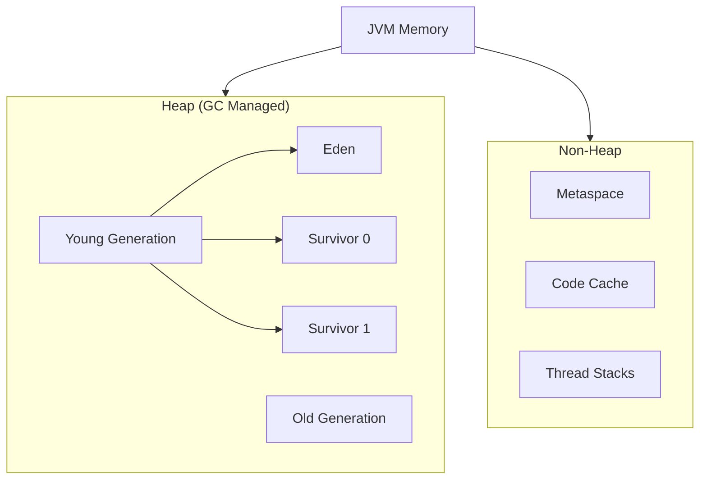
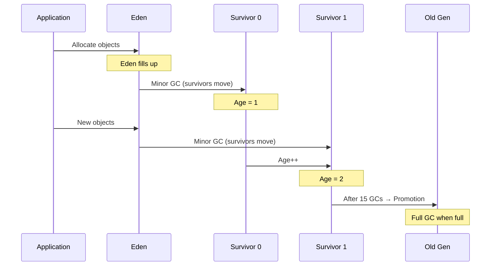

# JVM Memory Model & Java Concurrency - Complete Guide

:::info WHY THIS MATTERS
This guide covers **production-critical** knowledge that prevents OutOfMemoryErrors, memory leaks, race conditions, and performance bottlenecks in multi-threaded applications.
:::

---

## 1. JVM Memory Model

### 1.1 Memory Structure Overview



### 1.2 Heap Memory

**Young Generation** (1/3 of heap by default)
- **Eden Space**: Where new objects are allocated
- **Survivor Spaces (S0/S1)**: Hold objects that survived 1+ Minor GC
- Fast allocation via **TLAB** (Thread-Local Allocation Buffer)

**Old Generation** (2/3 of heap)
- Long-lived objects promoted after N survivals (default: 15)
- Larger, slower to collect

```java
// Object lifecycle example
public class HeapExample {
    public void demonstrateObjectLifecycle() {
        // 1. Created in Eden
        StringBuilder sb = new StringBuilder();
        
        // 2. If survives Minor GC → moves to Survivor
        for (int i = 0; i < 1000; i++) {
            sb.append("data");
        }
        
        // 3. After 15 Minor GCs → promoted to Old Gen
        // (if still referenced)
    }
    
    // Short-lived object - dies in Eden
    public String process() {
        String temp = "temporary"; // Collected quickly
        return temp.toUpperCase();
    }
}
```

**Key Flags:**
```bash
-Xms2g                    # Initial heap size
-Xmx4g                    # Maximum heap size
-XX:NewRatio=2            # Old:Young = 2:1
-XX:SurvivorRatio=8       # Eden:Survivor = 8:1:1
-XX:MaxTenuringThreshold=15  # Promotions to Old Gen
```

### 1.3 Stack Memory

**Thread Stack** (per thread, default ~1MB)

Contains:
- Local variables
- Method parameters
- Return addresses
- Partial results

```java
public class StackExample {
    // Each method call creates a stack frame
    public int factorial(int n) {
        if (n <= 1) return 1;
        return n * factorial(n - 1); // Each call adds stack frame
    }
    
    // Deep recursion → StackOverflowError
    public void causeStackOverflow() {
        causeStackOverflow(); // Infinite recursion
    }
}
```

**Stack Frame Contains:**
```
+------------------+
| Return Address   |
| Local Variables  |
| Operand Stack    |
| Frame Data       |
+------------------+
```

**Tuning:**
```bash
-Xss512k  # Stack size per thread
```

### 1.4 Metaspace (Java 8+)

Stores class metadata:
- Class structures
- Method bytecode
- Constant pool
- Static variables (references, not data)

**No longer limited to fixed PermGen size** - uses native memory

```java
public class MetaspaceExample {
    // Class metadata stored in Metaspace
    private static final String CONSTANT = "value"; // Reference here
    private static List<String> cache = new ArrayList<>(); // Reference
    
    // The actual String objects are in Heap
}
```

**Configuration:**
```bash
-XX:MetaspaceSize=128m      # Initial
-XX:MaxMetaspaceSize=512m   # Maximum (default: unlimited)
```

**Common Issue:**
```java
// ClassLoader leak - prevents class unloading
public class LeakyWebApp {
    private static ThreadLocal<ClassLoader> leak = new ThreadLocal<>();
    
    public void deploy() {
        leak.set(Thread.currentThread().getContextClassLoader());
        // Never removed → ClassLoader can't be GC'd → Metaspace leak
    }
}
```

### 1.5 Code Cache

Stores **JIT-compiled native code** (machine code from hotspots)

```bash
-XX:ReservedCodeCacheSize=256m
-XX:InitialCodeCacheSize=128m
```

**Monitoring:**
```bash
jinfo -flag ReservedCodeCacheSize <pid>
```

---

## 2. Garbage Collection

### 2.1 Minor GC vs Major GC

| Type | Scope | Speed | STW Pause | Trigger |
|------|-------|-------|-----------|---------|
| **Minor GC** | Young Gen only | Fast (ms) | Short | Eden full |
| **Major GC** | Old Gen | Slow (100ms-seconds) | Long | Old Gen full |
| **Full GC** | Entire Heap + Metaspace | Very Slow | Very Long | System.gc() / OOM prevention |

### 2.2 GC Process Flow



### 2.3 Stop-The-World (STW) Pauses

**All application threads are paused during GC**

**Problem:**
```java
// During STW pause:
// - HTTP requests timeout
// - Database connections drop
// - Microservices health checks fail
```

**Modern GC Goals:**
- **G1GC**: Target pause time (default 200ms)
- **ZGC**: < 10ms pauses (even for 16TB heap)
- **Shenandoah**: < 10ms pauses

**GC Selection:**
```bash
# G1 (Java 9+ default, good for most cases)
-XX:+UseG1GC
-XX:MaxGCPauseMillis=200

# ZGC (ultra-low latency, Java 15+)
-XX:+UseZGC
-XX:ZCollectionInterval=5

# Shenandoah (low latency alternative)
-XX:+UseShenandoahGC
```

**GC Logging:**
```bash
# Modern (Java 9+)
-Xlog:gc*:file=gc.log:time,uptime,level,tags

# Analyze with
jstat -gc <pid> 1000  # Every 1s
```

---

## 3. Memory Leak Patterns

### 3.1 Static References

**Problem:** Static fields hold references forever (never GC'd)

```java
// BAD: Memory leak
public class LeakyCache {
    private static Map<String, byte[]> cache = new HashMap<>();
    
    public void cacheData(String key, byte[] data) {
        cache.put(key, data); // Never removed!
    }
}

// GOOD: Use eviction policy
public class SafeCache {
    private static Cache<String, byte[]> cache = CacheBuilder.newBuilder()
        .maximumSize(1000)
        .expireAfterWrite(10, TimeUnit.MINUTES)
        .build();
}
```

### 3.2 Growing Collections

```java
// BAD: Unbounded growth
public class EventProcessor {
    private List<Event> processedEvents = new ArrayList<>();
    
    public void process(Event event) {
        processedEvents.add(event); // Grows forever!
    }
}

// GOOD: Bounded collection
public class EventProcessor {
    private Queue<Event> recentEvents = new LinkedBlockingQueue<>(1000);
    
    public void process(Event event) {
        if (recentEvents.size() >= 1000) {
            recentEvents.poll(); // Remove oldest
        }
        recentEvents.offer(event);
    }
}
```

### 3.3 Cache Without Eviction

```java
// BAD: No eviction
public class UserCache {
    private Map<Long, User> cache = new ConcurrentHashMap<>();
    
    public User getUser(Long id) {
        return cache.computeIfAbsent(id, this::loadFromDB);
    }
}

// GOOD: LRU with size limit
public class UserCache {
    private Map<Long, User> cache = Collections.synchronizedMap(
        new LinkedHashMap<Long, User>(100, 0.75f, true) {
            protected boolean removeEldestEntry(Map.Entry eldest) {
                return size() > 100; // LRU eviction
            }
        }
    );
}
```

### 3.4 ThreadLocal Leaks

**Problem:** ThreadLocal holds references in thread's ThreadLocalMap

```java
// BAD: Memory leak in thread pools
public class RequestContext {
    private static ThreadLocal<User> currentUser = new ThreadLocal<>();
    
    public void handleRequest(User user) {
        currentUser.set(user);
        // ... process request
        // LEAK: Never removed! Thread pool reuses threads
    }
}

// GOOD: Always clean up
public class RequestContext {
    private static ThreadLocal<User> currentUser = new ThreadLocal<>();
    
    public void handleRequest(User user) {
        try {
            currentUser.set(user);
            // ... process request
        } finally {
            currentUser.remove(); // Critical!
        }
    }
}
```

### 3.5 ClassLoader Leaks

**Problem:** Prevents class unloading (Metaspace leak)

```java
// Common in web apps with hot redeployment
public class WebAppLeak {
    // Static ThreadLocal holds reference to web app ClassLoader
    private static ThreadLocal<Context> ctx = new ThreadLocal<>();
    
    // On redeploy: old ClassLoader can't be GC'd → Metaspace leak
}

// Fix: Use framework-managed ThreadLocals (Spring RequestContextHolder)
```

### 3.6 Common Symptoms

**How to Detect Leaks:**

```bash
# 1. Monitor Old Gen growth
jstat -gc <pid> 1000

# Output:
# S0C    S1C    S0U    S1U      EC       EU        OC         OU       MC     MU
# Old Gen (OC/OU) keeps growing ↑↑↑

# 2. Heap dump analysis
jmap -dump:live,format=b,file=heap.bin <pid>

# Analyze with:
# - Eclipse MAT (Memory Analyzer Tool)
# - VisualVM
# - JProfiler
```

**Red Flags:**
- Old Gen > 80% after Full GC
- Full GC every few minutes
- Full GC doesn't reclaim memory
- Metaspace keeps growing

---

## 4. False Sharing

### 4.1 CPU Cache Lines

**CPU Cache Hierarchy:**
```
CPU Core 0          CPU Core 1
L1 Cache (32KB)     L1 Cache (32KB)
L2 Cache (256KB)    L2 Cache (256KB)
         L3 Cache (Shared, 8MB)
              Main Memory (RAM)
```

**Cache Line Size:** 64 bytes (typical)

### 4.2 False Sharing Problem

**When two threads modify variables in the same cache line:**

```java
// BAD: False sharing
public class FalseSharing {
    private volatile long counterA; // CPU 0 writes this
    private volatile long counterB; // CPU 1 writes this
    
    // Both in same 64-byte cache line!
    // CPU 0 write → invalidates CPU 1's cache
    // CPU 1 write → invalidates CPU 0's cache
    // Ping-pong effect → performance drop
}
```

**Performance Impact:**
```
Without false sharing: 100M ops/sec
With false sharing:    10M ops/sec  (10x slower!)
```

### 4.3 Solution: Padding

```java
// GOOD: Padded to separate cache lines
public class NoPadding {
    private volatile long counterA;
    private long p1, p2, p3, p4, p5, p6, p7; // 7 * 8 bytes = 56 bytes padding
    private volatile long counterB;
}
```

**Modern Java:** Use `@Contended` (Java 8+)

```java
import jdk.internal.vm.annotation.Contended;

public class PaddedCounter {
    @Contended
    private volatile long counterA;
    
    @Contended
    private volatile long counterB;
}

// Enable with: -XX:-RestrictContended
```

**Real-World Example:**
```java
// Disruptor pattern (LMAX)
public class RingBufferSequence {
    @Contended
    private volatile long cursor;
    
    // Prevents false sharing with other sequences
}
```

---

## 5. Java Memory Model (JMM)

### 5.1 Visibility vs Atomicity

**Visibility:** Changes made by one thread are visible to others
**Atomicity:** Operation completes without interruption

```java
public class VisibilityProblem {
    private boolean ready = false; // Not volatile
    private int number = 0;
    
    // Thread 1
    public void writer() {
        number = 42;
        ready = true; // May not be visible to reader!
    }
    
    // Thread 2
    public void reader() {
        while (!ready) { } // May loop forever!
        System.out.println(number); // May print 0!
    }
}
```

**Why?**
- CPU caches
- Compiler reordering
- CPU instruction reordering

### 5.2 volatile Keyword

**Guarantees:**
1. **Visibility:** Write visible to all threads immediately
2. **Ordering:** Prevents reordering around volatile operations

```java
public class VolatileFix {
    private volatile boolean ready = false; // Fixed
    private int number = 0;
    
    public void writer() {
        number = 42;
        ready = true; // Volatile write → memory barrier
    }
    
    public void reader() {
        while (!ready) { } // Now works correctly
        System.out.println(number); // Always prints 42
    }
}
```

**Use Cases:**
- Flags/state variables
- Double-checked locking
- Publishing objects safely

**Limitations:**
```java
private volatile int counter = 0;

public void increment() {
    counter++; // NOT ATOMIC! Read-modify-write
    // Same as: counter = counter + 1 (3 operations)
}
```

### 5.3 synchronized Keyword

**Provides both visibility AND atomicity:**

```java
public class SynchronizedExample {
    private int counter = 0; // Don't need volatile
    
    public synchronized void increment() {
        counter++; // Atomic now
    }
    
    public synchronized int getCounter() {
        return counter; // Visibility guaranteed
    }
}
```

**How it works:**
```
1. Acquire lock → memory barrier (flush cache)
2. Execute critical section
3. Release lock → memory barrier (publish changes)
```

### 5.4 Happens-Before Relationship

**Rule:** If A happens-before B, then A's effects are visible to B

**Key Rules:**
1. **Program Order:** Statement 1 happens-before statement 2 in same thread
2. **Monitor Lock:** Unlock happens-before subsequent lock
3. **Volatile:** Write happens-before read
4. **Thread Start:** `Thread.start()` happens-before thread's actions
5. **Thread Join:** Thread's actions happen-before `join()` returns

```java
public class HappensBefore {
    private int x = 0;
    private volatile boolean initialized = false;
    
    // Thread 1
    public void initialize() {
        x = 42;               // 1
        initialized = true;   // 2 (volatile write)
    }
    
    // Thread 2
    public void use() {
        if (initialized) {    // 3 (volatile read)
            System.out.println(x); // 4 - Always sees 42!
        }
    }
    
    // Happens-before chain: 1 → 2 → 3 → 4
}
```

---

## 6. Java Concurrency Utilities

### 6.1 CAS (Compare-And-Swap)

**Lock-free atomic operation:**

```java
// Pseudocode
boolean compareAndSwap(int* address, int expected, int newValue) {
    if (*address == expected) {
        *address = newValue;
        return true;
    }
    return false;
}
```

**Hardware instruction:** `CMPXCHG` (x86)

### 6.2 AtomicInteger

**Lock-free counter using CAS:**

```java
public class CounterComparison {
    // Synchronized version
    private int syncCounter = 0;
    
    public synchronized void incrementSync() {
        syncCounter++;
    }
    
    // Atomic version (faster, no locks)
    private AtomicInteger atomicCounter = new AtomicInteger(0);
    
    public void incrementAtomic() {
        atomicCounter.incrementAndGet(); // CAS loop
    }
    
    // Custom CAS operation
    public void addTen() {
        atomicCounter.updateAndGet(current -> current + 10);
    }
}
```

**How `incrementAndGet()` works:**
```java
// Simplified implementation
public final int incrementAndGet() {
    for (;;) {
        int current = get();
        int next = current + 1;
        if (compareAndSet(current, next))
            return next;
        // If CAS fails, retry (another thread modified it)
    }
}
```

**Atomic Family:**
- `AtomicInteger`, `AtomicLong`, `AtomicBoolean`
- `AtomicReference<T>`
- `AtomicIntegerArray`, `AtomicReferenceArray`
- `LongAdder`, `LongAccumulator` (better for high contention)

### 6.3 AQS (AbstractQueuedSynchronizer)

**Foundation for most Java locks:**

```java
// AQS powers these:
ReentrantLock
Semaphore
CountDownLatch
ReentrantReadWriteLock
```

**How it works:**
```
Thread tries to acquire lock
  ↓
  Success → proceed
  ↓
  Failure → add to wait queue (CLH queue)
  ↓
  Park thread (LockSupport.park)
  ↓
  When lock released → unpark next thread
```

**Custom Lock Example:**
```java
public class Mutex {
    private static class Sync extends AbstractQueuedSynchronizer {
        protected boolean tryAcquire(int acquires) {
            return compareAndSetState(0, 1);
        }
        
        protected boolean tryRelease(int releases) {
            setState(0);
            return true;
        }
    }
    
    private final Sync sync = new Sync();
    
    public void lock() { sync.acquire(1); }
    public void unlock() { sync.release(1); }
}
```

### 6.4 ReentrantLock

**More flexible than synchronized:**

```java
public class LockExample {
    private final ReentrantLock lock = new ReentrantLock();
    private int count = 0;
    
    // Try-lock with timeout
    public boolean incrementWithTimeout() throws InterruptedException {
        if (lock.tryLock(1, TimeUnit.SECONDS)) {
            try {
                count++;
                return true;
            } finally {
                lock.unlock();
            }
        }
        return false; // Failed to acquire
    }
    
    // Interruptible lock
    public void interruptibleIncrement() throws InterruptedException {
        lock.lockInterruptibly(); // Can be interrupted
        try {
            count++;
        } finally {
            lock.unlock();
        }
    }
    
    // Fair lock (FIFO order)
    private final ReentrantLock fairLock = new ReentrantLock(true);
}
```

**Use Cases:**
- Need timeout on lock acquisition
- Need interruptible locking
- Need fair scheduling
- Need to try lock without blocking

### 6.5 Semaphore

**Controls access to limited resources:**

```java
public class ConnectionPool {
    private final Semaphore semaphore = new Semaphore(10); // 10 permits
    private final List<Connection> pool = new ArrayList<>();
    
    public Connection acquire() throws InterruptedException {
        semaphore.acquire(); // Block if no permits
        return getConnectionFromPool();
    }
    
    public void release(Connection conn) {
        returnConnectionToPool(conn);
        semaphore.release(); // Release permit
    }
    
    // Try with timeout
    public Connection tryAcquire(long timeout, TimeUnit unit) 
            throws InterruptedException {
        if (semaphore.tryAcquire(timeout, unit)) {
            return getConnectionFromPool();
        }
        return null; // Timeout
    }
}
```

**Common Use Cases:**
- Rate limiting
- Connection pools
- Resource pools
- Throttling

### 6.6 ForkJoinPool

**Work-stealing thread pool for divide-and-conquer tasks:**

```java
public class ParallelSum extends RecursiveTask<Long> {
    private final int[] array;
    private final int start, end;
    private static final int THRESHOLD = 1000;
    
    public ParallelSum(int[] array, int start, int end) {
        this.array = array;
        this.start = start;
        this.end = end;
    }
    
    @Override
    protected Long compute() {
        if (end - start <= THRESHOLD) {
            // Base case: compute directly
            long sum = 0;
            for (int i = start; i < end; i++) {
                sum += array[i];
            }
            return sum;
        } else {
            // Divide
            int mid = (start + end) / 2;
            ParallelSum left = new ParallelSum(array, start, mid);
            ParallelSum right = new ParallelSum(array, mid, end);
            
            // Fork left task
            left.fork();
            
            // Compute right task in current thread
            long rightResult = right.compute();
            
            // Join left task
            long leftResult = left.join();
            
            return leftResult + rightResult;
        }
    }
    
    public static void main(String[] args) {
        int[] array = new int[1_000_000];
        ForkJoinPool pool = new ForkJoinPool();
        long sum = pool.invoke(new ParallelSum(array, 0, array.length));
    }
}
```

**Work Stealing:**
```
Thread 1 Queue: [Task1, Task2, Task3]
Thread 2 Queue: [Task4] → Idle, steals Task3 from Thread 1
```

### 6.7 Parallel Streams

**Built on ForkJoinPool.commonPool():**

```java
public class ParallelStreamExample {
    public long processLargeDataset(List<Integer> data) {
        return data.parallelStream()
                   .filter(n -> n % 2 == 0)
                   .mapToLong(n -> expensiveComputation(n))
                   .sum();
    }
    
    // Control parallelism
    public long processWithCustomPool(List<Integer> data) {
        ForkJoinPool customPool = new ForkJoinPool(4); // 4 threads
        
        try {
            return customPool.submit(() ->
                data.parallelStream()
                    .mapToLong(this::expensiveComputation)
                    .sum()
            ).get();
        } catch (Exception e) {
            throw new RuntimeException(e);
        }
    }
}
```

**When to Use Parallel Streams:**
✅ Large datasets (10,000+ elements)
✅ CPU-intensive operations
✅ Stateless operations
❌ Small datasets (overhead > benefit)
❌ I/O operations (use async instead)
❌ Stateful operations

---

## 7. Quick Reference

### Memory Tuning

```bash
# Heap
-Xms4g -Xmx4g                   # Same size = no resize overhead
-XX:NewRatio=2                   # Old:Young = 2:1
-XX:MaxGCPauseMillis=200        # GC pause target

# Metaspace
-XX:MetaspaceSize=256m
-XX:MaxMetaspaceSize=512m

# Stack
-Xss512k                        # Per-thread stack

# GC
-XX:+UseG1GC                    # G1 (default Java 9+)
-XX:+UseZGC -XX:+ZGenerational  # ZGC (low latency)

# Logging
-Xlog:gc*:file=gc.log:time,level,tags
```

### Monitoring Commands

```bash
# GC stats
jstat -gc <pid> 1000

# Heap dump
jmap -dump:live,format=b,file=heap.bin <pid>

# Thread dump
jstack <pid> > threads.txt

# Memory info
jcmd <pid> VM.native_memory summary

# GC log analysis
# Use: GCEasy.io, GCViewer
```

### Thread Safety Checklist

- [ ] Immutable objects (no setters)
- [ ] `volatile` for visibility
- [ ] `synchronized` or `Lock` for atomicity
- [ ] `Atomic*` classes for counters
- [ ] `ConcurrentHashMap` for shared maps
- [ ] `ThreadLocal` with proper cleanup
- [ ] Avoid shared mutable state

---

## 8. Production Best Practices

### Prevent OOM

```java
// 1. Set max heap based on container memory
-Xmx$(echo $CONTAINER_MEMORY * 0.75 | bc)

// 2. Set heap dump on OOM
-XX:+HeapDumpOnOutOfMemoryError
-XX:HeapDumpPath=/var/log/heapdump.hprof

// 3. Exit on OOM (let orchestrator restart)
-XX:+ExitOnOutOfMemoryError
```

### Monitor in Production

```java
// JMX metrics
MemoryMXBean memoryBean = ManagementFactory.getMemoryMXBean();
MemoryUsage heapUsage = memoryBean.getHeapMemoryUsage();

long usedHeap = heapUsage.getUsed();
long maxHeap = heapUsage.getMax();
double usagePercent = (double) usedHeap / maxHeap * 100;

if (usagePercent > 80) {
    log.warn("High heap usage: {}%", usagePercent);
}

// GC notifications
List<GarbageCollectorMXBean> gcBeans = 
    ManagementFactory.getGarbageCollectorMXBeans();

for (GarbageCollectorMXBean gcBean : gcBeans) {
    long count = gcBean.getCollectionCount();
    long time = gcBean.getCollectionTime();
    
    if (gcBean.getName().contains("Old") && time > 1000) {
        log.warn("Full GC took {}ms", time);
    }
}
```

### Load Test GC Settings

```bash
# Always test with production-like load
# Look for:
# - GC pause times < SLA
# - No Full GCs under normal load
# - Heap size appropriate (not too large = long GC)
```

:::tip Key Takeaway
Master these concepts to build **scalable, reliable** Java applications that handle high concurrency without memory leaks or race conditions.
:::