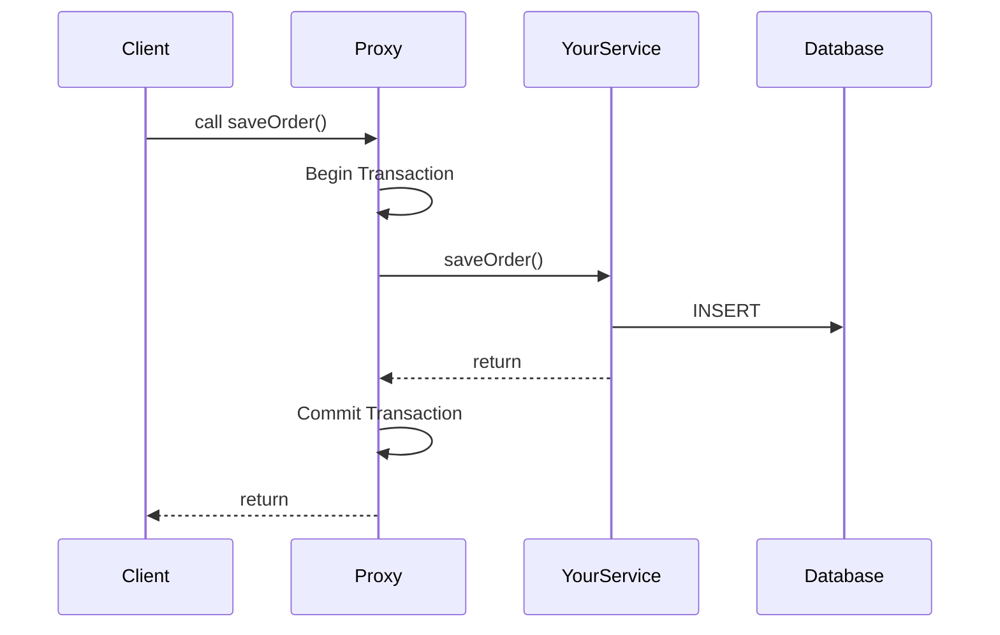
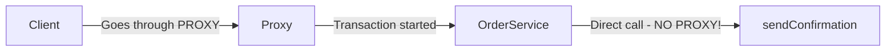

# Spring Transactions & Common Pitfalls

:::danger Interview Alert
The **self-invocation problem** catches many developers. Understanding why `@Transactional` sometimes "doesn't work" is critical for senior roles.
:::

## 1. How @Transactional Works

### The Proxy Magic

When you add `@Transactional`, Spring creates a **PROXY** around your class:



### Basic Usage

```java
@Service
public class OrderService {
    
    @Autowired
    private OrderRepository orderRepository;
    
    @Autowired
    private PaymentService paymentService;
    
    @Transactional
    public void placeOrder(Order order) {
        orderRepository.save(order);           // If this succeeds...
        paymentService.processPayment(order);  // ...and this fails...
        // BOTH are rolled back! ✅
    }
}
```

---

## 2. The Self-Invocation Problem (Critical!)

### ❌ The Problem

```java
@Service
public class OrderService {
    
    @Transactional
    public void placeOrder(Order order) {
        // Some logic...
        this.sendConfirmation(order);  // ❌ Transaction NOT applied!
    }
    
    @Transactional
    public void sendConfirmation(Order order) {
        // This method's @Transactional is IGNORED
        // because it's called internally (not through proxy)
    }
}
```

### Why Does This Happen?



When you call `this.sendConfirmation()`, you're calling the **actual object**, bypassing the proxy!

### ✅ Solutions

**Solution 1: Inject Self (Recommended)**

```java
@Service
public class OrderService {
    
    @Autowired
    private OrderService self;  // Inject the PROXY
    
    @Transactional
    public void placeOrder(Order order) {
        self.sendConfirmation(order);  // ✅ Goes through proxy
    }
    
    @Transactional
    public void sendConfirmation(Order order) {
        // Transaction properly applied
    }
}
```

**Solution 2: Extract to Separate Service**

```java
@Service
public class OrderService {
    
    @Autowired
    private NotificationService notificationService;
    
    @Transactional
    public void placeOrder(Order order) {
        notificationService.sendConfirmation(order);  // ✅ Different bean = proxy
    }
}

@Service
public class NotificationService {
    @Transactional
    public void sendConfirmation(Order order) { ... }
}
```

---

## 3. Rollback Rules

### Default Behavior

| Exception Type | Rollback? |
|----------------|-----------|
| `RuntimeException` (unchecked) | ✅ YES |
| `Error` | ✅ YES |
| `Exception` (checked) | ❌ NO |

```java
@Transactional
public void process() throws IOException {
    repository.save(entity);
    throw new IOException("File error");  // ❌ NO ROLLBACK by default!
}
```

### Customizing Rollback

```java
// Rollback for checked exceptions
@Transactional(rollbackFor = Exception.class)
public void process() throws IOException {
    repository.save(entity);
    throw new IOException("File error");  // ✅ NOW it rolls back
}

// Don't rollback for specific exception
@Transactional(noRollbackFor = BusinessException.class)
public void process() {
    repository.save(entity);
    throw new BusinessException("Expected error");  // ❌ No rollback
}
```

### Interview Question: What happens with try-catch?

```java
@Transactional
public void process() {
    try {
        repository.save(entity);
        throw new RuntimeException("Error!");
    } catch (Exception e) {
        log.error("Error occurred", e);
        // ⚠️ Transaction is STILL marked for rollback!
        // It will rollback when method exits
    }
}
// Result: ROLLBACK happens even though exception was caught!
```

**Why?** Spring marks the transaction as rollback-only when the exception occurs.

---

## 4. Propagation Levels

### Interview Cheat Sheet

| Propagation | Behavior | Use Case |
|-------------|----------|----------|
| `REQUIRED` (default) | Join existing or create new | Normal operations |
| `REQUIRES_NEW` | Always create new (suspend existing) | Audit logs that must save |
| `NESTED` | Create savepoint in existing | Batch processing |
| `SUPPORTS` | Join if exists, else non-transactional | Read-only services |
| `NOT_SUPPORTED` | Suspend existing, run non-transactional | Long-running tasks |

### REQUIRES_NEW Example

```java
@Service
public class AuditService {
    
    @Transactional(propagation = Propagation.REQUIRES_NEW)
    public void logAudit(String action) {
        // This runs in a SEPARATE transaction
        // Even if the parent transaction fails, this audit log is saved
        auditRepository.save(new AuditLog(action));
    }
}

@Service
public class OrderService {
    
    @Autowired
    private AuditService auditService;
    
    @Transactional
    public void placeOrder(Order order) {
        auditService.logAudit("Order placed");  // Committed immediately
        
        orderRepository.save(order);
        throw new RuntimeException("Error!");
        // Order is rolled back, but audit log is SAVED!
    }
}
```

---

## 5. Isolation Levels

### The Problems They Solve

| Problem | Description |
|---------|-------------|
| **Dirty Read** | Reading uncommitted data from another transaction |
| **Non-Repeatable Read** | Same query returns different results |
| **Phantom Read** | New rows appear in repeated queries |

### Isolation Levels

| Level | Dirty Read | Non-Repeatable | Phantom |
|-------|------------|----------------|---------|
| `READ_UNCOMMITTED` | ⚠️ Possible | ⚠️ Possible | ⚠️ Possible |
| `READ_COMMITTED` | ✅ Prevented | ⚠️ Possible | ⚠️ Possible |
| `REPEATABLE_READ` | ✅ Prevented | ✅ Prevented | ⚠️ Possible |
| `SERIALIZABLE` | ✅ Prevented | ✅ Prevented | ✅ Prevented |

```java
@Transactional(isolation = Isolation.REPEATABLE_READ)
public BigDecimal calculateBalance(Long accountId) {
    // Multiple reads during this transaction will return same data
    BigDecimal balance = accountRepository.getBalance(accountId);
    // ... complex calculations ...
    BigDecimal updated = accountRepository.getBalance(accountId);
    // balance == updated (guaranteed)
    return balance;
}
```

---

## 6. @Transactional Best Practices

### ✅ DO

```java
// 1. Use at service layer, not repository
@Service
public class OrderService {
    @Transactional
    public void placeOrder(Order order) { ... }
}

// 2. Keep transactions short
@Transactional
public void process(Order order) {
    // ❌ Don't do heavy computations inside transaction
    // ✅ Do: Quick DB operations only
}

// 3. Use readOnly for queries
@Transactional(readOnly = true)
public List<Order> findAllOrders() {
    return orderRepository.findAll();
}
```

### ❌ DON'T

```java
// 1. Don't catch exceptions silently
@Transactional
public void process() {
    try {
        doWork();
    } catch (Exception e) {
        // ❌ Swallowing exception but transaction is marked for rollback!
    }
}

// 2. Don't make external HTTP calls inside transaction
@Transactional
public void process() {
    repository.save(entity);
    httpClient.callExternalService();  // ❌ Holding DB connection!
}

// 3. Don't use on private methods
@Transactional  // ❌ IGNORED - proxies can't intercept private methods
private void helper() { ... }
```

---

## 7. Common Interview Questions

### Q1: Can @Transactional work on private methods?

**Answer:** No. Spring uses proxies, and proxies can only intercept public methods.

### Q2: What's the difference between JDK Proxy and CGLIB?

| JDK Proxy | CGLIB |
|-----------|-------|
| Interface-based | Class-based (subclassing) |
| Faster to create | Faster at runtime |
| Target must implement interface | Works with any class |

Spring Boot uses **CGLIB by default**.

### Q3: How do you test @Transactional?

```java
@SpringBootTest
@Transactional  // Each test runs in transaction and rolls back!
class OrderServiceTest {
    
    @Autowired
    private OrderService orderService;
    
    @Test
    void testPlaceOrder() {
        orderService.placeOrder(new Order());
        // Automatically rolled back after test
    }
}
```

---

## 8. Debugging Transactions

Enable transaction logging:

```yaml
# application.yml
logging:
  level:
    org.springframework.transaction: DEBUG
    org.springframework.orm.jpa: DEBUG
```

Look for these log messages:
- `Creating new transaction`
- `Participating in existing transaction`
- `Initiating transaction commit`
- `Initiating transaction rollback`

---

## Quick Reference

```text
Self-Invocation Problem:
- Internal method calls bypass proxy
- Solution: Inject self or extract to separate service

Rollback Rules:
- RuntimeException → ROLLBACK (default)
- Checked Exception → NO ROLLBACK
- Override with rollbackFor/noRollbackFor

Propagation:
- REQUIRED (default): Join or create
- REQUIRES_NEW: Always new (for audit logs)

Best Practices:
- Keep transactions short
- Use readOnly for queries
- Avoid external calls in transactions
- Don't catch exceptions silently
```

---

**Next:** [Spring Async & Thread Pools →](./04-async-processing)
