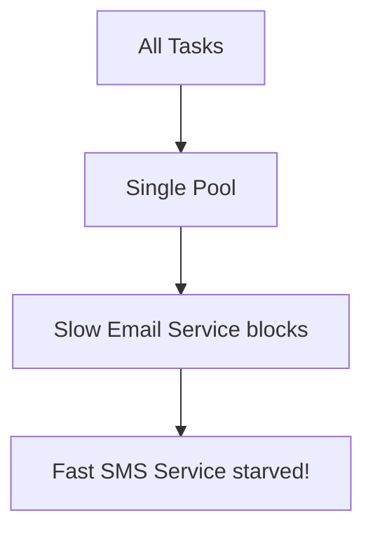

# Async Processing & Thread Pools

:::warning Production Issue
Thread pool exhaustion is the #1 cause of async failures in production. Understanding pool sizing is critical!
:::

## 1. Enabling Async in Spring

### Basic Setup

```java
@Configuration
@EnableAsync
public class AsyncConfig {
    // Default: Uses SimpleAsyncTaskExecutor (creates new thread per task - BAD!)
}
```

### Custom Thread Pool (Recommended)

```java
@Configuration
@EnableAsync
public class AsyncConfig implements AsyncConfigurer {
    
    @Override
    public Executor getAsyncExecutor() {
        ThreadPoolTaskExecutor executor = new ThreadPoolTaskExecutor();
        executor.setCorePoolSize(10);          // Always running
        executor.setMaxPoolSize(50);           // Max threads
        executor.setQueueCapacity(100);        // Waiting tasks
        executor.setThreadNamePrefix("Async-"); // For debugging
        executor.setRejectedExecutionHandler(new CallerRunsPolicy());
        executor.initialize();
        return executor;
    }
    
    @Override
    public AsyncUncaughtExceptionHandler getAsyncUncaughtExceptionHandler() {
        return (ex, method, params) -> {
            log.error("Async error in {}: {}", method.getName(), ex.getMessage());
        };
    }
}
```

---

## 2. Using @Async

### Basic Usage

```java
@Service
public class NotificationService {
    
    @Async
    public void sendEmail(String to, String subject) {
        // Runs in separate thread
        emailClient.send(to, subject);
    }
    
    @Async
    public CompletableFuture<String> sendEmailWithResult(String to) {
        String result = emailClient.send(to);
        return CompletableFuture.completedFuture(result);
    }
}
```

### Waiting for Async Results

```java
@Service
public class OrderService {
    
    @Autowired
    private NotificationService notificationService;
    
    public void processOrder(Order order) {
        // Fire and forget
        notificationService.sendEmail(order.getEmail(), "Order Placed");
        
        // Wait for result
        CompletableFuture<String> future = 
            notificationService.sendEmailWithResult(order.getEmail());
        
        String result = future.get(5, TimeUnit.SECONDS);  // Blocks with timeout
    }
}
```

---

## 3. Thread Pool Sizing Formula

### The Formula

```text
Optimal threads = Number of CPUs × Target CPU utilization × (1 + Wait time / Compute time)

For I/O bound tasks (most web apps):
Threads = CPUs × (1 + 50) = CPUs × 51

For CPU bound tasks:
Threads = CPUs + 1
```

### Practical Guidelines

| Task Type | Core Pool | Max Pool | Queue |
|-----------|-----------|----------|-------|
| CPU-bound | CPU count | CPU count + 1 | Small (10) |
| I/O-bound | CPU × 2 | CPU × 10 | Large (1000) |
| Mixed | CPU × 2 | CPU × 5 | Medium (100) |

```java
int cpuCount = Runtime.getRuntime().availableProcessors();

// For I/O bound (HTTP calls, DB queries)
executor.setCorePoolSize(cpuCount * 2);
executor.setMaxPoolSize(cpuCount * 10);
executor.setQueueCapacity(1000);

// For CPU bound (calculations, parsing)
executor.setCorePoolSize(cpuCount);
executor.setMaxPoolSize(cpuCount + 1);
executor.setQueueCapacity(10);
```

---

## 4. Common Pitfalls

### Pitfall 1: Self-Invocation (Same as @Transactional!)

```java
@Service
public class MyService {
    
    public void doWork() {
        this.asyncTask();  // ❌ NOT async - bypasses proxy!
    }
    
    @Async
    public void asyncTask() {
        // This runs synchronously when called internally
    }
}

// ✅ Solution: Inject self
@Service
public class MyService {
    @Autowired
    private MyService self;
    
    public void doWork() {
        self.asyncTask();  // ✅ Goes through proxy
    }
}
```

### Pitfall 2: Lost Context (Security, MDC)

```java
@Async
public void processOrder(Order order) {
    // ❌ SecurityContext is NULL here!
    String username = SecurityContextHolder.getContext().getAuthentication().getName();
}
```

**Solution: Propagate Context**

```java
@Configuration
@EnableAsync
public class AsyncConfig implements AsyncConfigurer {
    
    @Override
    public Executor getAsyncExecutor() {
        ThreadPoolTaskExecutor executor = new ThreadPoolTaskExecutor();
        executor.setCorePoolSize(10);
        executor.setMaxPoolSize(50);
        executor.initialize();
        
        // Wrap to propagate security context
        return new DelegatingSecurityContextAsyncTaskExecutor(executor);
    }
}
```

### Pitfall 3: Thread Pool Exhaustion

```java
// ❌ All threads blocked waiting for slow service
@Async
public void processAll(List<Item> items) {
    for (Item item : items) {
        slowExternalService.call(item);  // Each takes 5 seconds
    }
}
```

**Symptoms:**
- New async tasks wait in queue forever
- Application becomes unresponsive
- `RejectedExecutionException` thrown

**Solutions:**
1. Use timeouts for external calls
2. Increase pool size
3. Use bulkheads (separate pools)

```java
// ✅ Configure rejection policy
executor.setRejectedExecutionHandler(new CallerRunsPolicy());
// Runs in caller thread when pool is full - backpressure!
```

---

## 5. Multiple Thread Pools (Bulkhead Pattern)

### Why Multiple Pools?



### Solution: Separate Pools

```java
@Configuration
@EnableAsync
public class AsyncConfig {
    
    @Bean("emailExecutor")
    public TaskExecutor emailExecutor() {
        ThreadPoolTaskExecutor executor = new ThreadPoolTaskExecutor();
        executor.setCorePoolSize(5);
        executor.setMaxPoolSize(10);
        executor.setThreadNamePrefix("Email-");
        executor.initialize();
        return executor;
    }
    
    @Bean("smsExecutor")
    public TaskExecutor smsExecutor() {
        ThreadPoolTaskExecutor executor = new ThreadPoolTaskExecutor();
        executor.setCorePoolSize(3);
        executor.setMaxPoolSize(5);
        executor.setThreadNamePrefix("SMS-");
        executor.initialize();
        return executor;
    }
}

@Service
public class NotificationService {
    
    @Async("emailExecutor")  // Uses email pool
    public void sendEmail(String to) { ... }
    
    @Async("smsExecutor")    // Uses SMS pool
    public void sendSMS(String to) { ... }
}
```

---

## 6. CompletableFuture Patterns

### Parallel Execution

```java
public OrderDetails getOrderDetails(Long orderId) {
    CompletableFuture<Order> orderFuture = 
        CompletableFuture.supplyAsync(() -> orderService.getOrder(orderId));
    
    CompletableFuture<Customer> customerFuture = 
        CompletableFuture.supplyAsync(() -> customerService.getCustomer(orderId));
    
    CompletableFuture<List<Item>> itemsFuture = 
        CompletableFuture.supplyAsync(() -> itemService.getItems(orderId));
    
    // Wait for all
    CompletableFuture.allOf(orderFuture, customerFuture, itemsFuture).join();
    
    return new OrderDetails(
        orderFuture.join(),
        customerFuture.join(),
        itemsFuture.join()
    );
}
```

### With Timeout

```java
CompletableFuture<String> future = asyncService.doWork();

try {
    String result = future.get(5, TimeUnit.SECONDS);
} catch (TimeoutException e) {
    future.cancel(true);
    return fallbackValue;
}
```

---

## 7. Monitoring Thread Pools

### Expose Metrics

```java
@Bean
public ThreadPoolTaskExecutor asyncExecutor(MeterRegistry registry) {
    ThreadPoolTaskExecutor executor = new ThreadPoolTaskExecutor();
    executor.setCorePoolSize(10);
    executor.setMaxPoolSize(50);
    executor.initialize();
    
    // Register metrics
    Gauge.builder("async.pool.active", executor, ThreadPoolTaskExecutor::getActiveCount)
         .register(registry);
    Gauge.builder("async.pool.queue.size", executor, e -> e.getThreadPoolExecutor().getQueue().size())
         .register(registry);
    
    return executor;
}
```

### Key Metrics to Monitor

| Metric | Alert When |
|--------|------------|
| Active threads | > 80% of max |
| Queue size | Growing continuously |
| Rejected tasks | > 0 |
| Task completion time | > SLA threshold |

---

## 8. Interview Questions

### Q1: Why shouldn't you use SimpleAsyncTaskExecutor in production?

**Answer:** It creates a new thread for every task. Threads are expensive (1MB stack each). In production, you'll run out of memory with high load.

### Q2: What happens when the thread pool queue is full?

**Answer:** Depends on `RejectedExecutionHandler`:
- `AbortPolicy` (default): Throws `RejectedExecutionException`
- `CallerRunsPolicy`: Runs in calling thread (backpressure)
- `DiscardPolicy`: Silently drops task
- `DiscardOldestPolicy`: Drops oldest task in queue

### Q3: How do you handle exceptions in @Async methods?

```java
// For void methods - custom handler
@Override
public AsyncUncaughtExceptionHandler getAsyncUncaughtExceptionHandler() {
    return (ex, method, params) -> {
        log.error("Async error", ex);
        alertService.notify(ex);
    };
}

// For CompletableFuture - use exceptionally
@Async
public CompletableFuture<String> doWork() {
    return CompletableFuture
        .supplyAsync(() -> riskyOperation())
        .exceptionally(ex -> {
            log.error("Error", ex);
            return "fallback";
        });
}
```

---

## Quick Reference

```text
Thread Pool Sizing:
- I/O bound: cores × 10
- CPU bound: cores + 1

Common Pitfalls:
1. Self-invocation (inject self)
2. Lost security context (DelegatingSecurityContext)
3. Thread pool exhaustion (monitor, use timeouts)

Best Practices:
- Always configure custom executor
- Use separate pools for different task types
- Set appropriate rejection policy
- Monitor pool metrics
- Use timeouts for external calls
```

---

**Next:** [Operating Systems Fundamentals →](../04-operating-systems/01-intro)
