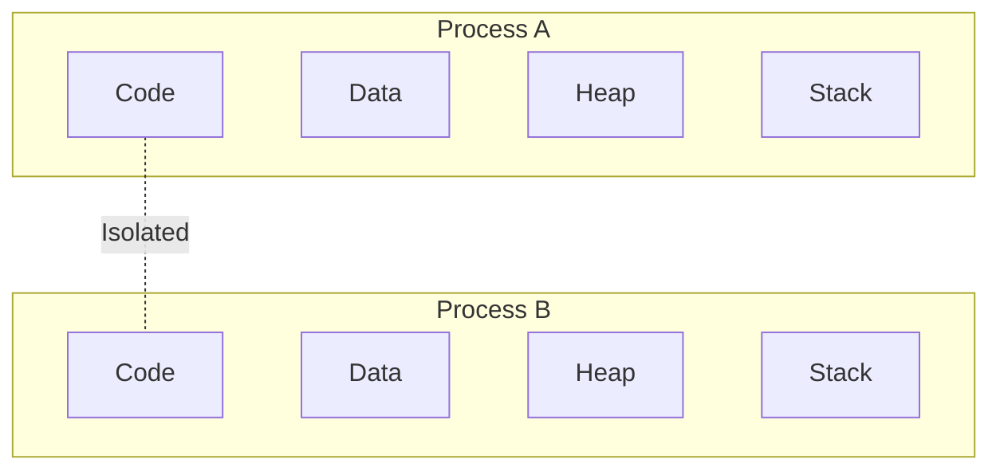
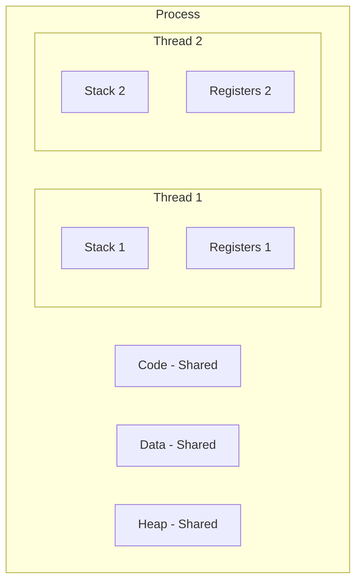
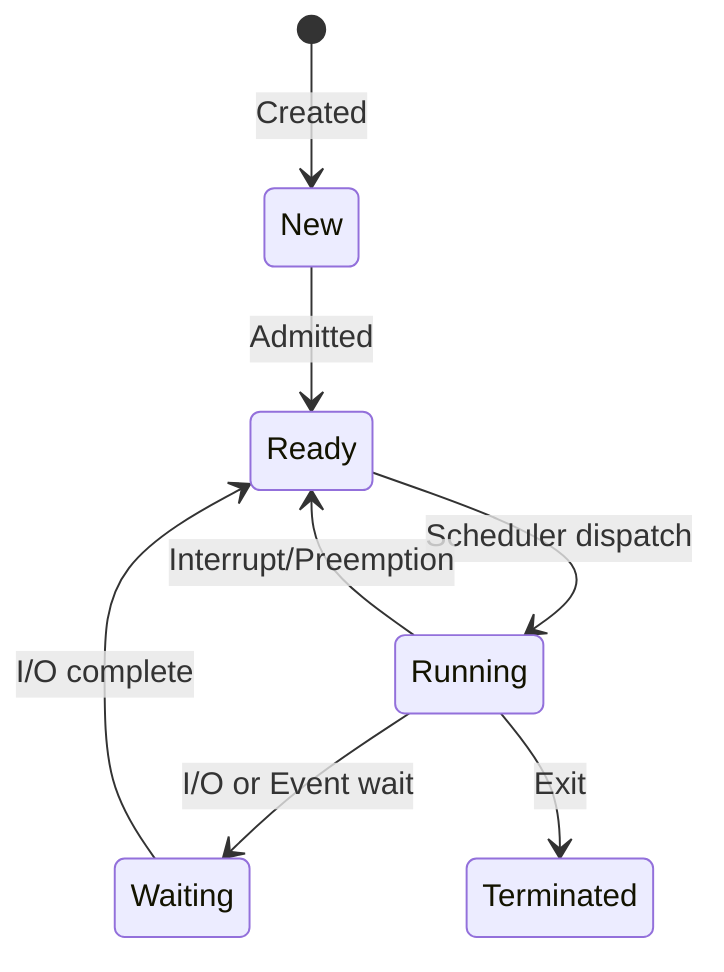

# Processes, Threads & Context Switching

:::info Interview Essential
Understanding the difference between processes and threads is fundamental for system design interviews and debugging performance issues.
:::

## 1. Process vs Thread

### Process

A **process** is an independent program in execution with its own memory space.



### Thread

A **thread** is a lightweight unit of execution within a process. Threads share the process's memory.



### Comparison Table

| Aspect | Process | Thread |
|--------|---------|--------|
| Memory | Separate memory space | Shared memory (except stack) |
| Creation cost | High (~10ms) | Low (~1ms) |
| Communication | IPC (Inter-Process Communication) | Direct shared memory |
| Crash impact | Only that process dies | Entire process dies |
| Context switch | Expensive | Cheaper |

### Interview Answer:

> "A process has its own isolated memory space, while threads within a process share memory. This makes thread communication faster but also introduces synchronization challenges. Thread creation is cheaper because there's no need to allocate new memory space."

---

## 2. Context Switching

### What Happens During a Context Switch?

When the CPU switches from one process/thread to another:

```text
1. Save current state (registers, PC, stack pointer) to PCB/TCB
2. Load saved state of new process/thread
3. Flush/update caches and TLB (for processes)
4. Resume execution
```

### Cost of Context Switching

| Type | Typical Cost | Why |
|------|--------------|-----|
| Thread switch (same process) | 1-10 μs | Just save/restore registers |
| Process switch | 10-100 μs | + TLB flush, cache effects |
| Virtual Machine switch | 1+ ms | Full context |

### Why It Matters for Java Applications

```java
// Too many threads = excessive context switching
ExecutorService pool = Executors.newFixedThreadPool(10000); // ❌ BAD

// Rule of thumb for I/O bound: threads = cores × 2
// Rule of thumb for CPU bound: threads = cores + 1
int optimalThreads = Runtime.getRuntime().availableProcessors() * 2;
ExecutorService pool = Executors.newFixedThreadPool(optimalThreads); // ✅ GOOD
```

### Monitoring Context Switches (Linux)

```bash
# Per-second system-wide
vmstat 1

# Per-process
pidstat -w -p <PID> 1

# Key metrics:
# cs (context switches/sec) - if > 10000, investigate
# us (user CPU) vs sy (system CPU) - high sy may indicate too many switches
```

---

## 3. CPU-Bound vs I/O-Bound

### CPU-Bound Tasks

Tasks that primarily use CPU cycles (calculations, parsing, compression).

```java
// CPU-bound example
public int fibonacci(int n) {
    if (n <= 1) return n;
    return fibonacci(n - 1) + fibonacci(n - 2);
}

// Optimal threads = CPU cores
int threads = Runtime.getRuntime().availableProcessors();
```

### I/O-Bound Tasks

Tasks that wait for I/O operations (network, disk, database).

```java
// I/O-bound example
public String fetchData(String url) {
    // Most time spent WAITING for response
    return httpClient.get(url);
}

// Optimal threads = CPU cores × (1 + wait_time/compute_time)
// For typical web app: cores × 10-50
int threads = Runtime.getRuntime().availableProcessors() * 10;
```

### Interview Question: How do you size a thread pool?

```text
For CPU-bound work:
  threads = number_of_cores + 1

For I/O-bound work:
  threads = number_of_cores × (1 + wait_time / compute_time)
  
  Example: If wait=100ms, compute=10ms, cores=8
  threads = 8 × (1 + 100/10) = 8 × 11 = 88 threads
```

---

## 4. Process States



### State Descriptions

| State | Description | Java Thread Equivalent |
|-------|-------------|----------------------|
| New | Process created, not yet running | `NEW` |
| Ready | Waiting for CPU | `RUNNABLE` |
| Running | Currently executing | `RUNNABLE` |
| Waiting | Blocked on I/O or event | `BLOCKED`, `WAITING`, `TIMED_WAITING` |
| Terminated | Finished execution | `TERMINATED` |

---

## 5. Linux Process Commands

### Essential Commands

```bash
# List all processes
ps aux

# Real-time monitoring
top
htop  # Better UI

# Process tree
pstree -p <PID>

# Detailed process info
cat /proc/<PID>/status

# Thread count
ps -o nlwp <PID>

# Memory mapping
pmap <PID>
```

### Key Metrics in top/htop

```text
PID   - Process ID
USER  - Owner
PR    - Priority
NI    - Nice value (-20 to 19, lower = higher priority)
VIRT  - Virtual memory
RES   - Resident (physical) memory
SHR   - Shared memory
S     - State (R=running, S=sleeping, Z=zombie)
%CPU  - CPU usage
%MEM  - Memory usage
TIME+ - Total CPU time
```

---

## 6. Scheduling Algorithms

### Common Linux Schedulers

| Scheduler | Type | Use Case |
|-----------|------|----------|
| CFS (Completely Fair Scheduler) | General purpose | Default for normal processes |
| Real-Time (SCHED_FIFO, SCHED_RR) | Priority-based | Latency-critical applications |
| Deadline (SCHED_DEADLINE) | EDF | Hard real-time requirements |

### Priority and Nice Values

```bash
# Run with lower priority (nice value 10)
nice -n 10 java -jar myapp.jar

# Change priority of running process
renice -n 5 -p <PID>

# Real-time priority (requires root)
chrt -f 50 java -jar myapp.jar
```

### How CFS Works (Simplified)

```text
1. Each process gets a "virtual runtime" (vruntime)
2. Process with LOWEST vruntime runs next
3. Running increases vruntime based on:
   - Actual CPU time used
   - Process weight (based on nice value)
4. Result: Fair distribution of CPU time
```

---

## 7. Interview Questions

### Q1: What's the difference between preemptive and non-preemptive scheduling?

| Preemptive | Non-Preemptive |
|------------|----------------|
| OS can interrupt running process | Process runs until it yields |
| Better for responsiveness | Simpler, less overhead |
| Modern OS default | Older systems, some embedded |

### Q2: What is a zombie process?

A process that has finished execution but still has an entry in the process table.

```bash
# Zombie process in ps output
Z    defunct <defunct>

# Cause: Parent didn't call wait() to read child's exit status
# Fix: Parent must call wait() or ignore SIGCHLD

# Check for zombies
ps aux | grep Z
```

### Q3: Why is forking expensive?

```text
Fork creates a copy of:
1. Page tables (even with copy-on-write)
2. File descriptors
3. Signal handlers
4. Memory mappings

This is why web servers use thread pools instead of fork-per-request.
```

### Q4: What's the "thundering herd" problem?

When multiple processes/threads wait on the same event (like a socket), and all wake up when the event occurs, but only one can handle it.

```java
// Problem: Many threads wait on same lock
synchronized(lock) {
    lock.notifyAll();  // ❌ All wake up, only one proceeds
}

// Solution: notify() or use specific signaling
synchronized(lock) {
    lock.notify();  // ✅ Only one thread wakes up
}
```

---

## 8. Production Tips

### Monitoring Thread Dumps (Java)

```bash
# Generate thread dump
jstack <PID> > threaddump.txt

# Or with kill signal
kill -3 <PID>  # Prints to stdout

# Look for:
# - BLOCKED threads (deadlock potential)
# - WAITING threads (what are they waiting for?)
# - High count of similar stack traces (thread pool exhaustion)
```

### Detecting Deadlocks

```bash
# JVM will report deadlocks in thread dump
jstack <PID> | grep -A 30 "deadlock"
```

---

## Quick Reference

```text
Process vs Thread:
- Process: Isolated memory, expensive to create
- Thread: Shared memory, cheap to create

Context Switch Cost:
- Thread: 1-10 μs
- Process: 10-100 μs

Thread Pool Sizing:
- CPU-bound: cores + 1
- I/O-bound: cores × (1 + wait/compute)

Process States:
New → Ready → Running → Terminated
              ↓     ↑
           Waiting

Key Commands:
ps, top, htop, pstree, jstack
```

---

**Next:** [Memory Management & Virtual Memory →](./03-memory-management)
