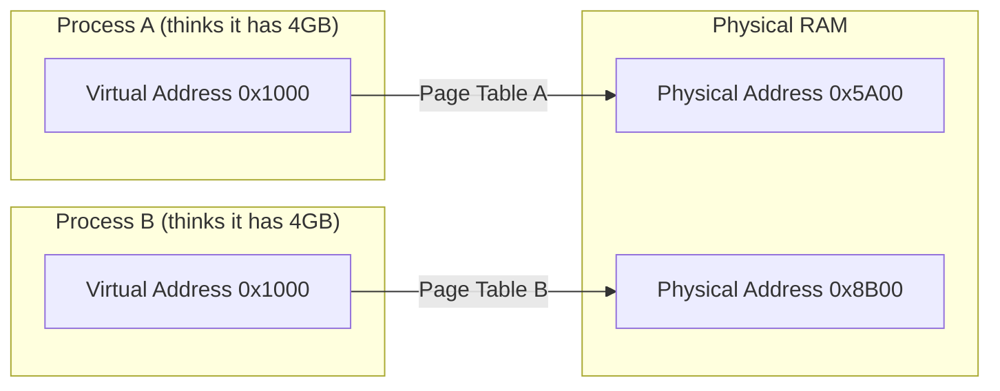
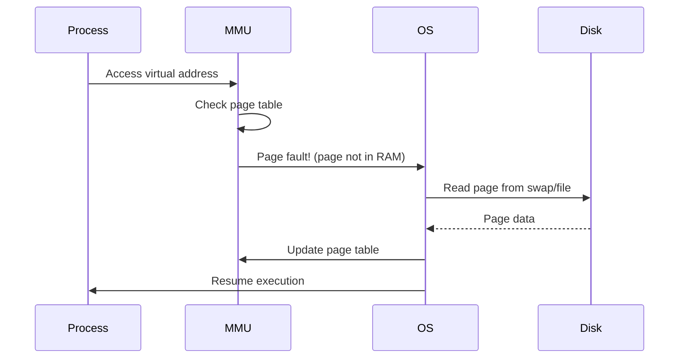

# Memory Management & Virtual Memory

:::danger Production Alert
Understanding memory management prevents the dreaded OOM Killer from randomly terminating your Java application in production!
:::

## 1. Virtual Memory Concepts

### What is Virtual Memory?

Virtual memory creates an illusion that each process has its own private, contiguous memory space, even if physical RAM is limited.



### Why Virtual Memory?

| Benefit | Explanation |
|---------|-------------|
| **Isolation** | Processes can't access each other's memory |
| **Larger address space** | Can use more memory than physical RAM |
| **Memory sharing** | Libraries can be shared between processes |
| **Efficient loading** | Only load pages that are actually used |

---

## 2. Paging

### How Paging Works

Memory is divided into fixed-size blocks:
- **Pages** (virtual memory) - typically 4KB
- **Frames** (physical memory) - same size as pages

```text
Virtual Memory (Process View):
┌──────────┬──────────┬──────────┬──────────┐
│  Page 0  │  Page 1  │  Page 2  │  Page 3  │
└──────────┴──────────┴──────────┴──────────┘
     │           │           │           │
     ▼           ▼           ▼           ▼
┌──────────┬──────────┬──────────┬──────────┬──────────┐
│ Frame 0  │ Frame 1  │ Frame 2  │ Frame 3  │ Frame 4  │  ← Physical RAM
└──────────┴──────────┴──────────┴──────────┴──────────┘
              │                       │
              └───────────────────────┘
                   (Not contiguous!)
```

### Page Table Entry

Each entry contains:
- **Physical frame number** - where the page is in RAM
- **Present bit** - is page in RAM?
- **Dirty bit** - has page been modified?
- **Access bits** - read/write/execute permissions

### Page Fault

When a process accesses a page not in RAM:



---

## 3. Translation Lookaside Buffer (TLB)

### The TLB Cache

The TLB is a high-speed cache for page table lookups.

```text
Virtual Address → TLB (fast lookup)
                    │
                    ├─ HIT → Physical Address (fast!)
                    │
                    └─ MISS → Page Table → Physical Address (slow)
```

### Why TLB Matters

| Lookup Type | Time |
|-------------|------|
| TLB hit | ~1-10 ns |
| TLB miss (page table) | ~100-200 ns |
| Page fault (disk) | ~10 ms |

### TLB and Context Switching

When switching processes, the TLB must be flushed (or tagged with process ID), causing temporary slowdown.

```java
// This is why too many threads can hurt performance
// Each context switch may flush TLB → more page table walks
```

---

## 4. Swapping

### How Swapping Works

When physical RAM is full, the OS moves inactive pages to disk (swap space).

```bash
# Check swap usage
free -h
swapon --show

# Example output:
#              total    used    free
# Mem:          16G     14G     2G
# Swap:          8G      2G     6G
```

### Swappiness

Linux parameter controlling aggressiveness of swapping:

```bash
# Check current value (0-100)
cat /proc/sys/vm/swappiness
# Default: 60

# For DB servers (avoid swapping)
echo 10 > /proc/sys/vm/swappiness

# For Java apps (avoid swapping heap)
echo 1 > /proc/sys/vm/swappiness
```

### Why Avoid Swapping for Java?

```text
1. JVM heap is actively used → constant page faults
2. GC scans entire heap → swapped pages = GC pauses in SECONDS
3. Better to OOM than swap (faster recovery)

Recommendation: Set swappiness = 1 for Java apps
```

---

## 5. The OOM Killer

### What is OOM Killer?

When Linux runs out of memory, the **OOM Killer** selects and kills processes to free memory.

### How It Chooses Victims

Each process has an **oom_score** (0-1000):

```bash
# Check process OOM score
cat /proc/<PID>/oom_score

# Higher score = more likely to be killed
# Factors: memory usage, process age, nice value
```

### Protecting Your Application

```bash
# Check current adjustment
cat /proc/<PID>/oom_score_adj
# Range: -1000 to 1000
# -1000 = never kill (protect)
# 1000 = always kill first

# Protect Java process
echo -500 > /proc/<PID>/oom_score_adj

# Or in systemd service file
[Service]
OOMScoreAdjust=-500
```

### Detecting OOM Kills

```bash
# Check system logs
dmesg | grep -i "killed process"
journalctl -xb | grep oom

# Example output:
# Out of memory: Kill process 1234 (java) score 950 or sacrifice child
```

---

## 6. Memory in Java Applications

### JVM Memory Layout

```text
┌─────────────────────────────────────────────────┐
│                  JVM Process                     │
├─────────────────────────────────────────────────┤
│  ┌───────────────────────────────────────────┐  │
│  │           Heap (-Xmx, -Xms)               │  │
│  │  ┌─────────────────┬─────────────────┐    │  │
│  │  │  Young Gen      │    Old Gen      │    │  │
│  │  └─────────────────┴─────────────────┘    │  │
│  └───────────────────────────────────────────┘  │
│                                                  │
│  ┌───────────────────────────────────────────┐  │
│  │  Metaspace (native memory)                │  │
│  └───────────────────────────────────────────┘  │
│                                                  │
│  ┌───────────────────────────────────────────┐  │
│  │  Thread stacks (1 per thread, -Xss)       │  │
│  └───────────────────────────────────────────┘  │
│                                                  │
│  ┌───────────────────────────────────────────┐  │
│  │  Native memory (NIO, JNI)                 │  │
│  └───────────────────────────────────────────┘  │
├─────────────────────────────────────────────────┤
│              OS/Kernel space                     │
└─────────────────────────────────────────────────┘
```

### Memory Calculation

```bash
Total JVM Memory ≈ Heap + Metaspace + (Threads × Stack) + Native

Example:
Heap: 4GB
Metaspace: 256MB
Threads: 500 × 1MB = 500MB
Native: ~500MB

Total ≈ 5.25GB

# Container limit should be higher!
# -Xmx4g needs ~6GB container limit
```

---

## 7. Linux Memory Commands

### Essential Commands

```bash
# System memory overview
free -h

# Detailed memory info
cat /proc/meminfo

# Process memory
pmap -x <PID>
ps aux --sort=-%mem | head -20

# Watch memory in real-time
watch -n 1 free -h
htop
```

### Understanding free Output

```text
              total        used        free      shared  buff/cache   available
Mem:           16G          8G          2G         100M          6G          7G
Swap:           8G          1G          7G

Key Terms:
- used: Actually used by processes
- free: Completely unused
- buff/cache: Used for caching (can be reclaimed)
- available: Memory available for new processes (free + reclaimable cache)
```

---

## 8. Interview Questions

### Q1: What causes a page fault?

**Answer:** A page fault occurs when a process accesses a virtual page that's not currently in physical RAM. Types:
- **Minor (soft):** Page is in memory but not mapped (just update page table)
- **Major (hard):** Page must be loaded from disk (expensive!)

### Q2: How do you debug high memory usage in Java?

```bash
# 1. Check overall memory
free -h
top -p <PID>

# 2. Analyze heap
jmap -histo:live <PID> | head -20  # Live objects
jmap -heap <PID>                    # Heap summary

# 3. Generate heap dump
jmap -dump:format=b,file=heap.hprof <PID>
# Analyze with Eclipse MAT or VisualVM
```

### Q3: What's the difference between RSS and VSZ?

| Metric | Description |
|--------|-------------|
| **VSZ** (Virtual Size) | Total virtual memory mapped |
| **RSS** (Resident Set Size) | Physical RAM currently used |

```bash
ps aux | grep java
# USER PID %CPU %MEM VSZ    RSS    COMMAND
# root 123 50.0 25.0 8000000 4000000 java

# VSZ = 8GB (includes mapped files, swap)
# RSS = 4GB (actually in physical RAM)
```

### Q4: Why shouldn't you disable swap completely?

**Answer:** 
- Inactive pages (old data, rarely used code) can be swapped, freeing RAM for active pages
- Completely disabled swap means OOM Killer activates sooner
- Best practice: Keep minimal swap (1-2GB) with low swappiness

---

## Quick Reference

```text
Virtual Memory Benefits:
- Process isolation
- Larger address space
- Memory sharing
- Demand paging

Page Fault Types:
- Minor: Quick page table update
- Major: Expensive disk I/O

Key Linux Settings:
- /proc/sys/vm/swappiness (1-10 for DB/Java)
- /proc/<PID>/oom_score_adj (-500 to protect)

Memory Debugging:
- free -h: Overview
- pmap: Per-process
- jmap: Java heap analysis

JVM Memory Total:
Heap + Metaspace + (Threads × Stack) + Native
```

---

**Next:** [4. File Descriptors & I/O →](./file-descriptors-io)
