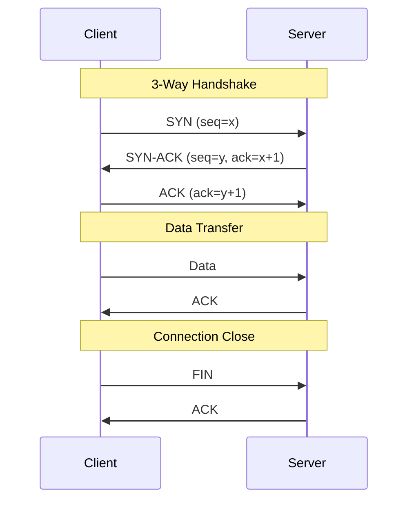

# Networking Fundamentals

:::info System Design Essential
Networking concepts like TCP, HTTP, and DNS are foundational for system design interviews. These are frequently asked!
:::

## 1. OSI Model vs TCP/IP Model

### OSI Model (7 Layers)

```text
┌─────────────────────────────────────────────────────────────────────┐
│ Layer │    Name      │    Function           │    Examples          │
├─────────────────────────────────────────────────────────────────────┤
│   7   │ Application  │ User interface        │ HTTP, HTTPS, FTP     │
│   6   │ Presentation │ Data format/encrypt   │ SSL/TLS, JPEG, ASCII │
│   5   │ Session      │ Session management    │ NetBIOS, RPC         │
│   4   │ Transport    │ End-to-end delivery   │ TCP, UDP             │
│   3   │ Network      │ Logical addressing    │ IP, ICMP, Routers    │
│   2   │ Data Link    │ Physical addressing   │ Ethernet, MAC, Switch│
│   1   │ Physical     │ Bits on wire          │ Cables, Hubs, Signals│
└─────────────────────────────────────────────────────────────────────┘

Mnemonic: "Please Do Not Throw Sausage Pizza Away"
          Physical → Data Link → Network → Transport → Session → Presentation → Application
```

### TCP/IP Model (4 Layers)

```text
┌─────────────────────────────────────────────────────────────────────┐
│ TCP/IP Layer    │ OSI Equivalent  │ Protocols                       │
├─────────────────────────────────────────────────────────────────────┤
│ Application     │ 7, 6, 5         │ HTTP, HTTPS, DNS, SMTP, SSH     │
│ Transport       │ 4               │ TCP, UDP                        │
│ Internet        │ 3               │ IP, ICMP, ARP                   │
│ Network Access  │ 2, 1            │ Ethernet, Wi-Fi                 │
└─────────────────────────────────────────────────────────────────────┘
```

### Interview Relevance by Layer

| Layer | Protocol | Interview Importance | Topics |
|-------|----------|---------------------|--------|
| Application | HTTP, HTTPS, WebSocket, DNS | ⭐⭐⭐⭐⭐ | Request/response, status codes, headers |
| Transport | TCP, UDP | ⭐⭐⭐⭐⭐ | Handshakes, reliability, flow control |
| Network | IP, ICMP | ⭐⭐⭐ | Routing, IP addressing |
| Below | Ethernet, ARP | ⭐⭐ | Rarely asked |

---

## 2. TCP vs UDP

### TCP (Transmission Control Protocol)

```text
TCP Characteristics:
├── Connection-oriented (3-way handshake)
├── Reliable (guaranteed delivery)
├── Ordered (maintains sequence)
├── Flow control (sliding window)
├── Congestion control
└── Higher overhead
```

### UDP (User Datagram Protocol)

```text
UDP Characteristics:
├── Connectionless (no handshake)
├── Unreliable (best effort, no delivery guarantee)
├── Unordered (packets may arrive out of order)
├── No flow control
├── No congestion control
└── Lower overhead, faster
```

### TCP vs UDP Comparison

| Feature | TCP | UDP |
|---------|-----|-----|
| **Connection** | Connection-oriented | Connectionless |
| **Reliability** | Guaranteed delivery | Best effort |
| **Ordering** | Ordered | No ordering |
| **Speed** | Slower (overhead) | Faster |
| **Header Size** | 20 bytes minimum | 8 bytes |
| **Use Cases** | HTTP, email, file transfer | Video streaming, gaming, DNS |

### TCP 3-Way Handshake



### When to Use UDP?

:::tip Interview Answer
"UDP is preferred when **speed matters more than reliability**: real-time video/audio streaming (small packet loss is acceptable), online gaming (low latency critical), DNS queries (simple request-response), and IoT sensors (high volume, low overhead)."
:::

---

## 3. IP Addressing

### IPv4 vs IPv6

```text
IPv4:
├── 32-bit address (4 octets)
├── Format: 192.168.1.1
├── ~4.3 billion addresses
└── Running out of addresses!

IPv6:
├── 128-bit address
├── Format: 2001:0db8:85a3:0000:0000:8a2e:0370:7334
├── 340 undecillion addresses
└── Solves address exhaustion
```

### Public vs Private IP

```text
Private IP Ranges (RFC 1918):
├── 10.0.0.0 - 10.255.255.255      (Class A)
├── 172.16.0.0 - 172.31.255.255    (Class B)
└── 192.168.0.0 - 192.168.255.255  (Class C)

These IPs are NOT routable on the internet.
Used within private networks (home, office).

NAT (Network Address Translation):
Router translates private IPs to public IP for internet access.

┌─────────────────────────────────────────────────────────────┐
│ Device (192.168.1.5) ─→ Router (NAT) ─→ Internet (1.2.3.4) │
│                          └── Translates 192.168.1.5 to 1.2.3.4
└─────────────────────────────────────────────────────────────┘
```

### CIDR Notation

```text
CIDR (Classless Inter-Domain Routing):
IP/Prefix - specifies network portion

192.168.1.0/24
├── /24 means first 24 bits are network
├── Subnet mask: 255.255.255.0
├── Host range: 192.168.1.1 - 192.168.1.254
└── 256 addresses (254 usable hosts)

10.0.0.0/8
├── /8 means first 8 bits are network
├── Subnet mask: 255.0.0.0
└── ~16 million addresses

Common CIDR blocks:
├── /32: Single host
├── /24: 256 addresses (typical LAN)
├── /16: 65,536 addresses
└── /8: 16+ million addresses
```

---

## 4. HTTP Basics

### HTTP Request Structure

```text
GET /api/users/123 HTTP/1.1        ← Request line (Method, Path, Version)
Host: example.com                   ← Required header
Authorization: Bearer eyJhbGciOi... ← Auth header
Content-Type: application/json      ← Body format
Accept: application/json            ← Expected response format

(empty line)

{request body if POST/PUT}
```

### HTTP Response Structure

```text
HTTP/1.1 200 OK                     ← Status line (Version, Status Code, Reason)
Content-Type: application/json      ← Response format
Cache-Control: max-age=3600         ← Caching directive
X-Request-Id: abc123                ← Trace ID

{
  "id": 123,
  "name": "John"
}
```

### HTTP Methods

| Method | Purpose | Safe | Idempotent | Has Body |
|--------|---------|------|------------|----------|
| GET | Retrieve | ✅ | ✅ | ❌ |
| POST | Create | ❌ | ❌ | ✅ |
| PUT | Replace | ❌ | ✅ | ✅ |
| PATCH | Partial update | ❌ | ❌ | ✅ |
| DELETE | Remove | ❌ | ✅ | May |
| HEAD | Headers only | ✅ | ✅ | ❌ |
| OPTIONS | Allowed methods | ✅ | ✅ | ❌ |

### Key HTTP Status Codes

| Code | Meaning | Common Uses |
|------|---------|-------------|
| **200** | OK | Successful request |
| **201** | Created | Resource created (POST) |
| **204** | No Content | Success, no body (DELETE) |
| **301** | Moved Permanently | Permanent redirect (cached) |
| **302** | Found | Temporary redirect |
| **304** | Not Modified | Use cached version |
| **400** | Bad Request | Invalid request syntax |
| **401** | Unauthorized | Authentication required |
| **403** | Forbidden | Authenticated but not allowed |
| **404** | Not Found | Resource doesn't exist |
| **429** | Too Many Requests | Rate limited |
| **500** | Internal Server Error | Server crashed |
| **502** | Bad Gateway | Upstream error |
| **503** | Service Unavailable | Overloaded/maintenance |

---

## 5. DNS Quick Reference

### How DNS Works (Simplified)

```text
User types: www.example.com

1. Browser cache → Found? Use cached IP
2. OS cache → Found? Use cached IP
3. DNS Resolver (ISP) → Found in cache? Return
4. Root DNS → "Where's .com?" → TLD server address
5. TLD DNS (.com) → "Where's example.com?" → Authoritative server
6. Authoritative DNS → "example.com = 93.184.216.34"
7. Resolver caches and returns IP to browser
```

### DNS Record Types

| Type | Purpose | Example |
|------|---------|---------|
| **A** | Domain → IPv4 | `example.com → 93.184.216.34` |
| **AAAA** | Domain → IPv6 | `example.com → 2606:2800:...` |
| **CNAME** | Alias | `www → example.com` |
| **MX** | Mail server | `example.com → mail.example.com` |
| **TXT** | Text data | SPF, DKIM verification |
| **NS** | Name server | `example.com → ns1.provider.com` |

---

## 6. Quick Overview of Other Topics

### Load Balancing Algorithms

```text
1. Round Robin: server1 → server2 → server3 → repeat
2. Least Connections: route to server with fewest active connections
3. IP Hash: hash(clientIP) % numServers (sticky sessions)
4. Weighted Round Robin: more traffic to higher-weight servers
```

### Layer 4 vs Layer 7 Load Balancer

| Feature | Layer 4 | Layer 7 |
|---------|---------|---------|
| **Routes by** | IP + Port | URL, Headers, Cookies |
| **Speed** | Faster | Slower |
| **SSL Termination** | No | Yes |
| **Use Case** | Raw TCP/UDP | HTTP routing |

### WebSocket Overview

```text
HTTP (Request-Response):
Client → Request → Server
Client ← Response ← Server
(Connection closes or idles)

WebSocket (Full Duplex):
Client ←─────────────→ Server
      Persistent bidirectional

Use for: Chat, gaming, live notifications, collaborative editing
```

### CDN Overview

```text
Without CDN: User in Australia → Server in USA (200ms+ latency)

With CDN:
User in Australia → Edge Server in Sydney → (if cache miss) → Origin in USA
                          ↓
                   Return cached content (20ms!)

What to cache: Static assets (images, CSS, JS, fonts)
What NOT to cache: User-specific data, real-time data
```

---

## 7. Common Interview Questions

### Q1: What happens when you type google.com in browser?

```text
1. Browser checks cache for DNS record
2. DNS resolution (recursive query)
3. Browser initiates TCP connection (3-way handshake)
4. TLS handshake (if HTTPS)
5. Browser sends HTTP GET request
6. Server processes and sends response
7. Browser receives and parses HTML
8. Browser fetches additional resources (CSS, JS, images)
9. Browser renders page
10. JavaScript executes
```

### Q2: How do you handle 10K concurrent connections?

```text
Traditional (Thread per connection):
├── 10K threads = 10GB+ memory (1MB stack each)
├── Too many context switches
└── Doesn't scale

Event-driven (Non-blocking I/O):
├── Few threads handle many connections
├── Use epoll/kqueue for I/O multiplexing
├── Examples: Nginx, Node.js, Netty
└── Java: NIO or Reactor pattern (Spring WebFlux)
```

### Q3: What's head-of-line blocking?

```text
HTTP/1.1 with single connection:
Request A (slow) ──────────────────────────→
Request B waits...──────────────────────────→
Request C waits...──────────────────────────→

Even if B and C are fast, they wait for A.

Solutions:
├── HTTP/1.1: Multiple connections (6-8 per domain)
├── HTTP/2: Multiplexing (parallel on same connection)
└── HTTP/3: QUIC (no HOL blocking at transport level)
```

---

## Quick Reference Card

```text
┌──────────────────────────────────────────────────────────────────────┐
│                NETWORKING FUNDAMENTALS CHEAT SHEET                    │
├──────────────────────────────────────────────────────────────────────┤
│                                                                       │
│ OSI MODEL (interview focus):                                          │
│ Layer 7: Application (HTTP, DNS)      ← Most important               │
│ Layer 4: Transport (TCP, UDP)         ← Very important               │
│ Layer 3: Network (IP)                 ← Somewhat important           │
│                                                                       │
│ TCP 3-WAY HANDSHAKE:                                                  │
│ SYN → SYN-ACK → ACK                                                  │
│                                                                       │
│ TCP vs UDP:                                                           │
│ TCP: Reliable, ordered, connection-oriented (HTTP, email)             │
│ UDP: Fast, unreliable, connectionless (streaming, gaming)             │
│                                                                       │
│ DNS RESOLUTION:                                                       │
│ Browser → Resolver → Root → TLD → Authoritative → IP                 │
│                                                                       │
│ HTTP STATUS CODES:                                                    │
│ 2xx: Success   3xx: Redirect   4xx: Client Error   5xx: Server Error │
│                                                                       │
│ LOAD BALANCING:                                                       │
│ Round Robin | Least Connections | IP Hash | Weighted                 │
│                                                                       │
│ COMMON PORTS:                                                         │
│ 21: FTP       22: SSH         23: Telnet                              │
│ 25: SMTP      53: DNS         80: HTTP                                │
│ 110: POP3     143: IMAP       443: HTTPS                              │
│ 3306: MySQL   5432: PostgreSQL 6379: Redis                            │
│                                                                       │
└──────────────────────────────────────────────────────────────────────┘
```

---

**Next:** [3. TCP Deep Dive →](./tcp-deep-dive)
