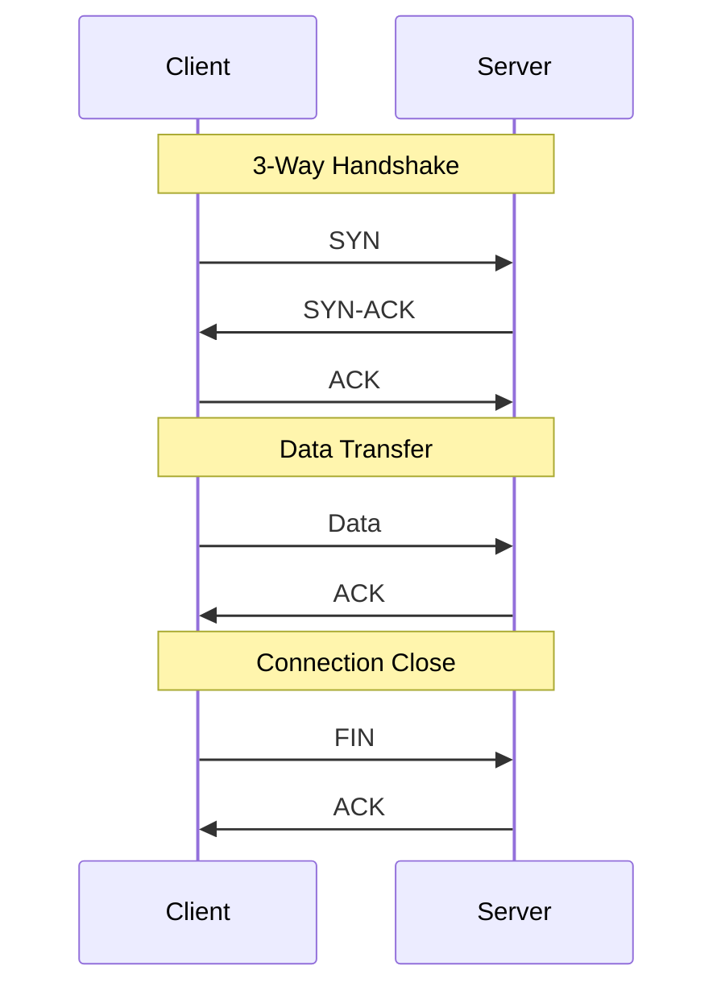
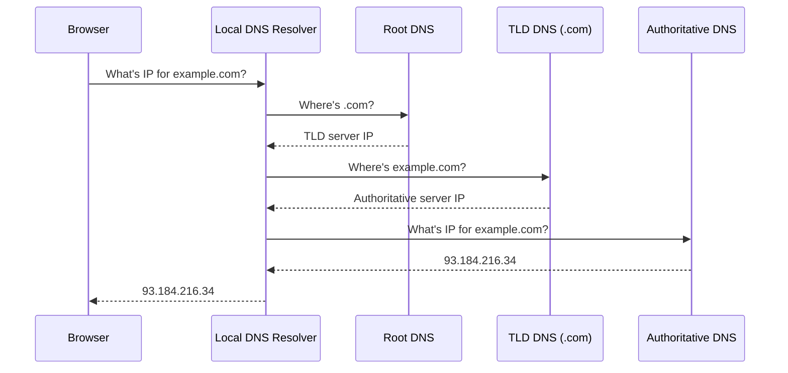
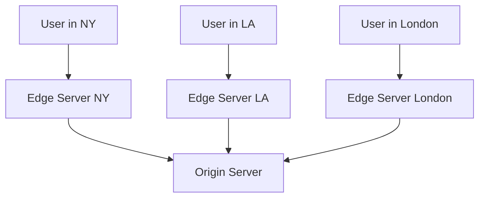
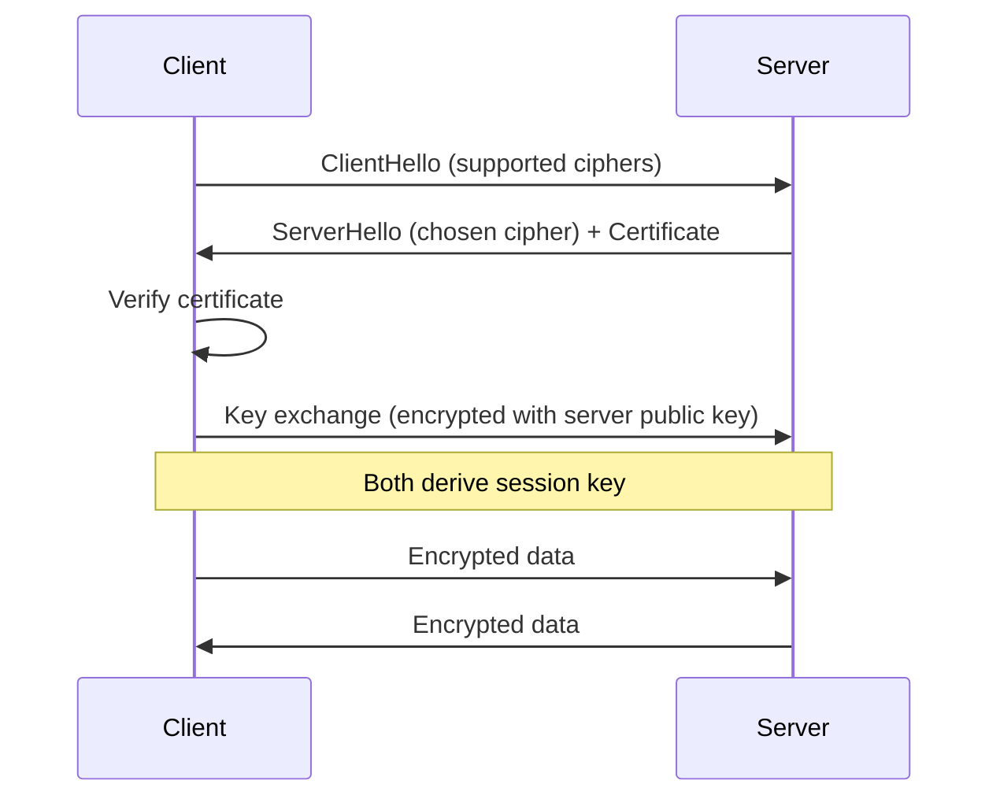

# Computer Networks Fundamentals

:::info System Design Essential
Networking concepts like TCP, HTTP, and DNS are foundational for system design interviews. These are frequently asked!
:::

## 1. OSI Model (Simplified)

```text
Layer 7: Application  → HTTP, HTTPS, WebSocket, gRPC
Layer 4: Transport    → TCP (reliable), UDP (fast)
Layer 3: Network      → IP addressing, routing
Layer 2: Data Link    → MAC addresses, Ethernet
Layer 1: Physical     → Cables, signals
```

### What You Need to Know

| Layer | Protocol | Interview Relevance |
|-------|----------|---------------------|
| Application | HTTP, HTTPS, WebSocket, DNS | High |
| Transport | TCP, UDP | High |
| Network | IP, ICMP | Medium |
| Below | Ethernet, ARP | Low |

---

## 2. TCP vs UDP

### TCP (Transmission Control Protocol)



### TCP vs UDP Comparison

| Feature | TCP | UDP |
|---------|-----|-----|
| Connection | Connection-oriented | Connectionless |
| Reliability | Guaranteed delivery | Best effort |
| Ordering | Ordered | No ordering |
| Speed | Slower (overhead) | Faster |
| Use Cases | HTTP, email, file transfer | Video streaming, gaming, DNS |

### Interview Question: When to use UDP?

> "UDP is preferred when speed matters more than reliability: real-time video/audio streaming (small packet loss is acceptable), online gaming (low latency critical), DNS queries (simple request-response), and IoT sensors (high volume, low overhead)."

---

## 3. HTTP/HTTPS

### HTTP Request Structure

```text
GET /api/users/123 HTTP/1.1
Host: example.com
Authorization: Bearer eyJhbGciOiJIUzI1...
Content-Type: application/json
Accept: application/json

(empty line)

{request body if POST/PUT}
```

### HTTP Response Structure

```text
HTTP/1.1 200 OK
Content-Type: application/json
Cache-Control: max-age=3600
X-Request-Id: abc123

{
  "id": 123,
  "name": "John"
}
```

### HTTP/1.1 vs HTTP/2 vs HTTP/3

| Feature | HTTP/1.1 | HTTP/2 | HTTP/3 |
|---------|----------|--------|--------|
| Transport | TCP | TCP | QUIC (UDP) |
| Multiplexing | No | Yes | Yes |
| Header Compression | No | HPACK | QPACK |
| Connections | Multiple | One | One |
| Head-of-line blocking | Yes | Partially | No |

### Keep-Alive Connections

```text
Without Keep-Alive:
Request 1 → [TCP Connect] → Response → [TCP Close]
Request 2 → [TCP Connect] → Response → [TCP Close]

With Keep-Alive (default in HTTP/1.1):
Request 1 ─┐
Request 2 ─┼→ [Single TCP Connection] → Responses
Request 3 ─┘
```

---

## 4. DNS (Domain Name System)

### How DNS Works



### DNS Record Types

| Type | Purpose | Example |
|------|---------|---------|
| A | IPv4 address | example.com → 93.184.216.34 |
| AAAA | IPv6 address | example.com → 2606:2800:220:1:... |
| CNAME | Alias | www.example.com → example.com |
| MX | Mail server | example.com → mail.example.com |
| TXT | Text data | SPF, DKIM records |
| NS | Name server | example.com → ns1.dns.com |

### DNS Caching

```text
Cache Hierarchy (faster to slower):
1. Browser cache (seconds to minutes)
2. OS cache (TTL-based)
3. Local DNS resolver (ISP)
4. Upstream DNS servers

TTL (Time To Live): How long to cache
Low TTL (60s): Frequent updates, fast failover
High TTL (86400s): Stable, less DNS traffic
```

---

## 5. Load Balancing

### Types of Load Balancers

```text
Layer 4 (Transport):
- Routes based on IP/port
- Fast, simple
- Can't inspect HTTP content

Layer 7 (Application):
- Routes based on HTTP headers, URL, cookies
- More flexible
- Can terminate SSL
```

### Load Balancing Algorithms

```java
// 1. Round Robin
server1 → server2 → server3 → server1...

// 2. Least Connections
route to server with fewest active connections

// 3. IP Hash
serverIndex = hash(clientIP) % numServers
// Same client always goes to same server (sticky sessions)

// 4. Weighted Round Robin
server1 (weight 3): Gets 60% traffic
server2 (weight 2): Gets 40% traffic
```

### Health Checks

```yaml
# Nginx example
upstream backend {
    server backend1.example.com:8080;
    server backend2.example.com:8080;
    
    health_check interval=5 fails=3 passes=2;
}
```

---

## 6. WebSocket

### HTTP vs WebSocket

```text
HTTP (Request-Response):
Client → Request → Server
Client ← Response ← Server
(Connection closes)

WebSocket (Full Duplex):
Client ←─────────────→ Server
       Persistent bidirectional
```

### WebSocket Handshake

```text
GET /chat HTTP/1.1
Host: server.example.com
Upgrade: websocket
Connection: Upgrade
Sec-WebSocket-Key: dGhlIHNhbXBsZS...
Sec-WebSocket-Version: 13

HTTP/1.1 101 Switching Protocols
Upgrade: websocket
Connection: Upgrade
Sec-WebSocket-Accept: s3pPLMBiTx...
```

### When to Use WebSocket

```text
✅ Use WebSocket for:
- Real-time chat
- Live notifications
- Collaborative editing
- Gaming
- Financial tickers

❌ Don't use for:
- Simple request-response
- Infrequent updates (use polling)
- One-way updates (use SSE)
```

---

## 7. CDN (Content Delivery Network)

### How CDN Works



### CDN Benefits

| Benefit | Explanation |
|---------|-------------|
| **Lower latency** | Content served from nearby edge |
| **Reduced origin load** | Cached content doesn't hit origin |
| **DDoS protection** | Traffic distributed across edges |
| **High availability** | Multiple edge servers |

### What to Put on CDN

```text
✅ Static assets:
- Images, videos
- CSS, JavaScript
- Fonts

✅ Cacheable API responses:
- Read-only data
- Data with long TTL

❌ Don't cache:
- User-specific data
- Rapidly changing data
- Authenticated endpoints
```

---

## 8. SSL/TLS

### TLS Handshake (Simplified)



### HTTPS Best Practices

```text
1. Use TLS 1.2 or 1.3 (disable older versions)
2. Enable HSTS (HTTP Strict Transport Security)
3. Use strong cipher suites
4. Keep certificates updated
5. Redirect HTTP to HTTPS
```

---

## 9. Interview Questions

### Q1: What happens when you type google.com in browser?

```text
1. Browser checks cache for DNS record
2. DNS resolution (recursive query)
3. Browser initiates TCP connection (3-way handshake)
4. TLS handshake (if HTTPS)
5. Browser sends HTTP GET request
6. Server processes request and sends response
7. Browser receives and parses HTML
8. Browser fetches additional resources (CSS, JS, images)
9. Browser renders page
10. JavaScript executes
```

### Q2: How do you handle 10K concurrent connections?

```text
Traditional (Thread per connection):
- 10K threads = 10GB+ memory (1MB stack each)
- Too many context switches

Event-driven (Non-blocking I/O):
- Few threads handle many connections
- Use epoll/kqueue for I/O multiplexing
- Example: Nginx, Node.js, Netty

Java: Use NIO or Reactor pattern (Spring WebFlux)
```

### Q3: What's head-of-line blocking?

```text
HTTP/1.1 with single connection:
Request A (slow) ──────────────────────────→
Request B waits...──────────────────────────→
Request C waits...──────────────────────────→

Even if B and C are fast, they wait for A.

Solution:
- HTTP/2 multiplexing (parallel on same connection)
- HTTP/3 with QUIC (no HOL blocking at transport)
```

---

## Quick Reference

```text
TCP 3-Way Handshake:
SYN → SYN-ACK → ACK

DNS Resolution:
Browser → Local DNS → Root → TLD → Authoritative

HTTP Status Codes:
1xx: Informational
2xx: Success
3xx: Redirect
4xx: Client Error
5xx: Server Error

Load Balancing:
- Round Robin: Simple rotation
- Least Connections: To least busy
- IP Hash: Sticky sessions

CDN: Edge caching for static content

WebSocket: Full-duplex, persistent connection

TLS: Encrypt data in transit
```

---

**Next:** [Cross-Cutting Topics (Logging & Observability) →](../07-cross-cutting-topics/01-intro)
