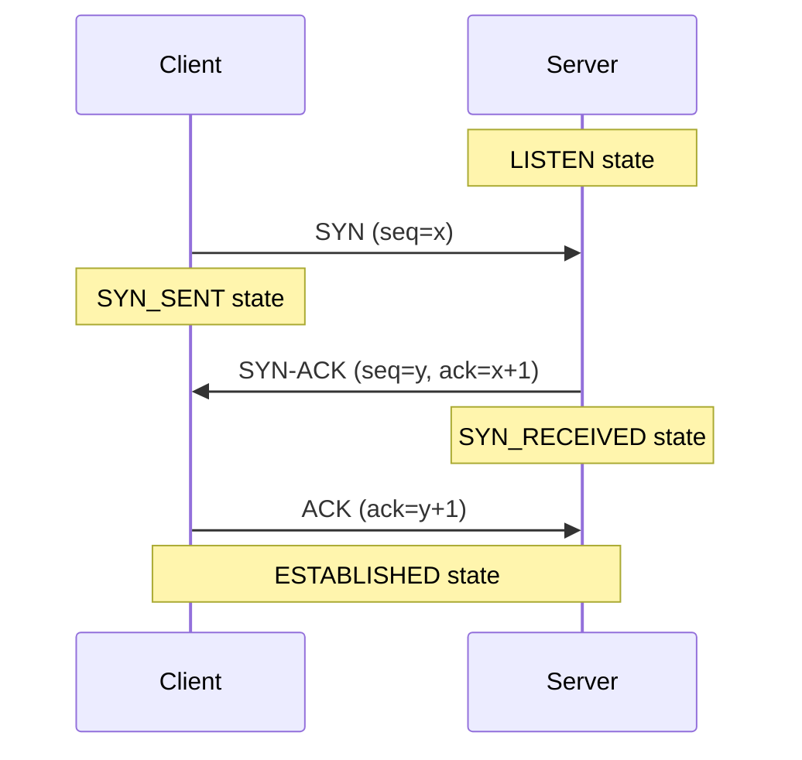
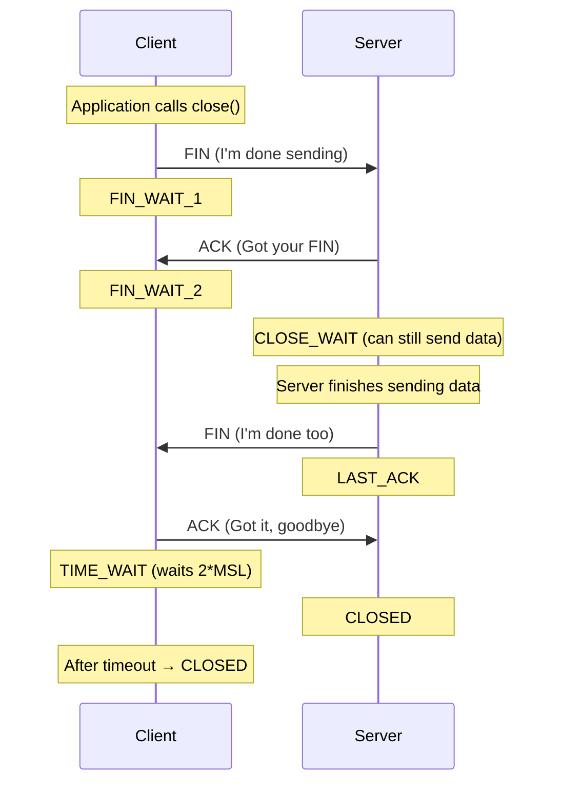

# TCP Deep Dive

:::info Interview Importance ⭐⭐⭐⭐⭐
TCP is the backbone of the internet. Understanding its internals is crucial for system design interviews, especially when discussing reliability, performance, and connection management.
:::

## 1. TCP Basics Recap

**TCP (Transmission Control Protocol)** is a connection-oriented, reliable transport layer protocol.

### Key Properties

| Property | Description |
|----------|-------------|
| **Connection-Oriented** | Must establish connection before data transfer |
| **Reliable** | Guarantees delivery (retransmissions) |
| **Ordered** | Data arrives in the order it was sent |
| **Flow Control** | Prevents sender from overwhelming receiver |
| **Congestion Control** | Prevents sender from overwhelming network |

### TCP Header Structure

```text
 0                   1                   2                   3
 0 1 2 3 4 5 6 7 8 9 0 1 2 3 4 5 6 7 8 9 0 1 2 3 4 5 6 7 8 9 0 1
+-+-+-+-+-+-+-+-+-+-+-+-+-+-+-+-+-+-+-+-+-+-+-+-+-+-+-+-+-+-+-+-+
|          Source Port          |       Destination Port        |
+-+-+-+-+-+-+-+-+-+-+-+-+-+-+-+-+-+-+-+-+-+-+-+-+-+-+-+-+-+-+-+-+
|                        Sequence Number                        |
+-+-+-+-+-+-+-+-+-+-+-+-+-+-+-+-+-+-+-+-+-+-+-+-+-+-+-+-+-+-+-+-+
|                    Acknowledgment Number                      |
+-+-+-+-+-+-+-+-+-+-+-+-+-+-+-+-+-+-+-+-+-+-+-+-+-+-+-+-+-+-+-+-+
|  Data |           |U|A|P|R|S|F|                               |
| Offset| Reserved  |R|C|S|S|Y|I|            Window             |
|       |           |G|K|H|T|N|N|                               |
+-+-+-+-+-+-+-+-+-+-+-+-+-+-+-+-+-+-+-+-+-+-+-+-+-+-+-+-+-+-+-+-+
|           Checksum            |         Urgent Pointer        |
+-+-+-+-+-+-+-+-+-+-+-+-+-+-+-+-+-+-+-+-+-+-+-+-+-+-+-+-+-+-+-+-+

Key Flags:
- SYN: Synchronize sequence numbers (connection setup)
- ACK: Acknowledgment field is valid
- FIN: No more data from sender (connection teardown)
- RST: Reset the connection
- PSH: Push data immediately to application
- URG: Urgent data present
```

---

## 2. The Three-Way Handshake (Connection Establishment)

:::warning Most Asked Question
"Explain the TCP 3-way handshake" is one of the most common networking interview questions.
:::

### How It Works



### Step-by-Step Explanation

```text
Step 1: Client sends SYN
┌────────────────────────────────────────────────────────┐
│ Client wants to connect                                │
│ Sends: SYN flag = 1, Sequence Number = 1000 (random)   │
│ Meaning: "Hey server, I want to talk. My starting      │
│           sequence number is 1000."                    │
└────────────────────────────────────────────────────────┘

Step 2: Server sends SYN-ACK
┌────────────────────────────────────────────────────────┐
│ Server acknowledges and sends its own SYN              │
│ Sends: SYN=1, ACK=1, seq=2000, ack=1001                │
│ Meaning: "I got your SYN. My sequence is 2000.         │
│           I'm expecting your next byte to be 1001."    │
└────────────────────────────────────────────────────────┘

Step 3: Client sends ACK
┌────────────────────────────────────────────────────────┐
│ Client acknowledges server's SYN                       │
│ Sends: ACK=1, seq=1001, ack=2001                       │
│ Meaning: "Got it. I'm expecting your next byte 2001."  │
│ Connection is now ESTABLISHED on both sides!           │
└────────────────────────────────────────────────────────┘
```

### Why Three-Way? Why Not Two?

**Interview Answer:**
> "Three-way handshake prevents **old duplicate connection requests** from causing problems. If only two-way, an old delayed SYN could establish an invalid connection. The third ACK confirms both parties are ready and agree on initial sequence numbers."

```text
Problem with 2-Way Handshake:

Time 0: Client sends SYN (gets delayed in network)
Time 1: Client times out, sends new SYN
Time 2: Server receives new SYN, sends SYN-ACK
Time 3: Connection established (correct)
Time 4: Old SYN arrives at server!
        Server thinks it's a new connection attempt!
        ❌ Creates duplicate/orphan connection

With 3-Way: Server waits for ACK. Old SYNs expire before ACK arrives.
```

### Real-World Timing

```text
Typical Handshake Times:
┌─────────────────────────────────────────────────────────┐
│ Same datacenter:        ~0.5ms (500 microseconds)       │
│ Same region (AWS):      ~1-5ms                          │
│ Cross-region (US→EU):   ~80-100ms                       │
│ Cross-continent (US→AU): ~150-200ms                     │
└─────────────────────────────────────────────────────────┘

Impact: HTTPS = TCP handshake + TLS handshake
       US→EU: 100ms (TCP) + 200ms (TLS 1.2) = 300ms before first byte!
```

---

## 3. Four-Way Termination (Connection Close)

### Why Four Steps Instead of Three?

TCP is **full-duplex** - both sides can send data independently. Each side must close its direction separately.



### The TIME_WAIT State

:::danger Interview Favorite
"What is TIME_WAIT and why does it exist?" is a classic interview question.
:::

**What is TIME_WAIT?**
- The client waits for **2×MSL** (Maximum Segment Lifetime, typically 60 seconds = 2 minutes total) before fully closing.

**Why TIME_WAIT exists:**

```text
Reason 1: Reliable FIN-ACK Delivery
─────────────────────────────────────
If the final ACK is lost, server will retransmit FIN.
Client must be around to re-acknowledge.

Client: FIN → ← ACK → ← FIN → ACK (lost!) 
                          ↓
                    Server retransmits FIN
                          ↓
        Client (in TIME_WAIT) can respond with ACK ✓


Reason 2: Old Duplicate Segments
─────────────────────────────────────
Old packets from this connection might still be in network.
If we immediately create a new connection on same port,
old packets could corrupt the new connection.

TIME_WAIT ensures old packets expire (2×MSL guarantees this).
```

### TIME_WAIT Problem in High-Traffic Servers

```text
Problem Scenario:
- Web server handles 10,000 req/sec
- Each request = new TCP connection
- Each connection creates TIME_WAIT (2 minutes)
- 10,000 × 120 = 1,200,000 sockets in TIME_WAIT!
- Run out of ephemeral ports (only 65535 available)

Solutions:
1. Enable SO_REUSEADDR (reuse sockets in TIME_WAIT)
2. Use connection pooling (HTTP Keep-Alive)
3. Reduce TIME_WAIT duration (tcp_tw_reuse kernel param)
4. Use client-side connection pools
```

---

## 4. TCP States Diagram

### Complete State Machine

```text
                              ┌───────────────────┐
                              │      CLOSED       │
                              └───────────────────┘
                                   │         │
                          Passive │         │ Active open
                          open    │         │ Send SYN
                                  ▼         ▼
                         ┌────────────┐ ┌────────────┐
                         │   LISTEN   │ │  SYN_SENT  │
                         └────────────┘ └────────────┘
                              │              │
                   Recv SYN   │              │ Recv SYN+ACK
                   Send SYN+ACK              │ Send ACK
                              ▼              ▼
                         ┌────────────┐ ┌────────────┐
                         │ SYN_RCVD   │←┴────────────┘
                         └────────────┘
                              │
                         Recv ACK
                              ▼
                         ┌────────────┐
                         │ESTABLISHED │ ← Normal data transfer
                         └────────────┘
                              │
              ┌───────────────┴───────────────┐
              │ Close (active)                │ Close (passive)
              │ Send FIN                      │ Recv FIN
              ▼                               ▼ Send ACK
         ┌────────────┐                ┌────────────┐
         │ FIN_WAIT_1 │                │ CLOSE_WAIT │
         └────────────┘                └────────────┘
              │                               │
         Recv ACK                        Close
              ▼                          Send FIN
         ┌────────────┐                       ▼
         │ FIN_WAIT_2 │                ┌────────────┐
         └────────────┘                │  LAST_ACK  │
              │                        └────────────┘
         Recv FIN                            │
         Send ACK                       Recv ACK
              ▼                              ▼
         ┌────────────┐                ┌────────────┐
         │ TIME_WAIT  │                │   CLOSED   │
         └────────────┘                └────────────┘
              │
         2MSL timeout
              ▼
         ┌────────────┐
         │   CLOSED   │
         └────────────┘
```

### Key States to Remember

| State | Who | Description |
|-------|-----|-------------|
| `LISTEN` | Server | Waiting for incoming connections |
| `SYN_SENT` | Client | SYN sent, waiting for SYN-ACK |
| `ESTABLISHED` | Both | Connection ready for data transfer |
| `CLOSE_WAIT` | Server | Got FIN, waiting for app to close |
| `TIME_WAIT` | Client | Waiting before fully closing |
| `FIN_WAIT_2` | Client | ACK received, waiting for server's FIN |

---

## 5. Flow Control (Sliding Window)

### The Problem

```text
Fast sender → Slow receiver = Receiver buffer overflow!

Sender (1 Gbps)     →→→→→→→→→→→     Receiver (100 Mbps)
                   Packets pile up!
                   Buffer fills up!
                   Packets DROPPED!
```

### The Solution: Sliding Window

The receiver tells the sender how much buffer space it has available.

```text
Receiver Window (rwnd) = 4 packets

Sender's view:
┌─────┬─────┬─────┬─────┬─────┬─────┬─────┬─────┐
│  1  │  2  │  3  │  4  │  5  │  6  │  7  │  8  │
└─────┴─────┴─────┴─────┴─────┴─────┴─────┴─────┘
│←─── Sent, ACKed ───→│←── Can Send ──→│← Cannot send yet
                        (window = 4)

As ACKs arrive, window slides forward:
┌─────┬─────┬─────┬─────┬─────┬─────┬─────┬─────┐
│  1  │  2  │  3  │  4  │  5  │  6  │  7  │  8  │
└─────┴─────┴─────┴─────┴─────┴─────┴─────┴─────┘
│←─ ACKed ─→│←─────── Can Send ───────→│
              Window slides right →
```

### Window Advertisement

```text
Every ACK includes: "I can receive X more bytes"

TCP ACK Packet:
┌─────────────────────────────────────────────┐
│ ACK Number: 5001                             │
│ Window Size: 65535 bytes                     │  ← "I have 64KB buffer free"
└─────────────────────────────────────────────┘

Sender adjusts sending rate based on this window.
```

### Zero Window Situation

```text
When receiver buffer is full:

Receiver: "Window = 0" (I'm full, stop sending!)
Sender: Stops... but how to know when to resume?

Solution: Window Probe
- Sender periodically sends 1-byte probe
- Receiver responds with current window size
- When window > 0, resume sending
```

---

## 6. Congestion Control

### The Problem

Flow control prevents overwhelming the **receiver**.
Congestion control prevents overwhelming the **network**.

```text
                    ┌─────────────┐
Sender ────────────→│   NETWORK   │────────────→ Receiver
                    │  (routers)  │
                    └─────────────┘
                          ↑
                    If too many senders,
                    routers get congested,
                    packets get dropped!
```

### Congestion Window (cwnd)

```text
Effective Send Rate = min(rwnd, cwnd)

rwnd = Receiver's advertised window (flow control)
cwnd = Sender's congestion window (congestion control)

You can only send as fast as the SLOWER of the two allows.
```

### TCP Congestion Control Algorithms

#### 1. Slow Start

```text
Start with cwnd = 1 MSS (Maximum Segment Size)
For each ACK received: cwnd = cwnd × 2 (exponential growth)

Time    cwnd    Packets sent
─────   ─────   ────────────
RTT 1     1        1
RTT 2     2        2
RTT 3     4        4
RTT 4     8        8
RTT 5    16       16
         ↑
   Exponential growth until threshold (ssthresh)
```

```text
Visual:
                              ssthresh
                                 │
  cwnd                           ▼
   ▲                         ────────
   │                      ╱
   │                   ╱
   │                ╱
   │             ╱
   │          ╱
   │       ╱         ← Exponential (Slow Start)
   │    ╱
   │ ╱
   └──────────────────────────→ Time
```

#### 2. Congestion Avoidance (AIMD)

After reaching `ssthresh`, switch to linear growth.

**AIMD = Additive Increase, Multiplicative Decrease**

```text
Additive Increase:
- For each RTT without loss: cwnd = cwnd + 1 MSS

Multiplicative Decrease:
- On packet loss (timeout): cwnd = cwnd / 2, ssthresh = cwnd
```

```text
Visual:
  cwnd ▲
       │        ╱╲              ╱╲
       │       ╱  ╲            ╱  ╲
       │      ╱    ╲          ╱    ╲
       │     ╱      ╲        ╱      ╲
       │    ╱        ╲      ╱        ╲
       │   ╱          ╲    ╱          ╲
       │  ╱            ╲  ╱            ╲
       │ ╱  Loss! ─────→╲╱←── Loss!     ╲
       └──────────────────────────────────→ Time
          ↑                ↑
    Linear increase   50% decrease
```

#### 3. Fast Retransmit & Fast Recovery

```text
Traditional: Wait for timeout to detect loss (slow!)

Fast Retransmit:
- If sender receives 3 duplicate ACKs for same packet
- Assume that packet is lost
- Retransmit immediately (don't wait for timeout)

Fast Recovery:
- After fast retransmit, don't go back to slow start
- ssthresh = cwnd / 2
- cwnd = ssthresh + 3 (for the 3 dup ACKs)
- Continue with congestion avoidance
```

### Modern Congestion Control Algorithms

| Algorithm | Description | Used By |
|-----------|-------------|---------|
| **Reno** | Classic AIMD with Fast Recovery | Historical |
| **CUBIC** | Uses cubic function for growth | Linux default |
| **BBR** | Measures bandwidth & RTT directly | Google, YouTube |

```text
BBR (Bottleneck Bandwidth and Round-trip propagation time):

Traditional: Detect congestion by packet loss (reactive)
BBR: Continuously measure network capacity (proactive)

BBR probes for:
1. Maximum bandwidth (how fast can I send?)
2. Minimum RTT (how long does a packet take?)

Result: BBR can fill the pipe without causing congestion!
Better performance, especially on long-distance links.
```

---

## 7. TCP Optimization Techniques

### Nagle's Algorithm

**Problem:** Small packets (like keystrokes) waste bandwidth.

```text
User types: "Hello"
Without Nagle: 5 packets, each with 1 byte + 40 byte header!

H [40B header + 1B data] →
e [40B header + 1B data] →
l [40B header + 1B data] →
l [40B header + 1B data] →
o [40B header + 1B data] →

205 bytes sent for 5 bytes of data!
```

**Solution (Nagle):** Buffer small packets until:
1. Previous packet is ACKed, OR
2. Buffer reaches MSS

**When to disable Nagle:**
- Real-time applications (games, telnet)
- Low-latency trading systems
- Set `TCP_NODELAY` socket option

### Delayed ACK

**Problem:** ACKing every packet wastes bandwidth.

```text
Without Delayed ACK:
Data → ← ACK
Data → ← ACK
Data → ← ACK
3 data packets = 3 ACK packets
```

**Solution:** Delay ACK up to 200ms, hoping to:
1. Piggyback ACK on outgoing data, OR
2. ACK multiple packets with one ACK

**Problem with Nagle + Delayed ACK:**

```text
Nagle: Wait for ACK before sending small packet
Delayed ACK: Wait before sending ACK

Sender:  [small packet] ────→ Server
         Waiting for ACK...  Waiting to send ACK...
                             (waits 200ms)
         Finally!    ←──────── [ACK after 200ms delay]

Solution: Disable Nagle (TCP_NODELAY) for request-response protocols
```

---

## 8. Common Interview Questions

### Q1: What happens if the 3rd ACK in handshake is lost?

```text
Answer:
1. Server stays in SYN_RECEIVED state
2. Server retransmits SYN-ACK (exponential backoff)
3. Client (already in ESTABLISHED) can send data
4. Server receives data with valid ACK, transitions to ESTABLISHED

Key insight: The retransmitted SYN-ACK or any data packet with ACK
will complete the handshake.
```

### Q2: Explain TIME_WAIT and why it's 2×MSL?

```text
Answer:
MSL = Maximum Segment Lifetime (typically 30-60 seconds)
     = Maximum time a packet can exist in network

2×MSL ensures:
1. Any delayed packets from old connection expire
2. Enough time to retransmit final ACK if it's lost

If we close earlier, old packets might corrupt new connections
on the same port pair.
```

### Q3: How does TCP detect packet loss?

```text
Answer: Two mechanisms

1. Retransmission Timeout (RTO):
   - If no ACK received within RTO, assume loss
   - RTO is dynamically calculated from RTT measurements
   - Conservative (typically 200ms - 3 seconds)

2. Fast Retransmit (3 Duplicate ACKs):
   - If receiver gets out-of-order packet, it sends duplicate ACK
   - 3 duplicate ACKs = high confidence packet is lost
   - Retransmit immediately without waiting for timeout
   
Fast Retransmit is preferred (faster recovery).
```

### Q4: What is SYN Flood attack and how to prevent it?

```text
SYN Flood Attack:
- Attacker sends many SYN packets with spoofed IPs
- Server allocates resources for each (SYN_RECEIVED state)
- But no ACK comes (spoofed IPs don't respond)
- Server runs out of resources (DoS)

Prevention:
1. SYN Cookies:
   - Don't allocate state on SYN
   - Encode state in initial sequence number
   - Only allocate on valid ACK
   
2. TCP Stack Hardening:
   - Reduce SYN_RECEIVED timeout
   - Increase backlog queue size
   - Rate limiting

3. Network Level:
   - Firewall rules
   - CDN/DDoS protection services
```

### Q5: TCP vs UDP for video streaming?

```text
Traditional Answer: UDP (lower latency, loss is OK)

Modern Reality: TCP (HTTP-based adaptive streaming)

Why TCP won:
1. Firewalls block UDP, TCP gets through
2. Adaptive bitrate compensates for TCP overhead
3. CDN infrastructure built for HTTP/TCP
4. Buffer hides latency (non-live content)

For live streaming:
- WebRTC uses UDP (real-time video calls)
- Traditional broadcast uses UDP multicast
- HTTP Live Streaming (HLS) uses TCP
```

---

## Quick Reference Card

```text
┌──────────────────────────────────────────────────────────────────────┐
│                       TCP CHEAT SHEET                                 │
├──────────────────────────────────────────────────────────────────────┤
│                                                                       │
│ THREE-WAY HANDSHAKE:                                                  │
│ Client →→→ SYN →→→→→→→→→→→→→→→ Server                                │
│        ←←← SYN+ACK ←←←←←←←←←←←                                       │
│        →→→ ACK →→→→→→→→→→→→→→→                                       │
│                                                                       │
│ FOUR-WAY TERMINATION:                                                 │
│ Client →→→ FIN →→→→→→→→→→→→→→→ Server                                │
│        ←←← ACK ←←←←←←←←←←←←←←←                                       │
│        ←←← FIN ←←←←←←←←←←←←←←←                                       │
│        →→→ ACK →→→→→→→→→→→→→→→                                       │
│                                                                       │
│ KEY STATES:                                                           │
│ ├── LISTEN        : Server waiting for connections                    │
│ ├── ESTABLISHED   : Connection active, data can flow                  │
│ ├── CLOSE_WAIT    : Received FIN, waiting to close                    │
│ └── TIME_WAIT     : Final ACK sent, waiting 2×MSL                     │
│                                                                       │
│ FLOW CONTROL:                                                         │
│ └── Receiver advertises window size → Sender limits rate              │
│                                                                       │
│ CONGESTION CONTROL:                                                   │
│ ├── Slow Start    : Exponential growth (cwnd × 2)                     │
│ ├── AIMD          : Linear up (+1), multiplicative down (÷2)          │
│ └── Fast Retransmit: 3 dup ACKs → immediate retransmit                │
│                                                                       │
│ TIMEOUTS:                                                             │
│ ├── Handshake timeout: ~75 seconds (varies by OS)                     │
│ ├── TIME_WAIT: 2 × MSL (typically 2 minutes)                          │
│ └── RTO: Dynamically calculated from RTT                              │
│                                                                       │
│ OPTIMIZATION:                                                         │
│ ├── TCP_NODELAY   : Disable Nagle (low latency)                       │
│ ├── SO_REUSEADDR  : Reuse TIME_WAIT sockets                           │
│ └── Keep-Alive    : Detect dead connections                           │
│                                                                       │
└──────────────────────────────────────────────────────────────────────┘
```

---

**Next:** [4. HTTP Versions →](./http-versions)
