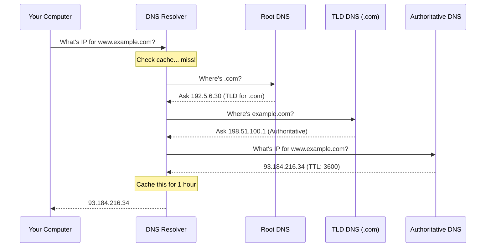

# DNS Explained

:::info Interview Importance ⭐⭐⭐⭐
DNS is a fundamental concept that comes up in "What happens when you type google.com?" questions and system design discussions about latency and reliability.
:::

## 1. What is DNS?

**DNS (Domain Name System)** is the "phonebook of the internet". It translates human-readable domain names into IP addresses.

```text
Without DNS:
User types: 142.250.190.78           ← Impossible to remember!

With DNS:
User types: google.com               ← Easy to remember!
DNS returns: 142.250.190.78          ← Browser uses this IP
```

### Why We Need DNS

| Human Problem | DNS Solution |
|--------------|--------------|
| IP addresses are hard to remember | Domain names are memorable |
| Servers change IPs | Domain stays same, DNS updates |
| One domain, multiple servers | Load balancing via DNS |
| Geographic routing | Return closest server's IP |

---

## 2. DNS Hierarchy

### The DNS Tree Structure

```text
                        [.]  ← Root (dot)
                         │
         ┌───────────────┼───────────────┐
         │               │               │
       [com]           [org]           [io]    ← TLD (Top Level Domain)
         │               │               │
    ┌────┴────┐     ┌────┴────┐     ┌────┴────┐
 [google] [github] [wikipedia] [...] [example] [...]  ← Second Level
    │         │         │               │
 [www]     [api]     [en]            [api]     ← Subdomain (Third Level)
 [mail]    [www]     [de]            [www]
 [drive]             [es]

Full domain: www.google.com.
             ↑     ↑     ↑ ↑
             │     │     │ └── Root (usually hidden)
             │     │     └──── TLD
             │     └────────── Second Level Domain
             └──────────────── Subdomain
```

### DNS Server Types

```text
1. ROOT DNS SERVERS
   └── 13 logical servers (hundreds of physical servers)
   └── Know where TLD servers are
   └── Managed by ICANN and various organizations

2. TLD DNS SERVERS
   └── One for each TLD (.com, .org, .io, etc.)
   └── Know where authoritative servers are
   └── Managed by registry (Verisign for .com)

3. AUTHORITATIVE DNS SERVERS
   └── Actually store DNS records for a domain
   └── "The source of truth"
   └── Managed by domain owner (or DNS provider like Cloudflare)

4. RECURSIVE RESOLVER (DNS Resolver)
   └── Your ISP, or 8.8.8.8 (Google), 1.1.1.1 (Cloudflare)
   └── Does the "heavy lifting" of resolution
   └── Caches results to speed up future queries
```

---

## 3. DNS Resolution Process

### Recursive vs Iterative Resolution

:::warning Common Interview Question
"Explain how DNS resolution works" is very common. Know both types!
:::

### Recursive Query (How Users Experience DNS)

```text
Your computer asks its resolver:
"Give me the IP for www.example.com"

Resolver does all the work and returns the answer.

You  ──────→  Resolver  ────→  [Does all the work]  ────→  IP Address
     "IP for           └────→  Root Server
     example.com?"     └────→  TLD Server
                       └────→  Authoritative Server
                       └────→  Returns IP to you
```

### Iterative Query (How Resolvers Work)



### Step-by-Step Breakdown

```text
1. USER QUERY
   └── User types www.example.com in browser
   └── Browser checks its cache (missed)
   └── OS checks /etc/hosts file (no match)
   └── OS asks configured DNS resolver (e.g., 8.8.8.8)

2. RESOLVER CHECKS CACHE
   └── Has this domain been queried recently?
   └── If yes, return cached IP (TTL not expired)
   └── If no, start iterative resolution

3. ROOT SERVER QUERY
   └── Resolver asks: "Where's .com?"
   └── Root responds: "Ask this TLD server"
   └── (Resolver caches this for 48 hours)

4. TLD SERVER QUERY
   └── Resolver asks: "Where's example.com?"
   └── TLD responds: "Ask this authoritative server"
   └── (Resolver caches this for 48 hours)

5. AUTHORITATIVE SERVER QUERY
   └── Resolver asks: "What's IP for www.example.com?"
   └── Authoritative responds: "93.184.216.34, TTL=3600"
   └── (Resolver caches this for 1 hour)

6. RESPONSE TO USER
   └── Resolver returns IP to user's OS
   └── OS caches it
   └── Browser caches it
   └── Browser connects to 93.184.216.34
```

### Query Types

| Type | Description |
|------|-------------|
| **Recursive** | "Give me the final answer" (client to resolver) |
| **Iterative** | "Give me the next server to ask" (resolver to servers) |
| **Inverse** | IP → Domain (rarely used, PTR records) |

---

## 4. DNS Record Types

### Essential Records (Must Know)

| Type | Purpose | Example |
|------|---------|---------|
| **A** | Domain → IPv4 | `example.com → 93.184.216.34` |
| **AAAA** | Domain → IPv6 | `example.com → 2606:2800:220:1:...` |
| **CNAME** | Alias to another domain | `www → example.com` |
| **MX** | Mail server | `example.com → mail.example.com (priority 10)` |
| **TXT** | Text data | SPF, DKIM, domain verification |
| **NS** | Name server | `example.com → ns1.dns-provider.com` |
| **SOA** | Zone authority | Serial, refresh intervals, etc. |

### A Record vs AAAA Record

```text
A Record (IPv4):
example.com.    IN    A    93.184.216.34

AAAA Record (IPv6):
example.com.    IN    AAAA    2606:2800:220:1:248:1893:25c8:1946

Modern servers typically have both.
Browser prefers IPv6 if available (Happy Eyeballs algorithm).
```

### CNAME Record (Canonical Name)

```text
Scenario: www.example.com should point to example.com

Without CNAME:
example.com     A     93.184.216.34
www.example.com A     93.184.216.34   ← Duplicate! Must update both!

With CNAME:
example.com     A       93.184.216.34
www.example.com CNAME   example.com   ← Points to the A record!

Now you only update ONE record when IP changes!

⚠️ CNAME Limitations:
- Cannot coexist with other records at same name
- Cannot use CNAME at zone apex (example.com itself)
- Alternative: ALIAS/ANAME record (provider-specific)
```

### MX Record (Mail Exchange)

```text
How email delivery works:

1. Someone sends email to user@example.com
2. Their mail server queries: "MX record for example.com?"
3. DNS responds: "mail.example.com, priority 10"
4. DNS responds: "backup.example.com, priority 20"
5. Sender's mail server connects to mail.example.com (lower = preferred)

example.com.    MX    10    mail.example.com.
example.com.    MX    20    backup.example.com.  ← Fallback if primary fails

Priority:
├── Lower number = higher priority
├── 10 mail.example.com (primary)
└── 20 backup.example.com (secondary)
```

### TXT Record (Text)

```text
Used for various purposes:

1. SPF (Sender Policy Framework) - Email authentication
   example.com.  TXT  "v=spf1 include:_spf.google.com ~all"
   Meaning: Only Google servers can send email from our domain

2. DKIM (DomainKeys Identified Mail) - Email signing
   selector._domainkey.example.com.  TXT  "v=DKIM1; k=rsa; p=MIGf..."
   
3. Domain Verification (Google, AWS, etc.)
   example.com.  TXT  "google-site-verification=abc123..."
   
4. DMARC (Email policy)
   _dmarc.example.com.  TXT  "v=DMARC1; p=reject; rua=mailto:..."
```

### NS Record (Name Server)

```text
Tells the world which DNS servers are authoritative for your domain:

example.com.    NS    ns1.cloudflare.com.
example.com.    NS    ns2.cloudflare.com.

When you buy a domain:
1. Registrar asks: "What name servers?"
2. You enter: ns1.cloudflare.com, ns2.cloudflare.com
3. Registrar updates TLD with this NS record
4. Now queries for example.com go to Cloudflare
```

### PTR Record (Reverse DNS)

```text
IP → Domain (opposite of A record)

Used for:
├── Email server validation (reverse lookup)
├── Logging (log IPs with hostnames)
└── Security (verify who owns an IP)

Stored in special domain: in-addr.arpa

For IP 93.184.216.34:
34.216.184.93.in-addr.arpa.    PTR    example.com.
      ↑
  Reversed IP!
```

---

## 5. DNS Caching & TTL

### TTL (Time To Live)

```text
TTL = How long to cache this record (in seconds)

example.com.    A    93.184.216.34    TTL=3600  (1 hour)

Meaning:
├── After resolution, cache for 1 hour
├── During this hour, no need to query again
└── After 1 hour, must query again
```

### TTL Guidelines

| TTL | Duration | Use Case |
|-----|----------|----------|
| 60 | 1 minute | During migrations, failover |
| 300 | 5 minutes | Active services, reasonable freshness |
| 3600 | 1 hour | General purpose, balanced |
| 86400 | 1 day | Stable records (NS, MX) |
| 604800 | 1 week | Very stable infrastructure |

### DNS Propagation

```text
"DNS propagation takes up to 48 hours" - WRONG!

Reality:
├── TTL determines cache expiry
├── If old TTL was 48 hours, caches might not refresh for 48 hours
├── New records are instantly available to anyone not cached

Best practice for changes:
1. Lower TTL to 60 seconds (days before change)
2. Wait for old TTL to expire
3. Make the DNS change
4. Verify propagation
5. Raise TTL back to normal
```

### Cache Hierarchy

```text
Caching happens at multiple levels:

1. APPLICATION/BROWSER (seconds to minutes)
   └── Chrome caches DNS for 60 seconds
   └── curl: no caching (fresh every time)

2. OPERATING SYSTEM (TTL-based)
   └── Windows DNS Client service
   └── Linux: nscd, systemd-resolved
   
3. LOCAL NETWORK (router, enterprise DNS)
   └── Home router might cache
   └── Corporate DNS server caches
   
4. ISP RESOLVER (TTL-based)
   └── Shared cache for all ISP customers
   └── Popular domains frequently cached

Check each level to debug DNS issues!
```

### Flush DNS Cache

```bash
# Windows
ipconfig /flushdns

# macOS
sudo dscacheutil -flushcache; sudo killall -HUP mDNSResponder

# Linux (systemd)
sudo systemd-resolve --flush-caches

# Chrome browser
chrome://net-internals/#dns  → Clear host cache
```

---

## 6. DNS Load Balancing

### Round Robin DNS

```text
Multiple A records for same domain:

example.com.    A    192.0.2.1
example.com.    A    192.0.2.2
example.com.    A    192.0.2.3

DNS resolver rotates the order:
Query 1: [192.0.2.1, 192.0.2.2, 192.0.2.3]
Query 2: [192.0.2.2, 192.0.2.3, 192.0.2.1]
Query 3: [192.0.2.3, 192.0.2.1, 192.0.2.2]

Client typically uses first IP → Load distributed!

Limitations:
├── No health checking (may route to dead server)
├── Caching breaks distribution
└── No weighted distribution
```

### GeoDNS (Geographic Routing)

```text
Return different IPs based on client location:

User in US → example.com → 192.0.2.1 (US server)
User in EU → example.com → 198.51.100.1 (EU server)
User in Asia → example.com → 203.0.113.1 (Asia server)

How it works:
1. DNS resolver's IP reveals approximate location
2. Authoritative server returns nearest data center
3. User gets lower latency
```

### Weighted DNS

```text
Distribute traffic unevenly:

example.com. WEIGHTED 70 → 192.0.2.1  (70% traffic)
example.com. WEIGHTED 30 → 192.0.2.2  (30% traffic)

Use cases:
├── Canary deployments (10% to new version)
├── Capacity-based routing (more traffic to bigger servers)
└── A/B testing
```

---

## 7. DNS Security

### DNS is Insecure by Default!

```text
Traditional DNS Problems:

1. No encryption → Anyone can see your queries
   ISP knows every site you visit!
   
2. No authentication → Responses can be spoofed
   Attacker can return fake IP addresses!
   
3. No integrity → Packets can be modified
   MITM can change DNS responses!
```

### DNS Attacks

#### DNS Spoofing (Cache Poisoning)

```text
Normal:
User → Resolver → bank.com → 10.0.0.1 (real bank)

Attack:
1. Attacker floods resolver with fake responses
2. Fake response: bank.com → 6.6.6.6 (attacker's server)
3. Resolver caches the fake IP
4. All users get sent to attacker's server!
5. Attacker serves fake banking site → steals credentials
```

#### DNS Amplification DDoS

```text
1. Attacker sends DNS query with spoofed source IP (victim's IP)
2. DNS server sends large response to victim
3. 60-byte query → 4000-byte response (70x amplification!)
4. Many open resolvers → massive traffic to victim

Query:  [Attacker] ────(spoofed IP)────→ [DNS Server]
                                               │
Response: [Victim] ←──(4KB response)──────────┘
                ↑
         Gets flooded!
```

### DNSSEC (DNS Security Extensions)

```text
DNSSEC adds authentication and integrity:

1. Zone owner signs DNS records with private key
2. Signature stored in RRSIG records
3. Public key published in DNSKEY record
4. Resolvers verify signatures before trusting response

example.com.    A       93.184.216.34
example.com.    RRSIG   A 8 2 86400 20240215... (signature)

Problem: Still no encryption (queries visible)
Solution: Use with DoH/DoT
```

### DNS over HTTPS (DoH)

```text
Traditional DNS: UDP port 53 (plaintext)
DoH: HTTPS port 443 (encrypted)

How it works:
GET https://dns.cloudflare.com/dns-query?name=example.com&type=A

Benefits:
├── Encrypted (ISP can't see queries)
├── Authenticated (can't be spoofed)
├── Bypasses censorship (looks like normal HTTPS)

Drawbacks:
├── Centralization (everyone uses same DoH providers)
├── Enterprise: Harder to monitor/filter
└── Slightly higher latency (TLS overhead)

Browsers supporting DoH:
├── Firefox (default in some regions)
├── Chrome (optional)
└── Edge (optional)
```

### DNS over TLS (DoT)

```text
DoT: TLS on port 853 (dedicated port)

Similar to DoH but:
├── Separate port (easier to block/allow in firewall)
├── Slightly lower overhead than HTTPS
└── Better for enterprise (can still filter at firewall)
```

---

## 8. Common Interview Questions

### Q1: What happens when you type google.com?

```text
DNS Part of the Answer:

1. Browser checks DNS cache (recent visit?)
2. OS checks hosts file (/etc/hosts)
3. OS checks its DNS cache
4. Query sent to configured resolver (e.g., 8.8.8.8)
5. Resolver checks its cache
6. If not cached, iterative queries:
   └── Root server → "Here's .com TLD"
   └── TLD server → "Here's Google's nameserver"
   └── Authoritative → "142.250.190.78, TTL=300"
7. Resolver returns IP, caches it
8. OS caches it, returns to browser
9. Browser caches it, starts TCP connection to IP
```

### Q2: How would you design a DNS system?

```text
Answer:
"I'd design a hierarchical, distributed system:

1. Hierarchy:
   - Root servers (13 logical, replicated globally via anycast)
   - TLD servers (one per extension, also distributed)
   - Authoritative servers (per domain, redundant)

2. Caching at every level with TTL to reduce load

3. UDP for queries (fast, small packets)
   TCP for zone transfers and large responses

4. Replication: 
   - At least 2 authoritative servers per zone
   - Geographic distribution for latency
   - Anycast for automatic routing to nearest

5. Security:
   - DNSSEC for authentication
   - Rate limiting against DDoS
   - Query logging for abuse detection"
```

### Q3: CNAME vs A Record?

```text
Answer:
"A record maps a domain directly to an IP address.
CNAME maps a domain to another domain name (alias).

Key differences:
1. A record: example.com → 93.184.216.34
   CNAME: www.example.com → example.com

2. CNAME requires additional lookup (follow the chain)
   A record is direct

3. CNAME cannot exist with other records at same name
   A record can coexist with TXT, MX, etc.

4. Zone apex (naked domain) cannot have CNAME
   Must use A/AAAA or provider-specific ALIAS record

Use CNAME for:
- CDN (www.example.com → d123.cloudfront.net)
- SaaS services (blog.example.com → company.wordpress.com)
- Simplifying record management (change one A record, CNAMEs follow)"
```

### Q4: How does DNS failover work?

```text
Answer:
"DNS failover routes traffic away from unhealthy servers:

1. Health Checks:
   - DNS provider monitors server health (HTTP check, TCP check)
   - Checks run from multiple locations
   - If server fails X consecutive checks, mark unhealthy

2. Automatic Failover:
   - Unhealthy server's IP removed from DNS responses
   - Only healthy servers returned
   - TTL determines how fast clients see the change

3. Example with Route 53:
   Primary:   192.0.2.1 (active, health checked)
   Secondary: 192.0.2.2 (standby)
   
   Primary healthy → Return 192.0.2.1
   Primary unhealthy → Return 192.0.2.2

Limitation: 
DNS caching means failover isn't instant.
Low TTL (60s) helps, but adds more DNS traffic."
```

### Q5: Low TTL vs High TTL trade-offs?

```text
Low TTL (60-300 seconds):
Pros:
├── Fast failover (clients refresh quickly)
├── Quick migration (IP change propagates fast)
└── More control over traffic routing

Cons:
├── More DNS queries (higher DNS costs)
├── Higher latency (frequent lookups)
└── More load on authoritative servers

High TTL (3600-86400 seconds):
Pros:
├── Fewer DNS queries (lower costs)
├── Lower latency (usually cached)
└── Less load on DNS infrastructure

Cons:
├── Slow failover (clients stuck with old IP)
├── Slow migrations (old IP cached for hours)
└── Hard to do quick changes

Recommendation:
├── Stable infrastructure: 3600s (1 hour)
├── Active services: 300s (5 minutes)
├── During migration: 60s temporarily
```

---

## Quick Reference Card

```text
┌──────────────────────────────────────────────────────────────────────┐
│                        DNS CHEAT SHEET                                │
├──────────────────────────────────────────────────────────────────────┤
│                                                                       │
│ DNS HIERARCHY:                                                        │
│ Root (.) → TLD (.com) → SLD (example) → Subdomain (www)              │
│                                                                       │
│ RECORD TYPES:                                                         │
│ ├── A       : Domain → IPv4                                          │
│ ├── AAAA    : Domain → IPv6                                          │
│ ├── CNAME   : Alias to another domain                                │
│ ├── MX      : Mail server (with priority)                            │
│ ├── TXT     : Text (SPF, DKIM, verification)                         │
│ ├── NS      : Name server for zone                                   │
│ └── PTR     : IP → Domain (reverse)                                  │
│                                                                       │
│ RESOLUTION FLOW:                                                      │
│ Browser → OS → Resolver → Root → TLD → Authoritative → IP            │
│                                                                       │
│ TTL GUIDELINES:                                                       │
│ ├── 60s     : Migration, active failover                             │
│ ├── 300s    : Active services                                        │
│ ├── 3600s   : General purpose                                        │
│ └── 86400s  : Stable records                                         │
│                                                                       │
│ SECURITY:                                                             │
│ ├── DNSSEC  : Signatures (authentication + integrity)                │
│ ├── DoH     : DNS over HTTPS (port 443, encrypted)                   │
│ └── DoT     : DNS over TLS (port 853, encrypted)                     │
│                                                                       │
│ COMMON PORTS:                                                         │
│ ├── DNS     : UDP/TCP 53                                             │
│ ├── DoT     : TCP 853                                                │
│ └── DoH     : TCP 443                                                │
│                                                                       │
└──────────────────────────────────────────────────────────────────────┘
```

---

**Next:** [6. TLS & Network Security →](./tls-security)
