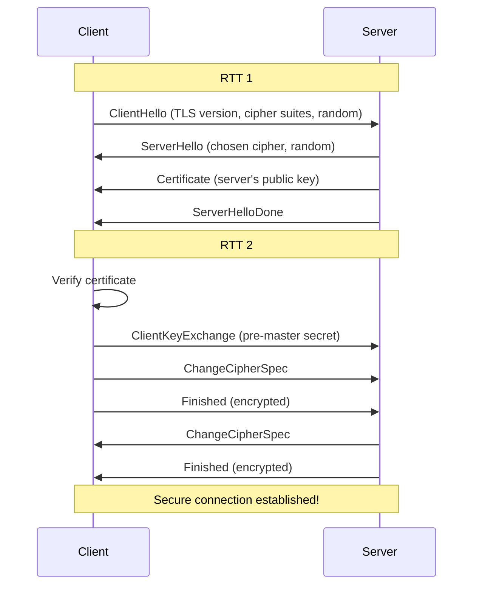
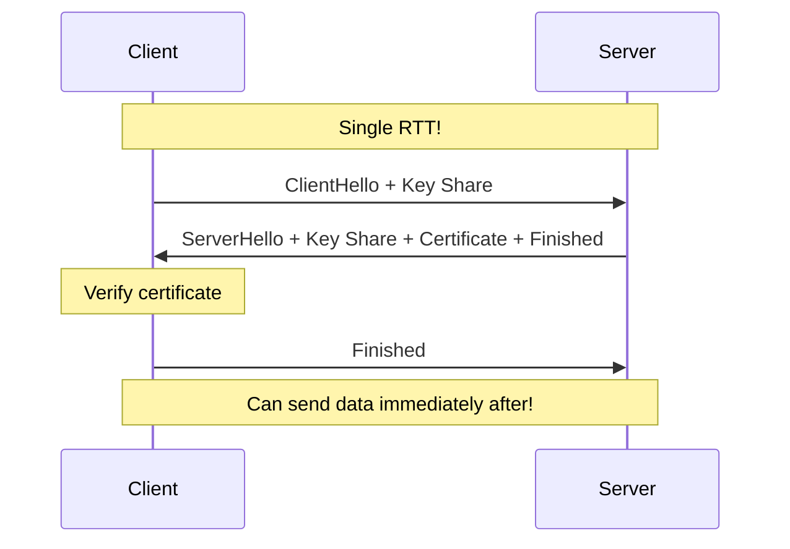

# TLS & Network Security

:::info Interview Importance ⭐⭐⭐⭐
TLS (Transport Layer Security) is essential knowledge for any backend developer. Understanding how HTTPS works, certificate verification, and common attacks shows security awareness.
:::

## 1. What is TLS?

**TLS (Transport Layer Security)** provides secure communication over a network. It's the successor to SSL (Secure Sockets Layer).

```text
Without TLS:
Client ────── "password=secret123" ────── Server
       ↑                             ↑
       Anyone can read this!

With TLS:
Client ────── "xK9#@mP2..." (encrypted) ────── Server
       ↑                                    ↑
       Only client and server can read!
```

### TLS vs SSL

| Version | Status | Notes |
|---------|--------|-------|
| SSL 1.0 | Never released | Too many flaws |
| SSL 2.0 | ❌ Deprecated | Security vulnerabilities |
| SSL 3.0 | ❌ Deprecated | POODLE attack |
| TLS 1.0 | ❌ Deprecated | Vulnerable (BEAST attack) |
| TLS 1.1 | ❌ Deprecated | No longer secure |
| TLS 1.2 | ✅ Acceptable | Still widely used |
| TLS 1.3 | ✅ Recommended | Latest, most secure |

### TLS Goals

| Goal | Description |
|------|-------------|
| **Confidentiality** | Data is encrypted (can't be read) |
| **Integrity** | Data can't be modified in transit |
| **Authentication** | Verify you're talking to the right server |

---

## 2. TLS 1.2 Handshake

### Full Handshake (2-RTT)



### Step-by-Step Explanation

```text
1. CLIENT HELLO
┌─────────────────────────────────────────────────────────┐
│ "Hi! I want to establish a secure connection."          │
│                                                         │
│ TLS Version: 1.2                                        │
│ Cipher Suites I support:                                │
│   - TLS_ECDHE_RSA_WITH_AES_128_GCM_SHA256              │
│   - TLS_ECDHE_RSA_WITH_AES_256_GCM_SHA384              │
│   - ... (in order of preference)                        │
│ Client Random: [32 bytes of random data]                │
│ Extensions: SNI (example.com), supported_versions, etc  │
└─────────────────────────────────────────────────────────┘

2. SERVER HELLO
┌─────────────────────────────────────────────────────────┐
│ "Great! Let's use these settings:"                      │
│                                                         │
│ TLS Version: 1.2                                        │
│ Chosen Cipher: TLS_ECDHE_RSA_WITH_AES_128_GCM_SHA256   │
│ Server Random: [32 bytes of random data]                │
│ Session ID: [for session resumption]                    │
└─────────────────────────────────────────────────────────┘

3. CERTIFICATE
┌─────────────────────────────────────────────────────────┐
│ "Here's proof that I am example.com"                    │
│                                                         │
│ Server Certificate (signed by CA)                       │
│ ├── Subject: CN=example.com                            │
│ ├── Issuer: DigiCert                                   │
│ ├── Public Key: [RSA/ECDSA public key]                 │
│ ├── Validity: Not Before / Not After                   │
│ └── Signature: [CA's signature]                        │
│                                                         │
│ Intermediate Certificate(s)                             │
│ └── Links server cert to trusted root                  │
└─────────────────────────────────────────────────────────┘

4. CLIENT VERIFICATION
┌─────────────────────────────────────────────────────────┐
│ Client verifies the certificate:                        │
│                                                         │
│ ✓ Is certificate valid (not expired)?                  │
│ ✓ Is domain name correct (matches SNI)?                │
│ ✓ Is certificate chain valid?                          │
│ ✓ Is it signed by a trusted CA?                        │
│ ✓ Has it been revoked (OCSP/CRL check)?               │
└─────────────────────────────────────────────────────────┘

5. KEY EXCHANGE
┌─────────────────────────────────────────────────────────┐
│ Client generates pre-master secret                      │
│ Encrypts it with server's public key                   │
│ Sends encrypted pre-master secret to server            │
│                                                         │
│ Both sides derive session keys:                        │
│ Master Secret = PRF(pre-master, client_random, server_random)
│                                                         │
│ From Master Secret:                                     │
│ ├── Client Write Key (client → server)                 │
│ ├── Server Write Key (server → client)                 │
│ ├── Client Write IV                                    │
│ └── Server Write IV                                    │
└─────────────────────────────────────────────────────────┘

6. CHANGE CIPHER SPEC
┌─────────────────────────────────────────────────────────┐
│ Both sides: "From now on, everything is encrypted!"     │
│                                                         │
│ Finished message:                                       │
│ - Contains hash of all handshake messages              │
│ - Encrypted with session keys                          │
│ - Proves both sides have same keys                     │
└─────────────────────────────────────────────────────────┘
```

### Cipher Suite Breakdown

```text
TLS_ECDHE_RSA_WITH_AES_128_GCM_SHA256
 │    │     │        │   │    │
 │    │     │        │   │    └── Hash for HMAC/PRF
 │    │     │        │   └─────── Mode (authenticated)
 │    │     │        └─────────── Key size (bits)
 │    │     └──────────────────── Bulk encryption
 │    └────────────────────────── Authentication
 └─────────────────────────────── Key exchange

Components:
├── Key Exchange: ECDHE (Elliptic Curve Diffie-Hellman Ephemeral)
├── Authentication: RSA (server cert signed with RSA)
├── Encryption: AES-128-GCM (symmetric encryption)
└── Hash: SHA256 (for MAC and key derivation)
```

---

## 3. TLS 1.3 Handshake (Improved)

### 1-RTT Handshake

```text
TLS 1.2: 2 Round Trips needed
TLS 1.3: 1 Round Trip (faster!)

How TLS 1.3 is faster:
- Client sends key share in ClientHello
- No separate key exchange message needed
- Encryption starts earlier
```



### 0-RTT Resumption

```text
First connection: 1-RTT handshake, save session ticket

Subsequent connection (0-RTT):
┌─────────────────────────────────────────────────────────┐
│ Client → Server:                                        │
│ ClientHello + Key Share + [Early Data (encrypted)]      │
│                    ↑                                    │
│    Application data sent in FIRST packet!               │
└─────────────────────────────────────────────────────────┘

⚠️ 0-RTT Security Warning:
└── Early data can be REPLAYED by attacker
└── Only use for idempotent requests (GET)
└── Never use for state-changing operations (POST)
```

### TLS 1.2 vs TLS 1.3

| Feature | TLS 1.2 | TLS 1.3 |
|---------|---------|---------|
| **Handshake RTT** | 2 RTT | 1 RTT |
| **0-RTT Resumption** | ❌ | ✅ |
| **Key Exchange** | RSA or DHE | DHE/ECDHE only |
| **Forward Secrecy** | Optional | Mandatory |
| **Cipher Suites** | 37+ | Only 5 |
| **Removed Algorithms** | - | RSA key exchange, RC4, SHA-1, etc. |
| **Encryption Starts** | After 2 RTT | After 1 RTT |

---

## 4. Certificates & PKI

### Certificate Chain

```text
Your browser trusts:
┌─────────────────────────────────────────────────────────┐
│                    ROOT CA                              │
│           (Pre-installed in browser/OS)                 │
│           DigiCert High Assurance Root                  │
│    Validity: 2006 - 2031 (very long, offline storage)   │
└─────────────────────────────────────────────────────────┘
                          │
                     Signed by
                          ↓
┌─────────────────────────────────────────────────────────┐
│                INTERMEDIATE CA                          │
│           DigiCert SHA2 Extended Validation             │
│           Validity: 2019 - 2029                         │
└─────────────────────────────────────────────────────────┘
                          │
                     Signed by
                          ↓
┌─────────────────────────────────────────────────────────┐
│              SERVER CERTIFICATE                         │
│           CN=example.com                                │
│           Validity: 2024 - 2025 (1 year max now)        │
│           Public Key: [server's public key]             │
└─────────────────────────────────────────────────────────┘

Why intermediate CA?
├── Root CA keys are kept OFFLINE for security
├── Intermediate can be revoked without affecting root
└── Limits blast radius of compromise
```

### Certificate Validation Steps

```text
Client receives certificate chain from server:

1. CHAIN BUILDING
   └── Assemble certificates from server + local store
   └── Build path: Server Cert → Intermediate → Root

2. SIGNATURE VERIFICATION
   └── Each cert signed by issuer (parent)
   └── Verify signatures up the chain
   └── Root is self-signed and explicitly trusted

3. VALIDITY CHECK
   └── NotBefore ≤ current time ≤ NotAfter
   └── Reject expired certificates

4. DOMAIN VALIDATION
   └── CN or SAN must match requested domain
   └── Wildcard: *.example.com matches www.example.com

5. REVOCATION CHECK
   └── CRL: Certificate Revocation List (cached, bulky)
   └── OCSP: Online Certificate Status Protocol (real-time)
   └── OCSP Stapling: Server fetches and includes status

6. KEY USAGE
   └── Certificate must be valid for TLS server auth
   └── Check Extended Key Usage extension
```

### Certificate Types

| Type | Validation | Time | Cost | Shows |
|------|------------|------|------|-------|
| **DV (Domain)** | Domain control | Minutes | Free/$10 | Lock icon |
| **OV (Organization)** | Company verification | Days | $100+ | Company name |
| **EV (Extended)** | Extensive vetting | Weeks | $500+ | Green bar (deprecated) |

```text
Let's Encrypt (Free, DV):
├── Automated domain validation
├── 90-day validity (forces automation)
├── Most websites use this
└── Limited to domain validation

Paid certificates:
├── OV/EV for compliance requirements
├── Longer support contracts
├── Warranty/insurance
└── Wildcard and multi-domain options
```

---

## 5. Common TLS Configurations

### Nginx HTTPS Configuration

```nginx
server {
    listen 443 ssl http2;
    server_name example.com;
    
    # Certificates
    ssl_certificate /etc/ssl/certs/example.com.crt;
    ssl_certificate_key /etc/ssl/private/example.com.key;
    
    # Modern configuration (TLS 1.2+)
    ssl_protocols TLSv1.2 TLSv1.3;
    
    # Cipher suites (TLS 1.2)
    ssl_ciphers ECDHE-ECDSA-AES128-GCM-SHA256:ECDHE-RSA-AES128-GCM-SHA256;
    ssl_prefer_server_ciphers off;
    
    # DH parameters for DHE ciphers
    ssl_dhparam /etc/ssl/certs/dhparam.pem;
    
    # OCSP Stapling
    ssl_stapling on;
    ssl_stapling_verify on;
    ssl_trusted_certificate /etc/ssl/certs/chain.pem;
    
    # Session resumption
    ssl_session_cache shared:SSL:10m;
    ssl_session_timeout 1d;
    ssl_session_tickets off;  # For forward secrecy
    
    # HSTS (HTTP Strict Transport Security)
    add_header Strict-Transport-Security "max-age=31536000; includeSubDomains" always;
}
```

### HSTS (HTTP Strict Transport Security)

```text
Without HSTS:
User types: example.com
Browser: http://example.com (insecure!)
Server: 301 → https://example.com
Browser: https://example.com

Problem: First request is HTTP (attackable!)

With HSTS:
Server sends: Strict-Transport-Security: max-age=31536000
Browser remembers: "Always use HTTPS for this domain"

Next visit:
User types: example.com
Browser: https://example.com (directly, no HTTP!)

HSTS Preload:
└── Submit domain to browser's built-in list
└── First visit is also HTTPS
└── hstspreload.org
```

### Certificate Pinning

```text
Problem: What if a CA is compromised?
└── Attacker gets valid cert for your domain
└── MITM attack possible despite HTTPS!

Solution: Certificate Pinning
└── App stores hash of expected certificate/public key
└── Rejects connections even with "valid" certs
└── Pins can be: Leaf cert, intermediate, or public key

Example (Android):
```

```java
// OkHttp Certificate Pinning
CertificatePinner pinner = new CertificatePinner.Builder()
    .add("api.example.com", "sha256/AAAAAAAAAAAAAAAAAAAAAAAAAAAAAAAAAAAAAAAAAAA=")
    .add("api.example.com", "sha256/BBBBBBBBBBBBBBBBBBBBBBBBBBBBBBBBBBBBBBBBBBB=") // Backup
    .build();

OkHttpClient client = new OkHttpClient.Builder()
    .certificatePinner(pinner)
    .build();
```

```text
⚠️ Pinning Risks:
├── If you lose keys, users are locked out
├── Must have backup pins
├── Difficult to rotate certificates
└── Most apps have moved AWAY from pinning
```

---

## 6. Common Attacks & Mitigations

### Man-in-the-Middle (MITM)

```text
Normal Connection:
Client ←────── Encrypted ──────→ Server

MITM Attack:
Client ←─ Encrypted ─→ Attacker ←─ Encrypted ─→ Server
                           ↑
                   Attacker decrypts,
                   reads, re-encrypts!

How MITM is Possible:
1. Attacker presents own certificate
2. Client trusts attacker's CA (corporate proxy, malware)
3. Attacker decrypts traffic, proxies to real server

Mitigations:
├── Certificate validation (CN matches domain)
├── Certificate pinning (app-level)
├── HSTS preload (no HTTP to intercept)
└── Certificate Transparency logs (detect rogue certs)
```

### SSL Stripping

```text
Attack Flow:
1. User types example.com (no https://)
2. Browser sends: http://example.com
3. MITM intercepts, connects to https://example.com
4. MITM serves HTTP to user, HTTPS to server
5. User sees HTTP - no padlock! (but might not notice)

Client ←── HTTP ──→ Attacker ←── HTTPS ──→ Server
           ↑                        ↑
    No encryption!          Attacker sees all!

Mitigation:
├── HSTS: Browser remembers to use HTTPS
├── HSTS Preload: Built into browser
└── User education: Look for padlock
```

### Downgrade Attacks

```text
Attack: Force use of weaker cipher/protocol

POODLE Attack (SSL 3.0):
└── Attacker forces fallback from TLS to SSL 3.0
└── SSL 3.0 has vulnerability in CBC padding
└── Attacker can decrypt data

Mitigation:
├── Disable old protocols (SSL 3.0, TLS 1.0, TLS 1.1)
├── TLS_FALLBACK_SCSV: Detect forced downgrades
└── Modern browsers refuse old protocols
```

### Heartbleed (CVE-2014-0160)

```text
OpenSSL Bug (TLS Heartbeat Extension):

Normal Heartbeat:
Client: "Echo back 'hello' (5 bytes)"
Server: "hello"

Heartbleed:
Client: "Echo back 'hi' (64KB bytes)"  ← Lie about length!
Server: "hi[64KB of server memory]"    ← Leaks memory!

Leaked data could include:
├── Private keys
├── Session tokens
├── User passwords
└── Any data in memory

Impact: Affected 17% of internet
Mitigation: Patch OpenSSL, revoke/replace certificates
```

### DDoS Attacks on TLS

```text
TLS Handshake is expensive for servers:
├── RSA private key operations (CPU intensive)
├── Session state allocation (memory)
└── Asymmetric crypto (slow)

Attack: Flood with TLS handshakes
└── Server exhausted doing expensive operations
└── Can't serve legitimate clients

Mitigations:
├── TLS session resumption (reduce handshakes)
├── ECDSA instead of RSA (faster)
├── Hardware acceleration (SSL offloading)
├── Rate limiting
└── CDN/DDoS protection
```

---

## 7. Forward Secrecy

### The Problem

```text
Traditional RSA Key Exchange:
1. Client encrypts pre-master secret with server's public key
2. Server decrypts with private key
3. Both derive session keys

What if private key is compromised LATER?
└── Attacker records all encrypted traffic
└── Attacker gets server's private key (theft, court order)
└── Attacker decrypts ALL past traffic! 💀
```

### The Solution: Ephemeral Keys

```text
With ECDHE (Ephemeral Diffie-Hellman):
1. Each connection uses NEW temporary key pair
2. Temporary keys deleted after handshake
3. Server's private key only used for AUTHENTICATION

If private key compromised:
├── Attacker can impersonate server (bad)
├── But CANNOT decrypt past traffic (good!)
└── Each session's keys are gone forever

This is called "Forward Secrecy" or "Perfect Forward Secrecy"
```

### Forward Secrecy Cipher Suites

```text
✅ Forward Secrecy (Ephemeral key exchange):
├── TLS_ECDHE_RSA_WITH_AES_128_GCM_SHA256
├── TLS_ECDHE_ECDSA_WITH_AES_256_GCM_SHA384
└── TLS_DHE_RSA_WITH_AES_128_GCM_SHA256

❌ No Forward Secrecy (Static RSA):
├── TLS_RSA_WITH_AES_128_GCM_SHA256
└── TLS_RSA_WITH_AES_256_GCM_SHA384

TLS 1.3: ALL cipher suites have forward secrecy
(RSA key exchange was removed entirely)
```

---

## 8. Interview Questions

### Q1: Explain the TLS handshake

```text
Answer:
"The TLS handshake establishes a secure connection in these steps:

1. ClientHello: Client sends supported TLS versions, cipher suites,
   and a random number.

2. ServerHello: Server chooses version, cipher suite, sends its
   random number.

3. Certificate: Server sends its certificate chain for authentication.

4. Key Exchange: Client verifies certificate, then both parties
   exchange key material (in TLS 1.3, this is in ClientHello).

5. Finished: Both sides derive session keys and send encrypted
   'Finished' messages to verify handshake integrity.

TLS 1.2 needs 2 RTT, TLS 1.3 needs only 1 RTT because key shares
are sent in the first message."
```

### Q2: What is mTLS (Mutual TLS)?

```text
Answer:
"In regular TLS, only the server presents a certificate.
In mTLS (mutual TLS), BOTH client and server present certificates.

Normal TLS:
Server: 'Here's my certificate, I am example.com'
Client: 'OK, I trust you'

mTLS:
Server: 'Here's my certificate'
Client: 'OK. Here's MY certificate'
Server: 'OK, I trust you too'

Use cases:
├── Microservices communication (service-to-service auth)
├── Zero-trust networks (verify both parties)
├── API authentication (client certs instead of API keys)
└── IoT device authentication

Both parties are authenticated before data exchange."
```

### Q3: How do you debug TLS issues?

```text
Answer:
"I use these tools to debug TLS issues:

1. openssl s_client:
   openssl s_client -connect example.com:443 -servername example.com
   Shows certificate chain, protocol, cipher

2. curl -v:
   curl -v https://example.com
   Shows TLS handshake details

3. Browser DevTools:
   Security tab shows certificate, protocol, cipher

4. ssllabs.com:
   Comprehensive TLS configuration test

Common issues:
├── Certificate expired → Check NotAfter date
├── Wrong domain → Check CN/SAN fields
├── Missing intermediate → Server must send full chain
├── Protocol mismatch → Client/server support different versions
├── Cipher mismatch → No common cipher suites"
```

### Q4: What is SNI and why is it needed?

```text
Answer:
"SNI (Server Name Indication) is a TLS extension that tells the
server which hostname the client wants to connect to.

Problem without SNI:
├── Server has multiple sites on same IP (shared hosting)
├── TLS handshake happens before HTTP (no Host header yet)
├── Server doesn't know which certificate to send!

With SNI:
├── Client includes hostname in ClientHello
├── Server selects correct certificate
├── Can host multiple HTTPS sites on one IP

Privacy concern:
├── SNI is sent in plaintext (unencrypted ClientHello)
├── Network observer can see which sites you visit
├── Solution: Encrypted SNI (ESNI) / ECH in TLS 1.3"
```

### Q5: TLS 1.2 vs TLS 1.3 differences?

```text
Answer:
"TLS 1.3 is faster and more secure:

Speed:
├── 1.2: 2 RTT handshake
├── 1.3: 1 RTT handshake
├── 1.3: 0-RTT for resumed connections

Security:
├── 1.3: Removed RSA key exchange (mandatory forward secrecy)
├── 1.3: Removed weak ciphers (RC4, SHA-1, CBC mode)
├── 1.3: Only 5 cipher suites (vs 37+ in 1.2)
├── 1.3: Encrypted more of the handshake

Key changes:
├── Handshake restructured for speed
├── 1-RTT by sending key share in ClientHello
├── Certificate is now encrypted (privacy)
├── Simplified state machine"
```

---

## Quick Reference Card

```text
┌──────────────────────────────────────────────────────────────────────┐
│                     TLS CHEAT SHEET                                   │
├──────────────────────────────────────────────────────────────────────┤
│                                                                       │
│ TLS VERSIONS:                                                         │
│ ├── TLS 1.0/1.1 : ❌ Deprecated, don't use                            │
│ ├── TLS 1.2     : ✅ Still acceptable (2 RTT handshake)               │
│ └── TLS 1.3     : ✅ Preferred (1 RTT, mandatory forward secrecy)     │
│                                                                       │
│ HANDSHAKE FLOW (TLS 1.2):                                             │
│ Client → ClientHello (versions, ciphers, random)                     │
│ Server → ServerHello + Certificate + ServerHelloDone                  │
│ Client → KeyExchange + ChangeCipherSpec + Finished                   │
│ Server → ChangeCipherSpec + Finished                                  │
│                                                                       │
│ CERTIFICATE CHAIN:                                                    │
│ Root CA (trusted) → Intermediate CA → Server Certificate              │
│                                                                       │
│ CIPHER SUITE COMPONENTS:                                              │
│ TLS_[KeyExchange]_[Auth]_WITH_[Encryption]_[Hash]                    │
│ Example: TLS_ECDHE_RSA_WITH_AES_128_GCM_SHA256                       │
│                                                                       │
│ FORWARD SECRECY:                                                      │
│ ├── Use ECDHE or DHE (ephemeral keys)                                │
│ └── Compromise of long-term key doesn't reveal past traffic          │
│                                                                       │
│ SECURITY HEADERS:                                                     │
│ ├── HSTS: Force HTTPS                                                 │
│ └── Strict-Transport-Security: max-age=31536000; includeSubDomains   │
│                                                                       │
│ COMMON ATTACKS:                                                       │
│ ├── MITM       : Attacker intercepts/modifies traffic                │
│ ├── SSL Strip  : Downgrade HTTPS → HTTP                              │
│ ├── Downgrade  : Force weak protocol/cipher                          │
│ └── Heartbleed : Memory leak via malformed heartbeat                 │
│                                                                       │
│ DEBUG COMMANDS:                                                       │
│ openssl s_client -connect host:443 -servername host                  │
│ curl -v https://host                                                  │
│                                                                       │
└──────────────────────────────────────────────────────────────────────┘
```

---

**Next:** [7. Modern Protocols →](./modern-protocols)
