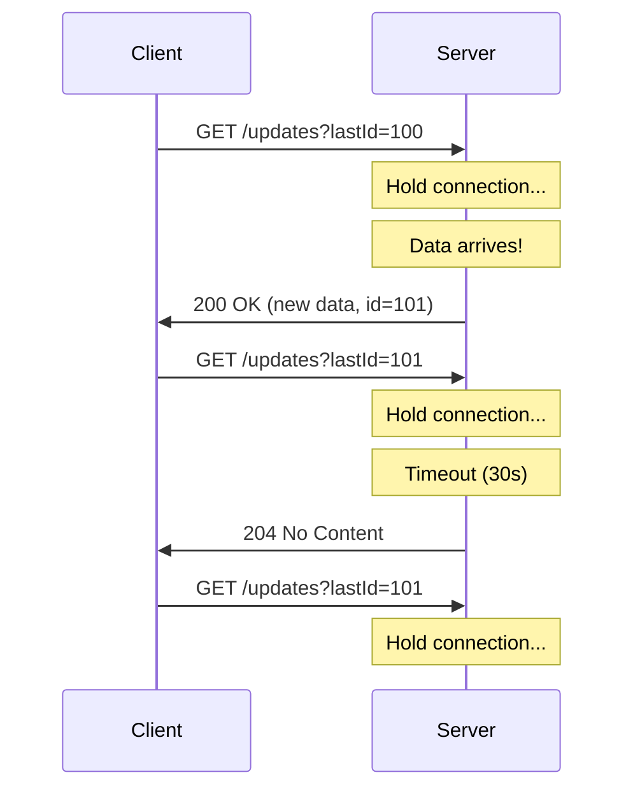
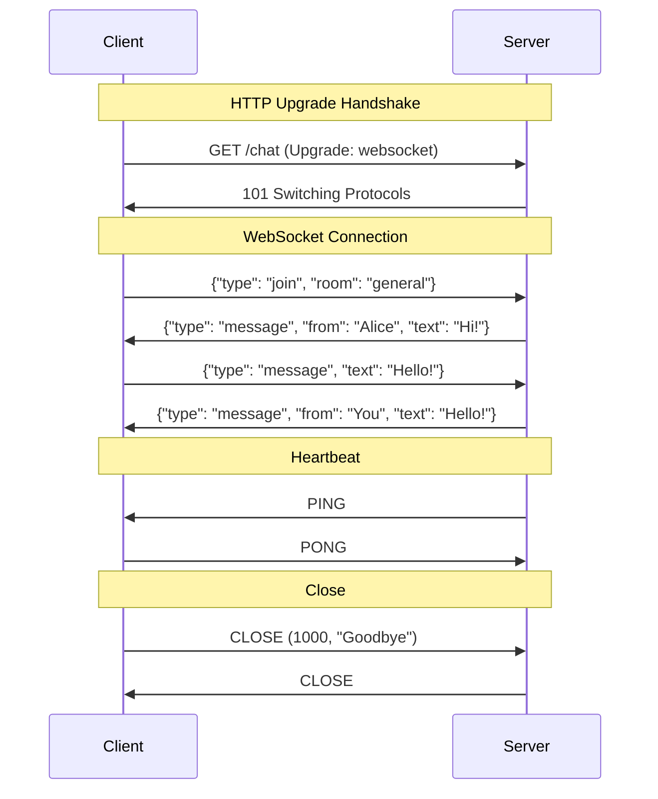

# Modern Protocols

:::info Interview Importance ⭐⭐⭐⭐
Understanding when to use WebSocket vs gRPC vs REST vs SSE is crucial for system design interviews. These questions test your ability to choose the right tool for real-time communication.
:::

## 1. HTTP Limitations for Real-Time

### The Problem with Traditional HTTP

```text
HTTP is Request-Response model:

Client ─────[Request]─────→ Server
Client ←────[Response]────── Server
       (Connection closes or idles)

For real-time updates (chat, notifications), this doesn't work well:

Option 1: Polling (Bad)
Client: "Any updates?" → Server: "No"
Client: "Any updates?" → Server: "No"
Client: "Any updates?" → Server: "No"
Client: "Any updates?" → Server: "Yes! Here's data"

Problems:
├── Wasted requests (95%+ have no data)
├── High latency (waits for next poll)
├── Server load (handling empty requests)
└── Battery drain (mobile devices)
```

### Solutions Overview

| Technology | Direction | Connection | Use Case |
|------------|-----------|------------|----------|
| **Polling** | Client → Server | New connection each time | Legacy, simple |
| **Long Polling** | Client → Server | Held open until data | Fallback for WebSocket |
| **SSE** | Server → Client | Persistent, one-way | Live feeds, notifications |
| **WebSocket** | Bidirectional | Persistent, two-way | Chat, gaming, collaboration |
| **gRPC** | Bidirectional | HTTP/2 streams | Microservices, high perf |

---

## 2. Long Polling

### How It Works

```text
Regular Polling:
Client: Request → Server: "No data" (immediately)
Client: Wait 5 seconds
Client: Request → Server: "No data" (immediately)
...repeat...

Long Polling:
Client: Request → Server: (holds connection...)
                          (holds connection...)
                          (data arrives!) → Response!
Client: Immediately make new request → Server: (holds...)
```



### Implementation Example

```java
// Server-side (Spring Boot)
@GetMapping("/updates")
public DeferredResult<List<Update>> getUpdates(@RequestParam Long lastId) {
    DeferredResult<List<Update>> result = new DeferredResult<>(30000L); // 30s timeout
    
    // Store the deferred result
    pendingRequests.put(lastId, result);
    
    // Check if there's already data
    List<Update> existingUpdates = getUpdatesSince(lastId);
    if (!existingUpdates.isEmpty()) {
        result.setResult(existingUpdates);
        pendingRequests.remove(lastId);
    }
    
    // On timeout, return empty
    result.onTimeout(() -> {
        result.setResult(Collections.emptyList());
        pendingRequests.remove(lastId);
    });
    
    return result;
}

// When new data arrives
public void onNewData(Update update) {
    pendingRequests.forEach((lastId, result) -> {
        if (update.getId() > lastId) {
            result.setResult(List.of(update));
        }
    });
}
```

### Long Polling Pros & Cons

| Pros | Cons |
|------|------|
| Works everywhere (even old browsers) | Still request-response overhead |
| Easy to implement | Server holds connections (resources) |
| Firewall-friendly (looks like HTTP) | Not truly real-time (small delays) |
| Good fallback for WebSocket | Can't push multiple updates easily |

---

## 3. Server-Sent Events (SSE)

### How It Works

```text
SSE: Server pushes events to client over persistent HTTP connection

Client ─── GET /events ───→ Server
Client ←── event: data1 ──── Server
Client ←── event: data2 ──── Server
Client ←── event: data3 ──── Server
       (Connection stays open)

Key features:
├── One-way: Server → Client only
├── Text-based: Uses HTTP text/event-stream
├── Auto-reconnect: Browser handles reconnection
├── Event IDs: Resume from last event on reconnect
```

### SSE Message Format

```text
HTTP Response:
HTTP/1.1 200 OK
Content-Type: text/event-stream
Cache-Control: no-cache
Connection: keep-alive

event: message
id: 1
data: {"user": "Alice", "text": "Hello!"}

event: message
id: 2
data: {"user": "Bob", "text": "Hi there!"}

event: typing
id: 3
data: {"user": "Alice"}

: This is a comment (ignored)

Each event is separated by blank lines.
```

### SSE Implementation

```java
// Server-side (Spring Boot)
@GetMapping(value = "/events", produces = MediaType.TEXT_EVENT_STREAM_VALUE)
public Flux<ServerSentEvent<String>> streamEvents() {
    return Flux.interval(Duration.ofSeconds(1))
        .map(sequence -> ServerSentEvent.<String>builder()
            .id(String.valueOf(sequence))
            .event("ping")
            .data("Event #" + sequence)
            .build());
}

// With real data
@GetMapping(value = "/notifications", produces = MediaType.TEXT_EVENT_STREAM_VALUE)
public Flux<ServerSentEvent<Notification>> streamNotifications(@RequestParam String userId) {
    return notificationService.getNotificationStream(userId)
        .map(notification -> ServerSentEvent.<Notification>builder()
            .id(notification.getId())
            .event("notification")
            .data(notification)
            .build());
}
```

```javascript
// Client-side (JavaScript)
const eventSource = new EventSource('/events');

eventSource.onmessage = (event) => {
    console.log('Message:', event.data);
};

eventSource.addEventListener('notification', (event) => {
    const notification = JSON.parse(event.data);
    showNotification(notification);
});

eventSource.onerror = (error) => {
    console.log('SSE Error:', error);
    // Browser auto-reconnects!
};

// Reconnection with last event ID (automatic)
// Browser sends: Last-Event-ID: 42
// Server resumes from event 43
```

### SSE vs WebSocket

| Feature | SSE | WebSocket |
|---------|-----|-----------|
| **Direction** | Server → Client only | Bidirectional |
| **Protocol** | HTTP | WebSocket (ws://) |
| **Data format** | Text only | Text or Binary |
| **Reconnection** | Automatic | Manual implementation |
| **Browser support** | All modern browsers | All modern browsers |
| **HTTP/2 support** | ✅ Multiplexed | ❌ Separate connection |
| **Use case** | Notifications, feeds | Chat, gaming |

---

## 4. WebSocket

### How WebSocket Works

```text
WebSocket Lifecycle:

1. HTTP Upgrade Request:
GET /chat HTTP/1.1
Host: example.com
Upgrade: websocket
Connection: Upgrade
Sec-WebSocket-Key: dGhlIHNhbXBsZSBub25jZQ==
Sec-WebSocket-Version: 13

2. HTTP Upgrade Response:
HTTP/1.1 101 Switching Protocols
Upgrade: websocket
Connection: Upgrade
Sec-WebSocket-Accept: s3pPLMBiTxaQ9kYGzzhZRbK+xOo=

3. WebSocket Frames (bidirectional):
Client ←───────────────→ Server
      [Binary/Text frames]
      [Ping/Pong for heartbeat]
      [Close frame on disconnect]
```



### WebSocket Implementation

```java
// Server-side (Spring Boot WebSocket)
@Configuration
@EnableWebSocket
public class WebSocketConfig implements WebSocketConfigurer {
    @Override
    public void registerWebSocketHandlers(WebSocketHandlerRegistry registry) {
        registry.addHandler(chatHandler(), "/chat")
            .setAllowedOrigins("*");
    }
}

@Component
public class ChatHandler extends TextWebSocketHandler {
    private final Set<WebSocketSession> sessions = ConcurrentHashMap.newKeySet();
    
    @Override
    public void afterConnectionEstablished(WebSocketSession session) {
        sessions.add(session);
        broadcast("User joined: " + session.getId());
    }
    
    @Override
    protected void handleTextMessage(WebSocketSession session, TextMessage message) {
        String payload = message.getPayload();
        broadcast("User " + session.getId() + ": " + payload);
    }
    
    @Override
    public void afterConnectionClosed(WebSocketSession session, CloseStatus status) {
        sessions.remove(session);
        broadcast("User left: " + session.getId());
    }
    
    private void broadcast(String message) {
        sessions.forEach(session -> {
            try {
                session.sendMessage(new TextMessage(message));
            } catch (Exception e) {
                // Handle error
            }
        });
    }
}
```

```javascript
// Client-side (JavaScript)
const ws = new WebSocket('wss://example.com/chat');

ws.onopen = () => {
    console.log('Connected');
    ws.send(JSON.stringify({ type: 'join', room: 'general' }));
};

ws.onmessage = (event) => {
    const msg = JSON.parse(event.data);
    console.log('Received:', msg);
};

ws.onclose = (event) => {
    console.log('Disconnected:', event.code, event.reason);
    // Implement reconnection logic
    setTimeout(() => reconnect(), 1000);
};

ws.onerror = (error) => {
    console.log('Error:', error);
};

// Send message
function sendMessage(text) {
    ws.send(JSON.stringify({ type: 'message', text }));
}
```

### WebSocket vs HTTP

| Feature | HTTP | WebSocket |
|---------|------|-----------|
| **Connection** | New per request | Persistent |
| **Headers** | Every request | Only handshake |
| **Direction** | Request-Response | Full duplex |
| **Latency** | Higher (connection overhead) | Lower (always connected) |
| **Overhead** | High (headers) | Low (2-14 bytes per frame) |
| **Scaling** | Stateless (easy) | Stateful (harder) |

### WebSocket Scaling Challenges

```text
Problem: WebSocket connections are STATEFUL

Server 1: Connected to User A, User B
Server 2: Connected to User C, User D

User A (on Server 1) wants to message User C (on Server 2)
How does the message reach User C?

Solutions:

1. Sticky Sessions (IP Hash)
   └── Same user always goes to same server
   └── Problem: Uneven load, failover issues

2. Message Broker (Redis Pub/Sub, Kafka)
   ┌─────────────────────────────────────────────┐
   │ Server 1 ←───→ Redis Pub/Sub ←───→ Server 2 │
   │     │               ↑                 │     │
   │   User A        Message A→C        User C   │
   └─────────────────────────────────────────────┘
   └── All servers subscribe to relevant channels
   └── Messages distributed via broker

3. Service Mesh
   └── Dedicated infrastructure for service-to-service communication
   └── Handles routing, load balancing, etc.
```

---

## 5. gRPC

### What is gRPC?

```text
gRPC = Google Remote Procedure Call

Key features:
├── Uses HTTP/2 (multiplexing, streaming)
├── Protocol Buffers for serialization (binary, fast)
├── Strong typing (generate client/server code)
├── Bidirectional streaming
├── Built-in auth, tracing, load balancing
```

### gRPC vs REST

| Feature | REST | gRPC |
|---------|------|------|
| **Protocol** | HTTP/1.1 or HTTP/2 | HTTP/2 only |
| **Format** | JSON (text) | Protobuf (binary) |
| **Contract** | OpenAPI (optional) | .proto file (required) |
| **Streaming** | Limited (SSE) | Native (4 types) |
| **Browser** | Native support | Needs grpc-web proxy |
| **Performance** | Good | Better (smaller payloads) |
| **Tooling** | curl, Postman | grpcurl, specialized tools |

### Protocol Buffers

```protobuf
// user.proto - Define the contract
syntax = "proto3";

package user;

service UserService {
    rpc GetUser(GetUserRequest) returns (User);
    rpc ListUsers(ListUsersRequest) returns (stream User);  // Server streaming
    rpc CreateUsers(stream User) returns (CreateUsersResponse);  // Client streaming
    rpc Chat(stream Message) returns (stream Message);  // Bidirectional
}

message GetUserRequest {
    int32 id = 1;
}

message User {
    int32 id = 1;
    string name = 2;
    string email = 3;
    repeated string roles = 4;
}

message ListUsersRequest {
    int32 page_size = 1;
    string page_token = 2;
}

message Message {
    string from = 1;
    string content = 2;
    int64 timestamp = 3;
}
```

### gRPC Streaming Types

```text
1. UNARY (Simple RPC):
   Client ─── Request ───→ Server
   Client ←── Response ──── Server
   
   Use case: Simple request-response

2. SERVER STREAMING:
   Client ─── Request ──────────────→ Server
   Client ←── Response 1 ───────────── Server
   Client ←── Response 2 ───────────── Server
   Client ←── Response N ───────────── Server
   
   Use case: List results, live updates

3. CLIENT STREAMING:
   Client ─── Request 1 ────────────→ Server
   Client ─── Request 2 ────────────→ Server
   Client ─── Request N ────────────→ Server
   Client ←── Response ─────────────── Server
   
   Use case: Upload, batch operations

4. BIDIRECTIONAL STREAMING:
   Client ←────────────────────────→ Server
          Messages in both directions
   
   Use case: Chat, real-time collaboration
```

### gRPC Implementation

```java
// Generated from .proto file
public class UserServiceImpl extends UserServiceGrpc.UserServiceImplBase {
    
    @Override
    public void getUser(GetUserRequest request, 
                       StreamObserver<User> responseObserver) {
        User user = userRepository.findById(request.getId());
        responseObserver.onNext(user);
        responseObserver.onCompleted();
    }
    
    @Override
    public void listUsers(ListUsersRequest request,
                         StreamObserver<User> responseObserver) {
        // Server streaming - send multiple responses
        userRepository.findAll()
            .forEach(user -> responseObserver.onNext(user));
        responseObserver.onCompleted();
    }
    
    @Override
    public StreamObserver<Message> chat(StreamObserver<Message> responseObserver) {
        // Bidirectional streaming
        return new StreamObserver<Message>() {
            @Override
            public void onNext(Message message) {
                // Process incoming message
                Message reply = processMessage(message);
                responseObserver.onNext(reply);
            }
            
            @Override
            public void onCompleted() {
                responseObserver.onCompleted();
            }
            
            @Override
            public void onError(Throwable t) {
                // Handle error
            }
        };
    }
}
```

### When to Use gRPC

```text
✅ Use gRPC for:
├── Microservices communication (internal)
├── Low-latency, high-throughput requirements
├── Polyglot systems (Java, Go, Python, etc.)
├── Strong contract requirement
└── Streaming requirements

❌ Don't use gRPC for:
├── Public APIs (browser compatibility)
├── Simple CRUD (REST is simpler)
├── When you need human-readable payloads
└── When HTTP caching is important
```

---

## 6. GraphQL

### GraphQL vs REST

```text
REST: Multiple endpoints, server decides data shape

GET /users/123           → {id, name, email, address, ...}
GET /users/123/posts     → [{id, title, content, ...}, ...]
GET /users/123/followers → [{id, name, ...}, ...]

Problems:
├── Over-fetching: Get fields you don't need
├── Under-fetching: Need multiple requests
└── N+1 problem: N posts means N author lookups

GraphQL: One endpoint, client decides data shape

POST /graphql
{
  user(id: 123) {
    name              ← Only fields you need
    posts(first: 5) {
      title
      likes
    }
    followers {
      name
    }
  }
}

Response:
{
  "data": {
    "user": {
      "name": "Alice",
      "posts": [{"title": "Post 1", "likes": 10}, ...],
      "followers": [{"name": "Bob"}, ...]
    }
  }
}
```

### GraphQL Types

```graphql
# Schema definition
type Query {
    user(id: ID!): User
    users(first: Int, after: String): UserConnection
}

type Mutation {
    createUser(input: CreateUserInput!): User
    updateUser(id: ID!, input: UpdateUserInput!): User
}

type Subscription {
    messageReceived(roomId: ID!): Message
}

type User {
    id: ID!
    name: String!
    email: String
    posts: [Post!]!
    followers: [User!]!
}

type Post {
    id: ID!
    title: String!
    author: User!
}

input CreateUserInput {
    name: String!
    email: String!
}
```

### GraphQL Subscriptions (Real-time)

```graphql
# Client subscribes
subscription {
    messageReceived(roomId: "room-123") {
        id
        content
        from {
            name
        }
        timestamp
    }
}
```

### When to Use GraphQL

```text
✅ Use GraphQL for:
├── Complex, nested data requirements
├── Mobile apps (minimize data transfer)
├── Multiple clients with different data needs
├── Rapid iteration on frontend
└── When over/under-fetching is a problem

❌ Don't use GraphQL for:
├── Simple APIs (REST is simpler)
├── File uploads (possible but awkward)
├── When HTTP caching is important
├── Small team (adds complexity)
└── When you need fine-grained auth per field
```

---

## 7. Protocol Selection Guide

### Decision Matrix

```text
                    ┌──────────────────────────────────────────┐
                    │         PROTOCOL SELECTION GUIDE          │
                    └──────────────────────────────────────────┘
                                        │
                              Need Real-Time?
                                   │
                    ┌──────────────┴──────────────┐
                    │ No                          │ Yes
                    ▼                             ▼
                REST/GraphQL                   Direction?
                    │                             │
           ┌────────┴────────┐       ┌───────────┴───────────┐
           │                 │       │                       │
       Complex           Simple   Server→Client          Bidirectional
       queries?          CRUD?    only?                      │
           │                │        │                       │
           ▼                ▼        ▼                       ▼
        GraphQL           REST     SSE                   WebSocket
                                   │                     or gRPC
                              Fallback?
                                   │
                                   ▼
                            Long Polling
```

### Comparison Summary

| Criteria | REST | GraphQL | WebSocket | SSE | gRPC |
|----------|------|---------|-----------|-----|------|
| **Ease of use** | ⭐⭐⭐⭐⭐ | ⭐⭐⭐ | ⭐⭐⭐ | ⭐⭐⭐⭐ | ⭐⭐ |
| **Performance** | ⭐⭐⭐ | ⭐⭐⭐ | ⭐⭐⭐⭐ | ⭐⭐⭐ | ⭐⭐⭐⭐⭐ |
| **Browser support** | ⭐⭐⭐⭐⭐ | ⭐⭐⭐⭐⭐ | ⭐⭐⭐⭐⭐ | ⭐⭐⭐⭐⭐ | ⭐⭐ |
| **Real-time** | ⭐ | ⭐⭐ | ⭐⭐⭐⭐⭐ | ⭐⭐⭐⭐ | ⭐⭐⭐⭐⭐ |
| **Flexibility** | ⭐⭐⭐ | ⭐⭐⭐⭐⭐ | ⭐⭐⭐⭐ | ⭐⭐⭐ | ⭐⭐⭐ |

---

## 8. Interview Questions

### Q1: When would you use WebSocket vs SSE?

```text
Answer:
"I'd use SSE when:
├── Only server needs to push data (notifications, live feeds)
├── I want automatic reconnection handling
├── HTTP/2 is available (efficient multiplexing)
├── I need simpler implementation

I'd use WebSocket when:
├── Communication is bidirectional (chat, gaming)
├── Client needs to send frequent messages
├── I need binary data support
├── Lower per-message overhead is critical

Real examples:
├── Stock ticker → SSE (server pushes prices)
├── Chat app → WebSocket (users send and receive)
├── Live notifications → SSE (simple push)
├── Collaborative editing → WebSocket (bidirectional)"
```

### Q2: How would you scale WebSocket connections?

```text
Answer:
"WebSocket connections are stateful, which complicates scaling:

1. Use message broker (Redis Pub/Sub, Kafka):
   ├── Each server subscribes to relevant channels
   ├── Messages broadcast via broker
   └── Server finds local connections to deliver

2. Connection registry:
   ├── Store user → server mapping in Redis
   ├── Route messages to correct server
   └── Handle failover (monitor connection health)

3. Sticky sessions with fallback:
   ├── Load balancer routes same user to same server
   ├── Broker handles cross-server communication
   └── Graceful failover on server death

4. Consider horizontal partitioning:
   ├── Partition by room/channel
   └── Each partition handled by subset of servers"
```

### Q3: gRPC vs REST for microservices?

```text
Answer:
"For internal microservices communication, I'd prefer gRPC because:

1. Performance:
   ├── HTTP/2 multiplexing (efficient connection usage)
   ├── Protobuf is faster than JSON (smaller, binary)
   └── Benchmarks show 2-10x improvement

2. Strong typing:
   ├── .proto file is the contract
   ├── Generated code catches errors at compile time
   └── Easier refactoring

3. Streaming:
   ├── Native support for all streaming patterns
   └── Useful for large data transfers, real-time

However, I'd use REST when:
├── Exposing public API (browser compatibility)
├── Team unfamiliar with gRPC
├── HTTP caching is valuable
├── Simple CRUD operations (less overhead)"
```

### Q4: Explain how you'd implement a real-time notification system

```text
Answer:
"I'd design it like this:

1. Connection layer:
   ├── SSE for simple notifications (one-way push)
   ├── WebSocket if user can interact (mark read, etc.)

2. Architecture:
   ┌─────────────────────────────────────────────────┐
   │ Client ←─ SSE ─→ Gateway ←─ Redis Pub/Sub ─→ │
   │                     ↑                          │
   │              Notification                      │
   │                Service                         │
   │                     ↑                          │
   │              Event Sources                     │
   │       (Order, Payment, Social, etc.)           │
   └─────────────────────────────────────────────────┘

3. Flow:
   ├── Events published to notification service
   ├── Service creates notification, stores in DB
   ├── Publishes to Redis channel (user-specific)
   ├── Gateway servers subscribed to their users' channels
   └── Push to connected clients via SSE

4. Reliability:
   ├── Store notifications in DB (fetch on reconnect)
   ├── Use event IDs for resumption
   ├── Exponential backoff for reconnection
   └── Fallback to polling if SSE fails"
```

### Q5: What are the tradeoffs of GraphQL?

```text
Answer:
"GraphQL has significant tradeoffs:

Pros:
├── Client-driven data fetching (no over/under-fetching)
├── Single endpoint, self-documenting
├── Great for complex, nested data requirements
└── Excellent developer experience (tooling, introspection)

Cons:
├── HTTP caching is difficult (POST requests, varying queries)
├── N+1 query problem (need dataloader pattern)
├── Complex authorization (field-level permissions)
├── Query complexity attacks (malicious deep queries)
├── Learning curve, additional infrastructure
└── Not great for simple APIs

Mitigations:
├── Persisted queries (cache predefined queries)
├── Query depth/complexity limits
├── DataLoader for batching
├── Caching at resolver level"
```

---

## Quick Reference Card

```text
┌──────────────────────────────────────────────────────────────────────┐
│                   MODERN PROTOCOLS CHEAT SHEET                        │
├──────────────────────────────────────────────────────────────────────┤
│                                                                       │
│ LONG POLLING:                                                         │
│ └── Server holds request until data available or timeout             │
│ └── Fallback for environments that block WebSocket                    │
│                                                                       │
│ SSE (Server-Sent Events):                                             │
│ └── Server → Client (one way)                                         │
│ └── Auto-reconnect, event IDs for resumption                          │
│ └── Content-Type: text/event-stream                                   │
│ └── Use for: notifications, live feeds                                │
│                                                                       │
│ WEBSOCKET:                                                            │
│ └── Full duplex (bidirectional)                                       │
│ └── Starts with HTTP upgrade handshake                                │
│ └── Low overhead after connection                                     │
│ └── Use for: chat, gaming, collaboration                              │
│                                                                       │
│ gRPC:                                                                  │
│ └── HTTP/2 + Protocol Buffers                                         │
│ └── 4 streaming types (unary, server, client, bidirectional)          │
│ └── Strongly typed (.proto contracts)                                 │
│ └── Use for: microservices, high-performance internal APIs            │
│                                                                       │
│ GRAPHQL:                                                              │
│ └── Single endpoint, client specifies data shape                      │
│ └── Query, Mutation, Subscription                                     │
│ └── Solves over/under-fetching                                        │
│ └── Use for: complex UIs, mobile apps with varying data needs         │
│                                                                       │
│ SELECTION GUIDE:                                                      │
│ ├── Simple CRUD             → REST                                    │
│ ├── Complex nested data     → GraphQL                                 │
│ ├── Server push only        → SSE                                     │
│ ├── Bidirectional real-time → WebSocket                               │
│ └── Internal microservices  → gRPC                                    │
│                                                                       │
└──────────────────────────────────────────────────────────────────────┘
```

---

**Next:** [8. Load Balancing & CDN →](./load-balancing-cdn)
