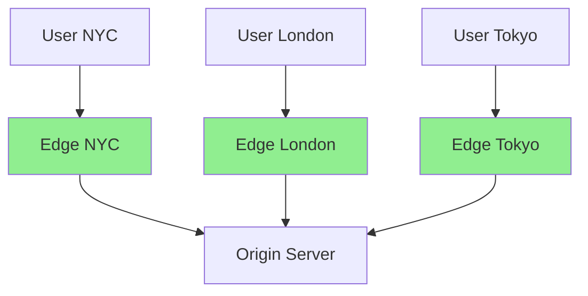

# Load Balancing & CDN

:::info Interview Importance ⭐⭐⭐⭐
Load balancing and CDN are core system design concepts. Understanding these helps you design scalable, highly available systems.
:::

## 1. Load Balancer Basics

### What is a Load Balancer?

```text
Without Load Balancer:
┌────────────────────────────────────────────────────┐
│                                                    │
│   All traffic → Single Server → 💀 (overloaded)   │
│                                                    │
│   Problems:                                        │
│   ├── Single point of failure                     │
│   ├── Limited scalability                         │
│   └── No redundancy                               │
│                                                    │
└────────────────────────────────────────────────────┘

With Load Balancer:
┌────────────────────────────────────────────────────┐
│                                                    │
│           ┌─────────────────┐                      │
│           │  Load Balancer  │                      │
│           └─────────────────┘                      │
│                    │                               │
│         ┌─────────┼─────────┐                      │
│         ▼         ▼         ▼                      │
│    ┌─────────┐ ┌─────────┐ ┌─────────┐            │
│    │Server 1 │ │Server 2 │ │Server 3 │            │
│    └─────────┘ └─────────┘ └─────────┘            │
│                                                    │
│   Benefits:                                        │
│   ├── Distributes load across servers             │
│   ├── High availability (server failure OK)       │
│   ├── Horizontal scaling (add more servers)       │
│   └── Health checks (route away from dead)        │
│                                                    │
└────────────────────────────────────────────────────┘
```

### Load Balancer Types

```text
1. HARDWARE LOAD BALANCER
   └── Physical appliance (F5, Citrix, A10)
   └── High performance, expensive
   └── Used in enterprise, on-premises

2. SOFTWARE LOAD BALANCER
   └── Nginx, HAProxy, Envoy, Traefik
   └── Runs on commodity hardware/VMs
   └── Flexible, cost-effective

3. CLOUD LOAD BALANCER
   └── AWS ALB/NLB, GCP Load Balancer, Azure LB
   └── Managed, auto-scaling
   └── Pay-per-use pricing
```

---

## 2. Layer 4 vs Layer 7 Load Balancing

### Layer 4 (Transport Layer)

```text
Layer 4 Load Balancer:
├── Routes based on IP and TCP/UDP port
├── Does NOT inspect HTTP content
├── Faster (less processing)
├── Connection-based decisions

Example:
Incoming: TCP SYN to 1.2.3.4:443
LB Decision: Route to Server 2 (based on source IP hash)
              (Doesn't know if it's HTTP, WebSocket, or anything else)

Use cases:
├── Raw TCP/UDP load balancing
├── Non-HTTP protocols
├── Maximum performance
└── Simple round-robin/hash distribution
```

### Layer 7 (Application Layer)

```text
Layer 7 Load Balancer:
├── Inspects HTTP headers, URL, cookies
├── Content-based routing decisions
├── SSL/TLS termination
├── Request modification possible

Example URL-based routing:
┌──────────────────────────────────────────────────────┐
│                                                      │
│  /api/*   ─────────────────→  API Servers            │
│  /static/* ────────────────→  CDN/Static Servers     │
│  /admin/* ─────────────────→  Admin Servers          │
│  /ws/*    ─────────────────→  WebSocket Servers      │
│                                                      │
└──────────────────────────────────────────────────────┘

Use cases:
├── URL/path-based routing
├── Header-based routing (host, auth)
├── Cookie-based sticky sessions
├── SSL termination
├── Request/response modification
├── Rate limiting per endpoint
└── A/B testing, canary deployments
```

### Comparison

| Feature | Layer 4 | Layer 7 |
|---------|---------|---------|
| **Speed** | ⚡ Faster | Slower (inspects content) |
| **SSL Termination** | ❌ Passthrough | ✅ Yes |
| **URL Routing** | ❌ | ✅ |
| **Header Modification** | ❌ | ✅ |
| **WebSocket Support** | ✅ (passthrough) | ✅ (native) |
| **Health Checks** | TCP/UDP port | HTTP endpoints |
| **Cost** | Lower | Higher |

---

## 3. Load Balancing Algorithms

### Round Robin

```text
Simple rotation through servers:

Request 1 → Server A
Request 2 → Server B
Request 3 → Server C
Request 4 → Server A
Request 5 → Server B
...and so on

Pros: Simple, fair distribution
Cons: Ignores server capacity and current load
```

### Weighted Round Robin

```text
Servers have different capacities:

Server A (weight 5): 50% traffic
Server B (weight 3): 30% traffic  
Server C (weight 2): 20% traffic

Sequence: A, A, A, A, A, B, B, B, C, C, (repeat)

Use case: Newer servers have more capacity
```

### Least Connections

```text
Route to server with fewest active connections:

Current state:
├── Server A: 45 connections
├── Server B: 32 connections  ← Lowest!
└── Server C: 58 connections

New request → Server B

Pros: Adapts to server load
Cons: Doesn't account for connection weight (some requests heavier)
```

### Weighted Least Connections

```text
Combines weight with connection count:

Score = Active Connections / Weight

Server A: 45 connections, weight 5 → Score: 9
Server B: 32 connections, weight 2 → Score: 16
Server C: 20 connections, weight 4 → Score: 5 ← Lowest!

New request → Server C
```

### IP Hash

```text
hash(client IP) % number_of_servers = server_index

Client 192.168.1.1 → hash("192.168.1.1") % 3 = 0 → Server A
Client 192.168.1.2 → hash("192.168.1.2") % 3 = 1 → Server B
Client 192.168.1.3 → hash("192.168.1.3") % 3 = 2 → Server C

Same client always goes to same server!

Use case: Sticky sessions without cookies
Problem: Uneven distribution if IPs are clustered
```

### Least Response Time

```text
Route to server with fastest response time:

Current response times:
├── Server A: 45ms
├── Server B: 32ms  ← Fastest!
└── Server C: 58ms

New request → Server B

Pros: Routes to healthiest/fastest server
Cons: Requires constant monitoring, can be noisy
```

### Random

```text
Randomly select a server:

New request → Random(A, B, C)

With many servers, approaches even distribution.

Pros: No state to maintain, good for large clusters
Cons: No awareness of server load
```

---

## 4. Session Persistence (Sticky Sessions)

### The Problem

```text
Without sticky sessions:

Request 1 (Login)     → Server A (creates session)
Request 2 (Get Data)  → Server B (no session!) → 401 Unauthorized!

User's session data is on Server A, but request went to Server B!
```

### Solutions

#### 1. Shared Session Store

```text
                    ┌──────────────┐
   Request ─────────│ Load Balancer│
                    └──────────────┘
                           │
              ┌────────────┼────────────┐
              ▼            ▼            ▼
         ┌────────┐   ┌────────┐   ┌────────┐
         │Server A│   │Server B│   │Server C│
         └────────┘   └────────┘   └────────┘
              │            │            │
              └────────────┼────────────┘
                           ▼
                   ┌──────────────┐
                   │    Redis     │
                   │(Session Store)│
                   └──────────────┘

All servers read/write sessions to shared Redis.
Any server can handle any request.
```

#### 2. Sticky Sessions (Session Affinity)

```text
User A (cookie: server=A) → Always routes to Server A
User B (cookie: server=B) → Always routes to Server B

Implementation:
├── Cookie-based: LB sets cookie indicating server
├── IP-based: Hash of source IP
└── Header-based: Custom header

Problems:
├── Uneven load (popular users on same server)
├── Server failure = lost sessions
├── Hard to scale down (users stuck on server)
```

#### 3. Stateless Architecture (Best)

```text
No server-side session state:

┌─────────────────────────────────────────────────────┐
│ All state in:                                        │
│ ├── JWT tokens (signed, client-held)                │
│ ├── Database (shared state)                         │
│ └── Cache (Redis for hot data)                      │
│                                                      │
│ Any server can handle any request!                  │
│ No sticky sessions needed.                          │
│ Easy to scale up/down.                              │
└─────────────────────────────────────────────────────┘
```

---

## 5. Health Checks

### Types of Health Checks

```text
1. PASSIVE HEALTH CHECKS
   └── Monitor existing traffic
   └── Mark unhealthy after N failures
   └── No extra traffic

2. ACTIVE HEALTH CHECKS
   └── Periodic probes (every 5-30 seconds)
   └── HTTP GET /health, TCP connect, etc.
   └── Proactive detection
```

### Health Check Configuration

```nginx
# Nginx upstream health checks
upstream backend {
    server backend1.example.com:8080;
    server backend2.example.com:8080;
    server backend3.example.com:8080 backup;  # Standby server
    
    # Health check settings
    health_check interval=5s fails=3 passes=2;
    # Check every 5 seconds
    # Mark unhealthy after 3 consecutive failures
    # Mark healthy after 2 consecutive successes
}
```

### Health Endpoint Design

```java
@RestController
public class HealthController {
    
    @Autowired
    private DataSource dataSource;
    
    @Autowired
    private RedisTemplate<String, String> redis;
    
    // Simple liveness check (am I running?)
    @GetMapping("/health/live")
    public ResponseEntity<String> liveness() {
        return ResponseEntity.ok("OK");
    }
    
    // Readiness check (can I serve traffic?)
    @GetMapping("/health/ready")
    public ResponseEntity<Map<String, Object>> readiness() {
        Map<String, Object> health = new HashMap<>();
        boolean isHealthy = true;
        
        // Check database
        try {
            dataSource.getConnection().isValid(2);
            health.put("database", "UP");
        } catch (Exception e) {
            health.put("database", "DOWN");
            isHealthy = false;
        }
        
        // Check Redis
        try {
            redis.getConnectionFactory().getConnection().ping();
            health.put("redis", "UP");
        } catch (Exception e) {
            health.put("redis", "DOWN");
            isHealthy = false;
        }
        
        health.put("status", isHealthy ? "UP" : "DOWN");
        
        return isHealthy 
            ? ResponseEntity.ok(health)
            : ResponseEntity.status(503).body(health);
    }
}
```

### Kubernetes Health Checks

```yaml
apiVersion: v1
kind: Pod
spec:
  containers:
  - name: app
    livenessProbe:          # Restart if fails
      httpGet:
        path: /health/live
        port: 8080
      initialDelaySeconds: 30
      periodSeconds: 10
      failureThreshold: 3
      
    readinessProbe:         # Remove from service if fails
      httpGet:
        path: /health/ready
        port: 8080
      initialDelaySeconds: 5
      periodSeconds: 5
      failureThreshold: 3
      
    startupProbe:           # Don't kill during startup
      httpGet:
        path: /health/live
        port: 8080
      initialDelaySeconds: 0
      periodSeconds: 10
      failureThreshold: 30   # 30 * 10 = 300s max startup
```

---

## 6. Reverse Proxy vs Forward Proxy

### Forward Proxy

```text
Forward Proxy: Client → Proxy → Internet

┌──────────────────────────────────────────────────────────┐
│                                                          │
│  Client ────→ Forward Proxy ────→ Internet (servers)     │
│               (hides client)                             │
│                                                          │
│  Use cases:                                              │
│  ├── Hide client IP (privacy, anonymity)                 │
│  ├── Content filtering (block certain sites)             │
│  ├── Caching (reduce bandwidth)                          │
│  └── Access control (authenticate users)                 │
│                                                          │
│  Examples: Corporate proxy, Squid, VPN                   │
│                                                          │
└──────────────────────────────────────────────────────────┘
```

### Reverse Proxy

```text
Reverse Proxy: Internet → Proxy → Servers

┌──────────────────────────────────────────────────────────┐
│                                                          │
│  Internet (clients) ────→ Reverse Proxy ────→ Servers    │
│                           (hides servers)                │
│                                                          │
│  Use cases:                                              │
│  ├── Load balancing                                      │
│  ├── SSL termination                                     │
│  ├── Caching static content                              │
│  ├── Compression                                         │
│  ├── Security (hide server topology)                     │
│  └── Rate limiting, WAF                                  │
│                                                          │
│  Examples: Nginx, HAProxy, Cloudflare, AWS ALB           │
│                                                          │
└──────────────────────────────────────────────────────────┘

Key difference:
├── Forward: Sits in front of CLIENTS
└── Reverse: Sits in front of SERVERS
```

---

## 7. CDN (Content Delivery Network)

### How CDN Works

```text
Without CDN:
User in Australia ────────────────→ Server in USA
                   200ms+ latency

With CDN:
User in Australia ────→ Edge Server in Sydney ────→ Origin in USA
                   20ms │                           (only on cache miss)
                        ↓
                   Cached content returned!

CDN stores copies of content at edge locations worldwide.
```



### CDN Cache Flow

```text
First request (Cache Miss):
1. User → Edge Server
2. Edge: "I don't have this, let me fetch"
3. Edge → Origin Server
4. Origin → Edge (with Cache-Control headers)
5. Edge caches and returns to user

Subsequent requests (Cache Hit):
1. User → Edge Server
2. Edge: "I have this cached!"
3. Edge → User (no origin contact)

Cache Validation:
1. Cache expired (TTL passed)
2. Edge → Origin: If-None-Match: "etag123"
3. Origin → Edge: 304 Not Modified (or new content)
4. Edge refreshes TTL or updates content
```

### What to Cache on CDN

```text
✅ CACHE (Static, rarely changes):
├── Images, videos, audio
├── CSS, JavaScript, fonts
├── PDF documents
├── Static HTML pages
└── API responses with Cache-Control

⚠️ CACHE WITH CARE:
├── Personalized content (use Vary header)
├── Infrequently changing data (with validation)
└── Large API responses (with short TTL)

❌ DON'T CACHE:
├── User-specific data (without proper keys)
├── Real-time data
├── Authenticated endpoints (sensitive data)
├── POST/PUT/DELETE responses
└── WebSocket connections
```

### CDN Cache Headers

```text
Response from Origin to CDN:

Cache-Control: public, max-age=31536000
└── CDN and browser can cache for 1 year

Cache-Control: private, max-age=3600
└── Only browser caches (not CDN), for 1 hour

Cache-Control: no-store
└── Don't cache at all

Cache-Control: no-cache
└── Must revalidate with origin before using cache

Cache-Control: s-maxage=86400, max-age=3600
└── CDN caches 1 day, browser caches 1 hour

Vary: Accept-Encoding, Authorization
└── Cache different versions based on these headers
```

### Cache Invalidation Strategies

```text
1. TTL-BASED (Time to Live)
   └── Content expires after X seconds
   └── Simple, but can serve stale content

2. VERSIONED URLs (Best for static assets)
   └── style.v1.2.3.css, bundle.abc123.js
   └── New version = new URL = new cache
   └── Never need to invalidate!

3. PURGE/INVALIDATE API
   └── Explicitly tell CDN to remove content
   └── POST /cdn/purge {"paths": ["/images/*"]}
   └── Takes time to propagate globally

4. SURROGATE-KEY TAGGING
   └── Tag content with identifiers
   └── Purge by tag: "Purge all product-123 content"
   └── More granular than path-based purging
```

### Edge Computing

```text
Traditional CDN:
Edge: Serves cached static content only

Edge Computing (Cloudflare Workers, AWS Lambda@Edge):
Edge: Runs code at the edge!

┌─────────────────────────────────────────────────────────┐
│ What can edge functions do?                              │
│ ├── URL rewriting and redirects                         │
│ ├── A/B testing                                         │
│ ├── Authentication (JWT validation)                     │
│ ├── Request/response modification                       │
│ ├── Geographic personalization                          │
│ ├── API response aggregation                            │
│ └── Render dynamic pages at edge                        │
└─────────────────────────────────────────────────────────┘
```

---

## 8. DNS-Based Load Balancing

### How It Differs

```text
Hardware/Software LB:
Client → DNS → 1.2.3.4 (LB IP) → LB distributes to servers

DNS Load Balancing:
Client → DNS → Returns different server IPs directly

DNS (Round Robin):
Query 1: example.com → [10.0.0.1, 10.0.0.2, 10.0.0.3]
Query 2: example.com → [10.0.0.2, 10.0.0.3, 10.0.0.1]
Query 3: example.com → [10.0.0.3, 10.0.0.1, 10.0.0.2]

Client typically uses first IP.
```

### DNS LB Pros and Cons

| Pros | Cons |
|------|------|
| No single point of failure | No health checks (returns dead IPs) |
| Simple to set up | DNS caching delays changes |
| Geographic routing possible | Uneven distribution |
| Scales infinitely | No session persistence |
| Low cost | Limited algorithms |

### GeoDNS

```text
Return different IPs based on client location:

User in USA → Request example.com
              DNS returns: 192.0.2.1 (US East server)

User in Europe → Request example.com
                 DNS returns: 198.51.100.1 (EU server)

User in Asia → Request example.com
               DNS returns: 203.0.113.1 (Asia server)

Reduces latency by routing to nearest datacenter.
```

---

## 9. Interview Questions

### Q1: Layer 4 vs Layer 7 Load Balancer?

```text
Answer:
"Layer 4 operates at the transport layer (TCP/UDP). It makes 
routing decisions based on source/destination IP and port. It's 
faster because it doesn't inspect packet content, but it can't 
route based on HTTP headers, URLs, or cookies.

Layer 7 operates at the application layer (HTTP). It can inspect 
request content and route based on URL paths, headers, or cookies. 
This enables features like:
- Path-based routing (/api → API servers)
- Host-based routing (api.example.com → different backend)
- SSL termination (decrypt at LB)
- Request modification

I'd use Layer 4 for maximum performance with non-HTTP protocols, 
and Layer 7 when I need content-aware routing or SSL termination."
```

### Q2: How would you handle sticky sessions?

```text
Answer:
"First, I'd try to avoid sticky sessions by making the system 
stateless:
- Store sessions in shared cache (Redis)
- Use JWTs for stateless authentication
- Store user state in database

If sticky sessions are required:
1. Cookie-based affinity: LB sets a cookie indicating which 
   server to route to. Most flexible.
   
2. IP hash: Hash source IP to determine server. Works without 
   cookies but can be uneven with NAT.
   
3. Application-generated cookie: App sets session ID, LB uses 
   it for routing.

The danger of sticky sessions is:
- Uneven load distribution
- Server failure loses user sessions
- Difficult to scale down gracefully"
```

### Q3: What happens when a server fails behind a load balancer?

```text
Answer:
"The load balancer detects failure through health checks:

1. Active health checks (every 5-30s):
   - LB sends probe to /health endpoint
   - If it fails 3 consecutive times → mark unhealthy
   - Remove from rotation

2. Passive health checks:
   - Monitor actual traffic
   - If errors exceed threshold → mark unhealthy
   
Recovery:
- Once healthy again (2-3 successful checks), add back
- Can implement gradual traffic increase (warmup)

If sticky sessions:
- Users on failed server get redistributed
- If session not in shared store, user loses session

Best practice:
- Shared session store (Redis)
- Multiple health check types (TCP + HTTP)
- Graceful degradation"
```

### Q4: CDN cache invalidation strategies?

```text
Answer:
"I'd use a combination of strategies:

1. Versioned URLs (primary strategy for static assets):
   style.abc123.css, bundle.v2.js
   - Cache forever (max-age=31536000)
   - New deploy = new version = no invalidation needed
   - Build tools generate hashed filenames

2. TTL-based for dynamic content:
   - Cache-Control: max-age=300 (5 minutes)
   - Accept some staleness in exchange for performance
   - Use for content that changes but latency-tolerant

3. Purge API for urgent updates:
   - Call CDN API to invalidate specific paths
   - Use sparingly (takes time to propagate)
   - Good for 'oh no we deployed broken content'

4. Stale-while-revalidate:
   - Serve stale content while fetching fresh
   - User gets fast response, background refresh
   - Cache-Control: max-age=60, stale-while-revalidate=300"
```

### Q5: Design a global load balancing system

```text
Answer:
"I'd design a multi-tier system:

Tier 1 - Global DNS Load Balancing:
├── GeoDNS routes users to nearest region
├── Health checks at DNS level (Route 53, Cloudflare)
├── Failover to another region if primary is down

Tier 2 - Regional CDN/Edge:
├── Static content served from CDN edge
├── Edge functions for simple logic (auth, redirects)
└── Reduces load on origin

Tier 3 - Regional Application Load Balancer:
├── Layer 7 LB (AWS ALB, Nginx)
├── SSL termination
├── Path-based routing to different services
├── Health checks with circuit breakers

Tier 4 - Service Mesh (optional):
├── Service-to-service load balancing
├── Sidecar proxy (Envoy)
└── Advanced routing, retries, circuit breaking

Key features:
├── Multiple regions for fault tolerance
├── Automatic failover at each tier
├── Health checks at all levels
├── Monitoring and alerts"
```

---

## Quick Reference Card

```text
┌──────────────────────────────────────────────────────────────────────┐
│                 LOAD BALANCING & CDN CHEAT SHEET                      │
├──────────────────────────────────────────────────────────────────────┤
│                                                                       │
│ LAYER 4 vs LAYER 7:                                                   │
│ ├── L4: IP/Port, fast, no content inspection                         │
│ └── L7: HTTP headers/URL, SSL termination, content routing           │
│                                                                       │
│ ALGORITHMS:                                                           │
│ ├── Round Robin       : Simple rotation                               │
│ ├── Weighted RR       : Capacity-based distribution                   │
│ ├── Least Connections : Route to least busy                           │
│ ├── IP Hash           : Same client → same server                     │
│ └── Least Response    : Route to fastest                              │
│                                                                       │
│ STICKY SESSIONS:                                                      │
│ ├── Cookie-based      : LB sets cookie with server ID                 │
│ ├── IP Hash           : Hash of client IP                             │
│ └── Better: Shared session store (Redis)                              │
│                                                                       │
│ HEALTH CHECKS:                                                        │
│ ├── Active: Periodic probes (HTTP GET /health)                        │
│ ├── Passive: Monitor actual traffic for errors                        │
│ └── Liveness (running?) vs Readiness (ready to serve?)                │
│                                                                       │
│ CDN CACHING:                                                          │
│ ├── Edge servers worldwide, serve cached content                      │
│ ├── Cache-Control: public, max-age=86400                              │
│ ├── Version URLs for cache busting                                    │
│ └── Purge API for urgent invalidation                                 │
│                                                                       │
│ PROXY TYPES:                                                          │
│ ├── Forward Proxy: Hides clients (VPN, corporate proxy)               │
│ └── Reverse Proxy: Hides servers (Nginx, CDN)                         │
│                                                                       │
│ AWS SERVICES:                                                         │
│ ├── ALB: Layer 7 (HTTP/HTTPS)                                         │
│ ├── NLB: Layer 4 (TCP/UDP, ultra-low latency)                         │
│ ├── CloudFront: CDN                                                   │
│ └── Route 53: DNS with health checks                                  │
│                                                                       │
└──────────────────────────────────────────────────────────────────────┘
```

---

**Next:** [9. Reliability Patterns →](./reliability-patterns)
