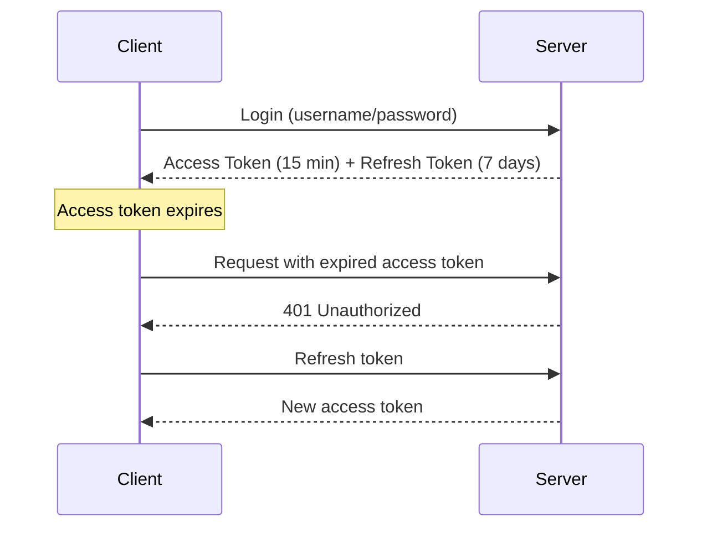
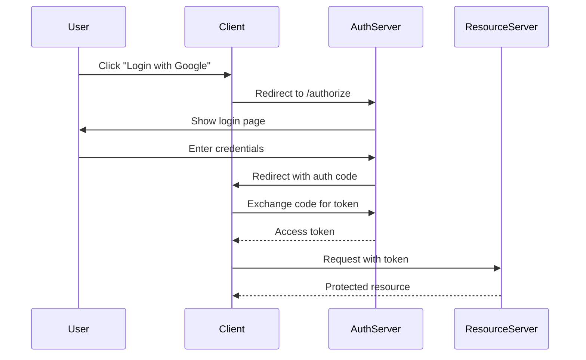

# Authentication & Security Fundamentals

:::danger Security is Critical
Security vulnerabilities can destroy companies. Understanding authentication and authorization is essential for any backend role.
:::

## 1. Authentication vs Authorization

| Authentication | Authorization |
|----------------|---------------|
| **Who are you?** | **What can you do?** |
| Verify identity | Verify permissions |
| Username/password, JWT | Roles, permissions |
| 401 Unauthorized | 403 Forbidden |

```java
// Authentication: Verify user
User user = authenticate(username, password);  // Who are they?

// Authorization: Check permissions
if (!user.hasRole("ADMIN")) {
    throw new AccessDeniedException("Admins only");  // What can they do?
}
```

---

## 2. JWT (JSON Web Tokens)

### JWT Structure

```text
eyJhbGciOiJIUzI1NiIsInR5cCI6IkpXVCJ9.
eyJzdWIiOiIxMjM0NTY3ODkwIiwibmFtZSI6IkpvaG4gRG9lIiwiaWF0IjoxNTE2MjM5MDIyfQ.
SflKxwRJSMeKKF2QT4fwpMeJf36POk6yJV_adQssw5c

[Header].[Payload].[Signature]
```

### JWT Decoded

```json
// Header
{
  "alg": "HS256",
  "typ": "JWT"
}

// Payload (Claims)
{
  "sub": "user123",       // Subject (user ID)
  "name": "John Doe",     // Custom claim
  "role": "USER",         // Custom claim
  "iat": 1516239022,      // Issued at
  "exp": 1516242622       // Expiration
}

// Signature
HMACSHA256(
  base64UrlEncode(header) + "." + base64UrlEncode(payload),
  secret
)
```

### JWT Implementation

```java
@Service
public class JwtService {
    private final String SECRET = "your-256-bit-secret";
    private final long EXPIRATION = 86400000;  // 24 hours
    
    public String generateToken(User user) {
        return Jwts.builder()
            .setSubject(user.getUsername())
            .claim("roles", user.getRoles())
            .setIssuedAt(new Date())
            .setExpiration(new Date(System.currentTimeMillis() + EXPIRATION))
            .signWith(SignatureAlgorithm.HS256, SECRET)
            .compact();
    }
    
    public Claims validateToken(String token) {
        try {
            return Jwts.parser()
                .setSigningKey(SECRET)
                .parseClaimsJws(token)
                .getBody();
        } catch (JwtException e) {
            throw new AuthenticationException("Invalid token");
        }
    }
    
    public String extractUsername(String token) {
        return validateToken(token).getSubject();
    }
}
```

### Access & Refresh Tokens



```java
public class TokenPair {
    private String accessToken;   // Short-lived (15 min)
    private String refreshToken;  // Long-lived (7 days)
}

public TokenPair refreshTokens(String refreshToken) {
    // Validate refresh token
    Claims claims = jwtService.validateToken(refreshToken);
    String userId = claims.getSubject();
    
    // Generate new pair
    return new TokenPair(
        generateAccessToken(userId),
        generateRefreshToken(userId)
    );
}
```

---

## 3. OAuth 2.0

### OAuth Flow (Authorization Code)



### Spring Security OAuth2

```java
@Configuration
@EnableWebSecurity
public class SecurityConfig {
    
    @Bean
    public SecurityFilterChain filterChain(HttpSecurity http) throws Exception {
        return http
            .authorizeHttpRequests(auth -> auth
                .requestMatchers("/public/**").permitAll()
                .anyRequest().authenticated()
            )
            .oauth2Login(oauth -> oauth
                .successHandler(customSuccessHandler())
            )
            .build();
    }
}

// Handling OAuth2 user info
@Service
public class OAuth2UserService extends DefaultOAuth2UserService {
    
    @Override
    public OAuth2User loadUser(OAuth2UserRequest request) {
        OAuth2User oauth2User = super.loadUser(request);
        
        // Extract info from Google/GitHub/etc
        String email = oauth2User.getAttribute("email");
        String name = oauth2User.getAttribute("name");
        
        // Create or update local user
        User user = userRepository.findByEmail(email)
            .orElseGet(() -> createNewUser(email, name));
        
        return new CustomOAuth2User(oauth2User, user);
    }
}
```

---

## 4. Password Security

### Never Store Plain Passwords!

```java
// ❌ NEVER do this
user.setPassword(rawPassword);

// ✅ Always hash
@Service
public class PasswordService {
    private final PasswordEncoder encoder = new BCryptPasswordEncoder();
    
    public String hash(String rawPassword) {
        return encoder.encode(rawPassword);  // Each call produces different hash
    }
    
    public boolean verify(String rawPassword, String hashedPassword) {
        return encoder.matches(rawPassword, hashedPassword);
    }
}

// Registration
user.setPassword(passwordService.hash(rawPassword));
userRepository.save(user);

// Login
if (passwordService.verify(inputPassword, user.getPassword())) {
    // Success
}
```

### Why BCrypt?

```text
1. Salted - Unique salt per password (prevents rainbow tables)
2. Slow - Configurable work factor (prevents brute force)
3. Adaptive - Can increase work factor as hardware improves

BCrypt hash format:
$2a$10$N9qo8uLOickgx2ZMRZoMyeIjZRGEbPEqRp8rqPlFiB.Z37b5rCMBu
 │  │  └── Salt + Hash
 │  └── Cost factor (2^10 iterations)
 └── Algorithm version
```

---

## 5. Common Security Vulnerabilities

### SQL Injection

```java
// ❌ VULNERABLE
String query = "SELECT * FROM users WHERE id = " + userId;
// Input: "1 OR 1=1" → Returns all users!

// ✅ SAFE - Parameterized query
@Query("SELECT u FROM User u WHERE u.id = :id")
User findById(@Param("id") Long id);

// ✅ SAFE - JDBC PreparedStatement
PreparedStatement stmt = conn.prepareStatement(
    "SELECT * FROM users WHERE id = ?"
);
stmt.setLong(1, userId);
```

### XSS (Cross-Site Scripting)

```java
// ❌ VULNERABLE - Rendering user input as HTML
<div>${userComment}</div>
// Input: <script>stealCookies()</script>

// ✅ SAFE - Escape output
<div>${fn:escapeXml(userComment)}</div>

// ✅ SAFE - Use safe templating (Thymeleaf escapes by default)
<div th:text="${userComment}"></div>
```

### CSRF (Cross-Site Request Forgery)

```java
// Spring Security CSRF protection
@Configuration
public class SecurityConfig {
    @Bean
    public SecurityFilterChain filterChain(HttpSecurity http) throws Exception {
        return http
            .csrf(csrf -> csrf
                .csrfTokenRepository(CookieCsrfTokenRepository.withHttpOnlyFalse())
            )
            .build();
    }
}

// For REST APIs, typically disable CSRF and use tokens
http.csrf().disable()  // Only if using JWT/token-based auth
```

---

## 6. API Security Best Practices

### Rate Limiting

```java
@Component
public class RateLimitFilter extends OncePerRequestFilter {
    
    private final RateLimiter rateLimiter = RateLimiter.create(100);  // 100 req/sec
    
    @Override
    protected void doFilterInternal(HttpServletRequest request,
                                    HttpServletResponse response,
                                    FilterChain chain) {
        if (!rateLimiter.tryAcquire()) {
            response.setStatus(429);  // Too Many Requests
            return;
        }
        chain.doFilter(request, response);
    }
}
```

### Input Validation

```java
@PostMapping("/users")
public ResponseEntity<User> createUser(@Valid @RequestBody CreateUserRequest req) {
    // @Valid triggers validation
}

public class CreateUserRequest {
    @NotBlank
    @Size(min = 2, max = 50)
    private String name;
    
    @NotBlank
    @Email
    private String email;
    
    @NotBlank
    @Pattern(regexp = "^(?=.*[a-z])(?=.*[A-Z])(?=.*\\d).{8,}$")
    private String password;
}
```

### Secure Headers

```java
@Bean
public SecurityFilterChain filterChain(HttpSecurity http) throws Exception {
    return http
        .headers(headers -> headers
            .contentSecurityPolicy("default-src 'self'")
            .referrerPolicy(ReferrerPolicyHeaderWriter.ReferrerPolicy.SAME_ORIGIN)
            .frameOptions().deny()
            .xssProtection().block(true)
        )
        .build();
}
```

---

## 7. Interview Questions

### Q1: How do you securely store passwords?

> "Never store plain text passwords. I use BCrypt which automatically handles salting and uses a slow hashing algorithm resistant to brute force attacks. The work factor can be increased as hardware improves."

### Q2: What's the difference between authentication and authorization?

> "Authentication verifies identity (who you are), typically through credentials. Authorization determines permissions (what you can do), typically through roles or claims. A 401 means not authenticated, 403 means authenticated but not authorized."

### Q3: Why use refresh tokens?

> "Refresh tokens allow short-lived access tokens (minutes) for security while providing a good UX. If an access token is stolen, it expires quickly. The refresh token is stored securely and only sent to get new access tokens, limiting exposure."

### Q4: How do you prevent SQL injection?

> "Always use parameterized queries or ORMs like JPA/Hibernate. Never concatenate user input into SQL strings. Also use principle of least privilege for database users."

---

## Quick Reference

```text
Authentication Methods:
- Session-based: Server stores state
- Token-based: Stateless, JWT
- OAuth2: Third-party authentication

JWT Structure:
- Header: Algorithm
- Payload: Claims (sub, exp, etc.)
- Signature: Verification

Password Security:
- BCrypt: Salt + slow hash
- Never store plain text
- Cost factor 10-12

Common Vulnerabilities:
- SQL Injection → Parameterized queries
- XSS → Escape output
- CSRF → Tokens for state-changing requests

HTTP Status:
- 401 = Not authenticated
- 403 = Not authorized
```

---

**Next:** [Computer Networks →](../05-computer-networks/01-intro)
