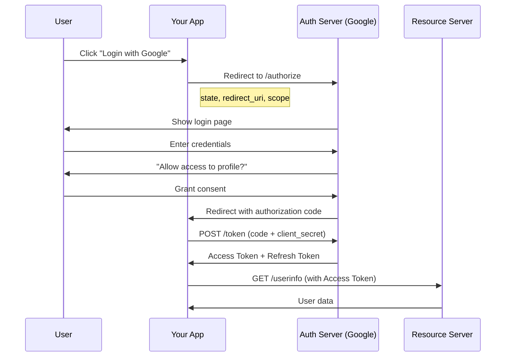

# OAuth 2.0 & OIDC Deep Dive

:::info Interview Essential
OAuth 2.0 and OpenID Connect power "Login with Google/GitHub" everywhere. Understanding the flow and security considerations is crucial for backend roles.
:::

## 1. OAuth 2.0 Overview

### OAuth 2.0 Roles

```text
┌─────────────────────────────────────────────────────────────────────┐
│                      OAUTH 2.0 ROLES                                 │
├─────────────────────────────────────────────────────────────────────┤
│                                                                      │
│  RESOURCE OWNER (User)                                              │
│  └── The human who owns the data                                    │
│      Example: You, the user with a Google account                   │
│                                                                      │
│  CLIENT (Your Application)                                          │
│  └── Application requesting access to user's data                   │
│      Example: Your app wanting to access user's Google profile      │
│                                                                      │
│  AUTHORIZATION SERVER (Auth Provider)                               │
│  └── Issues tokens after authenticating user                        │
│      Example: Google's OAuth server (accounts.google.com)           │
│                                                                      │
│  RESOURCE SERVER (API)                                              │
│  └── Hosts the protected resources                                  │
│      Example: Google's API (googleapis.com)                         │
│                                                                      │
└─────────────────────────────────────────────────────────────────────┘
```

### OAuth 2.0 vs OpenID Connect

| OAuth 2.0 | OpenID Connect (OIDC) |
|-----------|----------------------|
| **Authorization** | **Authentication** |
| "What can this app access?" | "Who is this user?" |
| Returns Access Token | Returns Access Token + **ID Token** |
| For API access | For user identity |
| No standard user info | Standardized claims (name, email, etc.) |

---

## 2. Authorization Code Flow (Recommended)

### The Flow



### Step-by-Step Implementation

```java
// Step 1: Redirect user to authorization server
@GetMapping("/login/google")
public void redirectToGoogle(HttpServletResponse response) throws IOException {
    String authUrl = "https://accounts.google.com/o/oauth2/v2/auth"
        + "?client_id=" + clientId
        + "&redirect_uri=" + URLEncoder.encode(redirectUri, "UTF-8")
        + "&response_type=code"
        + "&scope=" + URLEncoder.encode("openid email profile", "UTF-8")
        + "&state=" + generateState()  // CSRF protection
        + "&access_type=offline";      // Get refresh token
    
    response.sendRedirect(authUrl);
}

// Step 2: Handle callback with authorization code
@GetMapping("/callback")
public ResponseEntity<AuthResponse> handleCallback(
        @RequestParam String code,
        @RequestParam String state,
        HttpSession session) {
    
    // Verify state to prevent CSRF
    if (!state.equals(session.getAttribute("oauth_state"))) {
        throw new SecurityException("Invalid state parameter");
    }
    
    // Step 3: Exchange code for tokens
    TokenResponse tokens = exchangeCodeForTokens(code);
    
    // Step 4: Get user info
    UserInfo userInfo = getUserInfo(tokens.getAccessToken());
    
    // Create or update local user
    User user = userService.findOrCreateFromOAuth(userInfo);
    
    // Generate our own JWT
    String jwt = jwtService.generateToken(user);
    
    return ResponseEntity.ok(new AuthResponse(jwt, user));
}

private TokenResponse exchangeCodeForTokens(String code) {
    RestTemplate restTemplate = new RestTemplate();
    
    MultiValueMap<String, String> params = new LinkedMultiValueMap<>();
    params.add("code", code);
    params.add("client_id", clientId);
    params.add("client_secret", clientSecret);
    params.add("redirect_uri", redirectUri);
    params.add("grant_type", "authorization_code");
    
    HttpHeaders headers = new HttpHeaders();
    headers.setContentType(MediaType.APPLICATION_FORM_URLENCODED);
    
    HttpEntity<MultiValueMap<String, String>> request = 
        new HttpEntity<>(params, headers);
    
    return restTemplate.postForObject(
        "https://oauth2.googleapis.com/token",
        request,
        TokenResponse.class
    );
}
```

### Token Response

```json
{
  "access_token": "ya29.a0AfB_byC...",
  "expires_in": 3600,
  "refresh_token": "1//0eXx...",
  "scope": "openid email profile",
  "token_type": "Bearer",
  "id_token": "eyJhbGciOiJSUzI1NiIsInR5cCI6IkpXVCJ9..."
}
```

---

## 3. PKCE (Proof Key for Code Exchange)

### Why PKCE?

```text
┌─────────────────────────────────────────────────────────────────────┐
│                    THE AUTHORIZATION CODE INTERCEPTION ATTACK        │
├─────────────────────────────────────────────────────────────────────┤
│                                                                      │
│  WITHOUT PKCE (vulnerable):                                         │
│                                                                      │
│  1. User clicks login                                               │
│  2. Auth server redirects with code: ?code=abc123                   │
│  3. ATTACKER intercepts the redirect (e.g., malware on device)      │
│  4. Attacker exchanges code for tokens before your app!             │
│                                                                      │
│  WITH PKCE (secure):                                                 │
│                                                                      │
│  1. App generates random code_verifier                              │
│  2. App sends hash(code_verifier) as code_challenge                 │
│  3. Auth server returns code                                        │
│  4. Only app with original code_verifier can exchange code!         │
│                                                                      │
│  Attacker can intercept code but CAN'T exchange it without          │
│  the code_verifier (never sent over network initially).             │
│                                                                      │
└─────────────────────────────────────────────────────────────────────┘
```

### PKCE Implementation

```java
@Service
public class PKCEService {
    
    // Step 1: Generate code_verifier (random string)
    public String generateCodeVerifier() {
        SecureRandom random = new SecureRandom();
        byte[] bytes = new byte[32];
        random.nextBytes(bytes);
        return Base64.getUrlEncoder().withoutPadding().encodeToString(bytes);
    }
    
    // Step 2: Generate code_challenge (SHA256 hash of verifier)
    public String generateCodeChallenge(String verifier) {
        try {
            MessageDigest digest = MessageDigest.getInstance("SHA-256");
            byte[] hash = digest.digest(verifier.getBytes(StandardCharsets.UTF_8));
            return Base64.getUrlEncoder().withoutPadding().encodeToString(hash);
        } catch (NoSuchAlgorithmException e) {
            throw new RuntimeException("SHA-256 not available", e);
        }
    }
}

// Authorization request with PKCE
@GetMapping("/login/google")
public void redirectWithPKCE(HttpServletResponse response, 
                              HttpSession session) throws IOException {
    
    String codeVerifier = pkceService.generateCodeVerifier();
    String codeChallenge = pkceService.generateCodeChallenge(codeVerifier);
    
    // Store verifier in session (needed for token exchange)
    session.setAttribute("code_verifier", codeVerifier);
    
    String authUrl = "https://accounts.google.com/o/oauth2/v2/auth"
        + "?client_id=" + clientId
        + "&redirect_uri=" + URLEncoder.encode(redirectUri, "UTF-8")
        + "&response_type=code"
        + "&scope=openid%20email%20profile"
        + "&code_challenge=" + codeChallenge
        + "&code_challenge_method=S256";  // SHA-256
    
    response.sendRedirect(authUrl);
}

// Token exchange with code_verifier
private TokenResponse exchangeCodeWithPKCE(String code, String codeVerifier) {
    MultiValueMap<String, String> params = new LinkedMultiValueMap<>();
    params.add("code", code);
    params.add("client_id", clientId);
    params.add("redirect_uri", redirectUri);
    params.add("grant_type", "authorization_code");
    params.add("code_verifier", codeVerifier);  // Proves we initiated the flow
    // No client_secret needed for public clients!
    
    return restTemplate.postForObject(tokenEndpoint, 
        new HttpEntity<>(params, headers), TokenResponse.class);
}
```

---

## 4. Other Grant Types

### Client Credentials (Machine-to-Machine)

```text
Use Case: Backend service calling another backend service
No user involved - service authenticates itself

┌──────────────┐                    ┌──────────────┐
│  Your API    │                    │  Auth Server │
│  (Client)    │                    │              │
└──────┬───────┘                    └──────┬───────┘
       │                                   │
       │  POST /token                      │
       │  grant_type=client_credentials    │
       │  client_id=xxx                    │
       │  client_secret=yyy                │
       │  ─────────────────────────────────►
       │                                   │
       │  { access_token: "..." }          │
       │  ◄─────────────────────────────────
       │                                   │
```

```java
// Client Credentials flow
@Service
public class ServiceAuthClient {
    
    public String getServiceToken() {
        MultiValueMap<String, String> params = new LinkedMultiValueMap<>();
        params.add("grant_type", "client_credentials");
        params.add("client_id", clientId);
        params.add("client_secret", clientSecret);
        params.add("scope", "read:users write:orders");
        
        TokenResponse response = restTemplate.postForObject(
            tokenEndpoint, 
            new HttpEntity<>(params, formHeaders),
            TokenResponse.class
        );
        
        return response.getAccessToken();
    }
    
    // Cache the token until near expiration
    private String cachedToken;
    private Instant tokenExpiry;
    
    public String getValidToken() {
        if (cachedToken == null || Instant.now().isAfter(tokenExpiry.minusSeconds(60))) {
            cachedToken = getServiceToken();
            tokenExpiry = Instant.now().plusSeconds(3600);  // Assuming 1 hour expiry
        }
        return cachedToken;
    }
}
```

### Refresh Token Flow

```java
// Refresh token flow - get new access token without user interaction
@PostMapping("/auth/refresh")
public ResponseEntity<TokenResponse> refreshToken(
        @RequestBody RefreshRequest request) {
    
    MultiValueMap<String, String> params = new LinkedMultiValueMap<>();
    params.add("grant_type", "refresh_token");
    params.add("refresh_token", request.getRefreshToken());
    params.add("client_id", clientId);
    params.add("client_secret", clientSecret);
    
    try {
        TokenResponse response = restTemplate.postForObject(
            tokenEndpoint, 
            new HttpEntity<>(params, formHeaders),
            TokenResponse.class
        );
        return ResponseEntity.ok(response);
    } catch (HttpClientErrorException e) {
        // Refresh token expired or revoked
        return ResponseEntity.status(401)
            .body(null);  // Client should re-authenticate
    }
}
```

### Deprecated Grant Types

```text
⚠️ DO NOT USE - Security risks:

IMPLICIT GRANT (deprecated):
├── Access token in URL fragment (#access_token=...)
├── Exposed in browser history, logs
├── No refresh tokens
└── Use Authorization Code + PKCE instead

PASSWORD GRANT (deprecated):
├── User enters credentials directly in your app
├── Your app sees the password!
├── Only for first-party apps (even then, avoid)
└── Use Authorization Code flow instead
```

---

## 5. OpenID Connect (OIDC)

### ID Token Structure

```text
OIDC adds identity layer on top of OAuth 2.0

ID Token = JWT with standardized claims about the user

┌─────────────────────────────────────────────────────────────────────┐
│                         ID TOKEN CLAIMS                              │
├─────────────────────────────────────────────────────────────────────┤
│                                                                      │
│  REQUIRED CLAIMS:                                                    │
│  ├── iss: "https://accounts.google.com"  (Issuer)                   │
│  ├── sub: "110248495921238986420"        (Subject - unique user ID) │
│  ├── aud: "your-client-id"               (Audience - your app)      │
│  ├── exp: 1699900000                     (Expiration)               │
│  └── iat: 1699896400                     (Issued at)                │
│                                                                      │
│  COMMON CLAIMS (if requested in scope):                             │
│  ├── email: "user@example.com"                                      │
│  ├── email_verified: true                                           │
│  ├── name: "John Doe"                                               │
│  ├── picture: "https://..."                                         │
│  ├── given_name: "John"                                             │
│  ├── family_name: "Doe"                                             │
│  └── locale: "en"                                                    │
│                                                                      │
│  SECURITY CLAIMS:                                                    │
│  ├── nonce: "abc123"       (Replay protection - you send, verify)   │
│  ├── auth_time: 1699896000 (When user actually authenticated)       │
│  └── acr: "urn:..."        (Authentication Context Class)           │
│                                                                      │
└─────────────────────────────────────────────────────────────────────┘
```

### Validating ID Token

```java
@Service
public class OidcTokenValidator {
    
    private final JwkProvider jwkProvider;
    
    public OidcTokenValidator() {
        // Google's public keys
        this.jwkProvider = new UrlJwkProvider("https://www.googleapis.com/oauth2/v3/certs");
    }
    
    public IdTokenClaims validateIdToken(String idToken) {
        try {
            // Decode without verification first to get key ID
            DecodedJWT jwt = JWT.decode(idToken);
            
            // Get public key from JWKS
            Jwk jwk = jwkProvider.get(jwt.getKeyId());
            RSAPublicKey publicKey = (RSAPublicKey) jwk.getPublicKey();
            
            // Verify signature and claims
            Algorithm algorithm = Algorithm.RSA256(publicKey, null);
            JWTVerifier verifier = JWT.require(algorithm)
                .withIssuer("https://accounts.google.com")
                .withAudience(clientId)
                .build();
            
            DecodedJWT verified = verifier.verify(idToken);
            
            return new IdTokenClaims(
                verified.getSubject(),
                verified.getClaim("email").asString(),
                verified.getClaim("name").asString(),
                verified.getClaim("picture").asString()
            );
            
        } catch (JWTVerificationException e) {
            throw new AuthenticationException("Invalid ID token: " + e.getMessage());
        }
    }
}
```

### OIDC Discovery

```java
// Auto-discover OAuth/OIDC endpoints
// GET https://accounts.google.com/.well-known/openid-configuration

{
  "issuer": "https://accounts.google.com",
  "authorization_endpoint": "https://accounts.google.com/o/oauth2/v2/auth",
  "token_endpoint": "https://oauth2.googleapis.com/token",
  "userinfo_endpoint": "https://openidconnect.googleapis.com/v1/userinfo",
  "jwks_uri": "https://www.googleapis.com/oauth2/v3/certs",
  "scopes_supported": ["openid", "email", "profile"],
  "response_types_supported": ["code", "token", "id_token"],
  // ... more
}

// Spring Boot auto-configures from discovery
spring:
  security:
    oauth2:
      client:
        provider:
          google:
            issuer-uri: https://accounts.google.com
        registration:
          google:
            client-id: ${GOOGLE_CLIENT_ID}
            client-secret: ${GOOGLE_CLIENT_SECRET}
            scope: openid,email,profile
```

---

## 6. Token Storage & Security

### Where to Store Tokens

```text
┌─────────────────────────────────────────────────────────────────────┐
│                    TOKEN STORAGE OPTIONS                             │
├─────────────────────────────────────────────────────────────────────┤
│                                                                      │
│  BROWSER (SPA):                                                      │
│                                                                      │
│  ┌────────────────┬─────────────┬──────────────────────────────────┐│
│  │ Storage        │ XSS Risk    │ CSRF Risk    │ Recommendation    ││
│  ├────────────────┼─────────────┼──────────────┼───────────────────┤│
│  │ localStorage   │ ❌ HIGH     │ ✅ None      │ ⚠️ Avoid          ││
│  │ sessionStorage │ ❌ HIGH     │ ✅ None      │ ⚠️ Avoid          ││
│  │ Memory         │ ✅ Safe     │ ✅ None      │ ✅ Best for AT    ││
│  │ HttpOnly Cookie│ ✅ Safe     │ ❌ Needs fix │ ✅ Best for RT    ││
│  └────────────────┴─────────────┴──────────────┴───────────────────┘│
│                                                                      │
│  RECOMMENDED PATTERN:                                                │
│  ├── Access Token: In-memory (JavaScript variable)                  │
│  ├── Refresh Token: HttpOnly, Secure, SameSite cookie               │
│  └── On refresh: Send cookie, receive new AT in response body       │
│                                                                      │
│  MOBILE:                                                             │
│  ├── iOS: Keychain                                                  │
│  ├── Android: EncryptedSharedPreferences or Keystore                │
│  └── Never in plain SharedPreferences!                              │
│                                                                      │
└─────────────────────────────────────────────────────────────────────┘
```

### Secure Cookie Configuration

```java
@PostMapping("/auth/login")
public ResponseEntity<LoginResponse> login(@RequestBody LoginRequest request,
                                            HttpServletResponse response) {
    TokenPair tokens = authService.authenticate(request);
    
    // Set refresh token as HttpOnly cookie
    ResponseCookie refreshCookie = ResponseCookie.from("refresh_token", tokens.getRefreshToken())
        .httpOnly(true)           // JavaScript can't access
        .secure(true)             // HTTPS only
        .sameSite("Strict")       // CSRF protection
        .path("/api/auth/refresh") // Only sent to refresh endpoint
        .maxAge(Duration.ofDays(7))
        .build();
    
    response.addHeader(HttpHeaders.SET_COOKIE, refreshCookie.toString());
    
    // Return access token in response body (stored in memory by client)
    return ResponseEntity.ok(new LoginResponse(tokens.getAccessToken()));
}

@PostMapping("/auth/refresh")
public ResponseEntity<TokenResponse> refresh(
        @CookieValue(name = "refresh_token", required = false) String refreshToken) {
    
    if (refreshToken == null) {
        return ResponseEntity.status(401).build();
    }
    
    String newAccessToken = authService.refresh(refreshToken);
    return ResponseEntity.ok(new TokenResponse(newAccessToken));
}
```

---

## 7. Token Revocation

### Revocation Strategies

```java
// Strategy 1: Token Blacklist (Redis)
@Service
public class TokenBlacklistService {
    
    @Autowired
    private StringRedisTemplate redis;
    
    public void revokeToken(String token) {
        Claims claims = jwtService.parseToken(token);
        String jti = claims.getId();  // JWT ID
        long ttl = claims.getExpiration().getTime() - System.currentTimeMillis();
        
        if (ttl > 0) {
            // Blacklist until original expiration
            redis.opsForValue().set(
                "blacklist:" + jti, 
                "revoked",
                Duration.ofMillis(ttl)
            );
        }
    }
    
    public boolean isRevoked(String token) {
        Claims claims = jwtService.parseToken(token);
        return redis.hasKey("blacklist:" + claims.getId());
    }
}

// Strategy 2: Token Family Rotation
@Service
public class TokenFamilyService {
    
    // Each refresh token belongs to a "family"
    // If an old token is reused, revoke entire family (likely theft)
    
    public TokenPair refresh(String refreshToken) {
        RefreshTokenEntity entity = tokenRepository.findByToken(refreshToken);
        
        if (entity == null) {
            throw new InvalidTokenException("Token not found");
        }
        
        if (entity.isUsed()) {
            // Token reuse detected - possible theft!
            // Revoke entire family
            tokenRepository.revokeFamily(entity.getFamilyId());
            throw new SecurityException("Refresh token reuse detected");
        }
        
        // Mark as used
        entity.setUsed(true);
        tokenRepository.save(entity);
        
        // Create new tokens in same family
        return createTokenPair(entity.getUserId(), entity.getFamilyId());
    }
}
```

---

## 8. Interview Questions

### Q1: Explain OAuth 2.0 Authorization Code flow

```text
Answer:
"The Authorization Code flow is the most secure OAuth flow:

1. USER INITIATES: Clicks 'Login with Google'

2. REDIRECT TO AUTH SERVER:
   App redirects to authorization server with:
   - client_id, redirect_uri, scope
   - state (CSRF protection)
   - code_challenge (PKCE)

3. USER AUTHENTICATES:
   User logs in at Google, grants consent

4. AUTH CODE RETURNED:
   Auth server redirects back with authorization code
   (short-lived, ~10 minutes)

5. CODE EXCHANGE:
   App's backend exchanges code for tokens
   Sends: code + client_secret + code_verifier
   Receives: access_token + refresh_token + id_token

6. ACCESS RESOURCES:
   Use access_token to call APIs

SECURITY BENEFITS:
- Tokens never exposed in browser URL
- Backend holds secrets
- PKCE prevents code interception"
```

### Q2: Why use PKCE?

```text
Answer:
"PKCE (Proof Key for Code Exchange) prevents authorization 
code interception attacks.

THE ATTACK:
- Malware on device intercepts redirect URL
- Steals authorization code before your app
- Exchanges code for tokens

HOW PKCE PREVENTS IT:
1. App generates random 'code_verifier'
2. App sends SHA256(verifier) as 'code_challenge' to auth server
3. Auth server stores challenge with the code
4. When exchanging code, app proves it originated the request
   by providing the original verifier
5. Auth server verifies: SHA256(verifier) == stored challenge

Attacker has the code but not the verifier (never sent 
over network), so can't exchange it.

WHEN TO USE:
- Always for public clients (SPAs, mobile apps)
- Recommended even for confidential clients"
```

### Q3: How do you securely store tokens in a browser?

```text
Answer:
"Different tokens need different storage:

ACCESS TOKEN:
- Store in JavaScript memory (variable)
- Lost on page refresh (acceptable - use refresh token)
- Safe from XSS? Somewhat - XSS can still read memory
- But... no persistence means shorter attack window

REFRESH TOKEN:
- Store in HttpOnly, Secure, SameSite=Strict cookie
- JavaScript can't access (XSS can't steal it)
- Consider CSRF: only send to /refresh endpoint

ON PAGE LOAD:
1. Check for refresh token cookie (automatic)
2. Call /refresh endpoint to get new access token
3. Store access token in memory

TOKEN REFRESH:
- Intercept 401 responses
- Attempt refresh automatically
- Retry original request

NEVER:
- Store tokens in localStorage (XSS can steal)
- Store tokens in URL parameters (logs, history)"
```

---

## Quick Reference Card

```text
┌──────────────────────────────────────────────────────────────────────┐
│                OAUTH 2.0 / OIDC CHEAT SHEET                          │
├──────────────────────────────────────────────────────────────────────┤
│                                                                       │
│ GRANT TYPES:                                                          │
│   Authorization Code + PKCE   For all user-facing apps              │
│   Client Credentials          Machine-to-machine                    │
│   Refresh Token               Get new access token                  │
│   ❌ Implicit                  Deprecated (insecure)                 │
│   ❌ Password                  Deprecated (insecure)                 │
│                                                                       │
│ PKCE:                                                                 │
│   code_verifier    Random string (43-128 chars)                     │
│   code_challenge   Base64URL(SHA256(code_verifier))                 │
│   Prevents         Authorization code interception                  │
│                                                                       │
│ OIDC SCOPES:                                                          │
│   openid           Required for OIDC (returns id_token)             │
│   profile          name, picture, locale, etc.                      │
│   email            email, email_verified                            │
│   offline_access   Returns refresh_token                            │
│                                                                       │
│ TOKEN STORAGE (Browser):                                              │
│   Access Token     JavaScript memory (not localStorage!)            │
│   Refresh Token    HttpOnly, Secure, SameSite cookie                │
│                                                                       │
│ ID TOKEN VALIDATION:                                                  │
│   1. Verify signature (use JWKS from issuer)                        │
│   2. Check iss matches expected issuer                              │
│   3. Check aud matches your client_id                               │
│   4. Check exp has not passed                                       │
│   5. Check nonce if you sent one                                    │
│                                                                       │
│ DISCOVERY ENDPOINT:                                                   │
│   https://issuer/.well-known/openid-configuration                    │
│                                                                       │
└──────────────────────────────────────────────────────────────────────┘
```

---

**Next:** [5. Spring Security Deep Dive →](./spring-security-deep-dive)
