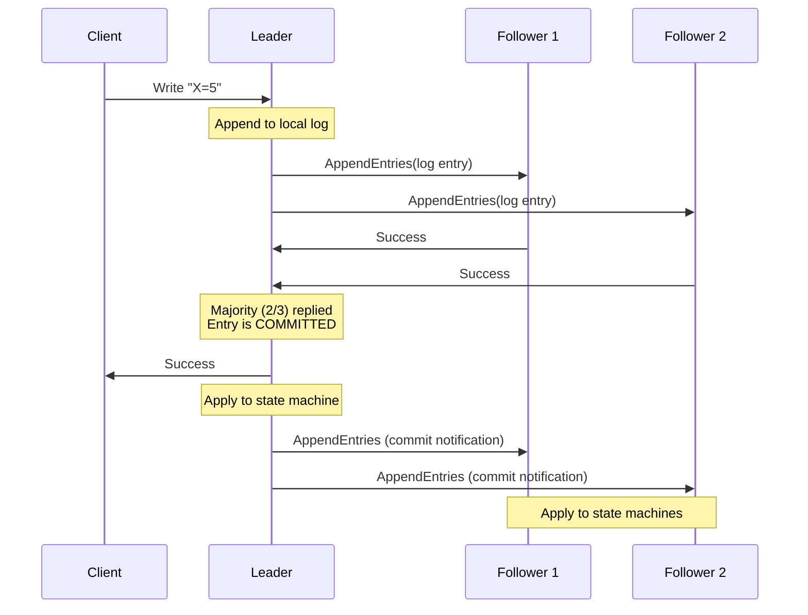

# Distributed Consensus & Leader Election

:::info Interview Importance ⭐⭐⭐⭐
Consensus algorithms are the backbone of distributed systems. Understanding how systems agree on values despite failures is crucial for system design interviews.
:::

## 1. The Consensus Problem

### What is Consensus?

```text
The Problem:
Multiple nodes need to agree on a SINGLE VALUE even when:
├── Some nodes may crash
├── Messages may be lost or delayed
├── Network may partition
└── Nodes may restart with old state

Example scenarios:
├── Who is the current leader?
├── What is the committed order of transactions?
├── Which server owns a particular shard?
└── What is the current cluster configuration?
```

### Requirements for Consensus

```text
1. AGREEMENT (Safety)
   └── All non-faulty nodes decide on the same value
   
2. VALIDITY
   └── The decided value must have been proposed by some node
   
3. TERMINATION (Liveness)
   └── All non-faulty nodes eventually decide
   
4. INTEGRITY
   └── Each node decides at most once
```

### FLP Impossibility

```text
FLP Theorem (Fischer, Lynch, Paterson, 1985):

"In an asynchronous distributed system with even ONE faulty process,
 there is NO algorithm that guarantees consensus."

What this means:
├── Can't distinguish slow node from crashed node
├── Must make trade-offs in practice
└── Real systems use timeouts (sacrifice pure asynchrony)

Practical implications:
├── Use timeouts for failure detection
├── Accept that progress may stall temporarily
└── Prioritize safety over liveness
```

---

## 2. Paxos (Conceptual)

### Why Paxos Matters

```text
Paxos is the FOUNDATION of modern consensus algorithms.
Created by Leslie Lamport in 1989.

Used in (or variants of):
├── Google Chubby (lock service)
├── Microsoft Azure (coordination)
├── Apache ZooKeeper (inspired by)
└── Many proprietary systems

Reputation: "Famously difficult to understand"
           → That's why Raft was created!
```

### Basic Paxos Roles

```text
Three roles (a node can play multiple):

1. PROPOSER
   └── Proposes values to be agreed upon
   └── Drives the protocol

2. ACCEPTOR
   └── Votes on proposals
   └── Remembers what it voted for
   └── Majority (quorum) needed to accept

3. LEARNER
   └── Learns the decided value
   └── Takes action based on decision
```

### Paxos Protocol (Simplified)

```text
Phase 1: PREPARE
┌─────────────────────────────────────────────────────────────┐
│ Proposer → Acceptors: "Prepare(n)"                          │
│   n = unique proposal number (higher = newer)               │
│                                                             │
│ Acceptor → Proposer: "Promise(n, accepted_value)"           │
│   "I won't accept proposals < n"                            │
│   "Here's the highest value I've already accepted"          │
└─────────────────────────────────────────────────────────────┘

Phase 2: ACCEPT
┌─────────────────────────────────────────────────────────────┐
│ If Proposer got promises from majority:                     │
│                                                             │
│ Proposer → Acceptors: "Accept(n, value)"                    │
│   value = highest accepted value from Phase 1               │
│           OR proposer's own value if none                   │
│                                                             │
│ Acceptor: Accept if no promise to higher proposal           │
│                                                             │
│ If majority accept → VALUE IS CHOSEN!                       │
└─────────────────────────────────────────────────────────────┘
```

### Paxos Example

```text
Scenario: 3 acceptors (A1, A2, A3), 2 proposers (P1, P2)
          P1 wants to propose "X", P2 wants to propose "Y"

Step 1: P1 sends Prepare(1) to all acceptors
        A1, A2, A3 reply: Promise(1, null) - no prior accepts

Step 2: P1 sends Accept(1, "X") to all acceptors
        A1 accepts "X"
        (P2 sends Prepare(2) before A2, A3 receive Accept)

Step 3: A2, A3 receive Prepare(2) from P2
        They promise to (2), but... they haven't accepted "X" yet
        They reply: Promise(2, null)

Step 4: P2 sends Accept(2, "Y") to all
        A1: Rejects (already accepted proposal 1)
        A2, A3: Accept "Y"

Result: CONFLICT! 
        A1 has "X", A2 and A3 have "Y"
        Majority (A2, A3) chose "Y" → "Y" is the consensus value
```

---

## 3. Raft Consensus Algorithm

### Why Raft?

```text
Raft was designed to be UNDERSTANDABLE.
Created by Diego Ongaro and John Ousterhout (Stanford, 2014).

Key principle: Decompose into subproblems
├── Leader Election
├── Log Replication  
└── Safety

Used by:
├── etcd (Kubernetes)
├── Consul (HashiCorp)
├── CockroachDB
├── TiKV (TiDB)
└── RethinkDB
```

### Raft Node States

```text
Every node is in one of three states:

┌────────────┐         ┌────────────┐
│  FOLLOWER  │────────→│ CANDIDATE  │
│            │ Timeout │            │
└────────────┘         └────────────┘
      ↑                      │
      │                      │ Wins election
      │                      ↓
      │                ┌────────────┐
      └────────────────│   LEADER   │
        Discovers       │            │
        higher term     └────────────┘

States:
├── FOLLOWER: Passive, responds to RPCs from leader/candidates
├── CANDIDATE: Actively seeking votes to become leader
└── LEADER: Handles all client requests, replicates to followers
```

### Raft Terms

```text
Time is divided into TERMS (like logical epochs):

Term 1         Term 2          Term 3         Term 4
┌──────────┐   ┌──────────┐   ┌──────────┐   ┌──────────┐
│ Election │   │ Election │   │ Election │   │ Election │
│    +     │   │  (fail)  │   │    +     │   │    +     │
│ Normal   │   │          │   │ Normal   │   │ Normal   │
│ Operation│   │          │   │ Operation│   │ Operation│
└──────────┘   └──────────┘   └──────────┘   └──────────┘

Rules:
├── Each term has at most ONE leader
├── Terms act as logical clock
├── Higher term always wins
└── Node seeing higher term → become follower
```

### Leader Election

```text
Election Process:
┌─────────────────────────────────────────────────────────────┐
│ 1. Follower times out (no heartbeat from leader)            │
│    └── Election timeout: 150-300ms (randomized!)            │
│                                                             │
│ 2. Becomes CANDIDATE                                         │
│    └── Increments current term                               │
│    └── Votes for itself                                      │
│    └── Sends RequestVote to all other nodes                  │
│                                                             │
│ 3. Waits for votes                                           │
│    └── Gets majority → becomes LEADER                        │
│    └── Gets AppendEntries from new leader → becomes FOLLOWER │
│    └── Timeout → start new election                          │
│                                                             │
│ 4. Leader sends heartbeats (empty AppendEntries)            │
│    └── Prevents other elections                              │
└─────────────────────────────────────────────────────────────┘
```

### Log Replication



### Raft Log Structure

```text
Each log entry contains:
├── Term number (when entry was received by leader)
├── Index (position in log)
└── Command (the actual data/operation)

Example log:
┌─────────────────────────────────────────────────────────────┐
│ Index │  1  │  2  │  3  │  4  │  5  │  6  │                │
├───────┼─────┼─────┼─────┼─────┼─────┼─────┤                │
│ Term  │  1  │  1  │  1  │  2  │  3  │  3  │                │
├───────┼─────┼─────┼─────┼─────┼─────┼─────┤                │
│ Cmd   │X=1  │Y=2  │Z=3  │X=4  │Y=5  │Z=6  │                │
└─────────────────────────────────────────────────────────────┘
         ↑──────────────────↑             ↑
         Committed          lastApplied   lastIndex
```

### Log Matching Property

```text
Two Safety Properties:

1. If two entries in different logs have same index and term,
   they store the SAME command.
   
2. If two entries in different logs have same index and term,
   all PRECEDING entries are also identical.

How Raft ensures this:
├── Leader never overwrites its log
├── AppendEntries includes prevLogIndex and prevLogTerm
├── Follower rejects if prev entry doesn't match
└── Leader decrements and retries until match found
```

### Raft Safety

```text
Key Safety Property:
"Once a log entry is committed, all future leaders
 must have that entry in their logs."

How this is ensured (Election Restriction):
Candidate includes last log index and term in RequestVote.
Voter denies vote if candidate's log is LESS up-to-date.

"Up-to-date" means:
├── Higher term OR
└── Same term but longer log
```

### Raft Implementation (Java Pseudocode)

```java
public class RaftNode {
    private State state = State.FOLLOWER;
    private int currentTerm = 0;
    private Integer votedFor = null;
    private List<LogEntry> log = new ArrayList<>();
    private int commitIndex = 0;
    private int lastApplied = 0;
    
    // Leader state
    private int[] nextIndex;   // For each follower
    private int[] matchIndex;  // For each follower
    
    // Election timeout handling
    public void onElectionTimeout() {
        if (state == State.LEADER) return;
        
        // Become candidate
        state = State.CANDIDATE;
        currentTerm++;
        votedFor = myId;
        int votesReceived = 1;  // Vote for self
        
        // Request votes from all other nodes
        for (int peer : peers) {
            RequestVoteRPC request = new RequestVoteRPC(
                currentTerm, 
                myId,
                log.size() - 1,  // lastLogIndex
                getLastLogTerm()  // lastLogTerm
            );
            
            sendAsync(peer, request, response -> {
                if (response.term > currentTerm) {
                    // Discovered higher term, revert to follower
                    currentTerm = response.term;
                    state = State.FOLLOWER;
                    return;
                }
                
                if (response.voteGranted) {
                    votesReceived++;
                    if (votesReceived > peers.length / 2) {
                        becomeLeader();
                    }
                }
            });
        }
    }
    
    private void becomeLeader() {
        state = State.LEADER;
        // Initialize leader state
        for (int i = 0; i < peers.length; i++) {
            nextIndex[i] = log.size();
            matchIndex[i] = 0;
        }
        // Send initial heartbeats
        sendHeartbeats();
    }
    
    // Handle client request
    public void handleClientRequest(Command cmd) {
        if (state != State.LEADER) {
            // Redirect to leader
            redirect(leaderId, cmd);
            return;
        }
        
        // Append to local log
        log.add(new LogEntry(currentTerm, cmd));
        
        // Replicate to followers
        replicateLog();
    }
}
```

---

## 4. Quorum Systems

### What is a Quorum?

```text
A quorum is the MINIMUM number of nodes that must participate
in an operation for it to be considered successful.

Most common: MAJORITY QUORUM
└── More than half: ⌊N/2⌋ + 1

Examples:
├── 3 nodes: quorum = 2
├── 5 nodes: quorum = 3
├── 7 nodes: quorum = 4
```

### Why Quorums Work

```text
Key insight: Any two majorities OVERLAP by at least one node!

5 nodes: {A, B, C, D, E}
Majority 1: {A, B, C}     ← Write quorum
Majority 2: {C, D, E}     ← Read quorum
            ↑
          OVERLAP!

This overlap guarantees:
├── A read quorum will see the latest write
├── Two writes can't both succeed with conflicting values
└── System makes progress if majority is available
```

### Read and Write Quorums

```text
Flexible Quorum Formula:
W + R > N

Where:
├── N = Total nodes (replicas)
├── W = Write quorum (nodes that must acknowledge write)
├── R = Read quorum (nodes to read from)

Common configurations:
┌────────────────────────────────────────────────────────────┐
│ Config       │ W │ R │ Properties                          │
├──────────────┼───┼───┼─────────────────────────────────────│
│ Majority     │ 3 │ 3 │ Balanced read/write availability    │
│ Read-heavy   │ 5 │ 1 │ Fast reads, slow writes             │
│ Write-heavy  │ 1 │ 5 │ Fast writes, slow reads             │
└────────────────────────────────────────────────────────────┘
(Assuming N=5)
```

### Quorum in Practice

```java
// Cassandra-style quorum write
public WriteResult write(String key, String value) {
    int acks = 0;
    int required = (replicaCount / 2) + 1;  // Majority
    
    List<Future<Ack>> futures = new ArrayList<>();
    
    for (Node replica : getReplicasForKey(key)) {
        futures.add(replica.writeAsync(key, value));
    }
    
    for (Future<Ack> future : futures) {
        try {
            future.get(timeout, TimeUnit.MILLISECONDS);
            acks++;
            
            if (acks >= required) {
                return WriteResult.success();
            }
        } catch (Exception e) {
            // Node failed, continue to others
        }
    }
    
    return WriteResult.failure("Quorum not reached");
}
```

---

## 5. Practical Implementations

### Apache ZooKeeper

```text
ZooKeeper: Distributed coordination service

Uses: ZAB (ZooKeeper Atomic Broadcast) - similar to Raft

Key features:
├── Hierarchical namespace (like filesystem)
├── Ephemeral nodes (deleted when session ends)
├── Sequential nodes (auto-incrementing)
├── Watches (notifications on changes)
└── Strong consistency (linearizable writes)

Common uses:
├── Leader election
├── Configuration management
├── Distributed locks
├── Service discovery
└── Barrier synchronization
```

### etcd

```text
etcd: Distributed key-value store

Uses: Raft consensus

Key features:
├── Simple key-value API
├── Watch for changes
├── Leases (TTL for keys)
├── Transactions (compare-and-swap)
└── Strong consistency

Used by:
├── Kubernetes (cluster state)
├── CoreDNS
└── Many cloud-native applications

Example:
$ etcdctl put mykey "myvalue"
$ etcdctl get mykey
mykey
myvalue
```

### ZooKeeper vs etcd

| Feature | ZooKeeper | etcd |
|---------|-----------|------|
| **Consensus** | ZAB | Raft |
| **Data Model** | Hierarchical (znodes) | Flat key-value |
| **Language** | Java | Go |
| **API** | Custom protocol | gRPC + HTTP |
| **Watches** | One-time triggers | Continuous streams |
| **Typical Use** | Hadoop, Kafka, HBase | Kubernetes, microservices |

---

## 6. Interview Questions

### Q1: Explain the difference between Paxos and Raft

```text
Answer:
"Paxos and Raft solve the same problem—distributed consensus—but 
with different approaches:

Paxos:
├── More flexible, can switch leaders per decision
├── Harder to understand and implement correctly
├── Two-phase: Prepare → Accept
└── No specific leader concept (any node can propose)

Raft:
├── Designed for understandability
├── Strong leader: all writes go through leader
├── Decomposes into: Leader Election + Log Replication + Safety
├── Leader-based: simpler client interaction
└── Easier to reason about (single decision-maker)

In practice, Raft is preferred for new systems because:
1. Easier to implement correctly
2. Well-defined leader election
3. Strong safety guarantees without complexity"
```

### Q2: How does Raft handle a network partition?

```text
Answer:
"When a network partition occurs in a Raft cluster:

Scenario: 5 nodes split into {A, B, C} and {D, E}
Original leader: A

Majority partition {A, B, C}:
├── A remains leader (has majority)
├── Writes still succeed (quorum of 3)
├── Committed entries persist
└── Normal operation continues

Minority partition {D, E}:
├── D and E lose contact with leader
├── After timeout, election starts
├── Can't get majority → elections fail repeatedly
├── No writes accepted (can't commit without quorum)

When partition heals:
├── D and E discover A is still leader (or C became leader)
├── They see higher term → revert to follower
├── Log discrepancies resolved (leader's log wins)
├── Uncommitted entries in minority may be overwritten

Key safety: No conflicting commits possible because
both sides can't have majority simultaneously."
```

### Q3: Why use odd numbers for cluster size?

```text
Answer:
"Odd numbers provide better efficiency for the same fault tolerance:

3 nodes: Quorum = 2, tolerates 1 failure
4 nodes: Quorum = 3, tolerates 1 failure (same!)
5 nodes: Quorum = 3, tolerates 2 failures

Fault Tolerance Formula:
Can tolerate (N-1)/2 failures

3 nodes: (3-1)/2 = 1 failure
4 nodes: (4-1)/2 = 1 failure (no improvement over 3!)
5 nodes: (5-1)/2 = 2 failures

So adding the 4th node:
├── Doesn't improve fault tolerance
├── Increases coordination overhead
├── Increases probability of partition
└── Wastes resources

Recommendation: Use 3, 5, or 7 nodes
├── 3 nodes: Development, small deployments
├── 5 nodes: Production standard
├── 7 nodes: Critical systems, multi-region"
```

### Q4: How would you implement leader election without Raft/Paxos?

```text
Answer:
"There are simpler approaches for specific scenarios:

1. Using External Coordination (ZooKeeper/etcd):
   - Create ephemeral sequential nodes
   - Lowest sequence number is leader
   - Watch the node ahead of you
   - If it disappears, check if you're now lowest

2. Database-based (for simpler systems):
   - Table with single row: leader_id, expires_at
   - UPDATE with lease renewal
   - SELECT and UPDATE if expired
   - Use database transactions for atomicity

3. Simple Time-based (non-distributed):
   - Oldest running instance is leader
   - Heartbeats with process start time
   - Not partition-tolerant!

4. Bully Algorithm:
   - Node with highest ID becomes leader
   - On failure detection, start election
   - Higher ID nodes can 'bully' lower ones

For production systems, I'd recommend using etcd or ZooKeeper
rather than implementing from scratch—consensus is notoriously
hard to get right."
```

### Q5: What is split-brain and how do you prevent it?

```text
Answer:
"Split-brain occurs when network partition causes multiple nodes
to believe they are the leader, leading to data divergence.

Example:
┌────────────────┐    PARTITION    ┌────────────────┐
│ Node A (Leader)│ ←─────X─────→  │ Node B (Leader)│
│ Writes: X=1    │                 │ Writes: X=2    │
└────────────────┘                 └────────────────┘
        ↓                                   ↓
   Client 1                            Client 2
   (thinks X=1)                       (thinks X=2)

Prevention Strategies:

1. Quorum-based decisions:
   - Require majority for any write
   - Minority partition can't make progress
   
2. Fencing tokens:
   - Sequential tokens for each leader term
   - Storage rejects writes with old token
   
3. STONITH (Shoot The Other Node In The Head):
   - On partition detection, kill other nodes
   - Extreme but guarantees single leader
   
4. Lease-based leadership:
   - Leader has time-limited lease
   - Must renew before expiry
   - Minority partition can't renew (loses leadership)

Best practice: Use quorum + fencing tokens together."
```

---

## Quick Reference Card

```text
┌──────────────────────────────────────────────────────────────────────┐
│               CONSENSUS & LEADER ELECTION CHEAT SHEET                 │
├──────────────────────────────────────────────────────────────────────┤
│                                                                       │
│ CONSENSUS REQUIREMENTS:                                               │
│ ├── Agreement: All decide same value                                  │
│ ├── Validity: Decided value was proposed                              │
│ ├── Termination: Eventually decide                                    │
│ └── Integrity: Decide at most once                                    │
│                                                                       │
│ FLP IMPOSSIBILITY:                                                    │
│ └── No guaranteed consensus in async system with failures             │
│                                                                       │
│ RAFT STATES:                                                          │
│ Follower ──timeout──→ Candidate ──wins vote──→ Leader                │
│     ↑                                            │                    │
│     └──────────discovers higher term─────────────┘                    │
│                                                                       │
│ RAFT LOG REPLICATION:                                                 │
│ 1. Client → Leader                                                    │
│ 2. Leader appends to log                                              │
│ 3. Leader replicates to followers                                     │
│ 4. Majority ACK → committed                                           │
│ 5. Leader applies to state machine                                    │
│ 6. Leader notifies followers to commit                                │
│                                                                       │
│ QUORUM:                                                               │
│ Majority = ⌊N/2⌋ + 1                                                  │
│ W + R > N for consistency                                             │
│                                                                       │
│ SPLIT-BRAIN PREVENTION:                                               │
│ ├── Quorum-based decisions                                            │
│ ├── Fencing tokens                                                    │
│ ├── Leases                                                            │
│ └── STONITH                                                           │
│                                                                       │
│ CLUSTER SIZE:                                                         │
│ 3 nodes: tolerates 1 failure                                          │
│ 5 nodes: tolerates 2 failures                                         │
│ 7 nodes: tolerates 3 failures                                         │
│                                                                       │
│ PRACTICAL IMPLEMENTATIONS:                                            │
│ ├── ZooKeeper: ZAB, hierarchical, Java                                │
│ └── etcd: Raft, key-value, Go/gRPC                                    │
│                                                                       │
└──────────────────────────────────────────────────────────────────────┘
```

---

**Next:** [4. Replication & Partitioning →](./replication-partitioning)
