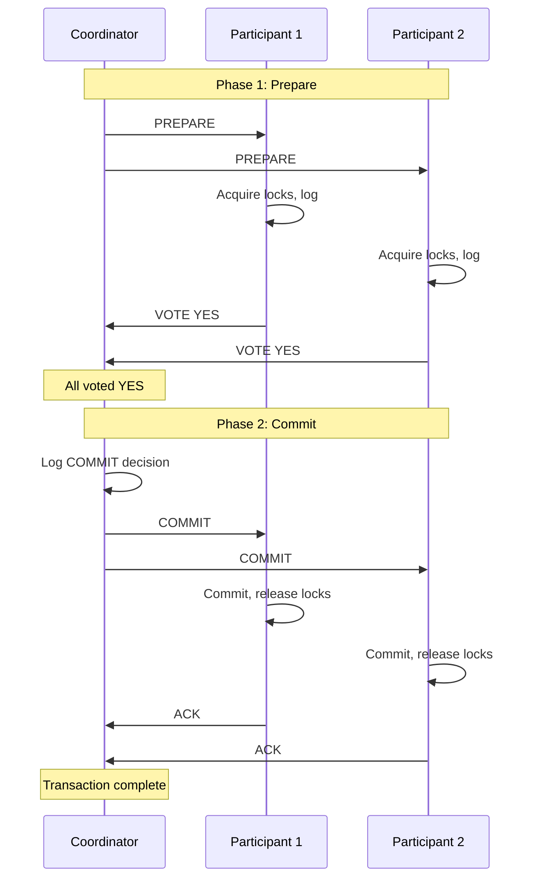

# Distributed Transactions

:::info Interview Importance ⭐⭐⭐⭐⭐
Distributed transactions are a critical topic for system design interviews. Understanding when to use 2PC vs Saga and how to handle failures is essential for designing reliable systems.
:::

## 1. The Problem

### Why Distributed Transactions are Hard

```text
LOCAL TRANSACTION (Easy):
BEGIN TRANSACTION
  UPDATE accounts SET balance = balance - 100 WHERE id = 1
  UPDATE accounts SET balance = balance + 100 WHERE id = 2
COMMIT

→ Database guarantees atomicity (both or neither)

═══════════════════════════════════════════════════════════════

DISTRIBUTED TRANSACTION (Hard):
Service A (Account Service):
  UPDATE accounts SET balance = balance - 100 WHERE id = 1

Service B (Payment Service):
  INSERT INTO payments (amount, status) VALUES (100, 'COMPLETED')

Service C (Notification Service):
  INSERT INTO notifications (user_id, message) VALUES (1, 'Payment sent')

What if:
├── Service A succeeds, Service B fails?
├── Network fails after A commits but before B receives request?
├── Service B takes too long and A times out?
└── How do we guarantee all-or-nothing ACROSS services?
```

### ACID in Distributed Systems

```text
Local ACID:
├── Atomicity: All or nothing
├── Consistency: Valid state to valid state
├── Isolation: Transactions don't interfere
└── Durability: Committed data survives crashes

Distributed ACID Challenges:
├── Atomicity: Need coordination protocol (2PC)
├── Consistency: Network delays cause inconsistency windows
├── Isolation: Distributed locks are expensive
└── Durability: Must durably commit across all nodes

Trade-off: Distributed ACID exists but is SLOW and FRAGILE
           Modern systems often use eventual consistency instead
```

---

## 2. Two-Phase Commit (2PC)

### How 2PC Works

```text
Participants: Coordinate + N Participants

PHASE 1: PREPARE (Voting Phase)
┌─────────────────────────────────────────────────────────────┐
│ Coordinator → All Participants: "Can you commit?"           │
│                                                             │
│ Each Participant:                                           │
│   - Acquire locks                                           │
│   - Write to transaction log                                │
│   - Reply: YES (ready to commit) or NO (abort)              │
│                                                             │
│ If any says NO → Coordinator decides ABORT                  │
│ If all say YES → Proceed to Phase 2                         │
└─────────────────────────────────────────────────────────────┘

PHASE 2: COMMIT (Decision Phase)
┌─────────────────────────────────────────────────────────────┐
│ Coordinator logs decision and sends to all:                 │
│   - COMMIT (if all voted YES)                               │
│   - ABORT (if any voted NO or timeout)                      │
│                                                             │
│ Each Participant:                                           │
│   - Execute COMMIT or ABORT                                 │
│   - Release locks                                           │
│   - ACK to Coordinator                                      │
└─────────────────────────────────────────────────────────────┘
```

### 2PC Sequence Diagram



### 2PC Failure Scenarios

```text
SCENARIO 1: Participant fails before PREPARE
┌─────────────────────────────────────────────────────────────┐
│ Coordinator sends PREPARE                                    │
│ Participant crashes before responding                        │
│                                                              │
│ Solution: Coordinator times out → ABORT                      │
│ Safe because participant didn't vote yet                     │
└─────────────────────────────────────────────────────────────┘

SCENARIO 2: Participant fails after voting YES
┌─────────────────────────────────────────────────────────────┐
│ Participant votes YES, then crashes                          │
│ Coordinator commits (got all YES)                            │
│                                                              │
│ Solution: Participant recovers, checks log, asks Coordinator │
│ "What was the decision for TX-123?"                          │
│ Coordinator: "COMMIT" → Participant commits                  │
└─────────────────────────────────────────────────────────────┘

SCENARIO 3: Coordinator fails after collecting votes
┌─────────────────────────────────────────────────────────────┐
│ Coordinator receives all YES votes                           │
│ Coordinator crashes before sending COMMIT                    │
│                                                              │
│ Problem! Participants are BLOCKED holding locks!             │
│                                                              │
│ Options:                                                     │
│ ├── Wait for coordinator recovery (blocking!)                │
│ ├── Participants ask each other (complex)                    │
│ └── Timeout and abort (may violate atomicity if coord        │
│     recovers and commits)                                    │
└─────────────────────────────────────────────────────────────┘
```

### 2PC Problems

```text
1. BLOCKING PROTOCOL
   └── Participants hold locks while waiting for decision
   └── Coordinator failure = indefinite blocking

2. SINGLE POINT OF FAILURE
   └── Coordinator crash can halt all participants
   └── Need coordinator recovery or failover

3. PERFORMANCE
   └── Multiple round trips
   └── Disk writes for logging
   └── Lock contention during prepare phase

4. NOT PARTITION TOLERANT
   └── Network partition = cannot make progress
   └── Must wait for partition to heal
```

### 2PC Implementation

```java
// Coordinator
public class TwoPhaseCommitCoordinator {
    private final List<Participant> participants;
    private final TransactionLog log;
    
    public boolean executeTransaction(Transaction tx) {
        String txId = tx.getId();
        
        // Phase 1: Prepare
        log.write(txId, State.PREPARING);
        
        List<Future<Vote>> voteFutures = new ArrayList<>();
        for (Participant p : participants) {
            voteFutures.add(p.prepareAsync(tx));
        }
        
        boolean allYes = true;
        for (Future<Vote> future : voteFutures) {
            try {
                Vote vote = future.get(TIMEOUT, TimeUnit.SECONDS);
                if (vote != Vote.YES) {
                    allYes = false;
                    break;
                }
            } catch (TimeoutException e) {
                allYes = false;
                break;
            }
        }
        
        // Phase 2: Commit or Abort
        if (allYes) {
            log.write(txId, State.COMMITTING);
            for (Participant p : participants) {
                p.commit(txId);
            }
            log.write(txId, State.COMMITTED);
            return true;
        } else {
            log.write(txId, State.ABORTING);
            for (Participant p : participants) {
                p.abort(txId);
            }
            log.write(txId, State.ABORTED);
            return false;
        }
    }
}

// Participant
public class Participant {
    private final TransactionLog log;
    
    public Vote prepare(Transaction tx) {
        try {
            // Acquire locks
            acquireLocks(tx.getResources());
            
            // Execute but don't commit
            executeStatements(tx);
            
            // Log that we're ready
            log.write(tx.getId(), State.PREPARED);
            
            return Vote.YES;
        } catch (Exception e) {
            return Vote.NO;
        }
    }
    
    public void commit(String txId) {
        log.write(txId, State.COMMITTED);
        commitToDatabase();
        releaseLocks();
    }
    
    public void abort(String txId) {
        log.write(txId, State.ABORTED);
        rollback();
        releaseLocks();
    }
}
```

---

## 3. Three-Phase Commit (3PC)

### Why 3PC?

```text
3PC adds a PRE-COMMIT phase to avoid blocking:

Phase 1: CAN-COMMIT (same as 2PC prepare)
Phase 2: PRE-COMMIT (new! coordinator tells participants decision)
Phase 3: DO-COMMIT (actual commit)

Key difference:
In 3PC, after PRE-COMMIT:
├── Participants KNOW the decision (commit)
├── If coordinator fails, participants can proceed
└── Timeout defaults to COMMIT (not block)
```

### 3PC Phases

```text
PHASE 1: CAN-COMMIT
Coordinator → Participants: "Can you commit?"
Participants → Coordinator: YES or NO

(Same as 2PC Phase 1)

═══════════════════════════════════════════════════════════════

PHASE 2: PRE-COMMIT
If all said YES:
Coordinator → Participants: "Prepare to commit, decision is COMMIT"
Participants → Coordinator: ACK

Participants now know the decision!

═══════════════════════════════════════════════════════════════

PHASE 3: DO-COMMIT
Coordinator → Participants: "COMMIT now"
Participants → Coordinator: ACK (done)
```

### 3PC Improvements and Limitations

```text
IMPROVEMENTS over 2PC:
├── Non-blocking (with timeouts)
├── Participants know decision before commit phase
└── Can make progress if coordinator fails after PRE-COMMIT

LIMITATIONS:
├── MORE round trips (3 instead of 2)
├── Still fails with network partitions
├── If partition during PRE-COMMIT, can violate atomicity
└── Rarely used in practice (complexity not worth it)

Why 3PC isn't widely used:
├── Still can't handle partitions correctly
├── Added complexity for marginal benefit
├── Modern systems prefer Saga pattern instead
```

---

## 4. Saga Pattern

### What is a Saga?

```text
SAGA: Sequence of local transactions with compensating actions

Instead of one atomic distributed transaction:
├── Break into steps (each a local transaction)
├── If step fails, run compensating transactions for completed steps
└── Eventually consistent, not atomic

Example: Book a trip
┌────────────────────────────────────────────────────────────┐
│ Normal flow:                                                │
│ T1: Reserve Flight → T2: Reserve Hotel → T3: Reserve Car   │
│                                                             │
│ If T3 fails:                                                │
│ C2: Cancel Hotel  → C1: Cancel Flight                       │
│ (Compensating transactions)                                 │
└────────────────────────────────────────────────────────────┘
```

### Saga vs 2PC

| Aspect | 2PC | Saga |
|--------|-----|------|
| **Atomicity** | Strong (all-or-nothing) | Eventual (compensate on failure) |
| **Isolation** | Full isolation (locks) | No isolation (intermediate states visible) |
| **Availability** | Lower (blocking) | Higher (no blocking) |
| **Performance** | Slower (coordination overhead) | Faster (local transactions) |
| **Complexity** | Coordinator logic | Compensation logic |
| **Failure handling** | Automatic rollback | Manual compensation |

### Saga Execution Types

#### Choreography (Event-driven)

```text
Each service listens for events and publishes events.
No central coordinator.

┌─────────────────────────────────────────────────────────────┐
│                                                             │
│  ┌─────────────┐   Flight    ┌─────────────┐   Hotel      │
│  │   Order     │──Booked───→ │   Hotel     │──Booked────→ │
│  │   Service   │             │   Service   │              │
│  └─────────────┘             └─────────────┘              │
│        ↑                           ↑                       │
│        │                           │                       │
│  Flight│                     Hotel │                       │
│  Failed│                     Failed│                       │
│        │                           │                       │
│        ↓                           ↓                       │
│  ┌─────────────┐             ┌─────────────┐              │
│  │   Car       │←─Car─────── │    Car      │              │
│  │   Service   │  Cancelled  │   Service   │              │
│  └─────────────┘             └─────────────┘              │
│                                                             │
└─────────────────────────────────────────────────────────────┘

Pros:
├── Loose coupling
├── No single point of failure
└── Each service owns its logic

Cons:
├── Hard to understand flow
├── Cyclic dependencies possible
└── Testing is complex
```

#### Orchestration (Central coordinator)

```text
Saga Orchestrator tells each service what to do.

┌─────────────────────────────────────────────────────────────┐
│                                                             │
│                    ┌───────────────┐                        │
│                    │     Saga      │                        │
│                    │ Orchestrator  │                        │
│                    └───────┬───────┘                        │
│                            │                                │
│          ┌─────────────────┼─────────────────┐              │
│          │                 │                 │              │
│          ↓                 ↓                 ↓              │
│    ┌──────────┐     ┌──────────┐     ┌──────────┐          │
│    │  Flight  │     │  Hotel   │     │   Car    │          │
│    │ Service  │     │ Service  │     │ Service  │          │
│    └──────────┘     └──────────┘     └──────────┘          │
│                                                             │
│  Orchestrator:                                              │
│  1. Call FlightService.book()                               │
│  2. Call HotelService.book()                                │
│  3. Call CarService.book()                                  │
│  4. If any fails → call compensations in reverse            │
│                                                             │
└─────────────────────────────────────────────────────────────┘

Pros:
├── Easy to understand (linear flow)
├── Centralized error handling
└── Easy to add/modify steps

Cons:
├── Orchestrator is single point of failure
├── Orchestrator can become complex
└── Tighter coupling to orchestrator
```

### Saga Implementation (Orchestration)

```java
public class TripBookingSaga {
    private final FlightService flightService;
    private final HotelService hotelService;
    private final CarService carService;
    
    public TripBookingResult execute(TripBookingRequest request) {
        SagaContext context = new SagaContext();
        
        try {
            // Step 1: Book flight
            FlightBooking flight = flightService.book(request.getFlight());
            context.setFlightBooking(flight);
            
            // Step 2: Book hotel
            HotelBooking hotel = hotelService.book(request.getHotel());
            context.setHotelBooking(hotel);
            
            // Step 3: Book car
            CarBooking car = carService.book(request.getCar());
            context.setCarBooking(car);
            
            return TripBookingResult.success(context);
            
        } catch (Exception e) {
            // Compensate in reverse order
            compensate(context);
            return TripBookingResult.failure(e.getMessage());
        }
    }
    
    private void compensate(SagaContext context) {
        // Compensate in reverse order of execution
        if (context.getCarBooking() != null) {
            carService.cancel(context.getCarBooking().getId());
        }
        
        if (context.getHotelBooking() != null) {
            hotelService.cancel(context.getHotelBooking().getId());
        }
        
        if (context.getFlightBooking() != null) {
            flightService.cancel(context.getFlightBooking().getId());
        }
    }
}
```

### Saga Implementation (Choreography)

```java
// Flight Service
@Service
public class FlightService {
    @Autowired
    private EventPublisher eventPublisher;
    
    @EventListener
    public void handleOrderCreated(OrderCreatedEvent event) {
        try {
            FlightBooking booking = bookFlight(event.getFlightDetails());
            eventPublisher.publish(new FlightBookedEvent(event.getOrderId(), booking));
        } catch (Exception e) {
            eventPublisher.publish(new FlightBookingFailedEvent(event.getOrderId(), e.getMessage()));
        }
    }
    
    @EventListener
    public void handleHotelBookingFailed(HotelBookingFailedEvent event) {
        // Compensate: Cancel the flight we booked
        cancelFlight(event.getOrderId());
        eventPublisher.publish(new FlightCancelledEvent(event.getOrderId()));
    }
}

// Hotel Service
@Service
public class HotelService {
    @Autowired
    private EventPublisher eventPublisher;
    
    @EventListener
    public void handleFlightBooked(FlightBookedEvent event) {
        try {
            HotelBooking booking = bookHotel(event.getOrderId());
            eventPublisher.publish(new HotelBookedEvent(event.getOrderId(), booking));
        } catch (Exception e) {
            eventPublisher.publish(new HotelBookingFailedEvent(event.getOrderId(), e.getMessage()));
        }
    }
}
```

### Designing Compensating Transactions

```text
Requirements for compensating transactions:

1. IDEMPOTENT
   Running compensation twice should have same effect as once.
   (Network retry might send compensation twice)

2. NEVER FAIL
   Compensation must always succeed eventually.
   Use retries, dead letter queues.

3. SEMANTIC ROLLBACK
   Not always exact reversal:
   ├── Transfer money → Reverse transfer (different transaction)
   ├── Send email → Send "correction" email (not unsend)
   └── Charge card → Refund (not reverse charge)

4. EVENTUALLY CONSISTENT
   Accept that there's a window of inconsistency.
   User might see partial state briefly.
```

```java
// Idempotent compensation
public class OrderCompensation {
    
    public void cancelOrder(String orderId) {
        Order order = orderRepository.findById(orderId);
        
        if (order == null) {
            // Already cancelled or never existed - idempotent
            return;
        }
        
        if (order.getStatus() == OrderStatus.CANCELLED) {
            // Already cancelled - idempotent
            return;
        }
        
        // Perform cancellation
        order.setStatus(OrderStatus.CANCELLED);
        order.setCancelledAt(Instant.now());
        orderRepository.save(order);
        
        // Compensate related actions
        refundPayment(order);
        restoreInventory(order);
        notifyUser(order);
    }
}
```

---

## 5. Handling Edge Cases

### Saga Failure Scenarios

```text
SCENARIO 1: Step fails before any work
┌────────────────────────────────────────────────────────────┐
│ T1: Book Flight → (fails immediately)                       │
│                                                             │
│ Nothing to compensate. Just return failure.                 │
└────────────────────────────────────────────────────────────┘

SCENARIO 2: Middle step fails
┌────────────────────────────────────────────────────────────┐
│ T1: Book Flight → SUCCESS                                   │
│ T2: Book Hotel  → FAIL                                      │
│                                                             │
│ Run: C1 (Cancel Flight)                                     │
│ Return failure to user.                                     │
└────────────────────────────────────────────────────────────┘

SCENARIO 3: Compensation fails
┌────────────────────────────────────────────────────────────┐
│ T1: Book Flight → SUCCESS                                   │
│ T2: Book Hotel  → FAIL                                      │
│ C1: Cancel Flight → FAIL!                                   │
│                                                             │
│ Options:                                                    │
│ ├── Retry compensation (with exponential backoff)           │
│ ├── Dead letter queue for manual intervention               │
│ └── Alert and manual resolution                             │
│                                                             │
│ MUST retry until compensation succeeds!                     │
└────────────────────────────────────────────────────────────┘

SCENARIO 4: Service unavailable during saga
┌────────────────────────────────────────────────────────────┐
│ T1: Book Flight → SUCCESS                                   │
│ T2: Book Hotel  → (service down, timeout)                   │
│                                                             │
│ Options:                                                    │
│ ├── Treat as failure, compensate T1                         │
│ ├── Retry T2 a few times                                    │
│ └── Put saga in "pending" state, retry later                │
└────────────────────────────────────────────────────────────┘
```

### Saga State Machine

```java
public enum SagaState {
    STARTED,
    FLIGHT_BOOKED,
    HOTEL_BOOKED,
    CAR_BOOKED,
    COMPLETED,
    
    // Compensating states
    COMPENSATING_CAR,
    COMPENSATING_HOTEL,
    COMPENSATING_FLIGHT,
    COMPENSATED,
    
    // Terminal failure
    COMPENSATION_FAILED
}

@Entity
public class TripSaga {
    @Id
    private String sagaId;
    
    @Enumerated(EnumType.STRING)
    private SagaState state;
    
    private String flightBookingId;
    private String hotelBookingId;
    private String carBookingId;
    
    private String failureReason;
    private int compensationRetryCount;
    
    private Instant createdAt;
    private Instant updatedAt;
}

// State machine for saga recovery
public class SagaRecoveryService {
    
    @Scheduled(fixedRate = 60000)  // Every minute
    public void recoverStuckSagas() {
        // Find sagas stuck in intermediate states
        List<TripSaga> stuckSagas = sagaRepository
            .findByStateInAndUpdatedAtBefore(
                List.of(SagaState.FLIGHT_BOOKED, SagaState.HOTEL_BOOKED),
                Instant.now().minus(5, ChronoUnit.MINUTES)
            );
        
        for (TripSaga saga : stuckSagas) {
            if (saga.getState() == SagaState.FLIGHT_BOOKED) {
                // Hotel step never completed - retry or compensate
                retryOrCompensate(saga);
            }
        }
    }
}
```

---

## 6. When to Use What

### Decision Framework

```text
DO use 2PC when:
├── Strong consistency is REQUIRED
├── Small number of participants
├── All participants are in same datacenter
├── Low latency not critical
└── Example: Traditional banking within same bank

DO NOT use 2PC when:
├── Participants are in different datacenters
├── Network is unreliable
├── High availability is priority
├── Many participants (scaling issues)
└── Long-running transactions

═══════════════════════════════════════════════════════════════

DO use Saga when:
├── High availability is priority
├── Cross-service transactions in microservices
├── Long-running business processes
├── Can tolerate temporary inconsistency
└── Example: E-commerce order processing

DO NOT use Saga when:
├── Strict atomicity is required
├── Can't design compensating actions
├── Isolation is required (no dirty reads)
└── Transaction duration is milliseconds (overhead not worth it)

═══════════════════════════════════════════════════════════════

Alternative: Avoid distributed transactions entirely
├── Design bounded contexts carefully
├── Use event sourcing
├── Accept eventual consistency
└── Use idempotency keys for retries
```

---

## 7. Interview Questions

### Q1: Explain the Saga pattern and when to use it

```text
Answer:
"Saga is a pattern for managing distributed transactions without using 
distributed locking. Instead of one atomic transaction, we break it into 
a sequence of local transactions, each with a compensating action.

Key characteristics:
1. Each step is a local ACID transaction
2. If a step fails, we run compensations in reverse order
3. No global locks - high availability
4. Eventual consistency, not strong consistency

Two implementation styles:
1. Choreography: Services react to events
   - Loose coupling, but harder to understand flow
   
2. Orchestration: Central coordinator directs services
   - Easy to understand, but coordinator is SPOF

When to use Saga:
- Microservices needing cross-service consistency
- Long-running business processes
- When availability matters more than strict consistency
- When you can design compensating actions

When NOT to use:
- When atomicity is strictly required
- When compensation isn't possible
- Very short transactions (overhead not worth it)"
```

### Q2: What are the problems with 2PC and how does Saga solve them?

```text
Answer:
"2PC has several critical problems:

1. BLOCKING:
   - Participants hold locks while waiting for coordinator
   - Coordinator failure = indefinite blocking
   
   Saga solution: No locks, each step commits immediately

2. SINGLE POINT OF FAILURE:
   - Coordinator crash can halt entire system
   
   Saga solution: Orchestrator failure doesn't block other services

3. LATENCY:
   - Multiple synchronous round trips
   - All participants must be available
   
   Saga solution: Async execution, independent services

4. SCALABILITY:
   - More participants = more coordination overhead
   - Not suitable for many participants
   
   Saga solution: Each service handles its own transactions

5. NOT PARTITION TOLERANT:
   - Network partition prevents progress
   
   Saga solution: Can make progress with available services

Trade-off: Saga sacrifices atomicity and isolation for availability 
and performance. This is often acceptable for business transactions 
that can tolerate brief inconsistency."
```

### Q3: How do you handle compensation failures in a Saga?

```text
Answer:
"Compensation failures are critical - they can leave the system in an 
inconsistent state. Here's how I'd handle them:

1. DESIGN COMPENSATIONS TO BE IDEMPOTENT:
   Running twice should have same effect as once.
   Use idempotency keys or check-then-act patterns.

2. RETRY WITH BACKOFF:
   Compensations should be retried until they succeed.
   Exponential backoff to avoid overwhelming failing service.

3. DEAD LETTER QUEUE:
   After N failures, move to DLQ for manual intervention.
   Alert operations team.

4. SAGA STATE PERSISTENCE:
   Store saga state in database.
   Recovery process picks up stuck sagas.
   Know exactly which compensations still need to run.

5. EVENTUAL CONSISTENCY ACCEPTANCE:
   Accept that there may be a window of inconsistency.
   Design UI to handle this gracefully.

Example implementation:
- Store saga state machine in DB
- Background job checks for stuck sagas
- Compensation retries up to 5 times with backoff
- Then move to manual queue with alert"
```

### Q4: Design a payment saga with proper error handling

```text
Answer:
"Here's a payment saga for e-commerce checkout:

Steps:
1. Reserve inventory
2. Create payment authorization
3. Ship order
4. Capture payment

Compensations:
1. Release inventory reservation
2. Cancel payment authorization
3. Cancel shipment
4. Refund payment

Implementation:

class PaymentSaga:
    def execute(order):
        saga = SagaState(order_id=order.id)
        
        try:
            # Step 1: Reserve inventory
            saga.state = "RESERVING_INVENTORY"
            reservation = inventory.reserve(order.items)
            saga.reservation_id = reservation.id
            save(saga)
            
            # Step 2: Authorize payment
            saga.state = "AUTHORIZING_PAYMENT"
            auth = payment.authorize(order.amount, order.card)
            saga.auth_id = auth.id
            save(saga)
            
            # Step 3: Ship
            saga.state = "SHIPPING"
            shipment = shipping.create(order)
            saga.shipment_id = shipment.id
            save(saga)
            
            # Step 4: Capture payment
            saga.state = "CAPTURING"
            payment.capture(saga.auth_id)
            
            saga.state = "COMPLETED"
            save(saga)
            
        except Exception as e:
            compensate(saga)
            
    def compensate(saga):
        # Reverse order of execution
        if saga.shipment_id:
            retry_until_success(shipping.cancel, saga.shipment_id)
            
        if saga.auth_id:
            retry_until_success(payment.void, saga.auth_id)
            
        if saga.reservation_id:
            retry_until_success(inventory.release, saga.reservation_id)
            
        saga.state = "COMPENSATED"
        save(saga)

Key points:
- Save state after each step (durability)
- Compensations retry until success
- Each compensation is idempotent"
```

---

## Quick Reference Card

```text
┌──────────────────────────────────────────────────────────────────────┐
│              DISTRIBUTED TRANSACTIONS CHEAT SHEET                     │
├──────────────────────────────────────────────────────────────────────┤
│                                                                       │
│ 2PC (Two-Phase Commit):                                               │
│ Phase 1: PREPARE - All vote YES/NO                                    │
│ Phase 2: COMMIT/ABORT - Based on votes                                │
│                                                                       │
│ 2PC Problems:                                                         │
│ ├── Blocking (locks held during coordination)                         │
│ ├── Coordinator SPOF                                                  │
│ ├── High latency                                                      │
│ └── Not partition tolerant                                            │
│                                                                       │
│ SAGA PATTERN:                                                         │
│ ├── Sequence of local transactions                                    │
│ ├── Each has compensating action                                      │
│ ├── On failure: run compensations in reverse                          │
│ └── Eventually consistent                                             │
│                                                                       │
│ SAGA TYPES:                                                           │
│ ├── Choreography: Event-driven, decentralized                         │
│ └── Orchestration: Central coordinator                                │
│                                                                       │
│ COMPENSATION RULES:                                                   │
│ ├── Must be idempotent                                                │
│ ├── Must eventually succeed (retry forever)                           │
│ ├── Is semantic rollback, not exact reverse                           │
│ └── May leave brief inconsistency                                     │
│                                                                       │
│ WHEN TO USE WHAT:                                                     │
│ ├── 2PC: Strong consistency required, same datacenter                 │
│ ├── Saga: Microservices, cross-datacenter, availability priority      │
│ └── Neither: Design to avoid distributed transactions                 │
│                                                                       │
│ SAGA STATE MACHINE:                                                   │
│ STARTED → STEP1 → STEP2 → ... → COMPLETED                             │
│     ↓        ↓       ↓                                                │
│ COMPENSATING ← ← ← ←                                                  │
│     ↓                                                                 │
│ COMPENSATED                                                           │
│                                                                       │
└──────────────────────────────────────────────────────────────────────┘
```

---

**Next:** [6. Event Sourcing & CQRS →](./event-sourcing-cqrs)
