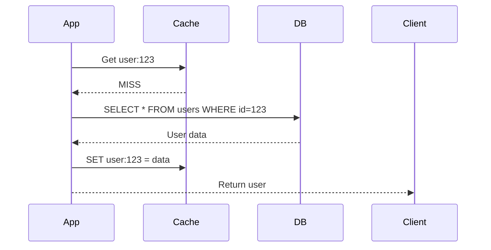
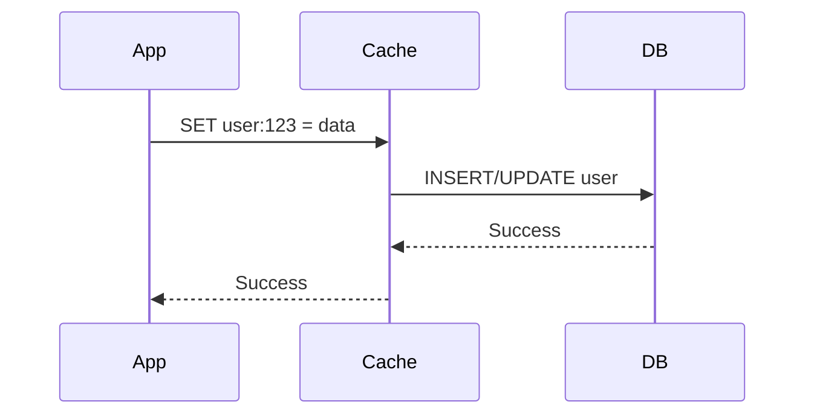

# Caching Strategies & Patterns

:::tip Performance Impact
A well-implemented cache can reduce database load by **90%+** and cut response times from **200ms to 5ms**. It's one of the highest-impact optimizations.
:::

## 1. Why Caching Matters

### The Performance Gap

| Operation | Latency |
|-----------|---------|
| L1 cache reference | 0.5 ns |
| L2 cache reference | 7 ns |
| RAM access | 100 ns |
| **Redis access** | **0.5 ms** |
| SSD read | 1 ms |
| **Database query** | **5-50 ms** |
| Network round trip (same DC) | 0.5 ms |
| Network round trip (cross DC) | 50-150 ms |

### When to Cache

```text
✅ Cache when:
- Data is read frequently
- Data changes infrequently
- Fetching is expensive (DB query, API call)
- Temporary staleness is acceptable

❌ Don't cache when:
- Data changes constantly
- Every request needs fresh data
- Data is unique per request
- Security-sensitive data
```

---

## 2. Caching Patterns

### Pattern 1: Cache-Aside (Lazy Loading)

Application manages both cache and database.



```java
public User getUser(Long userId) {
    String cacheKey = "user:" + userId;
    
    // 1. Check cache first
    User cachedUser = cache.get(cacheKey, User.class);
    if (cachedUser != null) {
        return cachedUser;  // Cache HIT
    }
    
    // 2. Cache MISS - fetch from DB
    User user = userRepository.findById(userId);
    
    // 3. Populate cache for next time
    cache.put(cacheKey, user, Duration.ofMinutes(30));
    
    return user;
}
```

**Pros:** Simple, only cache what's accessed
**Cons:** Cache miss penalty, possible stale data

### Pattern 2: Write-Through

Write to cache AND database together.



```java
public void saveUser(User user) {
    // Write to DB first
    userRepository.save(user);
    
    // Then update cache
    cache.put("user:" + user.getId(), user);
}
```

**Pros:** Cache always consistent with DB
**Cons:** Write latency (wait for both), caches data that may never be read

### Pattern 3: Write-Behind (Write-Back)

Write to cache, async write to database.

```java
public void saveUser(User user) {
    // Write to cache immediately
    cache.put("user:" + user.getId(), user);
    
    // Queue async write to DB
    writeQueue.add(new DBWriteTask(user));
}

@Scheduled(fixedRate = 1000)
public void flushWritesToDB() {
    List<DBWriteTask> batch = writeQueue.drain();
    userRepository.batchSave(batch);  // Efficient batch write
}
```

**Pros:** Very fast writes, batching reduces DB load
**Cons:** Data loss risk if cache crashes, complex

### Pattern 4: Read-Through

Cache handles DB fetching automatically.

```java
// Cache configured with loader function
LoadingCache<Long, User> userCache = CacheBuilder.newBuilder()
    .maximumSize(10000)
    .expireAfterWrite(30, TimeUnit.MINUTES)
    .build(new CacheLoader<Long, User>() {
        @Override
        public User load(Long userId) {
            return userRepository.findById(userId);
        }
    });

// Usage - cache handles miss automatically
User user = userCache.get(userId);  // Loads from DB if not cached
```

---

## 3. Cache Invalidation Strategies

:::danger The Hard Problem
> "There are only two hard things in Computer Science: cache invalidation and naming things."
> — Phil Karlton
:::

### Strategy 1: Time-Based Expiration (TTL)

```java
// Simple: Expire after fixed time
cache.put("user:123", user, Duration.ofMinutes(30));

// Sliding expiration: Reset TTL on access
cache.put("user:123", user, Duration.ofMinutes(30), SLIDING);

// Different TTLs for different data
cache.put("user:123", user, Duration.ofHours(1));      // User profile - stable
cache.put("inventory:456", count, Duration.ofSeconds(30)); // Inventory - volatile
```

### Strategy 2: Event-Based Invalidation

```java
@EventListener
public void onUserUpdated(UserUpdatedEvent event) {
    cache.evict("user:" + event.getUserId());
}

// With Spring
@Caching(evict = {
    @CacheEvict(value = "users", key = "#user.id"),
    @CacheEvict(value = "userList", allEntries = true)
})
public void updateUser(User user) {
    userRepository.save(user);
}
```

### Strategy 3: Version-Based

```java
public class User {
    private Long id;
    private int version;  // Incremented on every update
    // ...
}

String cacheKey = "user:" + userId + ":v" + user.getVersion();
// New version = new cache key = automatic invalidation
```

---

## 4. Distributed Caching with Redis

### Basic Operations

```java
@Autowired
private StringRedisTemplate redisTemplate;

// String operations
redisTemplate.opsForValue().set("key", "value");
redisTemplate.opsForValue().set("key", "value", Duration.ofMinutes(30));
String value = redisTemplate.opsForValue().get("key");

// Hash operations (for objects)
redisTemplate.opsForHash().put("user:123", "name", "John");
redisTemplate.opsForHash().put("user:123", "email", "john@example.com");
Map<Object, Object> user = redisTemplate.opsForHash().entries("user:123");

// List operations (for queues)
redisTemplate.opsForList().leftPush("queue", "job1");
String job = redisTemplate.opsForList().rightPop("queue");

// Set operations (for unique values)
redisTemplate.opsForSet().add("tags:article:1", "java", "spring", "redis");
Set<String> tags = redisTemplate.opsForSet().members("tags:article:1");
```

### Spring Cache Integration

```java
@Configuration
@EnableCaching
public class CacheConfig {
    
    @Bean
    public RedisCacheManager cacheManager(RedisConnectionFactory factory) {
        RedisCacheConfiguration config = RedisCacheConfiguration.defaultCacheConfig()
            .entryTtl(Duration.ofMinutes(30))
            .serializeKeysWith(SerializationPair.fromSerializer(new StringRedisSerializer()))
            .serializeValuesWith(SerializationPair.fromSerializer(new GenericJackson2JsonRedisSerializer()));
        
        return RedisCacheManager.builder(factory)
            .cacheDefaults(config)
            .build();
    }
}

@Service
public class UserService {
    
    @Cacheable(value = "users", key = "#userId")
    public User getUser(Long userId) {
        return userRepository.findById(userId);
    }
    
    @CachePut(value = "users", key = "#user.id")
    public User updateUser(User user) {
        return userRepository.save(user);
    }
    
    @CacheEvict(value = "users", key = "#userId")
    public void deleteUser(Long userId) {
        userRepository.deleteById(userId);
    }
}
```

---

## 5. Common Problems & Solutions

### Problem 1: Cache Stampede (Thundering Herd)

**Scenario:** Cache expires, 1000 requests hit DB simultaneously.

```java
// ❌ Problem
public User getUser(Long userId) {
    User user = cache.get(userId);
    if (user == null) {
        user = db.getUser(userId);  // 1000 concurrent calls!
        cache.put(userId, user);
    }
    return user;
}

// ✅ Solution 1: Locking
public User getUser(Long userId) {
    User user = cache.get(userId);
    if (user == null) {
        Lock lock = getLock("user:" + userId);
        if (lock.tryLock(5, TimeUnit.SECONDS)) {
            try {
                user = cache.get(userId);  // Double-check
                if (user == null) {
                    user = db.getUser(userId);
                    cache.put(userId, user);
                }
            } finally {
                lock.unlock();
            }
        }
    }
    return user;
}

// ✅ Solution 2: Probabilistic early expiration
public User getUser(Long userId) {
    CacheEntry<User> entry = cache.getEntry(userId);
    
    // Refresh early with some probability
    if (entry.isExpiringSoon() && random.nextDouble() < 0.1) {
        refresh(userId);  // Only 10% of requests refresh
    }
    
    return entry.getValue();
}
```

### Problem 2: Hot Key

**Scenario:** One key gets millions of requests (celebrity profile, viral post).

```java
// ✅ Solution 1: Local cache + distributed cache
@Cacheable(value = "users", key = "#userId")
public User getUser(Long userId) {
    // First: Check local cache (Caffeine)
    User user = localCache.get(userId);
    if (user != null) return user;
    
    // Second: Check Redis
    user = redisCache.get(userId);
    if (user != null) {
        localCache.put(userId, user);
        return user;
    }
    
    // Finally: DB
    return userRepository.findById(userId);
}

// ✅ Solution 2: Replicate hot keys
// Store same data under multiple keys
// Randomly pick key to distribute load
String key = "user:123:shard:" + (random.nextInt(10));
```

### Problem 3: Cache Penetration

**Scenario:** Requests for non-existent data bypass cache and hit DB.

```java
// ❌ Problem: ID that doesn't exist
getUser(999999999);  // Not in cache → DB (returns null) → Not cached → repeat!

// ✅ Solution 1: Cache null values
public User getUser(Long userId) {
    Optional<User> cached = cache.get(userId);
    if (cached != null) {
        return cached.orElse(null);  // Return null if that's what we cached
    }
    
    User user = userRepository.findById(userId);
    cache.put(userId, Optional.ofNullable(user), Duration.ofMinutes(5));
    return user;
}

// ✅ Solution 2: Bloom filter
BloomFilter<Long> existingIds = BloomFilter.create(1_000_000, 0.01);

public User getUser(Long userId) {
    if (!existingIds.mightContain(userId)) {
        return null;  // Definitely doesn't exist
    }
    // Proceed with cache/DB lookup
}
```

---

## 6. Cache Sizing & Eviction

### Eviction Policies

| Policy | Description | Use When |
|--------|-------------|----------|
| **LRU** | Least Recently Used | General purpose (default) |
| **LFU** | Least Frequently Used | Access patterns are stable |
| **FIFO** | First In First Out | Time-based relevance |
| **TTL** | Time-based expiration | Data becomes stale after time |

### Sizing Guidelines

```text
Memory needed = Number of items × Average item size

Example:
- 1 million users
- Each user object = 500 bytes
- Memory = 1M × 500B = 500MB

Add 20% overhead = 600MB

For Redis: maxmemory 600mb
```

```bash
# Redis configuration
maxmemory 600mb
maxmemory-policy allkeys-lru
```

---

## 7. Interview Questions

### Q1: How do you handle cache and DB consistency?

**Answer:**
> "We use a combination of event-based invalidation and TTL. When data is updated, we publish an event that evicts the cache entry. The TTL acts as a safety net in case the event is lost. For critical data, we use write-through caching."

### Q2: What's the difference between local and distributed cache?

| Local Cache (Caffeine) | Distributed Cache (Redis) |
|------------------------|---------------------------|
| Fastest (in-process) | Network latency |
| Limited to single JVM | Shared across instances |
| Lost on restart | Persisted |
| Duplication across nodes | Single source of truth |

**Best practice:** Use both! Local cache for hot data, Redis for shared state.

### Q3: How do you debug cache issues in production?

```bash
# Redis CLI
redis-cli INFO stats           # Hit/miss rate
redis-cli INFO memory          # Memory usage
redis-cli MONITOR              # Real-time commands
redis-cli DEBUG OBJECT key     # Key details

# Key metrics to watch:
# - Hit rate (should be > 90%)
# - Memory usage (should be < maxmemory)
# - Evictions (should be low in normal operation)
```

---

## Quick Reference

```text
Caching Patterns:
- Cache-Aside: App manages cache, lazy loading
- Write-Through: Write to cache + DB together
- Write-Behind: Write to cache, async DB
- Read-Through: Cache loads from DB automatically

Invalidation:
- TTL: Time-based expiration
- Event-based: Evict on update events
- Version-based: New version = new key

Common Problems:
- Stampede: Use locking or probabilistic refresh
- Hot Key: Local cache + sharding
- Penetration: Cache nulls + bloom filter

Key Metrics:
- Hit Rate > 90%
- Evictions should be low
- Memory < maxmemory
```

---

**Next:** [3. Redis Deep Dive →](./redis-deep-dive)
