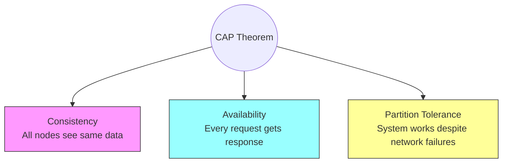
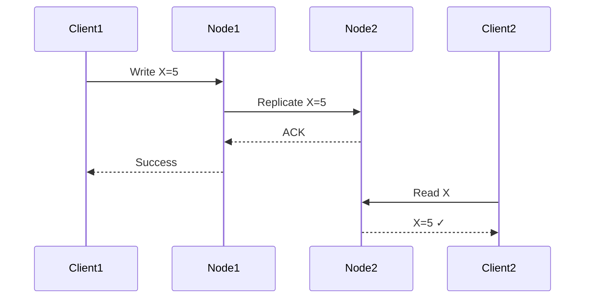
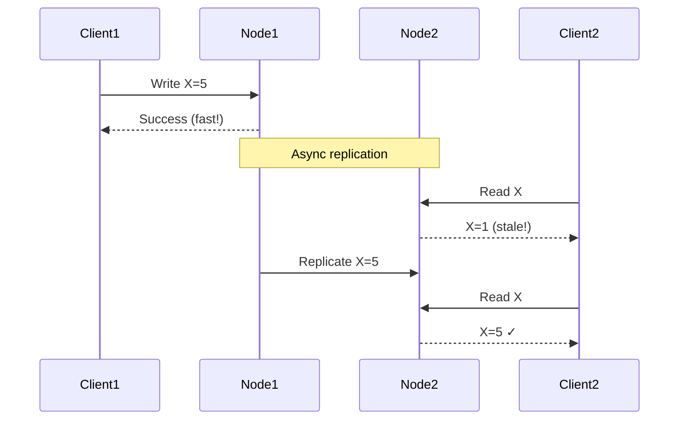
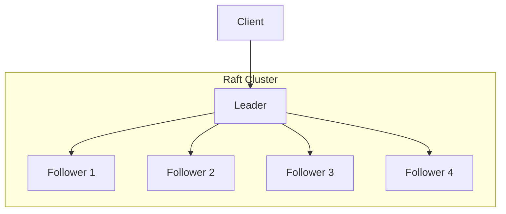

# CAP Theorem & Distributed Consistency

:::info System Design Essential
CAP theorem is asked in **every** system design interview. Understanding the trade-offs is crucial for architectural decisions.
:::

## 1. Understanding CAP Theorem

### The Three Properties

The CAP theorem states that a distributed system can only guarantee **2 out of 3** properties simultaneously:



### Property Definitions

| Property | Definition | Example |
|----------|------------|---------|
| **Consistency** | All nodes return the same, most recent data | After a write, all reads return the new value |
| **Availability** | Every request receives a response | System never refuses to answer |
| **Partition Tolerance** | System continues despite network failures | Network split doesn't crash the system |

### The Reality: P is Mandatory

In distributed systems, network partitions **will** happen. So the real choice is:

```text
CP: Consistency + Partition Tolerance
    → Sacrifice availability during partitions
    → Example: Banking systems, ZooKeeper

AP: Availability + Partition Tolerance  
    → Sacrifice consistency during partitions
    → Example: DNS, Social media feeds

CA: Consistency + Availability
    → Sacrifice partition tolerance
    → Only possible in single-node systems (not distributed)
```

---

## 2. Consistency Models

### Strong Consistency



**After write completes, all reads return the new value.**

- **Use when:** Financial transactions, inventory counts
- **Trade-off:** Higher latency, lower availability
- **Examples:** Traditional RDBMS, Spanner

### Eventual Consistency



**Data will become consistent eventually (maybe seconds to minutes).**

- **Use when:** Social media, product catalogs, DNS
- **Trade-off:** May return stale data temporarily
- **Examples:** DynamoDB, Cassandra, S3

### Read-Your-Writes Consistency

```java
// Problem with eventual consistency
user.updateEmail("new@email.com");  // Write to Node A
showProfile();                       // Read from Node B → shows OLD email!

// Solution: Read-your-writes consistency
// Ensure reads go to the same node that handled the write
// Or wait for replication before returning success
```

---

## 3. Real-World Trade-offs

### Example 1: E-commerce Inventory

```text
Scenario: Black Friday sale, high traffic

Option A (CP - Strong Consistency):
+ Never oversell
- Slow: Every purchase requires global consensus
- May reject purchases during partition

Option B (AP - Eventual Consistency):
+ Fast, handles traffic spike
+ Always available
- Risk of overselling (must handle through backorders/refunds)

Decision: Most e-commerce uses AP with business logic
         to handle edge cases (refunds, waitlists)
```

### Example 2: Banking Transactions

```text
Scenario: Money transfer between accounts

Option A (CP - Strong Consistency):
+ Account balances always accurate
+ Never process same transaction twice
- Slower, may timeout during network issues

Option B (AP):
❌ NOT acceptable - could lose money or duplicate transfers

Decision: Banking systems MUST be CP
         They sacrifice availability for correctness
```

---

## 4. Consensus Algorithms

### Why Consensus?

In CP systems, nodes must agree on the order of operations. This requires consensus algorithms.

### Paxos (Theoretical Foundation)

- Complex to implement
- Used as foundation for other algorithms
- Two phases: Prepare and Accept

### Raft (Practical Alternative)



**Key concepts:**
- **Leader Election:** One node is elected leader
- **Log Replication:** Leader replicates commands to followers
- **Majority Quorum:** Need N/2 + 1 nodes to agree

```text
5 nodes: Need 3 to agree (tolerates 2 failures)
3 nodes: Need 2 to agree (tolerates 1 failure)
```

### Interview Question: Why odd number of nodes?

```text
5 nodes: Majority = 3, can lose 2
4 nodes: Majority = 3, can lose 1

Same fault tolerance, but 5 nodes costs more!
Better: Use 3 or 5 nodes, never 4.
```

---

## 5. Replication Strategies

### Synchronous Replication

```java
// Write only succeeds if ALL replicas confirm
public void write(Data data) {
    primaryNode.write(data);
    replicaA.write(data);  // Wait
    replicaB.write(data);  // Wait
    return SUCCESS;        // All confirmed
}
```

- **Pros:** Strong consistency
- **Cons:** Slow, any replica failure blocks writes

### Asynchronous Replication

```java
// Write succeeds immediately, replicas updated later
public void write(Data data) {
    primaryNode.write(data);
    queue.add(new ReplicationTask(data));  // Async
    return SUCCESS;  // Fast!
}
```

- **Pros:** Fast, high availability
- **Cons:** Risk of data loss if primary fails before replication

### Semi-Synchronous (Quorum)

```java
// Write succeeds if MAJORITY confirm
public void write(Data data) {
    primaryNode.write(data);
    int confirmations = 1;
    
    for (Replica r : replicas) {
        if (r.write(data)) {
            confirmations++;
        }
        if (confirmations >= QUORUM) {
            return SUCCESS;  // Don't wait for all
        }
    }
    throw new WriteFailedException();
}
```

- **Used by:** DynamoDB, Cassandra
- **Configurable:** W (writes) + R (reads) > N (replicas) for consistency

---

## 6. PACELC Theorem

CAP is incomplete. PACELC extends it:

```text
If Partition:
    Choose Availability or Consistency (AC)
Else (normal operation):
    Choose Latency or Consistency (LC)
    
Examples:
- DynamoDB: PA/EL (Availability + Low Latency)
- Cassandra: PA/EL (configurable)
- Spanner: PC/EC (Always Consistent, higher latency)
- MySQL: PC/EC (Single node = consistent)
```

---

## 7. Interview Questions

### Q1: How would you design a distributed counter?

```java
// Problem: Multiple nodes, each counting independently

// Solution 1: Single counter (CP)
// - All increments go to one node
// - Bottleneck, but always accurate

// Solution 2: CRDT Counter (AP)
// - Each node has local counter
// - Periodically sync and merge
// - Eventually consistent but highly available

class GCounter {
    Map<String, Long> counts; // nodeId -> count
    
    void increment() {
        counts.merge(MY_NODE_ID, 1L, Long::sum);
    }
    
    long value() {
        return counts.values().stream().sum();
    }
    
    void merge(GCounter other) {
        for (var entry : other.counts.entrySet()) {
            counts.merge(entry.getKey(), entry.getValue(), Math::max);
        }
    }
}
```

### Q2: Explain split-brain scenario

**Scenario:** Network partition splits cluster in half. Each half thinks **it's** the leader.

```text
Before:  [A - B - C - D - E]  (C is leader)

After:   [A - B - C]  (C is leader)
         [D - E]      (E becomes leader!)

Problem: Two leaders accepting writes = data divergence!
```

**Solutions:**
1. Quorum-based systems (need 3/5 nodes)
2. Witness/third datacenter
3. STONITH (Shoot The Other Node In The Head)

### Q3: What consistency model does your current project use?

**Sample answer:**
> "We use eventual consistency for our product catalog service because it's read-heavy and doesn't require real-time accuracy. However, our order processing system uses strong consistency with PostgreSQL because we can't risk double-charging customers or overselling inventory."

---

## Quick Reference

```text
CAP Theorem:
- Pick 2 of 3 (Consistency, Availability, Partition Tolerance)
- Reality: Must tolerate partitions, so choose C or A

Consistency Models:
- Strong: Always current data, higher latency
- Eventual: May be stale, highly available
- Read-your-writes: See your own changes

Consensus Algorithms:
- Paxos: Theoretical foundation
- Raft: Practical, widely used
- Need N/2+1 nodes for consensus

Replication:
- Sync: Strong, slow
- Async: Fast, risk of data loss
- Quorum: Balanced (W + R > N)

PACELC: Partition→AC or Else→LC
```

---

**Next:** [Distributed Transactions →](./03-distributed-transactions)
