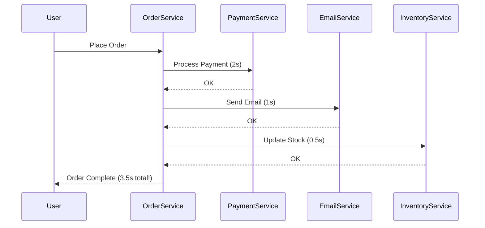
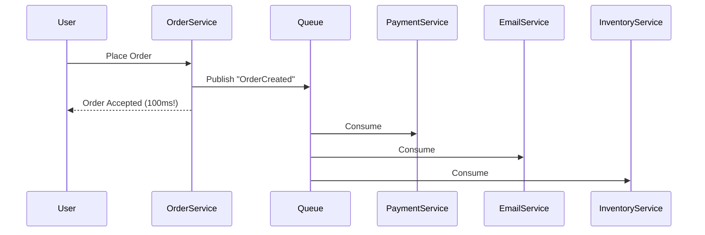
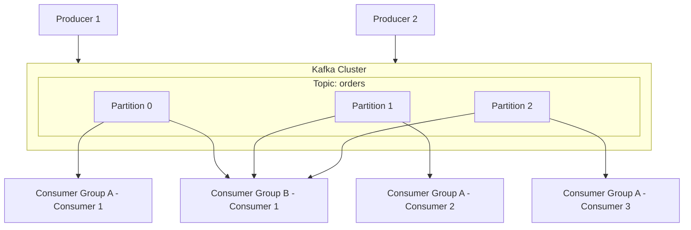

# Kafka & Message Queue Patterns

:::info System Design Essential
Message queues enable **asynchronous, decoupled architectures** — essential knowledge for microservices and high-scale systems.
:::

## 1. Why Message Queues?

### The Problem: Synchronous Coupling



**Problems:**
- User waits 3.5 seconds
- If email service is down, order fails
- All services tightly coupled

### The Solution: Async with Message Queue



**Benefits:**
- User gets instant response
- Services are decoupled
- If email fails, order still completes
- Can retry failed messages

---

## 2. Messaging Patterns

### Point-to-Point (Queue)

One message → One consumer

```text
Producer → [Queue] → Consumer A
                    → Consumer B (gets next message)
                    → Consumer C (gets next message)
                    
Each message procesed by exactly ONE consumer
Use for: Task distribution, work queues
```

### Publish-Subscribe (Topics)

One message → ALL subscribers

```text
Producer → [Topic] → Consumer A (gets copy)
                   → Consumer B (gets copy)
                   → Consumer C (gets copy)
                   
Every subscriber gets every message
Use for: Events, notifications, logs
```

### Competing Consumers

Multiple consumers process from same queue for scaling.

```text
Producer → [Queue] → Consumer A ─┐
                   → Consumer B ─┼→ Parallel processing
                   → Consumer C ─┘
```

---

## 3. Apache Kafka Deep Dive

### Architecture



### Key Concepts

| Concept | Description |
|---------|-------------|
| **Topic** | A category/feed of messages |
| **Partition** | Subdivision of topic for parallelism |
| **Offset** | Position of message in partition |
| **Consumer Group** | Set of consumers sharing the work |
| **Broker** | Kafka server node |

### Partitioning Strategy

```java
// Messages with same key go to same partition
producer.send(new ProducerRecord<>("orders", 
    orderId,     // Key - determines partition
    orderJson    // Value
));

// Key = null → Round-robin distribution
// Key = userId → All orders from same user in same partition
//                (preserves order per user)
```

### Consumer Groups

```text
Topic with 6 partitions + Consumer Group with 3 consumers:

Partition 0 ─┐
Partition 1 ─┤ → Consumer 1
             
Partition 2 ─┐
Partition 3 ─┤ → Consumer 2
             
Partition 4 ─┐
Partition 5 ─┤ → Consumer 3

Each partition consumed by exactly ONE consumer in the group
Add more consumers → rebalance (up to number of partitions)
```

---

## 4. Kafka Producer Patterns

### Basic Producer

```java
Properties props = new Properties();
props.put("bootstrap.servers", "localhost:9092");
props.put("key.serializer", "org.apache.kafka.common.serialization.StringSerializer");
props.put("value.serializer", "org.apache.kafka.common.serialization.StringSerializer");

try (Producer<String, String> producer = new KafkaProducer<>(props)) {
    ProducerRecord<String, String> record = 
        new ProducerRecord<>("orders", orderId, orderJson);
    
    // Async send with callback
    producer.send(record, (metadata, exception) -> {
        if (exception != null) {
            log.error("Send failed", exception);
        } else {
            log.info("Sent to partition {} offset {}", 
                metadata.partition(), metadata.offset());
        }
    });
}
```

### Delivery Guarantees

```java
// At-most-once (may lose messages)
props.put("acks", "0");  // Don't wait for acknowledgment

// At-least-once (may duplicate)
props.put("acks", "1");  // Wait for leader acknowledgment
// Or
props.put("acks", "all"); // Wait for all replicas

// Exactly-once (Kafka 0.11+)
props.put("enable.idempotence", "true");
props.put("acks", "all");
```

---

## 5. Kafka Consumer Patterns

### Basic Consumer

```java
Properties props = new Properties();
props.put("bootstrap.servers", "localhost:9092");
props.put("group.id", "order-processing-group");
props.put("key.deserializer", StringDeserializer.class.getName());
props.put("value.deserializer", StringDeserializer.class.getName());

try (Consumer<String, String> consumer = new KafkaConsumer<>(props)) {
    consumer.subscribe(Collections.singletonList("orders"));
    
    while (true) {
        ConsumerRecords<String, String> records = 
            consumer.poll(Duration.ofMillis(100));
        
        for (ConsumerRecord<String, String> record : records) {
            processOrder(record.value());
        }
        
        consumer.commitAsync();  // Commit offset
    }
}
```

### Commit Strategies

```java
// Auto-commit (dangerous - may lose messages)
props.put("enable.auto.commit", "true");
props.put("auto.commit.interval.ms", "1000");

// Manual commit (recommended)
props.put("enable.auto.commit", "false");

// Commit after processing
for (ConsumerRecord<String, String> record : records) {
    processOrder(record.value());
}
consumer.commitSync();  // Only commit after successful processing

// Commit per message (slow but safe)
for (ConsumerRecord<String, String> record : records) {
    processOrder(record.value());
    consumer.commitSync(Collections.singletonMap(
        new TopicPartition(record.topic(), record.partition()),
        new OffsetAndMetadata(record.offset() + 1)
    ));
}
```

---

## 6. Spring Kafka Integration

### Configuration

```yaml
# application.yml
spring:
  kafka:
    bootstrap-servers: localhost:9092
    producer:
      key-serializer: org.apache.kafka.common.serialization.StringSerializer
      value-serializer: org.springframework.kafka.support.serializer.JsonSerializer
    consumer:
      group-id: order-service
      auto-offset-reset: earliest
```

### Producer

```java
@Service
public class OrderEventPublisher {
    
    @Autowired
    private KafkaTemplate<String, OrderEvent> kafkaTemplate;
    
    public void publishOrderCreated(Order order) {
        OrderEvent event = new OrderEvent("ORDER_CREATED", order);
        
        kafkaTemplate.send("order-events", order.getId(), event)
            .addCallback(
                result -> log.info("Sent: {}", event),
                ex -> log.error("Failed to send", ex)
            );
    }
}
```

### Consumer

```java
@Service
public class OrderEventListener {
    
    @KafkaListener(topics = "order-events", groupId = "inventory-service")
    public void handleOrderEvent(OrderEvent event) {
        switch (event.getType()) {
            case "ORDER_CREATED":
                inventoryService.reserve(event.getOrder().getItems());
                break;
            case "ORDER_CANCELLED":
                inventoryService.release(event.getOrder().getItems());
                break;
        }
    }
    
    // With manual acknowledgment
    @KafkaListener(topics = "order-events", groupId = "payment-service")
    public void handlePayment(OrderEvent event, Acknowledgment ack) {
        try {
            paymentService.process(event.getOrder());
            ack.acknowledge();  // Only ack after success
        } catch (Exception e) {
            // Don't ack - message will be redelivered
            throw e;
        }
    }
}
```

---

## 7. Handling Failures

### Dead Letter Queue (DLQ)

```java
@Bean
public ConcurrentKafkaListenerContainerFactory<String, String> kafkaListenerFactory() {
    ConcurrentKafkaListenerContainerFactory<String, String> factory = 
        new ConcurrentKafkaListenerContainerFactory<>();
    factory.setConsumerFactory(consumerFactory());
    
    // Configure error handler with DLQ
    factory.setCommonErrorHandler(new DefaultErrorHandler(
        new DeadLetterPublishingRecoverer(kafkaTemplate,
            (record, ex) -> new TopicPartition(record.topic() + ".DLQ", record.partition())),
        new FixedBackOff(1000L, 3)  // 3 retries with 1s delay
    ));
    
    return factory;
}
```

### Retry Pattern

```java
@RetryableTopic(
    attempts = "3",
    backoff = @Backoff(delay = 1000, multiplier = 2),
    dltTopicSuffix = ".DLQ"
)
@KafkaListener(topics = "orders")
public void processOrder(Order order) {
    // Will retry 3 times with exponential backoff
    // After failures, sends to orders.DLQ
    orderService.process(order);
}
```

---

## 8. Kafka vs RabbitMQ

| Aspect | Kafka | RabbitMQ |
|--------|-------|----------|
| **Model** | Distributed log | Message broker |
| **Persistence** | All messages persisted | Configurable |
| **Ordering** | Per partition | Per queue |
| **Throughput** | Very high (millions/sec) | High (100K/sec) |
| **Use Case** | Event streaming, logs | Task queues, RPC |
| **Message Replay** | Yes (offset-based) | No (consumed = gone) |
| **Complexity** | Higher | Lower |

### When to Use What

```text
Use Kafka when:
- Event sourcing / event streaming
- High throughput needed
- Need to replay messages
- Multiple consumers need same messages
- Log aggregation

Use RabbitMQ when:
- Traditional job queues
- Complex routing needed
- Lower latency required
- Simpler setup preferred
- Request/reply patterns
```

---

## 9. Interview Questions

### Q1: How do you ensure message ordering?

**Answer:**
> "Kafka guarantees ordering within a partition. To ensure ordered processing for related messages (like all orders from same user), I use the same key for those messages, which routes them to the same partition. At the consumer side, each partition is consumed by exactly one consumer in a group."

### Q2: How do you handle duplicate messages?

**Answer:**
> "I design consumers to be **idempotent**. This means processing the same message twice has the same effect as processing it once. I achieve this by:
> 1. Using unique message IDs and tracking processed IDs
> 2. Using database constraints (unique keys)
> 3. Using conditional updates (UPDATE ... WHERE version = x)"

```java
@Transactional
public void processOrder(OrderEvent event) {
    // Idempotent: Check if already processed
    if (processedEventRepository.exists(event.getId())) {
        log.info("Already processed: {}", event.getId());
        return;
    }
    
    // Process and record
    orderService.process(event);
    processedEventRepository.save(event.getId());
}
```

### Q3: What happens when a consumer dies?

**Answer:**
> "Kafka handles this through consumer group rebalancing. When a consumer leaves (crash or graceful shutdown), its partitions are reassigned to remaining consumers. The new consumer continues from the last committed offset. Messages that weren't committed will be reprocessed, which is why idempotent consumers are important."

---

## Quick Reference

```text
Kafka Concepts:
- Topic: Category of messages
- Partition: Parallel unit (ordering within)
- Consumer Group: Consumers sharing partitions
- Offset: Position in partition

Delivery Semantics:
- At-most-once: acks=0 (may lose)
- At-least-once: acks=1 or all (may duplicate)
- Exactly-once: enable.idempotence=true

Patterns:
- Point-to-point: Queue (one consumer)
- Pub-sub: Topic (all subscribers)
- Competing consumers: Multiple consumers on queue

Best Practices:
- Use keys for ordering related messages
- Make consumers idempotent
- Use manual commits after processing
- Configure DLQ for failed messages
```

---

**Next:** [Microservices Patterns →](../11-microservices-architecture/01-intro)
