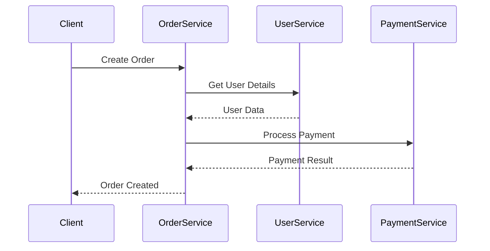
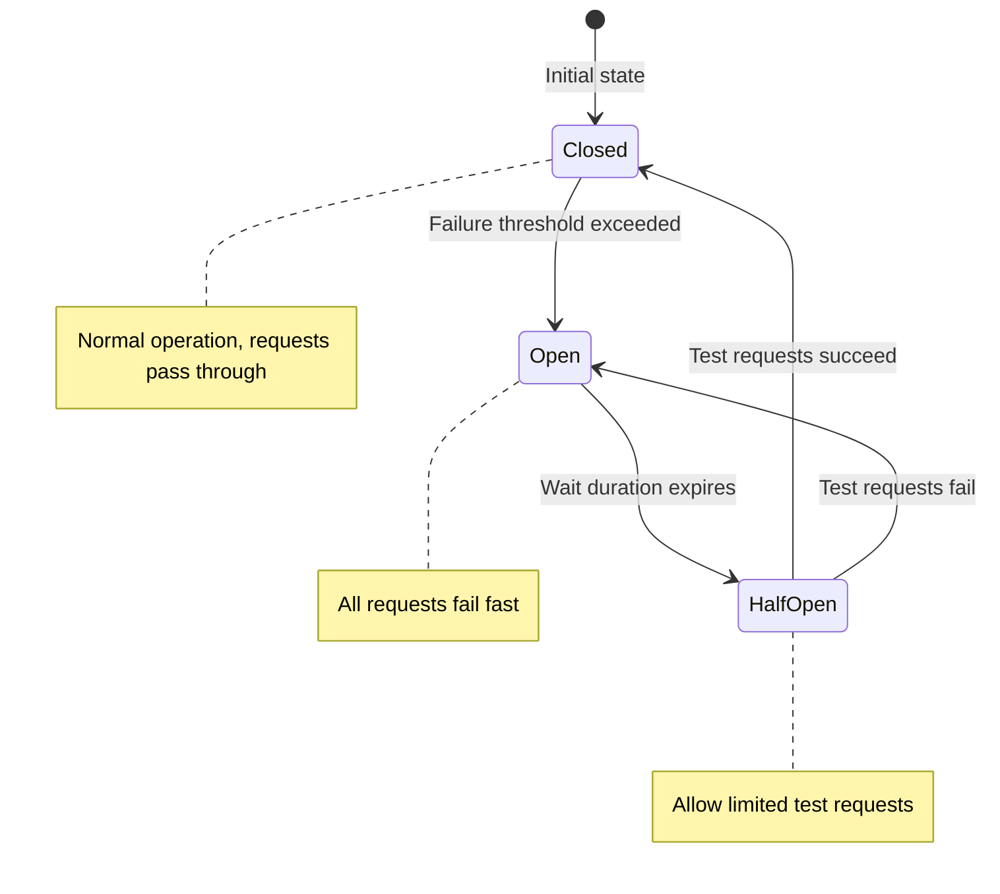

# Core Microservices Patterns

:::info Architecture Essential
These patterns are asked in **every senior backend interview**. Know when and why to use each.
:::

## 1. Service Communication

### Synchronous Communication



```java
// Option 1: RestTemplate (Legacy)
User user = restTemplate.getForObject(
    "http://user-service/users/{id}", User.class, userId);

// Option 2: WebClient (Reactive, Preferred)
User user = webClient.get()
    .uri("http://user-service/users/{id}", userId)
    .retrieve()
    .bodyToMono(User.class)
    .timeout(Duration.ofSeconds(5))
    .block();

// Option 3: Feign Client (Declarative, Best for Spring)
@FeignClient(name = "user-service", fallback = UserClientFallback.class)
public interface UserClient {
    
    @GetMapping("/users/{id}")
    User getUser(@PathVariable Long id);
    
    @PostMapping("/users")
    User createUser(@RequestBody CreateUserRequest request);
}

@Component
public class UserClientFallback implements UserClient {
    public User getUser(Long id) {
        return User.builder().id(id).name("Unknown").build();
    }
    public User createUser(CreateUserRequest req) {
        throw new ServiceUnavailableException("User service unavailable");
    }
}
```

### Asynchronous Communication

```java
// Event Producer (Order Service)
@Service
public class OrderService {
    
    @Autowired
    private KafkaTemplate<String, OrderEvent> kafka;
    
    @Transactional
    public Order createOrder(CreateOrderRequest request) {
        Order order = orderRepository.save(new Order(request));
        
        // Publish event - other services react
        kafka.send("order-events", order.getId().toString(),
            new OrderCreatedEvent(order));
        
        return order;
    }
}

// Event Consumer (Notification Service)
@Service
public class NotificationService {
    
    @KafkaListener(topics = "order-events", groupId = "notifications")
    public void handleOrderEvent(OrderEvent event) {
        if (event instanceof OrderCreatedEvent created) {
            sendConfirmationEmail(created.getOrder());
        }
    }
}
```

### When to Use Each

| Synchronous (REST/gRPC) | Asynchronous (Events) |
|------------------------|----------------------|
| Need immediate response | Fire-and-forget OK |
| Simple request-response | Long-running processes |
| Strong consistency needed | Eventual consistency OK |
| Low latency required | High throughput needed |
| Few downstream calls | Many subscribers |

---

## 2. API Gateway Pattern

### Responsibilities

```text
┌─────────────────────────────────────────────────────────────────────┐
│                         API GATEWAY                                  │
├─────────────────────────────────────────────────────────────────────┤
│                                                                      │
│   Client Request                                                     │
│        │                                                             │
│        ▼                                                             │
│   ┌─────────────────────────────────────────────────────────────┐   │
│   │  1. AUTHENTICATION                                          │   │
│   │     ├── Validate JWT/OAuth tokens                           │   │
│   │     └── Extract user context                                │   │
│   ├─────────────────────────────────────────────────────────────┤   │
│   │  2. RATE LIMITING                                           │   │
│   │     ├── Per-user limits (100 req/min)                       │   │
│   │     └── Per-IP limits (1000 req/min)                        │   │
│   ├─────────────────────────────────────────────────────────────┤   │
│   │  3. ROUTING                                                 │   │
│   │     ├── /api/users/** → user-service                        │   │
│   │     ├── /api/orders/** → order-service                      │   │
│   │     └── /api/products/** → product-service                  │   │
│   ├─────────────────────────────────────────────────────────────┤   │
│   │  4. LOAD BALANCING                                          │   │
│   │     └── Round-robin across service instances                │   │
│   ├─────────────────────────────────────────────────────────────┤   │
│   │  5. CIRCUIT BREAKER                                         │   │
│   │     └── Fallback if service unavailable                     │   │
│   ├─────────────────────────────────────────────────────────────┤   │
│   │  6. RESPONSE TRANSFORMATION                                 │   │
│   │     └── Aggregate responses, filter fields                  │   │
│   └─────────────────────────────────────────────────────────────┘   │
│                                                                      │
└─────────────────────────────────────────────────────────────────────┘
```

### Spring Cloud Gateway Implementation

```java
@Configuration
public class GatewayConfig {
    
    @Bean
    public RouteLocator routes(RouteLocatorBuilder builder) {
        return builder.routes()
            // User Service Route
            .route("user-service", r -> r
                .path("/api/users/**")
                .filters(f -> f
                    .stripPrefix(1)
                    .addRequestHeader("X-Request-Source", "gateway")
                    .retry(config -> config
                        .setRetries(3)
                        .setBackoff(Duration.ofMillis(100), 
                                   Duration.ofSeconds(1), 2, true)))
                .uri("lb://user-service"))
            
            // Order Service with Circuit Breaker
            .route("order-service", r -> r
                .path("/api/orders/**")
                .filters(f -> f
                    .stripPrefix(1)
                    .circuitBreaker(c -> c
                        .setName("orderCircuitBreaker")
                        .setFallbackUri("forward:/fallback/orders")))
                .uri("lb://order-service"))
            
            // Rate Limiting
            .route("product-service", r -> r
                .path("/api/products/**")
                .filters(f -> f
                    .stripPrefix(1)
                    .requestRateLimiter(c -> c
                        .setRateLimiter(redisRateLimiter())
                        .setKeyResolver(userKeyResolver())))
                .uri("lb://product-service"))
            .build();
    }
    
    @Bean
    public RedisRateLimiter redisRateLimiter() {
        return new RedisRateLimiter(100, 200);  // 100 req/sec, burst 200
    }
    
    @Bean
    public KeyResolver userKeyResolver() {
        return exchange -> Mono.just(
            exchange.getRequest().getHeaders()
                .getFirst("X-User-Id") != null
                    ? exchange.getRequest().getHeaders().getFirst("X-User-Id")
                    : exchange.getRequest().getRemoteAddress().getHostString()
        );
    }
}

@RestController
public class FallbackController {
    
    @GetMapping("/fallback/orders")
    public ResponseEntity<Map<String, String>> ordersFallback() {
        return ResponseEntity.status(HttpStatus.SERVICE_UNAVAILABLE)
            .body(Map.of(
                "message", "Order service is temporarily unavailable",
                "status", "DEGRADED"
            ));
    }
}
```

### Backend for Frontend (BFF) Pattern

```text
┌─────────────────────────────────────────────────────────────────────┐
│                     BFF PATTERN                                      │
├─────────────────────────────────────────────────────────────────────┤
│                                                                      │
│   ┌─────────┐     ┌─────────┐     ┌─────────┐                       │
│   │  Web    │     │ Mobile  │     │  Admin  │                       │
│   │  App    │     │   App   │     │  Portal │                       │
│   └────┬────┘     └────┬────┘     └────┬────┘                       │
│        │               │               │                             │
│        ▼               ▼               ▼                             │
│   ┌─────────┐     ┌─────────┐     ┌─────────┐                       │
│   │Web BFF  │     │Mobile   │     │Admin BFF│                       │
│   │(Full    │     │BFF      │     │(All     │                       │
│   │ data)   │     │(Minimal)│     │ fields) │                       │
│   └────┬────┘     └────┬────┘     └────┬────┘                       │
│        │               │               │                             │
│        └───────────────┼───────────────┘                             │
│                        │                                             │
│                        ▼                                             │
│              ┌─────────────────┐                                     │
│              │   Microservices │                                     │
│              └─────────────────┘                                     │
│                                                                      │
│   Why BFF?                                                           │
│   ├── Different data needs per client                               │
│   ├── Mobile needs minimal data (bandwidth)                         │
│   ├── Web can handle rich responses                                 │
│   └── Admin needs all fields                                        │
│                                                                      │
└─────────────────────────────────────────────────────────────────────┘
```

---

## 3. Circuit Breaker Pattern

### The Problem: Cascade Failures

```text
Without Circuit Breaker:
┌─────────┐     ┌─────────┐     ┌─────────┐
│Service A│────►│Service B│────►│Service C│ (DOWN!)
└─────────┘     └─────────┘     └─────────┘
     │               │               │
     │          Timeout...       Timeout...
     │               │               │
     ▼               ▼               ▼
  Thread           Thread          Thread
  blocked          blocked         blocked
     │               │
     ▼               ▼
  All threads exhausted → Service A fails → Cascade!
```

### Circuit Breaker States



### Resilience4j Implementation

```java
// Configuration
@Configuration
public class ResilienceConfig {
    
    @Bean
    public CircuitBreakerConfig circuitBreakerConfig() {
        return CircuitBreakerConfig.custom()
            .failureRateThreshold(50)              // Open at 50% failures
            .slowCallRateThreshold(80)             // Slow = over 2 seconds
            .slowCallDurationThreshold(Duration.ofSeconds(2))
            .waitDurationInOpenState(Duration.ofSeconds(30))
            .permittedNumberOfCallsInHalfOpenState(5)
            .slidingWindowType(SlidingWindowType.COUNT_BASED)
            .slidingWindowSize(10)
            .minimumNumberOfCalls(5)
            .build();
    }
    
    @Bean
    public RetryConfig retryConfig() {
        return RetryConfig.custom()
            .maxAttempts(3)
            .waitDuration(Duration.ofMillis(500))
            .exponentialBackoffMultiplier(2)       // 500ms, 1s, 2s
            .retryExceptions(IOException.class, TimeoutException.class)
            .ignoreExceptions(BusinessException.class)
            .build();
    }
    
    @Bean
    public TimeLimiterConfig timeLimiterConfig() {
        return TimeLimiterConfig.custom()
            .timeoutDuration(Duration.ofSeconds(3))
            .build();
    }
}

// Service with all resilience patterns
@Service
public class PaymentService {
    
    private final PaymentGateway gateway;
    
    @CircuitBreaker(name = "payment", fallbackMethod = "paymentFallback")
    @Retry(name = "payment")
    @TimeLimiter(name = "payment")
    @Bulkhead(name = "payment")
    public CompletableFuture<PaymentResult> processPayment(Payment payment) {
        return CompletableFuture.supplyAsync(() -> 
            gateway.charge(payment)
        );
    }
    
    public CompletableFuture<PaymentResult> paymentFallback(
            Payment payment, Exception e) {
        log.warn("Payment fallback triggered for {}: {}", 
            payment.getId(), e.getMessage());
        
        // Queue for retry later
        pendingPaymentQueue.add(payment);
        
        return CompletableFuture.completedFuture(
            PaymentResult.pending("Payment queued for processing")
        );
    }
}
```

### Bulkhead Pattern

```java
// Limit concurrent calls to isolate failures
@Bulkhead(name = "userService", type = Bulkhead.Type.SEMAPHORE)
public User getUser(Long userId) {
    return userClient.getUser(userId);
}

// Configuration: application.yml
resilience4j:
  bulkhead:
    instances:
      userService:
        maxConcurrentCalls: 25      # Max 25 concurrent calls
        maxWaitDuration: 500ms      # Wait max 500ms for permit
  thread-pool-bulkhead:
    instances:
      paymentService:
        maxThreadPoolSize: 10       # Dedicated thread pool
        coreThreadPoolSize: 5
        queueCapacity: 50
```

---

## 4. Saga Pattern

### When to Use Saga

```text
Problem: Order requires multiple service transactions
┌─────────────────────────────────────────────────────────────────────┐
│  1. Order Service    → Create order record                          │
│  2. Payment Service  → Charge customer                              │
│  3. Inventory Service → Reserve items                               │
│  4. Shipping Service → Schedule delivery                            │
│                                                                      │
│  What if step 3 fails?                                              │
│  ├── Need to refund payment (step 2)                                │
│  ├── Need to cancel order (step 1)                                  │
│  └── 2PC is too slow and locks resources                           │
│                                                                      │
│  Solution: Saga with compensating transactions                      │
└─────────────────────────────────────────────────────────────────────┘
```

### Choreography-Based Saga

Each service listens to events and publishes its own events:

```java
// Order Service - Starts the saga
@Service
public class OrderService {
    
    @Transactional
    public Order createOrder(CreateOrderRequest request) {
        Order order = orderRepository.save(new Order(request));
        order.setStatus(OrderStatus.PENDING);
        
        // Publish event - Payment service will pick this up
        eventPublisher.publish(new OrderCreatedEvent(order));
        return order;
    }
    
    @KafkaListener(topics = "payment-events")
    public void handlePaymentEvents(PaymentEvent event) {
        if (event instanceof PaymentFailedEvent failed) {
            // Compensate: Cancel order
            Order order = orderRepository.findById(failed.getOrderId());
            order.setStatus(OrderStatus.CANCELLED);
            orderRepository.save(order);
        }
    }
}

// Payment Service
@Service
public class PaymentService {
    
    @KafkaListener(topics = "order-events")
    public void handleOrderEvents(OrderEvent event) {
        if (event instanceof OrderCreatedEvent created) {
            try {
                Payment payment = processPayment(created.getOrder());
                eventPublisher.publish(new PaymentCompletedEvent(
                    created.getOrderId(), payment));
            } catch (Exception e) {
                eventPublisher.publish(new PaymentFailedEvent(
                    created.getOrderId(), e.getMessage()));
            }
        }
    }
    
    @KafkaListener(topics = "inventory-events")
    public void handleInventoryEvents(InventoryEvent event) {
        if (event instanceof ReservationFailedEvent failed) {
            // Compensate: Refund payment
            refundPayment(failed.getOrderId());
            eventPublisher.publish(new PaymentRefundedEvent(failed.getOrderId()));
        }
    }
}

// Inventory Service
@Service
public class InventoryService {
    
    @KafkaListener(topics = "payment-events")
    public void handlePaymentEvents(PaymentEvent event) {
        if (event instanceof PaymentCompletedEvent completed) {
            try {
                reserveItems(completed.getOrderId());
                eventPublisher.publish(new ReservationCompletedEvent(
                    completed.getOrderId()));
            } catch (InsufficientInventoryException e) {
                eventPublisher.publish(new ReservationFailedEvent(
                    completed.getOrderId(), e.getMessage()));
            }
        }
    }
}
```

### Orchestration-Based Saga

Central orchestrator controls the flow:

```java
@Service
public class OrderSagaOrchestrator {
    
    @Autowired private OrderService orderService;
    @Autowired private PaymentClient paymentClient;
    @Autowired private InventoryClient inventoryClient;
    @Autowired private ShippingClient shippingClient;
    
    public Order executeSaga(CreateOrderRequest request) {
        SagaContext ctx = new SagaContext();
        
        try {
            // Step 1: Create Order
            Order order = orderService.create(request);
            ctx.setOrderId(order.getId());
            ctx.addCompensation(() -> orderService.cancel(order.getId()));
            
            // Step 2: Process Payment
            Payment payment = paymentClient.charge(
                order.getCustomerId(), order.getTotal());
            ctx.setPaymentId(payment.getId());
            ctx.addCompensation(() -> paymentClient.refund(payment.getId()));
            
            // Step 3: Reserve Inventory
            Reservation reservation = inventoryClient.reserve(order.getItems());
            ctx.setReservationId(reservation.getId());
            ctx.addCompensation(() -> inventoryClient.release(reservation.getId()));
            
            // Step 4: Schedule Shipping
            Shipment shipment = shippingClient.schedule(order);
            ctx.setShipmentId(shipment.getId());
            
            // All succeeded - confirm order
            order.setStatus(OrderStatus.CONFIRMED);
            return orderService.save(order);
            
        } catch (Exception e) {
            log.error("Saga failed, compensating: {}", e.getMessage());
            ctx.compensate();  // Execute compensations in reverse order
            throw new SagaFailedException("Order creation failed", e);
        }
    }
}

@Data
public class SagaContext {
    private Long orderId;
    private Long paymentId;
    private Long reservationId;
    private Long shipmentId;
    
    private final Deque<Runnable> compensations = new ArrayDeque<>();
    
    public void addCompensation(Runnable compensation) {
        compensations.push(compensation);  // LIFO order
    }
    
    public void compensate() {
        while (!compensations.isEmpty()) {
            try {
                compensations.pop().run();
            } catch (Exception e) {
                log.error("Compensation failed: {}", e.getMessage());
                // Log for manual intervention
            }
        }
    }
}
```

### Choreography vs Orchestration

| Aspect | Choreography | Orchestration |
|--------|--------------|---------------|
| **Control** | Decentralized | Centralized |
| **Coupling** | Loose | Tighter |
| **Complexity** | Harder to trace | Easy to understand |
| **Single Point of Failure** | No | Orchestrator |
| **Best For** | Simple flows | Complex flows |

---

## 5. Service Discovery

### Client-Side Discovery (Eureka)

```java
// Eureka Server
@SpringBootApplication
@EnableEurekaServer
public class EurekaServerApplication { }

// Service Registration (automatic with dependency)
// application.yml
spring:
  application:
    name: order-service
eureka:
  client:
    serviceUrl:
      defaultZone: http://eureka:8761/eureka/
  instance:
    preferIpAddress: true

// Service Discovery
@FeignClient(name = "user-service")  // Uses service name, not URL!
public interface UserClient {
    @GetMapping("/users/{id}")
    User getUser(@PathVariable Long id);
}

// Or with DiscoveryClient
@Service
public class DynamicServiceCaller {
    
    @Autowired
    private DiscoveryClient discoveryClient;
    
    @Autowired
    private RestTemplate restTemplate;
    
    public User getUser(Long userId) {
        List<ServiceInstance> instances = 
            discoveryClient.getInstances("user-service");
        
        if (instances.isEmpty()) {
            throw new ServiceNotFoundException("user-service not found");
        }
        
        // Simple round-robin
        ServiceInstance instance = instances.get(
            counter.getAndIncrement() % instances.size());
        
        String url = instance.getUri() + "/users/" + userId;
        return restTemplate.getForObject(url, User.class);
    }
}
```

### Server-Side Discovery (Kubernetes)

```yaml
# Kubernetes Service - built-in service discovery
apiVersion: v1
kind: Service
metadata:
  name: user-service
spec:
  selector:
    app: user-service
  ports:
    - port: 80
      targetPort: 8080
  type: ClusterIP

---
# Deployment
apiVersion: apps/v1
kind: Deployment
metadata:
  name: user-service
spec:
  replicas: 3
  selector:
    matchLabels:
      app: user-service
  template:
    metadata:
      labels:
        app: user-service
    spec:
      containers:
        - name: user-service
          image: user-service:latest
          ports:
            - containerPort: 8080
          readinessProbe:
            httpGet:
              path: /actuator/health/readiness
              port: 8080
            initialDelaySeconds: 10
            periodSeconds: 5
          livenessProbe:
            httpGet:
              path: /actuator/health/liveness
              port: 8080
            initialDelaySeconds: 30
            periodSeconds: 10
```

```java
// In Kubernetes, just use service name
@FeignClient(name = "user-service", url = "http://user-service")
public interface UserClient {
    @GetMapping("/users/{id}")
    User getUser(@PathVariable Long id);
}
```

---

## 6. Interview Questions

### Q1: How do you handle distributed transactions?

```text
Answer:
"I avoid 2PC due to its blocking nature and instead use the Saga pattern.

For simple flows: CHOREOGRAPHY
- Each service publishes events after completing its transaction
- Other services listen and react
- Compensating events for rollback

For complex flows: ORCHESTRATION  
- Central orchestrator controls the flow
- Easier to track saga state
- Simpler compensations

Example: Order creation
1. OrderService creates order → publishes OrderCreated
2. PaymentService charges → publishes PaymentCompleted
3. InventoryService reserves → publishes ItemsReserved

If step 3 fails:
- Publishes ReservationFailed
- PaymentService listens, refunds → PaymentRefunded
- OrderService listens, cancels order

I also use idempotency keys to handle duplicate events safely."
```

### Q2: How do you prevent cascade failures?

```text
Answer:
"I implement multiple resilience patterns:

1. CIRCUIT BREAKER (Resilience4j):
   - Track failure rate over sliding window
   - Open circuit at 50% failure rate
   - Fast-fail without waiting for timeout
   - Try half-open after 30 seconds

2. TIMEOUT:
   - Never wait forever (3 seconds max)
   - Use CompletableFuture with timeout

3. RETRY WITH BACKOFF:
   - Retry transient failures
   - Exponential backoff: 500ms, 1s, 2s
   - Max 3 retries
   - Don't retry non-transient errors

4. BULKHEAD:
   - Limit concurrent calls (25 per service)
   - Isolate thread pools
   - One service failure doesn't exhaust threads

5. FALLBACK:
   - Return cached data
   - Return default response
   - Queue for later processing"
```

### Q3: When would you NOT use microservices?

```text
Answer:
"Microservices aren't always the right choice:

DON'T USE when:
├── Small team (under 5 developers)
├── Simple domain with unclear boundaries
├── Tight deadline (monolith is faster to build)
├── No DevOps maturity (CI/CD, monitoring)
├── Low traffic (complexity not justified)
└── Constant cross-service transactions needed

START WITH MONOLITH when:
├── Exploring new domain
├── Team is learning the business
├── MVP or prototype phase

MIGRATE TO MICROSERVICES when:
├── Team grows beyond 10
├── Need independent scaling
├── Clear bounded contexts emerge
├── Different tech stacks needed
└── Deployment bottlenecks appear

I use the 'Strangler Fig' pattern for migration -
gradually extract services from the monolith."
```

---

## Quick Reference Card

```text
┌──────────────────────────────────────────────────────────────────────┐
│              MICROSERVICES PATTERNS CHEAT SHEET                      │
├──────────────────────────────────────────────────────────────────────┤
│                                                                       │
│ COMMUNICATION:                                                        │
│   Sync (REST/gRPC)   Immediate response, tight coupling              │
│   Async (Events)     Fire-and-forget, loose coupling                 │
│                                                                       │
│ API GATEWAY:                                                          │
│   ├── Authentication, Rate limiting                                  │
│   ├── Routing, Load balancing                                        │
│   └── Circuit breaker, Response aggregation                          │
│                                                                       │
│ CIRCUIT BREAKER STATES:                                               │
│   Closed     → Normal operation                                      │
│   Open       → Fast-fail all requests                                │
│   Half-Open  → Test with limited requests                            │
│                                                                       │
│ RESILIENCE4J CONFIG:                                                  │
│   failureRateThreshold: 50%                                          │
│   waitDurationInOpenState: 30s                                       │
│   slidingWindowSize: 10                                              │
│                                                                       │
│ SAGA PATTERN:                                                         │
│   Choreography  → Decentralized, events                              │
│   Orchestration → Centralized controller                             │
│   Compensation  → Undo in reverse order                              │
│                                                                       │
│ SERVICE DISCOVERY:                                                    │
│   Client-side   → Eureka, Consul                                     │
│   Server-side   → Kubernetes DNS                                     │
│                                                                       │
│ WHEN TO USE MICROSERVICES:                                            │
│   ✅ Large team (10+), clear domains, independent scaling            │
│   ❌ Small team, unclear domain, no DevOps maturity                  │
│                                                                       │
└──────────────────────────────────────────────────────────────────────┘
```

---

**Next:** [3. Service Mesh & Observability →](./service-mesh-observability)
