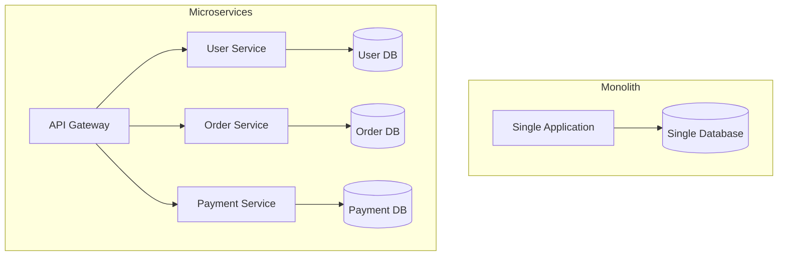
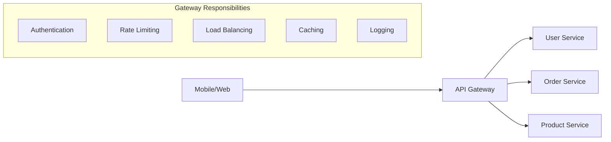
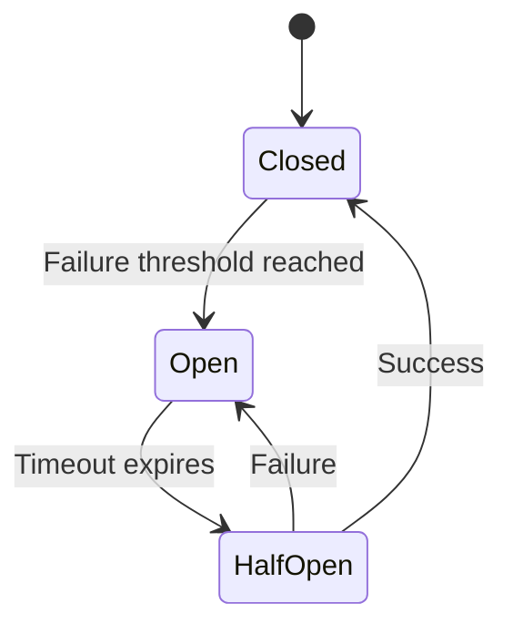
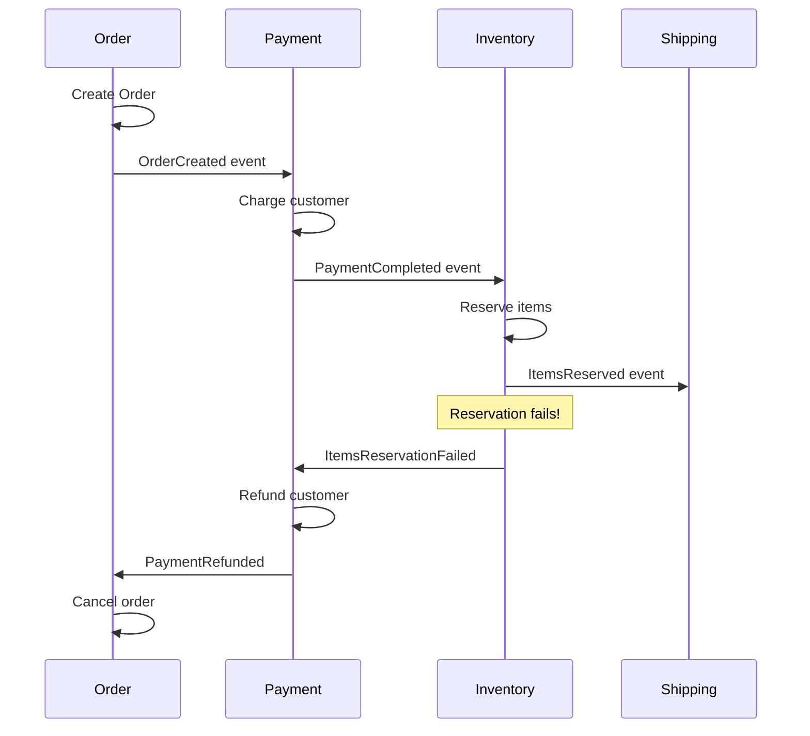
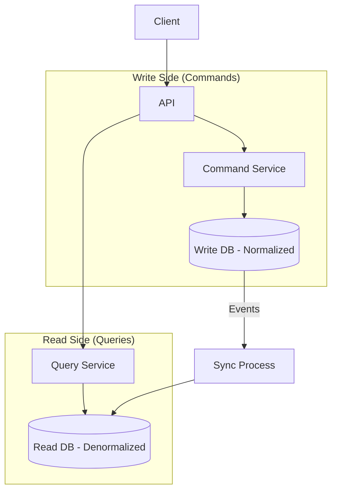

# Microservices Patterns & Best Practices

:::info Architecture Essential
Microservices patterns like **Circuit Breaker**, **Saga**, and **CQRS** are asked in every senior backend interview.
:::

## 1. Microservice Architecture Overview

### Monolith vs Microservices



### When to Use Microservices

| Use Microservices When | Stick with Monolith When |
|------------------------|--------------------------|
| Large team (10+ developers) | Small team (under 5) |
| Need independent scaling | Uniform scaling is OK |
| Different tech stacks needed | Single tech stack |
| High availability required | Simpler deployment OK |
| Clear domain boundaries | Domain is unclear |

---

## 2. Service Communication Patterns

### Synchronous (HTTP/gRPC)

```java
// RestTemplate (legacy)
User user = restTemplate.getForObject(
    "http://user-service/users/{id}", User.class, userId);

// WebClient (reactive, preferred)
User user = webClient.get()
    .uri("http://user-service/users/{id}", userId)
    .retrieve()
    .bodyToMono(User.class)
    .block();

// Feign Client (declarative)
@FeignClient(name = "user-service")
public interface UserClient {
    @GetMapping("/users/{id}")
    User getUser(@PathVariable Long id);
}
```

### Asynchronous (Message Queue)

```java
// Publishing event
@Service
public class OrderService {
    @Autowired
    private KafkaTemplate<String, OrderEvent> kafka;
    
    public Order createOrder(Order order) {
        Order saved = orderRepository.save(order);
        
        // Publish event for other services
        kafka.send("order-events", new OrderEvent("CREATED", saved));
        
        return saved;
    }
}

// Consuming event
@Service
public class InventoryService {
    @KafkaListener(topics = "order-events")
    public void handleOrder(OrderEvent event) {
        if ("CREATED".equals(event.getType())) {
            reserveInventory(event.getOrder());
        }
    }
}
```

### Comparison

| Synchronous | Asynchronous |
|-------------|--------------|
| Simple to implement | More complex |
| Immediate response | No immediate response |
| Tight coupling | Loose coupling |
| Cascade failures possible | Failure isolation |
| Lower latency for simple calls | Better for long operations |

---

## 3. API Gateway Pattern

### What API Gateway Does



### Spring Cloud Gateway Example

```java
@Configuration
public class GatewayConfig {
    
    @Bean
    public RouteLocator routes(RouteLocatorBuilder builder) {
        return builder.routes()
            .route("user-service", r -> r
                .path("/api/users/**")
                .filters(f -> f
                    .stripPrefix(1)
                    .addRequestHeader("X-Request-Source", "gateway")
                    .retry(3))
                .uri("lb://user-service"))
            
            .route("order-service", r -> r
                .path("/api/orders/**")
                .filters(f -> f
                    .stripPrefix(1)
                    .circuitBreaker(c -> c
                        .setName("orderCB")
                        .setFallbackUri("forward:/fallback/orders")))
                .uri("lb://order-service"))
            .build();
    }
}
```

---

## 4. Circuit Breaker Pattern

### The Problem: Cascade Failures

```text
Service A → Service B (down) → Timeout → Service A threads blocked
                              → Service A overloaded → Service A fails
                              → Cascade continues...
```

### The Solution: Circuit Breaker



### Resilience4j Implementation

```java
// Configuration
@Configuration
public class ResilienceConfig {
    @Bean
    public CircuitBreakerConfig circuitBreakerConfig() {
        return CircuitBreakerConfig.custom()
            .failureRateThreshold(50)           // Open at 50% failure rate
            .waitDurationInOpenState(Duration.ofSeconds(30))
            .slidingWindowSize(10)              // Last 10 calls
            .minimumNumberOfCalls(5)            // Need 5 calls before evaluating
            .build();
    }
}

// Usage with annotation
@Service
public class UserService {
    
    @CircuitBreaker(name = "userService", fallbackMethod = "getUserFallback")
    public User getUser(Long userId) {
        return userClient.getUser(userId);  // External call
    }
    
    public User getUserFallback(Long userId, Exception e) {
        log.warn("Circuit breaker fallback for user {}", userId);
        return User.builder()
            .id(userId)
            .name("Unknown User")
            .build();
    }
}

// Programmatic usage
@Service
public class PaymentService {
    private final CircuitBreaker circuitBreaker;
    
    public PaymentService(CircuitBreakerRegistry registry) {
        this.circuitBreaker = registry.circuitBreaker("paymentService");
    }
    
    public PaymentResult processPayment(Payment payment) {
        return circuitBreaker.executeSupplier(() -> 
            paymentGateway.process(payment)
        );
    }
}
```

---

## 5. Saga Pattern (Distributed Transactions)

### The Problem

```text
Order spans multiple services:
1. Order Service: Create order
2. Payment Service: Charge customer
3. Inventory Service: Reserve items
4. Shipping Service: Create shipment

If step 3 fails, need to undo steps 1 & 2!
Traditional 2PC is slow and blocks resources.
```

### Choreography-Based Saga



```java
// Each service listens and reacts
@Service
public class PaymentService {
    
    @KafkaListener(topics = "order-events")
    public void handleOrderCreated(OrderCreatedEvent event) {
        try {
            Payment payment = processPayment(event.getOrder());
            kafkaTemplate.send("payment-events", 
                new PaymentCompletedEvent(event.getOrderId(), payment));
        } catch (Exception e) {
            kafkaTemplate.send("payment-events",
                new PaymentFailedEvent(event.getOrderId(), e.getMessage()));
        }
    }
    
    @KafkaListener(topics = "inventory-events")
    public void handleInventoryFailed(InventoryFailedEvent event) {
        // Compensating action: Refund
        refundPayment(event.getOrderId());
    }
}
```

### Orchestration-Based Saga

```java
@Service
public class OrderSagaOrchestrator {
    
    public Order executeOrderSaga(OrderRequest request) {
        SagaState state = new SagaState();
        
        try {
            // Step 1: Create Order
            Order order = orderService.createOrder(request);
            state.setOrderId(order.getId());
            
            // Step 2: Process Payment
            Payment payment = paymentService.charge(order);
            state.setPaymentId(payment.getId());
            
            // Step 3: Reserve Inventory
            inventoryService.reserve(order.getItems());
            state.setInventoryReserved(true);
            
            // Step 4: Create Shipment
            shippingService.createShipment(order);
            
            return order;
            
        } catch (Exception e) {
            // Compensate in reverse order
            compensate(state);
            throw new SagaException("Order saga failed", e);
        }
    }
    
    private void compensate(SagaState state) {
        if (state.isInventoryReserved()) {
            inventoryService.release(state.getOrderId());
        }
        if (state.getPaymentId() != null) {
            paymentService.refund(state.getPaymentId());
        }
        if (state.getOrderId() != null) {
            orderService.cancel(state.getOrderId());
        }
    }
}
```

---

## 6. Service Discovery

### Client-Side Discovery (Eureka)

```java
// Register service
@SpringBootApplication
@EnableEurekaClient
public class OrderServiceApplication { }

// Discover and call
@FeignClient(name = "user-service")  // Uses service name, not URL
public interface UserClient {
    @GetMapping("/users/{id}")
    User getUser(@PathVariable Long id);
}

// Or with LoadBalancerClient
@Autowired
private LoadBalancerClient loadBalancer;

public User getUser(Long id) {
    ServiceInstance instance = loadBalancer.choose("user-service");
    String url = instance.getUri() + "/users/" + id;
    return restTemplate.getForObject(url, User.class);
}
```

### Server-Side Discovery (Kubernetes)

```yaml
# Kubernetes Service
apiVersion: v1
kind: Service
metadata:
  name: user-service
spec:
  selector:
    app: user-service
  ports:
    - port: 80
      targetPort: 8080
---
# Access via service name
# http://user-service/users/123
```

---

## 7. CQRS Pattern

### Command Query Responsibility Segregation



### Implementation

```java
// Command side
@Service
public class OrderCommandService {
    @Autowired
    private OrderRepository orderRepository;
    @Autowired
    private EventPublisher eventPublisher;
    
    @Transactional
    public void createOrder(CreateOrderCommand command) {
        Order order = new Order(command);
        orderRepository.save(order);
        eventPublisher.publish(new OrderCreatedEvent(order));
    }
}

// Query side
@Service
public class OrderQueryService {
    @Autowired
    private OrderReadRepository readRepository;  // Optimized for reads
    
    public OrderView getOrder(Long orderId) {
        return readRepository.findById(orderId);  // Denormalized view
    }
    
    public List<OrderSummary> getOrdersByCustomer(Long customerId) {
        return readRepository.findByCustomerId(customerId);
    }
}

// Sync process (event listener)
@Service
public class OrderProjection {
    @Autowired
    private OrderReadRepository readRepository;
    
    @EventListener
    public void on(OrderCreatedEvent event) {
        OrderView view = OrderView.from(event.getOrder());
        readRepository.save(view);
    }
}
```

---

## 8. Interview Questions

### Q1: How do you handle distributed transactions?

**Answer:**
> "I use the Saga pattern instead of 2PC. Each service performs its local transaction and publishes an event. If a step fails, compensating transactions are triggered to undo previous steps. I prefer choreography for simple flows and orchestration for complex ones."

### Q2: How do you prevent cascade failures?

**Answer:**
> "I implement several resilience patterns:
> 1. **Circuit Breaker** - Stop calling failing services
> 2. **Timeout** - Don't wait forever
> 3. **Retry with backoff** - Handle transient failures
> 4. **Bulkhead** - Isolate failures to specific components
> 5. **Fallback** - Return cached or default data"

### Q3: How do you debug issues across services?

**Answer:**
> "I implement distributed tracing using tools like Jaeger or Zipkin. Every request gets a correlation ID that's propagated across all service calls. This allows me to trace a single request through the entire system and identify bottlenecks or failures."

```java
// Auto-propagated with Spring Cloud Sleuth
@GetMapping("/orders/{id}")
public Order getOrder(@PathVariable Long id) {
    log.info("Getting order {}", id);  // Trace ID in logs
    User user = userClient.getUser(order.getUserId());  // Trace propagated
    return order;
}
```

---

## Quick Reference

```text
Communication Patterns:
- Sync: REST/gRPC (simple, coupled)
- Async: Events/Messages (decoupled, eventual consistency)

Resilience Patterns:
- Circuit Breaker: Stop calling failing services
- Retry: Handle transient failures
- Timeout: Don't wait forever
- Bulkhead: Isolate failures

Distributed Transactions:
- Saga: Choreography or Orchestration
- Compensating transactions for rollback

Data Patterns:
- Database per service (isolation)
- CQRS: Separate read/write models
- Event Sourcing: Store events, not state

Observability:
- Distributed Tracing (Jaeger/Zipkin)
- Centralized Logging (ELK)
- Metrics (Prometheus/Grafana)
```

---

**Next:** [API Design Best Practices →](../12-api-design/01-intro)
