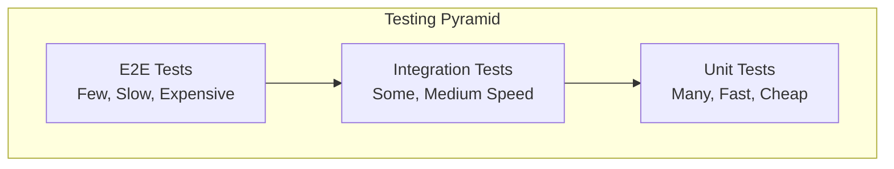

# Testing Best Practices

:::tip Quality Code
"Code without tests is broken by design." Testing is not optional — it's a core engineering skill expected in all roles.
:::

## 1. Testing Pyramid



| Type | Speed | Coverage | When to Use |
|------|-------|----------|-------------|
| **Unit** | Fast (ms) | Single class/method | Business logic |
| **Integration** | Medium (s) | Multiple components | DB, API calls |
| **E2E** | Slow (min) | Entire system | Critical user flows |

---

## 2. Unit Testing with JUnit 5

### Basic Test Structure

```java
import org.junit.jupiter.api.*;
import static org.junit.jupiter.api.Assertions.*;

class UserServiceTest {
    
    private UserService userService;
    private UserRepository userRepository;
    
    @BeforeEach
    void setUp() {
        userRepository = Mockito.mock(UserRepository.class);
        userService = new UserService(userRepository);
    }
    
    @Test
    @DisplayName("Should find user by ID when user exists")
    void findById_WhenUserExists_ReturnsUser() {
        // Given (Arrange)
        User expectedUser = new User(1L, "Alice");
        when(userRepository.findById(1L)).thenReturn(Optional.of(expectedUser));
        
        // When (Act)
        User actualUser = userService.findById(1L);
        
        // Then (Assert)
        assertEquals(expectedUser.getName(), actualUser.getName());
        verify(userRepository).findById(1L);
    }
    
    @Test
    @DisplayName("Should throw exception when user not found")
    void findById_WhenUserNotFound_ThrowsException() {
        // Given
        when(userRepository.findById(999L)).thenReturn(Optional.empty());
        
        // When & Then
        assertThrows(UserNotFoundException.class, () -> {
            userService.findById(999L);
        });
    }
}
```

### JUnit 5 Annotations

```java
@Test                    // Mark as test method
@DisplayName("...")      // Readable test name
@BeforeEach             // Run before each test
@AfterEach              // Run after each test
@BeforeAll              // Run once before all tests (static)
@AfterAll               // Run once after all tests (static)
@Disabled               // Skip this test
@Tag("integration")     // Categorize tests
@Timeout(5)             // Fail if takes > 5 seconds
```

### Assertions

```java
// Basic assertions
assertEquals(expected, actual);
assertNotEquals(unexpected, actual);
assertTrue(condition);
assertFalse(condition);
assertNull(object);
assertNotNull(object);

// Exception assertion
assertThrows(IllegalArgumentException.class, () -> {
    service.process(invalidInput);
});

// Multiple assertions (all run, report all failures)
assertAll(
    () -> assertEquals("Alice", user.getName()),
    () -> assertEquals(25, user.getAge()),
    () -> assertTrue(user.isActive())
);

// AssertJ (more readable)
assertThat(user.getName()).isEqualTo("Alice");
assertThat(users).hasSize(3).contains(alice, bob);
assertThat(age).isGreaterThan(18).isLessThan(100);
```

---

## 3. Mockito

### Creating Mocks

```java
// Using annotation
@ExtendWith(MockitoExtension.class)
class MyTest {
    @Mock
    private UserRepository userRepository;
    
    @InjectMocks  // Injects mocks into this object
    private UserService userService;
    
    @Spy  // Partial mock - real methods unless stubbed
    private EmailService emailService;
}

// Programmatically
UserRepository mock = Mockito.mock(UserRepository.class);
```

### Stubbing Methods

```java
// Return value
when(userRepository.findById(1L)).thenReturn(Optional.of(user));

// Return different values on consecutive calls
when(counter.next()).thenReturn(1, 2, 3);

// Throw exception
when(userRepository.findById(999L)).thenThrow(new RuntimeException());

// Answer with callback
when(userRepository.save(any())).thenAnswer(invocation -> {
    User user = invocation.getArgument(0);
    user.setId(1L);
    return user;
});
```

### Verifying Interactions

```java
// Verify method was called
verify(userRepository).save(user);

// Verify exact number of calls
verify(userRepository, times(2)).save(any());
verify(userRepository, never()).delete(any());
verify(userRepository, atLeast(1)).findById(any());

// Verify order
InOrder inOrder = inOrder(service1, service2);
inOrder.verify(service1).first();
inOrder.verify(service2).second();

// Capture arguments
ArgumentCaptor<User> captor = ArgumentCaptor.forClass(User.class);
verify(userRepository).save(captor.capture());
User savedUser = captor.getValue();
assertEquals("Alice", savedUser.getName());
```

### Argument Matchers

```java
// Any value
when(repo.findById(any())).thenReturn(user);
when(repo.findById(anyLong())).thenReturn(user);
when(repo.findByName(anyString())).thenReturn(user);

// Specific conditions
when(repo.findByName(eq("Alice"))).thenReturn(alice);
when(repo.findByAge(gt(18))).thenReturn(adults);
when(repo.findByName(startsWith("A"))).thenReturn(aNames);

// Custom matcher
when(repo.findByName(argThat(name -> name.length() > 5))).thenReturn(user);
```

---

## 4. Testing Spring Applications

### @SpringBootTest (Full Integration)

```java
@SpringBootTest
@AutoConfigureTestDatabase  // Use H2 instead of real DB
class UserServiceIntegrationTest {
    
    @Autowired
    private UserService userService;
    
    @Autowired
    private UserRepository userRepository;
    
    @Test
    void createUser_ShouldPersistToDatabase() {
        User user = new User("Alice", "alice@email.com");
        
        User saved = userService.create(user);
        
        assertNotNull(saved.getId());
        assertTrue(userRepository.existsById(saved.getId()));
    }
}
```

### @WebMvcTest (Controller Only)

```java
@WebMvcTest(UserController.class)
class UserControllerTest {
    
    @Autowired
    private MockMvc mockMvc;
    
    @MockBean  // Spring mock, not Mockito mock
    private UserService userService;
    
    @Test
    void getUser_ShouldReturnUser() throws Exception {
        User user = new User(1L, "Alice");
        when(userService.findById(1L)).thenReturn(user);
        
        mockMvc.perform(get("/users/1"))
            .andExpect(status().isOk())
            .andExpect(jsonPath("$.name").value("Alice"));
    }
    
    @Test
    void createUser_ShouldValidateInput() throws Exception {
        String invalidJson = "{}";  // Missing required fields
        
        mockMvc.perform(post("/users")
                .contentType(MediaType.APPLICATION_JSON)
                .content(invalidJson))
            .andExpect(status().isBadRequest());
    }
}
```

### @DataJpaTest (Repository Only)

```java
@DataJpaTest
class UserRepositoryTest {
    
    @Autowired
    private UserRepository userRepository;
    
    @Autowired
    private TestEntityManager entityManager;
    
    @Test
    void findByEmail_ShouldReturnUser() {
        // Given
        User user = new User("Alice", "alice@email.com");
        entityManager.persistAndFlush(user);
        
        // When
        Optional<User> found = userRepository.findByEmail("alice@email.com");
        
        // Then
        assertTrue(found.isPresent());
        assertEquals("Alice", found.get().getName());
    }
}
```

---

## 5. Test Naming Conventions

### Pattern: Should_When or Given_When_Then

```java
// Should_When pattern
@Test
void shouldReturnUser_WhenUserExists() { }

@Test
void shouldThrowException_WhenUserNotFound() { }

// Given_When_Then pattern
@Test
void givenValidUser_whenSave_thenIdIsGenerated() { }

// Method_State_Expected pattern
@Test
void findById_ExistingUser_ReturnsUser() { }

@Test
void findById_NonExistingUser_ThrowsException() { }
```

---

## 6. Testing Best Practices

### ✅ DO

```java
// 1. Test one thing per test
@Test
void shouldCalculateTotalCorrectly() {
    // Only testing calculation, not validation
}

// 2. Use meaningful test names
@Test
@DisplayName("Discount should be 10% for orders over $100")
void discountCalculation() { }

// 3. Follow Arrange-Act-Assert pattern
@Test
void testExample() {
    // Arrange
    Order order = new Order(150.0);
    
    // Act
    double discount = discountService.calculate(order);
    
    // Assert
    assertEquals(15.0, discount);
}

// 4. Test edge cases
@Test void shouldHandleEmptyList() { }
@Test void shouldHandleNullInput() { }
@Test void shouldHandleMaxValue() { }
```

### ❌ DON'T

```java
// 1. Don't test multiple things
@Test
void testEverything() {
    // ❌ Creates user, updates, deletes, and checks all
}

// 2. Don't use random data (unless testing randomness)
@Test
void testWithRandomData() {
    int random = new Random().nextInt();  // ❌ Not reproducible
}

// 3. Don't depend on test order
@Test void test1_CreateUser() { }
@Test void test2_UpdateUser() { }  // ❌ Depends on test1

// 4. Don't test implementation details
@Test
void shouldCallPrivateMethodA() { }  // ❌ Testing internal logic
```

---

## 7. Parameterized Tests

```java
@ParameterizedTest
@ValueSource(strings = {"alice", "bob", "charlie"})
void shouldAcceptValidNames(String name) {
    assertTrue(validator.isValidName(name));
}

@ParameterizedTest
@CsvSource({
    "1, 1, 2",
    "2, 3, 5",
    "10, 20, 30"
})
void shouldAddNumbers(int a, int b, int expected) {
    assertEquals(expected, calculator.add(a, b));
}

@ParameterizedTest
@MethodSource("provideUsers")
void shouldValidateUser(User user, boolean expected) {
    assertEquals(expected, validator.isValid(user));
}

static Stream<Arguments> provideUsers() {
    return Stream.of(
        Arguments.of(new User("Alice", 25), true),
        Arguments.of(new User("", 25), false),
        Arguments.of(new User("Bob", -1), false)
    );
}
```

---

## 8. Test Coverage

### What to Aim For

```text
Unit Tests: 80%+ code coverage
- Focus on business logic
- Cover edge cases
- Cover error paths

Not everything needs testing:
- Simple getters/setters
- Framework-generated code
- Third-party libraries
```

### Running Coverage (Maven)

```xml
<plugin>
    <groupId>org.jacoco</groupId>
    <artifactId>jacoco-maven-plugin</artifactId>
    <version>0.8.8</version>
    <executions>
        <execution>
            <goals>
                <goal>prepare-agent</goal>
            </goals>
        </execution>
        <execution>
            <id>report</id>
            <phase>test</phase>
            <goals>
                <goal>report</goal>
            </goals>
        </execution>
    </executions>
</plugin>
```

```bash
mvn test jacoco:report
# Report at target/site/jacoco/index.html
```

---

## 9. Interview Questions

### Q1: What's the difference between @Mock and @MockBean?

> "`@Mock` is from Mockito and creates a simple mock object. `@MockBean` is from Spring and creates a mock that replaces the actual bean in the Spring context. Use `@Mock` for unit tests, `@MockBean` for Spring integration tests."

### Q2: How do you test private methods?

> "Generally, you shouldn't test private methods directly. They should be tested indirectly through public methods. If a private method is complex enough to need its own tests, consider extracting it to a separate class. If absolutely necessary, you can use reflection, but this is a code smell."

### Q3: When do you use Spy vs Mock?

```java
// Mock: All methods return default values until stubbed
@Mock UserService userService;

// Spy: Real implementation, but can stub specific methods
@Spy UserService userService;
when(userService.isAdmin(any())).thenReturn(true);  // Stub this one
userService.create(user);  // Calls REAL method
```

---

## Quick Reference

```text
JUnit 5 Annotations:
@Test, @BeforeEach, @AfterEach
@BeforeAll, @AfterAll (static)
@DisplayName, @Disabled, @Timeout

Mockito:
when(mock.method()).thenReturn(value)
verify(mock).method()
@Mock, @InjectMocks, @Spy

Spring Test:
@SpringBootTest - Full context
@WebMvcTest - Controller only
@DataJpaTest - Repository only
@MockBean - Mock bean in context

Test Pattern:
Arrange → Act → Assert
Given → When → Then

Coverage Target: 80%+ for business logic
```

---

**Next:** [CI/CD & DevOps →](../14-cicd-devops/01-intro)
