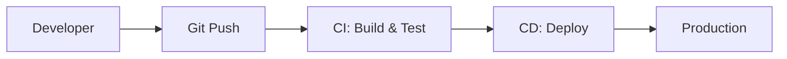

# CI/CD & Docker Essentials

:::info DevOps Skills
Modern backend developers are expected to understand CI/CD pipelines and containerization. This is increasingly tested in interviews.
:::

## 1. CI/CD Fundamentals

### What is CI/CD?



| Term | Meaning | Example |
|------|---------|---------|
| **CI** | Continuous Integration | Auto-build and test on every push |
| **CD** | Continuous Delivery | Auto-deploy to staging |
| **CD** | Continuous Deployment | Auto-deploy to production |

### CI/CD Pipeline Stages

```text
1. Build       → Compile code, create artifacts
2. Test        → Unit tests, integration tests
3. Code Quality → Linting, SonarQube analysis
4. Security    → Dependency scanning, SAST
5. Package     → Docker image, JAR file
6. Deploy      → To staging/production
```

---

## 2. GitHub Actions

### Basic Workflow

```yaml
# .github/workflows/ci.yml
name: CI Pipeline

on:
  push:
    branches: [main, develop]
  pull_request:
    branches: [main]

jobs:
  build:
    runs-on: ubuntu-latest
    
    steps:
      - name: Checkout code
        uses: actions/checkout@v3
      
      - name: Set up JDK 17
        uses: actions/setup-java@v3
        with:
          java-version: '17'
          distribution: 'temurin'
      
      - name: Cache Maven packages
        uses: actions/cache@v3
        with:
          path: ~/.m2
          key: ${{ runner.os }}-m2-${{ hashFiles('**/pom.xml') }}
      
      - name: Build with Maven
        run: mvn clean package -DskipTests
      
      - name: Run tests
        run: mvn test
      
      - name: Upload coverage report
        uses: codecov/codecov-action@v3

  deploy:
    needs: build
    runs-on: ubuntu-latest
    if: github.ref == 'refs/heads/main'
    
    steps:
      - name: Deploy to production
        run: echo "Deploying..."
```

### Environment Secrets

```yaml
steps:
  - name: Deploy
    env:
      AWS_ACCESS_KEY_ID: ${{ secrets.AWS_ACCESS_KEY_ID }}
      AWS_SECRET_ACCESS_KEY: ${{ secrets.AWS_SECRET_ACCESS_KEY }}
    run: |
      aws s3 sync ./build s3://my-bucket
```

---

## 3. Docker Fundamentals

### What is Docker?

Docker packages your application and its dependencies into a **container** that runs consistently anywhere.

```text
Container vs VM:
┌────────────────────┐    ┌────────────────────┐
│   Container 1      │    │   Container 2      │
├────────────────────┤    ├────────────────────┤
│   App + Deps       │    │   App + Deps       │
├────────────────────┴────┴────────────────────┤
│              Docker Engine                    │
├──────────────────────────────────────────────┤
│              Host OS (Linux)                  │
├──────────────────────────────────────────────┤
│              Hardware                         │
└──────────────────────────────────────────────┘

(VMs have full Guest OS for each, much heavier)
```

### Dockerfile for Spring Boot

```dockerfile
# Multi-stage build for smaller image
FROM maven:3.8-openjdk-17 AS builder
WORKDIR /app
COPY pom.xml .
COPY src ./src
RUN mvn clean package -DskipTests

# Production image
FROM eclipse-temurin:17-jre-alpine
WORKDIR /app

# Create non-root user
RUN addgroup -S spring && adduser -S spring -G spring
USER spring:spring

# Copy JAR from builder
COPY --from=builder /app/target/*.jar app.jar

# JVM options for containers
ENV JAVA_OPTS="-XX:+UseContainerSupport -XX:MaxRAMPercentage=75.0"

EXPOSE 8080
ENTRYPOINT ["sh", "-c", "java $JAVA_OPTS -jar app.jar"]
```

### Docker Commands

```bash
# Build image
docker build -t myapp:1.0 .

# Run container
docker run -d -p 8080:8080 --name myapp myapp:1.0

# View logs
docker logs -f myapp

# Enter container
docker exec -it myapp /bin/sh

# Stop and remove
docker stop myapp
docker rm myapp

# List running containers
docker ps

# List images
docker images

# Remove unused resources
docker system prune
```

### Docker Compose

```yaml
# docker-compose.yml
version: '3.8'

services:
  app:
    build: .
    ports:
      - "8080:8080"
    environment:
      - SPRING_PROFILES_ACTIVE=prod
      - DB_HOST=postgres
      - REDIS_HOST=redis
    depends_on:
      - postgres
      - redis
  
  postgres:
    image: postgres:15
    environment:
      POSTGRES_DB: myapp
      POSTGRES_USER: user
      POSTGRES_PASSWORD: password
    volumes:
      - postgres_data:/var/lib/postgresql/data
    ports:
      - "5432:5432"
  
  redis:
    image: redis:7-alpine
    ports:
      - "6379:6379"

volumes:
  postgres_data:
```

```bash
# Start all services
docker-compose up -d

# View logs
docker-compose logs -f app

# Stop all
docker-compose down
```

---

## 4. Kubernetes Basics

### Key Concepts

```text
Cluster     → Set of nodes running containers
Node        → A server in the cluster
Pod         → Smallest deployable unit (contains containers)
Deployment  → Manages pod replicas
Service     → Exposes pods to network
ConfigMap   → Store configuration
Secret      → Store sensitive data
```

### Basic Deployment

```yaml
# deployment.yaml
apiVersion: apps/v1
kind: Deployment
metadata:
  name: myapp
spec:
  replicas: 3
  selector:
    matchLabels:
      app: myapp
  template:
    metadata:
      labels:
        app: myapp
    spec:
      containers:
        - name: myapp
          image: myapp:1.0
          ports:
            - containerPort: 8080
          env:
            - name: SPRING_PROFILES_ACTIVE
              value: "prod"
          resources:
            requests:
              memory: "256Mi"
              cpu: "250m"
            limits:
              memory: "512Mi"
              cpu: "500m"
          readinessProbe:
            httpGet:
              path: /actuator/health
              port: 8080
            initialDelaySeconds: 30
          livenessProbe:
            httpGet:
              path: /actuator/health
              port: 8080
            initialDelaySeconds: 60
---
# service.yaml
apiVersion: v1
kind: Service
metadata:
  name: myapp-service
spec:
  selector:
    app: myapp
  ports:
    - port: 80
      targetPort: 8080
  type: LoadBalancer
```

### kubectl Commands

```bash
# Apply configuration
kubectl apply -f deployment.yaml

# Get resources
kubectl get pods
kubectl get services
kubectl get deployments

# Describe (debug)
kubectl describe pod myapp-xxx

# View logs
kubectl logs -f myapp-xxx

# Scale
kubectl scale deployment myapp --replicas=5

# Delete
kubectl delete -f deployment.yaml
```

---

## 5. Deployment Strategies

### Rolling Deployment (Default)

```text
Old: [v1] [v1] [v1]
     ↓
     [v1] [v1] [v2]  ← One at a time
     ↓
     [v1] [v2] [v2]
     ↓
     [v2] [v2] [v2]  ← Complete
```

### Blue-Green Deployment

```text
Blue (current):  [v1] [v1] [v1]  ← Live traffic
Green (new):     [v2] [v2] [v2]  ← Testing

After validation, switch traffic:
Blue:  [v1] [v1] [v1]  ← Idle (easy rollback)
Green: [v2] [v2] [v2]  ← Live traffic
```

### Canary Deployment

```text
Route 10% traffic to new version:
[v1] [v1] [v1] [v1] [v1] [v1] [v1] [v1] [v1] [v2]
                                              ↑
                                         10% canary

Gradually increase if successful:
[v1] [v1] [v1] [v1] [v1] [v2] [v2] [v2] [v2] [v2]
                         50%

Full rollout:
[v2] [v2] [v2] [v2] [v2] [v2] [v2] [v2] [v2] [v2]
                        100%
```

---

## 6. Monitoring & Health Checks

### Spring Boot Actuator

```yaml
# application.yml
management:
  endpoints:
    web:
      exposure:
        include: health, metrics, prometheus
  endpoint:
    health:
      show-details: always
  health:
    db:
      enabled: true
    redis:
      enabled: true
```

### Health Check Endpoints

```text
/actuator/health         → Overall health
/actuator/health/liveness  → Is app alive?
/actuator/health/readiness → Is app ready for traffic?
/actuator/metrics        → Application metrics
/actuator/prometheus     → Prometheus format
```

---

## 7. Interview Questions

### Q1: What's the difference between Docker image and container?

> "An **image** is a read-only template containing the application and its dependencies - like a class. A **container** is a running instance of an image - like an object. Multiple containers can be created from the same image."

### Q2: How do you handle secrets in CI/CD?

> "Never store secrets in code or git. Use:
> 1. CI/CD secret management (GitHub Secrets, Jenkins Credentials)
> 2. Cloud secret managers (AWS Secrets Manager, HashiCorp Vault)
> 3. Kubernetes Secrets (for runtime)
> Secrets should be injected at runtime as environment variables."

### Q3: What happens during a rolling deployment if the new version is buggy?

> "The deployment should have proper health checks (readinessProbe). If the new pods fail health checks, Kubernetes won't route traffic to them and won't continue the rollout. We can then manually rollback using `kubectl rollout undo deployment/myapp`."

### Q4: How do you debug a production container issue?

```bash
# 1. Check pod status
kubectl get pods
kubectl describe pod myapp-xxx

# 2. Check logs
kubectl logs myapp-xxx --previous  # Previous container logs

# 3. Enter container (if running)
kubectl exec -it myapp-xxx -- /bin/sh

# 4. Check resource usage
kubectl top pod myapp-xxx
```

---

## Quick Reference

```text
Docker Commands:
docker build -t name:tag .
docker run -d -p 8080:8080 name:tag
docker logs -f container
docker exec -it container /bin/sh

Docker Compose:
docker-compose up -d
docker-compose down
docker-compose logs -f

Kubernetes:
kubectl apply -f file.yaml
kubectl get pods/services/deployments
kubectl describe pod name
kubectl logs -f pod-name
kubectl scale deployment name --replicas=N

Deployment Strategies:
- Rolling: Gradual replacement (default)
- Blue-Green: Parallel environments, instant switch
- Canary: Gradual traffic shift (safest)

CI/CD Pipeline:
Build → Test → Analyze → Package → Deploy
```

---

**Next:** [Computer Networks →](../05-computer-networks/01-intro)
