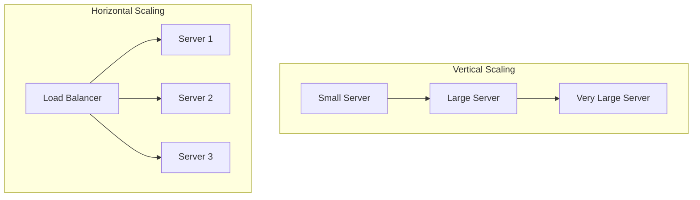
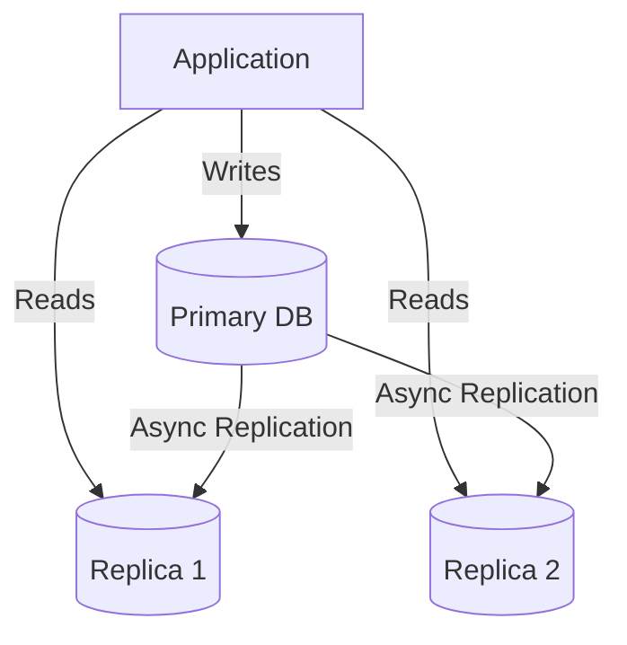
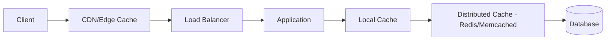
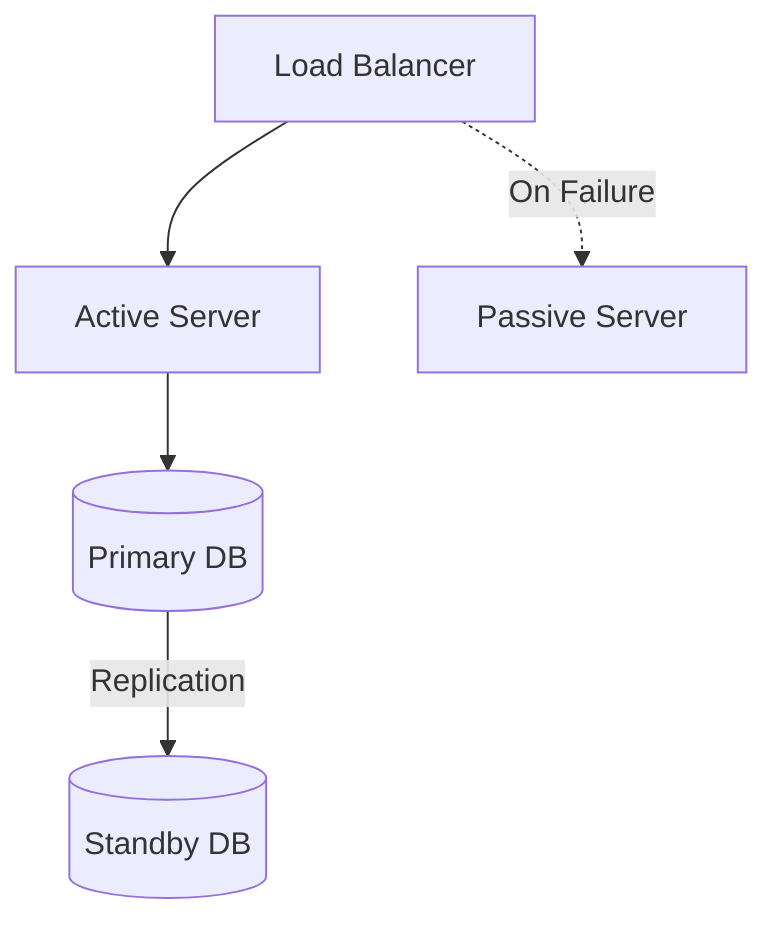
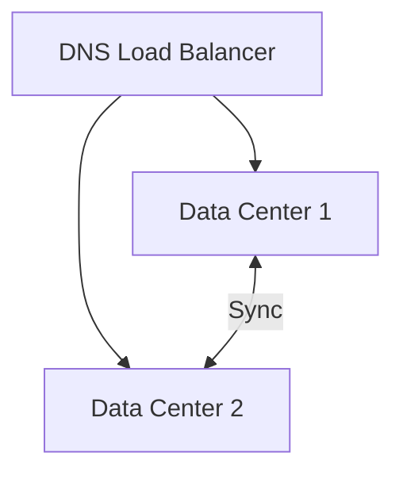
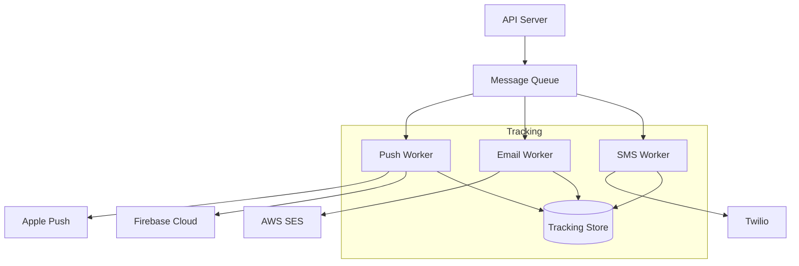

# System Design Framework & Patterns

:::tip Interview Success
System design interviews test your ability to think at scale. Use this **structured framework** to approach any problem.
:::

## 1. The System Design Framework

### Step-by-Step Approach (45 minutes)

```text
1. REQUIREMENTS (5 min)
   - Functional: What does the system do?
   - Non-functional: Scale, latency, availability
   - Constraints: Budget, team size, timeline

2. ESTIMATIONS (5 min)
   - Users, requests per second
   - Storage requirements
   - Bandwidth needs

3. HIGH-LEVEL DESIGN (10 min)
   - Core components
   - API design
   - Data flow

4. DEEP DIVE (20 min)
   - Database design
   - Scaling strategies
   - Key algorithms

5. WRAP UP (5 min)
   - Trade-offs discussion
   - Bottlenecks and solutions
   - Monitoring/alerting
```

---

## 2. Back-of-the-Envelope Calculations

### Key Numbers to Memorize

```text
Time:
- 1 day = 86,400 seconds ≈ 100K seconds
- 1 month ≈ 2.5 million seconds
- 1 year ≈ 30 million seconds

Storage:
- Character: 1 byte
- Integer: 4 bytes
- Long/Double: 8 bytes
- UUID: 16 bytes
- Timestamp: 8 bytes

Scale:
- 1 million = 10^6 = 1M
- 1 billion = 10^9 = 1B
- 1 KB = 1,000 bytes
- 1 MB = 1 million bytes
- 1 GB = 1 billion bytes
- 1 TB = 1 trillion bytes
```

### Example: Twitter-like System

```text
Requirements:
- 500M daily active users
- Each user posts 2 tweets/day
- Each user reads 100 tweets/day

Calculations:
Writes/day = 500M × 2 = 1B tweets/day
Writes/sec = 1B / 100K = 10,000 TPS

Reads/day = 500M × 100 = 50B reads/day
Reads/sec = 50B / 100K = 500,000 QPS

Read:Write ratio = 50:1 (read-heavy!)

Storage (1 year):
- Tweet size: 280 chars + metadata ≈ 500 bytes
- Daily storage: 1B × 500B = 500GB/day
- Yearly: 500GB × 365 = 180TB/year
```

---

## 3. Scaling Patterns

### Vertical vs Horizontal Scaling



| Vertical | Horizontal |
|----------|------------|
| Add more CPU/RAM | Add more servers |
| Simple, no code changes | Requires stateless design |
| Limited by hardware | Virtually unlimited |
| Single point of failure | High availability |

### Load Balancing Algorithms

```text
1. Round Robin
   Request 1 → Server A
   Request 2 → Server B
   Request 3 → Server C
   Request 4 → Server A (repeat)

2. Least Connections
   Route to server with fewest active connections
   Good for: Long-running requests

3. IP Hash
   hash(client_IP) % num_servers
   Good for: Session affinity

4. Weighted
   Server A (weight 3): Gets 3x traffic
   Server B (weight 1): Gets 1x traffic
   Good for: Mixed server capacities
```

---

## 4. Database Scaling

### Read Replicas



### Sharding (Horizontal Partitioning)

```text
Strategy 1: Range-based
  Shard 1: Users A-H
  Shard 2: Users I-P
  Shard 3: Users Q-Z
  Problem: Uneven distribution

Strategy 2: Hash-based
  shard = hash(user_id) % num_shards
  Better distribution

Strategy 3: Directory-based
  Lookup table maps key → shard
  Most flexible, but lookup overhead
```

```java
// Hash-based sharding
public int getShard(long userId) {
    return (int) (userId % NUM_SHARDS);
}

// Consistent hashing (better for adding/removing shards)
public int getShardConsistent(String key) {
    int hash = consistentHash.hash(key);
    return hashRing.getNode(hash);
}
```

### When to Shard

```text
Consider sharding when:
- Single DB can't handle write load
- Data doesn't fit in one machine
- Need geographic distribution

Avoid sharding when possible:
- Adds complexity
- Cross-shard queries are hard
- Transactions become difficult

Try first:
1. Optimize queries, add indexes
2. Add read replicas
3. Vertical scaling
4. Caching layer
5. Then shard if still needed
```

---

## 5. Caching Architecture

### Multi-Level Caching



### Cache Placement

| Location | Latency | Use Case |
|----------|---------|----------|
| Browser cache | 0ms | Static assets |
| CDN | 10-50ms | Static content, API responses |
| Local cache (Caffeine) | Under 1ms | Hot data, computed values |
| Distributed cache (Redis) | 1-5ms | Session, shared state |
| Database cache | 5ms | Query results |

---

## 6. High Availability Patterns

### Active-Passive (Failover)



### Active-Active



### Availability Math

```text
Single Server: 99.9% uptime = 8.76 hours downtime/year

Two Servers (Active-Passive):
  P(both down) = 0.001 × 0.001 = 0.000001
  Availability = 99.9999% = 31 seconds downtime/year

Three Servers:
  P(all down) = 0.001^3 = 10^-9
  Availability = 99.9999999%

"Nines" table:
  99% = 3.65 days downtime/year
  99.9% = 8.76 hours
  99.99% = 52.6 minutes  
  99.999% = 5.26 minutes
```

---

## 7. Common System Designs

### URL Shortener (bit.ly)

```text
Requirements:
- Generate short URL from long URL
- Redirect short → long
- 100M URLs/month, 10B redirects/month

Components:
┌────────────┐     ┌─────────────┐     ┌─────────┐
│   Client   │────▶│ API Server  │────▶│  Cache  │
└────────────┘     └─────────────┘     └────┬────┘
                          │                  │
                   ┌──────▼──────┐    ┌─────▼─────┐
                   │ ID Generator │    │ Database  │
                   └─────────────┘    └───────────┘

Key Decisions:
- ID Generation: Base62 encoding of auto-increment ID
- Storage: Key-value store (short_url → long_url)
- Caching: Hot URLs in Redis
```

### Rate Limiter

```text
Algorithms:

1. Token Bucket
   - Bucket holds N tokens
   - Request consumes 1 token
   - Tokens refill at rate R
   - Good for: Allowing bursts

2. Sliding Window
   - Count requests in time window
   - Reject if count > limit
   - Good for: Smooth rate limiting

3. Leaky Bucket
   - Requests added to queue
   - Processed at fixed rate
   - Good for: Consistent output rate
```

```java
// Token Bucket implementation
public class RateLimiter {
    private final long capacity;
    private final long refillRate;  // tokens per second
    private long tokens;
    private long lastRefillTime;
    
    public synchronized boolean tryAcquire() {
        refill();
        if (tokens > 0) {
            tokens--;
            return true;
        }
        return false;
    }
    
    private void refill() {
        long now = System.currentTimeMillis();
        long elapsed = now - lastRefillTime;
        long tokensToAdd = elapsed * refillRate / 1000;
        tokens = Math.min(capacity, tokens + tokensToAdd);
        lastRefillTime = now;
    }
}
```

### Notification System



---

## 8. Trade-off Discussions

### Consistency vs Availability

```text
Strong Consistency:
  + Always see latest data
  - Higher latency
  - Lower availability during failures
  Use: Financial systems, inventory

Eventual Consistency:
  + Low latency
  + High availability
  - May see stale data
  Use: Social media feeds, analytics
```

### Latency vs Throughput

```text
Optimize for Latency:
  - In-memory caching
  - Fewer network hops
  - Smaller payloads
  Use: Real-time gaming, trading

Optimize for Throughput:
  - Batch processing
  - Queue-based architecture
  - Parallel processing
  Use: Data pipelines, batch jobs
```

---

## 9. Interview Questions

### Q1: Design a chat application

```text
Functional Requirements:
- 1:1 and group messaging
- Delivered/read receipts
- Online presence

Non-Functional:
- Low latency (under 100ms)
- Messages never lost
- 100M daily active users

Key Components:
1. WebSocket for real-time
2. Message queue for reliability
3. Cassandra for message storage
4. Redis for presence/sessions
5. CDN for media

Data Flow:
User A → WebSocket Server → Message Queue → WebSocket Server → User B
                                ↓
                           Database (persistence)
```

### Q2: Design a search autocomplete

```text
Requirements:
- Return top 10 suggestions
- Under 100ms latency
- Handle typos

Solution:
1. Trie data structure for prefix matching
2. Precompute and cache top suggestions
3. Distributed cache (Redis) for hot prefixes
4. Rank by: popularity, recency, personalization
5. Update trie hourly from search logs
```

### Q3: Walk me through what happens when you type a URL

```text
1. Browser checks local cache
2. DNS resolution (recursive)
3. TCP connection (3-way handshake)
4. TLS handshake (if HTTPS)
5. HTTP request sent
6. Server processes request
7. Response sent back
8. Browser renders page
   - Parse HTML
   - Load CSS/JS
   - Execute JavaScript
   - Paint pixels
```

---

## Quick Reference Checklist

```text
Before the Interview:
□ Practice estimations
□ Know trade-offs
□ Memorize key numbers

During Requirements:
□ Clarify functional requirements
□ Clarify scale (users, data size)
□ Clarify non-functional (latency, availability)

High-Level Design:
□ Draw major components
□ Show data flow
□ Define APIs

Deep Dive:
□ Database schema
□ Scaling strategy
□ Key algorithms
□ Failure handling

Common Components:
□ Load Balancer
□ CDN
□ Cache (local + distributed)
□ Database (replicated/sharded)
□ Message Queue
□ Monitoring
```

---

**Next:** [Design URL Shortener →](./03-url-shortener)
