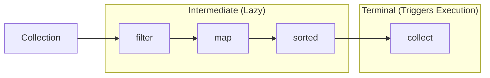

# Java 8+ Features Masterclass

:::info Interview Must-Know
Java 8 features like **Streams** and **Lambdas** are used everywhere in modern Java codebases. Expect interview questions on these!
:::

## 1. Lambda Expressions

### Before and After

```java
// ❌ Before Java 8: Anonymous class
button.addActionListener(new ActionListener() {
    @Override
    public void actionPerformed(ActionEvent e) {
        System.out.println("Button clicked!");
    }
});

// ✅ Java 8+: Lambda expression
button.addActionListener(e -> System.out.println("Button clicked!"));
```

### Lambda Syntax

```java
// No parameters
() -> System.out.println("Hello")

// One parameter (parentheses optional)
x -> x * x
(x) -> x * x

// Multiple parameters
(x, y) -> x + y

// Multiple statements (need braces and return)
(x, y) -> {
    int sum = x + y;
    return sum * 2;
}

// Type declaration (optional)
(int x, int y) -> x + y
```

### Functional Interfaces

```java
// A functional interface has exactly ONE abstract method
@FunctionalInterface
public interface Predicate<T> {
    boolean test(T t);
}

// Usage
Predicate<String> isLong = s -> s.length() > 10;
boolean result = isLong.test("Hello World");  // true
```

### Common Functional Interfaces

| Interface | Method | Use Case |
|-----------|--------|----------|
| `Predicate<T>` | `test(T) → boolean` | Filtering |
| `Function<T,R>` | `apply(T) → R` | Transforming |
| `Consumer<T>` | `accept(T) → void` | Side effects |
| `Supplier<T>` | `get() → T` | Lazy creation |
| `BiFunction<T,U,R>` | `apply(T,U) → R` | Two inputs |

---

## 2. Streams API

### What is a Stream?

A **stream** is a sequence of elements supporting sequential and parallel aggregate operations.

```java
List<String> names = Arrays.asList("Alice", "Bob", "Charlie", "David");

// Stream pipeline
List<String> result = names.stream()          // Source
    .filter(n -> n.startsWith("A"))           // Intermediate
    .map(String::toUpperCase)                 // Intermediate
    .sorted()                                 // Intermediate
    .collect(Collectors.toList());            // Terminal

// Result: ["ALICE"]
```

### Stream Operations



### Common Intermediate Operations

```java
// filter: Keep elements matching condition
stream.filter(x -> x > 5)

// map: Transform elements
stream.map(x -> x * 2)
stream.map(String::toUpperCase)

// flatMap: Flatten nested collections
List<List<Integer>> nested = ...
nested.stream().flatMap(List::stream)  // Single stream

// distinct: Remove duplicates
stream.distinct()

// sorted: Sort elements
stream.sorted()
stream.sorted(Comparator.reverseOrder())
stream.sorted(Comparator.comparing(Person::getName))

// limit/skip: Pagination
stream.skip(10).limit(20)  // Skip first 10, take next 20

// peek: Debug (don't use for side effects)
stream.peek(x -> System.out.println(x))
```

### Terminal Operations

```java
// collect: Convert to collection
List<String> list = stream.collect(Collectors.toList());
Set<String> set = stream.collect(Collectors.toSet());
Map<Long, User> map = stream.collect(
    Collectors.toMap(User::getId, Function.identity())
);

// forEach: Side effect on each element
stream.forEach(System.out::println);

// reduce: Combine all elements
int sum = stream.reduce(0, (a, b) -> a + b);
int sum = stream.reduce(0, Integer::sum);

// count, min, max
long count = stream.count();
Optional<Integer> max = stream.max(Comparator.naturalOrder());

// anyMatch, allMatch, noneMatch
boolean hasAlice = stream.anyMatch(n -> n.equals("Alice"));
boolean allAdults = stream.allMatch(p -> p.getAge() >= 18);

// findFirst, findAny
Optional<String> first = stream.findFirst();
```

### Collectors

```java
// toList, toSet
List<String> list = stream.collect(Collectors.toList());

// toMap
Map<Long, User> userMap = users.stream()
    .collect(Collectors.toMap(User::getId, u -> u));

// groupingBy
Map<String, List<User>> byCity = users.stream()
    .collect(Collectors.groupingBy(User::getCity));

// partitioningBy
Map<Boolean, List<User>> adultSplit = users.stream()
    .collect(Collectors.partitioningBy(u -> u.getAge() >= 18));

// counting
Map<String, Long> countByCity = users.stream()
    .collect(Collectors.groupingBy(User::getCity, Collectors.counting()));

// joining
String names = users.stream()
    .map(User::getName)
    .collect(Collectors.joining(", "));  // "Alice, Bob, Charlie"

// summarizingInt
IntSummaryStatistics stats = users.stream()
    .collect(Collectors.summarizingInt(User::getAge));
// stats.getAverage(), stats.getMax(), stats.getMin(), stats.getSum()
```

---

## 3. Optional

### The Problem: NullPointerException

```java
// ❌ NPE waiting to happen
String city = user.getAddress().getCity().toUpperCase();
// What if getAddress() returns null?
```

### The Solution: Optional

```java
// ✅ Safe with Optional
Optional<User> optUser = findUserById(id);

// Check presence
if (optUser.isPresent()) {
    User user = optUser.get();
}

// Or better: use functional methods
optUser.ifPresent(user -> System.out.println(user.getName()));

// Default value
User user = optUser.orElse(defaultUser);

// Lazy default
User user = optUser.orElseGet(() -> createDefaultUser());

// Throw if empty
User user = optUser.orElseThrow(() -> new NotFoundException("User not found"));

// Transform if present
Optional<String> name = optUser.map(User::getName);

// Chain optionals
Optional<String> city = optUser
    .map(User::getAddress)
    .map(Address::getCity);
```

### Optional Best Practices

```java
// ✅ DO: Return Optional for "might not exist"
public Optional<User> findByEmail(String email) {
    return Optional.ofNullable(userRepository.findByEmail(email));
}

// ❌ DON'T: Use Optional as field
public class User {
    private Optional<Address> address;  // ❌ Bad
    private Address address;            // ✅ Good (can be null)
}

// ❌ DON'T: Use Optional as parameter
public void process(Optional<User> user) {  // ❌ Bad
public void process(User user) {            // ✅ Good

// ✅ DO: Use orElseThrow for required values
User user = repository.findById(id)
    .orElseThrow(() -> new NotFoundException("User " + id));
```

---

## 4. Method References

### Types of Method References

```java
// Static method reference
Function<String, Integer> parser = Integer::parseInt;
// Same as: s -> Integer.parseInt(s)

// Instance method of particular object
User user = new User("Alice");
Supplier<String> getName = user::getName;
// Same as: () -> user.getName()

// Instance method of arbitrary object
Function<String, Integer> length = String::length;
// Same as: s -> s.length()

// Constructor reference
Supplier<User> userFactory = User::new;
// Same as: () -> new User()

Function<String, User> userFactory = User::new;
// Same as: name -> new User(name)
```

### Usage Examples

```java
// Sorting with method reference
users.sort(Comparator.comparing(User::getName));

// Mapping
List<String> names = users.stream()
    .map(User::getName)    // Method reference
    .collect(Collectors.toList());

// Filtering
users.stream()
    .filter(User::isActive)    // Method reference (returns boolean)
    .forEach(System.out::println);
```

---

## 5. Date/Time API (java.time)

### Key Classes

```java
// Date only
LocalDate date = LocalDate.now();
LocalDate birthday = LocalDate.of(1990, Month.JANUARY, 15);

// Time only
LocalTime time = LocalTime.now();
LocalTime meeting = LocalTime.of(14, 30);

// Date and time
LocalDateTime dateTime = LocalDateTime.now();

// With timezone
ZonedDateTime zoned = ZonedDateTime.now(ZoneId.of("America/New_York"));

// Duration (time-based)
Duration duration = Duration.between(startTime, endTime);
long hours = duration.toHours();

// Period (date-based)
Period period = Period.between(startDate, endDate);
int years = period.getYears();
```

### Formatting

```java
LocalDateTime now = LocalDateTime.now();

// Predefined formatters
String iso = now.format(DateTimeFormatter.ISO_LOCAL_DATE_TIME);
// 2024-01-15T14:30:00

// Custom format
DateTimeFormatter formatter = DateTimeFormatter.ofPattern("dd/MM/yyyy HH:mm");
String formatted = now.format(formatter);
// 15/01/2024 14:30

// Parsing
LocalDate parsed = LocalDate.parse("15/01/2024", 
    DateTimeFormatter.ofPattern("dd/MM/yyyy"));
```

---

## 6. Java 9+ Features

### Immutable Collections (Java 9)

```java
// Before Java 9
List<String> list = Collections.unmodifiableList(Arrays.asList("a", "b", "c"));

// Java 9+
List<String> list = List.of("a", "b", "c");
Set<String> set = Set.of("a", "b", "c");
Map<String, Integer> map = Map.of("a", 1, "b", 2);

// These are immutable - cannot add/remove
list.add("d");  // throws UnsupportedOperationException
```

### var Keyword (Java 10)

```java
// Type inference for local variables
var list = new ArrayList<String>();    // ArrayList<String>
var map = new HashMap<String, User>(); // HashMap<String, User>
var stream = users.stream();           // Stream<User>

// Can't use with:
var field;           // ❌ Must have initializer
var lambda = x -> x; // ❌ Can't infer lambda type
```

### Records (Java 16)

```java
// Before: Lots of boilerplate
public class User {
    private final String name;
    private final int age;
    
    public User(String name, int age) {
        this.name = name;
        this.age = age;
    }
    
    public String getName() { return name; }
    public int getAge() { return age; }
    
    // equals, hashCode, toString...
}

// After: Concise
public record User(String name, int age) {}

// Records are:
// - Immutable
// - Auto-generate constructor, getters, equals, hashCode, toString
```

### Pattern Matching (Java 16+)

```java
// Before
if (obj instanceof String) {
    String s = (String) obj;
    System.out.println(s.length());
}

// After (pattern matching)
if (obj instanceof String s) {
    System.out.println(s.length());  // s already cast
}

// Switch expressions (Java 14+)
String result = switch (day) {
    case MONDAY, FRIDAY -> "Work";
    case SATURDAY, SUNDAY -> "Rest";
    default -> "Unknown";
};
```

---

## 7. Interview Questions

### Q1: What's the difference between map and flatMap?

```java
// map: One-to-one transformation
List<String> words = List.of("hello", "world");
List<Integer> lengths = words.stream()
    .map(String::length)
    .toList();  // [5, 5]

// flatMap: One-to-many, flattens result
List<List<Integer>> nested = List.of(List.of(1, 2), List.of(3, 4));
List<Integer> flat = nested.stream()
    .flatMap(List::stream)
    .toList();  // [1, 2, 3, 4]
```

### Q2: Why are streams lazy?

> "Streams are lazy because intermediate operations don't execute until a terminal operation is called. This allows for optimization - the stream can skip unneeded processing. For example, with `limit(5)`, only 5 elements are processed even if the source has millions."

### Q3: How do you handle null in streams?

```java
// Filter out nulls
List<String> result = list.stream()
    .filter(Objects::nonNull)
    .toList();

// Using Optional
list.stream()
    .map(Optional::ofNullable)
    .flatMap(Optional::stream)
    .toList();
```

### Q4: Parallel streams - when to use?

```java
// Use parallel for CPU-intensive operations on large datasets
list.parallelStream()
    .filter(x -> heavyComputation(x))
    .collect(Collectors.toList());

// DON'T use parallel for:
// - Small collections (overhead > benefit)
// - I/O operations (threads will block)
// - Operations requiring order
// - Shared mutable state
```

---

## Quick Reference

```text
Lambda Syntax:
(params) -> expression
(params) -> { statements; return value; }

Key Functional Interfaces:
Predicate<T>     → boolean test(T)
Function<T,R>    → R apply(T)
Consumer<T>      → void accept(T)
Supplier<T>      → T get()

Stream Operations:
Intermediate: filter, map, flatMap, sorted, distinct, limit, skip
Terminal: collect, forEach, reduce, count, findFirst, anyMatch

Optional Methods:
isPresent(), get(), orElse(), orElseGet(), orElseThrow()
map(), flatMap(), filter()

Method References:
Class::staticMethod
object::instanceMethod
Class::instanceMethod
Class::new
```

---

**Next:** [Testing Best Practices →](../13-testing/01-intro)
